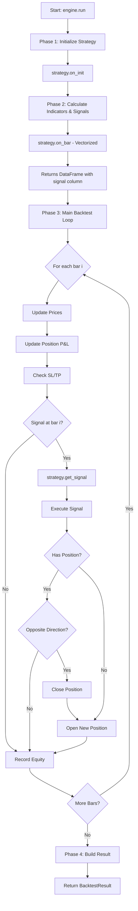

# Backtest Module

Event-driven and vectorized backtesting framework for trading strategies.

## Overview

The backtest module provides high-fidelity simulation of trading strategies using historical data. It maintains **identical execution semantics** to live trading, ensuring strategies tested here will behave the same in production.

## Core Principles

1. **Event-driven = Truth**: Realistic execution with bar-by-bar processing
2. **Vectorized = Speed**: Fast bulk evaluation for research (future)
3. **Same Code**: Strategy works unchanged between backtest and live
4. **DRY**: Reuses `apps.trading` providers for execution simulation
5. **Separation**: Engine owns execution, strategy owns logic

---

## Architecture

```
apps/backtest/
├── engine/
│   ├── base.py              # BaseEngine abstract class
│   └── event_driven.py      # EventDrivenEngine (Phase 1)
│   └── vectorized.py        # VectorizedEngine (future)
├── result.py                # BacktestResult, TradeRecord, EquityPoint
├── stats.py                 # Performance analytics (future)
├── plotting.py              # Visualization (future)
└── optimization.py          # Parameter optimization (future)
```

---

## Event-Driven Backtest

### Event-Driven Engine

**Purpose**: High-fidelity bar-by-bar simulation aligned with live trading

**Characteristics**:

- Iterates bar-by-bar through historical data
- Uses full broker simulation (`BacktestTradeProvider` from `apps.trading`)
- Checks SL/TP against bar high/low (intra-bar execution)
- Records complete trade history and equity curve
- Slower but **realistic and accurate**

**Use Cases**:

- Strategy validation before going live
- Risk analysis and drawdown assessment
- Execution modeling
- Live trading parity testing

---

### Event-Driven Flow

The event-driven engine follows a precise execution flow that mirrors live trading:



---

### Detailed Execution Steps

#### **Phase 1: Initialization (Once)**

```python
# 1. Create Backtest Providers
_trade_provider = BacktestTradeProvider(initial_balance)
_account_provider = BacktestAccountProvider(initial_balance)
_position_provider = BacktestPositionProvider()
_order_provider = BacktestOrderProvider()
_symbol_provider = BacktestSymbolProvider(symbol)

# 2. Inject into Strategy
strategy.trade = Trade(_trade_provider)
strategy.account = AccountInfo(_account_provider)
strategy.position = PositionInfo(_position_provider)
strategy.order = OrderInfo(_order_provider)
strategy.symbol_info = SymbolInfo(_symbol_provider)

# 3. Initialize Strategy
strategy.on_init()
```

#### **Phase 2: Prepare Indicators (Vectorized)**

```python
# Calculate ALL indicators and signals at once
data_with_signals = strategy.on_bar(data)
# Now data has: ema_20, ema_50, atr_14, signal columns
```

> **Note**: Indicators are calculated vectorized (once for all bars) for efficiency. Only signal execution is bar-by-bar.

#### **Phase 3: Main Loop (Bar-by-Bar)**

For each bar from 0 to N:

```python
for i in range(total_bars):
    bar = data_with_signals.iloc[i]

    # 1. Update Market Prices
    _update_prices(bar)  # Set bid/ask from bar close

    # 2. Mark-to-Market
    _update_positions(bar)  # Update unrealized P&L

    # 3. Check Stop Loss / Take Profit
    _check_stops(bar)  # Close if SL/TP hit on this bar

    # 4. Check for Signal
    if bar['signal'] != 0:
        signal_info = strategy.get_signal(data_with_signals, i)

        if signal_info:
            _execute_signal(signal_info, bar)

    # 5. Record Equity Point
    _record_equity_point(timestamp, balance, equity)
```

---

### Signal Execution Logic

```python
def _execute_signal(signal_info, bar):
    signal_value = signal_info['signal']  # 1 (long), -1 (short)
    has_position = len(positions) > 0
    should_open_position = False

    # If we have a position and signal is opposite, close first
    if has_position:
        current_direction = 1 if position_type == BUY else -1

        if signal_value != current_direction:
            # Close opposite position
            strategy.trade.position_close(ticket)
            should_open_position = True
    else:
        # No position, so we should open one
        should_open_position = True

    # Open new position if needed
    if should_open_position:
        _open_position(signal_info, bar)
```

---

### Position Management

#### **Opening Positions**

```python
def _open_position(signal_info, bar):
    # 1. Calculate position size
    if position_sizer:
        volume = position_sizer.calculate_size(
            account_balance=balance,
            entry_price=signal_info['entry_price'],
            stop_loss=signal_info['stop_loss'],
            symbol_info=symbol_provider
        )
    else:
        volume = 0.1  # Default lot size

    # 2. Execute trade
    if signal_info['signal'] == 1:  # Long
        strategy.trade.buy(
            volume,
            symbol,
            sl=signal_info['stop_loss'],
            tp=signal_info['take_profit']
        )
    else:  # Short
        strategy.trade.sell(
            volume,
            symbol,
            sl=signal_info['stop_loss'],
            tp=signal_info['take_profit']
        )

    # 3. Track position for trade recording
    _open_positions[ticket] = {
        'entry_time': bar.name,
        'entry_price': signal_info['entry_price'],
        'entry_sl': signal_info['stop_loss'],
        'entry_tp': signal_info['take_profit'],
        'direction': 'long' if signal_info['signal'] == 1 else 'short',
        'size': volume
    }
```

#### **Stop Loss / Take Profit Checking**

The engine checks SL/TP **intra-bar** using high/low prices:

```python
def _check_stops(bar):
    for position in positions:
        sl = position.get('sl', 0.0)
        tp = position.get('tp', 0.0)

        if position['type'] == BUY:  # Long position
            # Check SL on bar's low (worst case)
            if sl > 0 and bar['low'] <= sl:
                _close_position_at_price(position, sl, "sl")
            # Check TP on bar's high (best case)
            elif tp > 0 and bar['high'] >= tp:
                _close_position_at_price(position, tp, "tp")

        elif position['type'] == SELL:  # Short position
            # Check SL on bar's high (worst case)
            if sl > 0 and bar['high'] >= sl:
                _close_position_at_price(position, sl, "sl")
            # Check TP on bar's low (best case)
            elif tp > 0 and bar['low'] <= tp:
                _close_position_at_price(position, tp, "tp")
```

> **Conservative Assumption**: SL checked on worst price (low for long, high for short), TP checked on best price (high for long, low for short).

---

### Trade Recording

When a position closes (via signal, SL, or TP):

```python
def _record_position_close(position, exit_price, exit_reason):
    # 1. Calculate P&L
    if position['type'] == BUY:
        pnl = (exit_price - entry_price) * size * 100000
    else:  # SELL
        pnl = (entry_price - exit_price) * size * 100000

    # 2. Calculate duration
    exit_time = current_bar.name
    duration = (exit_time - entry_time).total_seconds() / 3600  # hours

    # 3. Create trade record
    trade = TradeRecord(
        trade_id=next_trade_id,
        symbol=symbol,
        entry_time=entry_time,
        exit_time=exit_time,
        duration=duration,
        direction='long' or 'short',
        entry_price=entry_price,
        exit_price=exit_price,
        size=size,
        pnl=pnl,
        pnl_percent=(pnl / (entry_price * size * 100000)) * 100,
        commission=commission,
        swap=0.0,
        exit_reason=exit_reason,  # "signal", "sl", or "tp"
        entry_sl=entry_sl,
        entry_tp=entry_tp
    )

    # 4. Append to result
    _record_trade(trade)
```

---

### Key Characteristics

#### ✅ **Realistic Execution**
- Bar-by-bar processing matches live trading
- Intra-bar SL/TP checking (uses high/low)
- Full broker simulation with providers
- Mark-to-market updates every bar

#### ✅ **High Fidelity**
- Proper position tracking
- Commission and slippage support
- Realistic order execution
- Complete trade lifecycle

#### ⚠️ **Trade-offs**
- Slower than vectorized (processes each bar individually)
- More memory usage (tracks all positions)
- More complex code

---

### Comparison: Event-Driven vs Vectorized

| Feature | Event-Driven | Vectorized |
|---------|-------------|------------|
| **Speed** | Slower (bar-by-bar) | Fast (bulk operations) |
| **Accuracy** | High (intra-bar SL/TP) | Lower (close-based) |
| **Use Case** | Final validation, live alignment | Research, optimization |
| **SL/TP** | Checked on high/low | Checked on close only |
| **Execution** | Realistic broker simulation | Simplified |
| **Live Parity** | ✅ Yes | ❌ No |

---

### When to Use Event-Driven

1. **Final strategy validation** before live trading
2. **Risk analysis** with realistic execution
3. **Testing SL/TP logic** (needs intra-bar checking)
4. **Aligning with live trading** behavior
5. **Position sizing validation**
6. **Regulatory compliance** (accurate simulation)

---

## Integration with Strategy Module

The engine works seamlessly with `apps.strategy`:

```python
# Strategy emits TradeIntent
intents = strategy.generate_signals(context)

# Engine executes intents
for intent in intents:
    if intent.signal_type == SignalType.ENTRY:
        if intent.direction == Direction.LONG:
            strategy.trade.buy(volume, symbol, sl=intent.stop_loss, tp=intent.take_profit)
        else:
            strategy.trade.sell(volume, symbol, sl=intent.stop_loss, tp=intent.take_profit)

    elif intent.signal_type == SignalType.EXIT:
        strategy.trade.position_close(symbol=symbol)
```

The strategy **never knows** it's in backtest - it just emits intents.

---

## Reuse of apps.trading

The engine uses existing providers from `apps.trading`:

- `BacktestTradeProvider` - Order execution simulation
- `BacktestAccountProvider` - Balance, equity, margin tracking
- `BacktestPositionProvider` - Position management
- `BacktestOrderProvider` - Order management
- `BacktestSymbolProvider` - Symbol information

These are injected into `Trade`, `AccountInfo`, `PositionInfo` objects, which are then injected into the strategy.

**Benefit**: DRY - no duplication of execution logic!

---

## Future Enhancements (Phase 2+)

### Metrics Module

```python
from apps.backtest import stats

result = engine.run()

# Calculate performance metrics
sharpe = stats.sharpe_ratio(result)
sortino = stats.sortino_ratio(result)
max_dd = stats.max_drawdown(result)
calmar = stats.calmar_ratio(result)
```

### Plotting Module

```python
from apps.backtest import plotting

result = engine.run()

# Generate report
plotting.create_report(result, filename="backtest_report.html")

# Individual plots
plotting.plot_equity_curve(result)
plotting.plot_drawdown(result)
plotting.plot_monthly_returns(result)
```

### Vectorized Engine

```python
from apps.backtest import VectorizedEngine

engine = VectorizedEngine(strategy, data)
result = engine.run()  # Much faster, less accurate
```

### Optimization Module

```python
from apps.backtest import optimization

# Grid search
results = optimization.grid_search(
    strategy_class=TrendFollowingStrategy,
    data=data,
    param_grid={
        'ema_fast': [10, 20, 30],
        'ema_slow': [40, 50, 60],
        'atr_period': [10, 14, 20]
    }
)

# Best parameters
best = results.get_best()
```

---

## Testing

### Unit Tests

```python
def test_event_driven_engine():
    # Create simple data
    data = pd.DataFrame({
        'open': [1.1000] * 100,
        'high': [1.1010] * 100,
        'low': [1.0990] * 100,
        'close': [1.1005] * 100,
    }, index=pd.date_range('2024-01-01', periods=100, freq='H'))

    # Create strategy
    strategy = TrendFollowingStrategy(symbol="EURUSD")

    # Run backtest
    engine = EventDrivenEngine(strategy, data)
    result = engine.run()

    # Assertions
    assert result.backtest_mode == "event_driven"
    assert result.initial_balance == 10000
    assert isinstance(result.trades, list)
```

---

## Best Practices

1. **Always use event-driven for validation** before live trading
2. **Check SL/TP placement** - ensure they're reasonable
3. **Review trade history** - look for unexpected behavior
4. **Analyze drawdown periods** - understand risk
5. **Compare backtest modes** - event-driven vs vectorized (when available)
6. **Don't overfit** - test on out-of-sample data
7. **Account for costs** - include commission and slippage

---

## Common Pitfalls

### ❌ Insufficient Data

```python
# WRONG - Not enough bars for warmup
data = load_dukascopy("EURUSD", "H1", "2024-12-01", "2024-12-05")  # Only 5 days!
strategy = TrendFollowingStrategy(symbol="EURUSD", ema_slow=50)  # Needs 60 bars!
engine = EventDrivenEngine(strategy, data)
result = engine.run()  # ERROR: Insufficient data for warmup
```

**Fix**: Ensure `len(data) >= strategy.get_required_warmup_bars()`

### ❌ Wrong Data Format

```python
# WRONG - Data not sorted
data = data.sample(frac=1)  # Shuffled!
engine = EventDrivenEngine(strategy, data)  # ERROR: Data must be sorted
```

**Fix**: Data must have `DatetimeIndex` sorted ascending

### ❌ Missing Columns

```python
# WRONG - Missing OHLC columns
data = pd.DataFrame({'close': [...]})  # Missing open, high, low!
engine = EventDrivenEngine(strategy, data)  # ERROR: Missing required columns
```

**Fix**: Data must have `['open', 'high', 'low', 'close']`

---

## Comparison: Event-Driven vs Vectorized (Future)

| Feature               | Event-Driven    | Vectorized  |
| --------------------- | --------------- | ----------- |
| **Speed**       | Slower          | Much faster |
| **Accuracy**    | High            | Medium      |
| **SL/TP**       | Intra-bar check | Simplified  |
| **Use Case**    | Validation      | Research    |
| **Broker Sim**  | Full            | Simplified  |
| **Live Parity** | ✅ Yes          | ❌ No       |

---

## Phase 2: Analytics & Visualization (COMPLETED)

### Performance Metrics

The `stats` module provides comprehensive performance analytics:

#### Return Metrics

```python
from apps.backtest import stats

# Individual metrics
total_ret = stats.total_return(result)      # Total return %
cagr_value = stats.cagr(result)             # Compound annual growth rate
```

**Available:**

- `total_return()` - Total return percentage
- `cagr()` - Compound Annual Growth Rate

#### Risk Metrics

```python
sharpe = stats.sharpe_ratio(result, risk_free_rate=0.0)
sortino = stats.sortino_ratio(result, risk_free_rate=0.0)
calmar = stats.calmar_ratio(result)
```

**Available:**

- `sharpe_ratio()` - Risk-adjusted return (total volatility)
- `sortino_ratio()` - Downside risk-adjusted return
- `calmar_ratio()` - CAGR / Max Drawdown

#### Drawdown Metrics

```python
max_dd = stats.max_drawdown(result)              # Maximum drawdown %
dd_duration = stats.max_drawdown_duration(result) # Duration in days
recovery = stats.recovery_factor(result)          # Profit / Max DD
ulcer = stats.ulcer_index(result)                # Downside volatility
```

#### Trade Metrics

```python
wr = stats.win_rate(result)                      # Win rate %
pf = stats.profit_factor(result)                 # Gross profit / loss
avg_win = stats.average_win(result)
avg_loss = stats.average_loss(result)
expectancy = stats.expectancy(result)            # Expected value per trade
rr = stats.risk_reward_ratio(result)             # Avg win / avg loss
kelly = stats.kelly_criterion(result)            # Kelly % to risk
```

#### Comprehensive Report

```python
# Calculate all metrics at once
all_metrics = stats.calculate_all_metrics(result, risk_free_rate=0.0)

# Print formatted report
stats.print_metrics_report(result)
```

Output:

```
======================================================================
PERFORMANCE METRICS
======================================================================

Return Metrics:
  Total Return:        12.35%
  CAGR:                 8.21%

Risk Metrics:
  Sharpe Ratio:         1.45
  Sortino Ratio:        2.12
  Calmar Ratio:         0.82

Drawdown Metrics:
  Max Drawdown:        -10.05%
  Max DD Duration:          45 days
  Recovery Factor:      1.23
  Ulcer Index:          4.56

Trade Metrics:
  Total Trades:           42
  Win Rate:            62.50%
  Profit Factor:        2.15
  Avg Win:           $ 125.32
  Avg Loss:          $ -65.15
  Expectancy:        $  45.12
  Risk/Reward:          1.92
...
======================================================================
```

---

### Visualization

The `plotting` module provides visual analysis tools:

#### Equity Curve

```python
from apps.backtest import plotting

# Plot equity curve
plotting.plot_equity_curve(result, show=True, save_path="equity.png")
```

Features:

- Equity vs Balance over time
- Formatted date axis
- Auto-scaled y-axis

#### Drawdown Chart

```python
# Plot drawdown
plotting.plot_drawdown(result, show=True, save_path="drawdown.png")
```

Features:

- Drawdown percentage over time
- Maximum drawdown marker
- Fill area visualization

#### Trade Analysis

```python
# Trade P&L distribution
plotting.plot_trade_pnl_distribution(result)

# Cumulative P&L
plotting.plot_cumulative_pnl(result)

# Monthly returns
plotting.plot_monthly_returns(result)
```

#### Performance Dashboard

```python
# Create comprehensive 4-panel dashboard
plotting.create_performance_dashboard(result, show=True, save_path="dashboard.png")
```

Creates a 2x2 grid with:

1. Equity curve (top)
2. Drawdown chart (bottom left)
3. Trade P&L distribution (bottom right)
4. Metrics summary (text overlay)

#### HTML Report

```python
# Generate complete HTML report with charts
plotting.create_html_report(
    result,
    output_path="backtest_report.html",
    include_charts=True
)
```

Generates:

- Styled HTML page
- All metrics in grid layout
- Embedded charts
- Trade history table
- Opens in any browser

---

### Complete Analytics Example

```python
from apps.backtest import EventDrivenEngine, stats, plotting
from apps.strategy import TrendFollowingStrategy

# Run backtest
strategy = TrendFollowingStrategy(symbol="EURUSD")
engine = EventDrivenEngine(strategy, data, initial_balance=10000)
result = engine.run()

# Calculate metrics
print("Total Return:", stats.total_return(result), "%")
print("Sharpe Ratio:", stats.sharpe_ratio(result))
print("Max Drawdown:", stats.max_drawdown(result), "%")

# Full metrics report
stats.print_metrics_report(result)

# Visualizations
plotting.plot_equity_curve(result)
plotting.plot_drawdown(result)
plotting.create_performance_dashboard(result)

# HTML report
plotting.create_html_report(result, "report.html", include_charts=True)
```

---

### Strategy Comparison

```python
strategies = [
    ("Fast Trend", TrendFollowingStrategy(symbol="EURUSD", ema_fast=10, ema_slow=30)),
    ("Slow Trend", TrendFollowingStrategy(symbol="EURUSD", ema_fast=20, ema_slow=50)),
    ("Mean Rev", MeanReversionStrategy(symbol="EURUSD")),
]

results = []
for name, strategy in strategies:
    engine = EventDrivenEngine(strategy, data, initial_balance=10000)
    result = engine.run()
    results.append((name, result))

# Compare
print(f"{'Strategy':<20} {'Return':>10} {'Sharpe':>8} {'Max DD':>10}")
for name, result in results:
    print(f"{name:<20} {stats.total_return(result):>9.2f}% "
          f"{stats.sharpe_ratio(result):>8.2f} "
          f"{stats.max_drawdown(result):>9.2f}%")
```

Output:

```
Strategy             Return   Sharpe     Max DD
Fast Trend            8.5%     1.23     -12.3%
Slow Trend           12.3%     1.45     -10.1%
Mean Rev              6.2%     0.98     -15.4%
```

---

### Metrics Reference

| Metric                | Function                    | Description                      |
| --------------------- | --------------------------- | -------------------------------- |
| **Returns**     |                             |                                  |
| Total Return          | `total_return()`          | Total % gain/loss                |
| CAGR                  | `cagr()`                  | Annualized return                |
| **Risk**        |                             |                                  |
| Sharpe Ratio          | `sharpe_ratio()`          | Return per unit of risk          |
| Sortino Ratio         | `sortino_ratio()`         | Return per unit of downside risk |
| Calmar Ratio          | `calmar_ratio()`          | CAGR / Max DD                    |
| **Drawdown**    |                             |                                  |
| Max Drawdown          | `max_drawdown()`          | Largest peak-to-trough decline % |
| DD Duration           | `max_drawdown_duration()` | Longest drawdown period (days)   |
| Recovery Factor       | `recovery_factor()`       | Net profit / max DD              |
| Ulcer Index           | `ulcer_index()`           | Measure of downside volatility   |
| **Trade Stats** |                             |                                  |
| Win Rate              | `win_rate()`              | % of winning trades              |
| Profit Factor         | `profit_factor()`         | Gross profit / gross loss        |
| Expectancy            | `expectancy()`            | Average $ per trade              |
| R/R Ratio             | `risk_reward_ratio()`     | Avg win / avg loss               |
| Kelly Criterion       | `kelly_criterion()`       | Optimal % of capital to risk     |

---

### Demo Scripts

Run the included demos:

```bash
# Basic backtest demo
python -m apps.backtest.demo

# Analytics & visualization demo
python -m apps.backtest.demo_analytics
```

---

## Phase 3: Vectorized Engine & Optimization (COMPLETED)

### VectorizedEngine

**Purpose**: Fast bulk evaluation for research and parameter optimization

**Characteristics**:

- Processes entire DataFrame at once using vectorized pandas/numpy operations
- Simplified execution model (close-based entry/exit)
- No intra-bar SL/TP checking (checks at bar close)
- **10-100x faster** than event-driven
- Less accurate but sufficient for research

**Trade-offs**:

| Aspect            | Event-Driven          | Vectorized               |
| ----------------- | --------------------- | ------------------------ |
| Speed             | Slower (realistic)    | **10-100x faster** |
| Execution         | Intra-bar (high/low)  | Close-based only         |
| SL/TP Check       | Every bar (realistic) | Simplified (close)       |
| Accuracy          | High                  | Medium                   |
| Position Tracking | Full simulation       | Simplified               |
| Mark-to-Market    | Every bar             | Simplified               |

**When to use Vectorized:**

- Parameter optimization (grid search, random search)
- Initial strategy testing and exploration
- Strategy comparison across many variants
- Research and hypothesis testing

**When to use Event-Driven:**

- Final validation before live trading
- Precise execution modeling
- Realistic SL/TP behavior testing
- Pre-production parity testing

---

### Vectorized Usage

```python
from apps.backtest import VectorizedEngine
from apps.strategy import TrendFollowingStrategy

# Create strategy
strategy = TrendFollowingStrategy(
    symbol="EURUSD",
    ema_fast=20,
    ema_slow=50,
    atr_period=14
)

# Create vectorized engine
engine = VectorizedEngine(
    strategy=strategy,
    data=data,
    initial_balance=10000,
    commission=7.0,
    slippage_points=1.0,
    timeframe="H1"
)

# Run (much faster!)
result = engine.run()

# Same BacktestResult as event-driven
print(result.summary())
```

---

### Speed Comparison

```python
from apps.backtest import EventDrivenEngine, VectorizedEngine
import time

data = load_dukascopy("EURUSD", "H1", "2024-01-01", "2024-12-01")  # 2000 bars

# Event-Driven
start = time.time()
ed_engine = EventDrivenEngine(strategy, data.copy())
ed_result = ed_engine.run()
ed_time = time.time() - start

# Vectorized
start = time.time()
vec_engine = VectorizedEngine(strategy, data.copy())
vec_result = vec_engine.run()
vec_time = time.time() - start

print(f"Event-Driven: {ed_time:.2f}s")
print(f"Vectorized:   {vec_time:.2f}s")
print(f"Speed improvement: {ed_time / vec_time:.1f}x faster")
```

Expected output:

```
Event-Driven: 4.25s
Vectorized:   0.12s
Speed improvement: 35.4x faster
```

---

## Parameter Optimization

The `optimization` module provides systematic parameter search for strategies.

### Grid Search

**Exhaustive search** of all parameter combinations.

```python
from apps.backtest import optimization
from apps.strategy import TrendFollowingStrategy

# Define parameter grid
param_grid = {
    'ema_fast': [10, 20, 30],
    'ema_slow': [40, 50, 60],
    'atr_period': [10, 14, 20]
}

# Run grid search (uses vectorized engine by default)
summary = optimization.grid_search(
    strategy_class=TrendFollowingStrategy,
    data=data,
    param_grid=param_grid,
    initial_balance=10000,
    scoring_func=optimization.sharpe_score,  # Default: Sharpe ratio
    engine_type="vectorized",  # or "event_driven" for accuracy
    verbose=True  # Show progress
)

# View results
print(f"Best parameters: {summary.best_params}")
print(f"Best score: {summary.best_score:.4f}")
print(f"Total combinations tested: {summary.completed}")

# Get top 5 results
optimization.print_optimization_report(summary, top_n=5)
```

Output:

```
======================================================================
OPTIMIZATION RESULTS
======================================================================

Total combinations: 27
Completed: 27
Best score: 1.8542

Best Parameters:
  ema_fast: 20
  ema_slow: 50
  atr_period: 14

Best Result Metrics:
  Return: 12.35%
  Sharpe: 1.85
  Max DD: -8.45%

Top 5 Results:
  Rank 1: score=1.8542  ema_fast=20, ema_slow=50, atr_period=14
  Rank 2: score=1.7234  ema_fast=10, ema_slow=50, atr_period=14
  Rank 3: score=1.6891  ema_fast=20, ema_slow=60, atr_period=14
  ...
======================================================================
```

---

### Random Search

**Random sampling** of parameter space - more efficient for large spaces.

```python
from apps.backtest import optimization

# Define parameter distributions (min, max)
param_distributions = {
    'ema_fast': (5, 30),       # Random int between 5-30
    'ema_slow': (30, 100),     # Random int between 30-100
    'atr_period': (10, 20)     # Random int between 10-20
}

# Run random search
summary = optimization.random_search(
    strategy_class=TrendFollowingStrategy,
    data=data,
    param_distributions=param_distributions,
    n_iter=50,  # Number of random combinations to test
    initial_balance=10000,
    scoring_func=optimization.sortino_score,  # Downside risk focus
    engine_type="vectorized",
    seed=42,  # Reproducible results
    verbose=True
)

# Results
print(f"Best parameters: {summary.best_params}")
print(f"Tested {summary.completed} random combinations")
optimization.print_optimization_report(summary, top_n=10)
```

**When to use:**

- Large parameter spaces (grid search becomes too slow)
- Continuous parameters
- Quick exploration

---

### Walk-Forward Analysis

**Rolling window optimization** with out-of-sample testing to avoid overfitting.

```python
from apps.backtest import optimization

# Define parameters
param_grid = {
    'ema_fast': [10, 20, 30],
    'ema_slow': [40, 50, 60]
}

# Run walk-forward
wf_summary = optimization.walk_forward(
    strategy_class=TrendFollowingStrategy,
    data=data,
    param_grid=param_grid,
    train_period=500,  # Optimize on 500 bars
    test_period=100,   # Test on 100 bars
    scoring_func=optimization.sharpe_score,
    verbose=True
)

# Results
print(f"Number of windows: {wf_summary['n_windows']}")
print(f"Average test score: {wf_summary['avg_test_score']:.4f}")
print(f"Average test return: {wf_summary['avg_test_return']:.2f}%")

# Window breakdown
for i, window in enumerate(wf_summary['windows'], 1):
    print(f"\nWindow {i}:")
    print(f"  Best params: {window['best_params']}")
    print(f"  Train score: {window['train_score']:.4f}")
    print(f"  Test score: {window['test_score']:.4f}")
    print(f"  Test return: {window['test_return']:.2f}%")
```

**How it works:**

```
Data: [====================================================]

Window 1:
  Train: [============]
  Test:              [===]

Window 2:
          Train:     [============]
          Test:                   [===]

Window 3:
                     Train:       [============]
                     Test:                     [===]
...
```

**Benefits:**

- Prevents overfitting (test on unseen data)
- Simulates real-world parameter adaptation
- Shows strategy robustness over time

---

### Scoring Functions

Optimization requires a scoring function to rank results.

#### Built-in Scoring Functions

```python
from apps.backtest import optimization

# Sharpe Ratio (default) - risk-adjusted return
optimization.sharpe_score(result)

# Sortino Ratio - downside risk focus
optimization.sortino_score(result)

# Calmar Ratio - CAGR / Max DD
optimization.calmar_score(result)
```

#### Custom Scoring

```python
# Balanced custom score
def my_score(result):
    return optimization.custom_score(
        result,
        return_weight=0.3,   # 30% weight on returns
        sharpe_weight=0.4,   # 40% weight on Sharpe
        dd_weight=0.3        # 30% weight on drawdown (penalty)
    )

# Use in optimization
summary = optimization.grid_search(
    strategy_class=TrendFollowingStrategy,
    data=data,
    param_grid=param_grid,
    scoring_func=my_score
)
```

#### Create Your Own

```python
from apps.backtest import BacktestResult, metrics

def profit_factor_score(result: BacktestResult) -> float:
    """Score based on profit factor only"""
    pf = metrics.profit_factor(result)
    return pf if pf > 0 else 0.0

def conservative_score(result: BacktestResult) -> float:
    """Prioritize low drawdown"""
    total_ret = metrics.total_return(result)
    max_dd = metrics.max_drawdown(result)

    # Penalize heavily for drawdown
    if max_dd > 20:
        return 0.0

    return total_ret / (max_dd + 0.01)

# Use it
summary = optimization.grid_search(
    strategy_class=TrendFollowingStrategy,
    data=data,
    param_grid=param_grid,
    scoring_func=conservative_score
)
```

---

### Optimization Results Analysis

```python
# Run optimization
summary = optimization.grid_search(
    TrendFollowingStrategy,
    data,
    param_grid={'ema_fast': [10, 15, 20, 25, 30], 'ema_slow': [40, 50, 60]},
    scoring_func=optimization.sharpe_score
)

# Convert to DataFrame for analysis
df = summary.to_dataframe()

# Analyze
print("\nCorrelation with score:")
corr = df[['ema_fast', 'ema_slow', 'atr_period', 'score']].corr()['score']
print(corr.sort_values(ascending=False))

# Best parameter values
print("\nTop 3 ema_fast values by avg score:")
avg_by_fast = df.groupby('ema_fast')['score'].mean().sort_values(ascending=False).head(3)
print(avg_by_fast)

# Filter stable results
stable = df[df['max_dd'] < 10]  # Max DD < 10%
print(f"\nStable strategies (DD < 10%): {len(stable)}")
print(f"Best stable: {stable.nlargest(1, 'score')['score'].values[0]:.4f}")
```

---

### Complete Optimization Workflow

```python
from apps.backtest import VectorizedEngine, EventDrivenEngine, optimization, metrics
from apps.strategy import TrendFollowingStrategy

# 1. Load data
data = load_dukascopy("EURUSD", "H1", "2024-01-01", "2024-12-01")

# 2. Quick grid search with vectorized engine
param_grid = {
    'ema_fast': [10, 15, 20, 25, 30],
    'ema_slow': [40, 50, 60, 70],
    'atr_period': [10, 14, 20]
}

summary = optimization.grid_search(
    TrendFollowingStrategy,
    data,
    param_grid,
    engine_type="vectorized",  # Fast!
    scoring_func=optimization.sharpe_score,
    verbose=True
)

# 3. Get top 3 parameter sets
top_3 = summary.all_results[:3]

# 4. Validate with event-driven (accurate)
print("\nValidating top 3 with event-driven engine...")
for i, opt_result in enumerate(top_3, 1):
    params = opt_result.parameters

    # Create strategy with optimized params
    strategy = TrendFollowingStrategy(
        symbol="EURUSD",
        **params  # Unpack optimized parameters
    )

    # Run event-driven (accurate)
    engine = EventDrivenEngine(strategy, data)
    result = engine.run()

    # Compare
    print(f"\nRank {i}: {params}")
    print(f"  Vectorized Sharpe: {opt_result.score:.4f}")
    print(f"  Event-Driven Sharpe: {metrics.sharpe_ratio(result):.4f}")
    print(f"  Return: {metrics.total_return(result):.2f}%")
    print(f"  Max DD: {metrics.max_drawdown(result):.2f}%")

# 5. Final validation with walk-forward
print("\nWalk-forward validation...")
wf_summary = optimization.walk_forward(
    TrendFollowingStrategy,
    data,
    param_grid,
    train_period=500,
    test_period=100,
    scoring_func=optimization.sharpe_score
)

print(f"Avg out-of-sample score: {wf_summary['avg_test_score']:.4f}")
print(f"Avg out-of-sample return: {wf_summary['avg_test_return']:.2f}%")
```

---

### Optimization Reference

| Method                  | Best For               | Speed             | Overfitting Risk |
| ----------------------- | ---------------------- | ----------------- | ---------------- |
| **Grid Search**   | Small parameter spaces | Slow (exhaustive) | Medium           |
| **Random Search** | Large parameter spaces | Fast              | Low              |
| **Walk-Forward**  | Robust validation      | Slowest           | Lowest           |

**Recommended Workflow:**

1. **Random search** (n=100) - Quick exploration
2. **Grid search** (narrow range) - Refine around best areas
3. **Walk-forward** - Final validation

---

### Optimization Best Practices

#### ✅ DO

1. **Use vectorized engine for optimization**

   ```python
   summary = optimization.grid_search(..., engine_type="vectorized")
   ```
2. **Validate top results with event-driven**

   ```python
   # After optimization, re-run top 3 with event-driven
   for params in top_3_params:
       strategy = MyStrategy(**params)
       engine = EventDrivenEngine(strategy, data)
       result = engine.run()
   ```
3. **Use walk-forward to prevent overfitting**

   ```python
   wf_summary = optimization.walk_forward(...)
   # Check that avg_test_score is close to avg_train_score
   ```
4. **Test on out-of-sample data**

   ```python
   train_data = data['2024-01-01':'2024-09-01']
   test_data = data['2024-09-01':'2024-12-01']

   # Optimize on train
   summary = optimization.grid_search(..., data=train_data)

   # Validate on test
   strategy = MyStrategy(**summary.best_params)
   engine = EventDrivenEngine(strategy, test_data)
   result = engine.run()
   ```
5. **Consider multiple scoring functions**

   ```python
   # Run with different scorers
   sharpe_opt = optimization.grid_search(..., scoring_func=optimization.sharpe_score)
   sortino_opt = optimization.grid_search(..., scoring_func=optimization.sortino_score)

   # Pick parameters that perform well across both
   ```

#### ❌ DON'T

1. **Don't optimize on all your data**

   - Always keep hold-out test set
   - Use walk-forward instead
2. **Don't over-parameterize**

   ```python
   # BAD - too many parameters
   param_grid = {
       'ema_fast': range(5, 50, 1),  # 45 values!
       'ema_slow': range(30, 200, 1),  # 170 values!
       # = 7650 combinations
   }

   # GOOD - reasonable granularity
   param_grid = {
       'ema_fast': [10, 15, 20, 25, 30],
       'ema_slow': [40, 50, 60, 70]
       # = 20 combinations
   }
   ```
3. **Don't trust single-metric optimization**

   - Check return, Sharpe, drawdown, win rate
   - Use custom_score with balanced weights
4. **Don't ignore execution differences**

   - Vectorized gives approximate results
   - Always validate with event-driven
5. **Don't forget costs**

   ```python
   # Include realistic commission and slippage
   summary = optimization.grid_search(
       ...,
       commission=7.0,
       slippage_points=1.0
   )
   ```

---

### Demo Scripts

Run the included Phase 3 demos:

```bash
# Optimization and vectorized engine demo
python -m apps.backtest.demo_optimization
```

Demonstrates:

- Vectorized vs event-driven speed comparison
- Grid search optimization
- Random search optimization
- Custom scoring functions
- Walk-forward analysis
- Results analysis with DataFrame export

---

## Position Sizing Framework

Dynamic position sizing module that replaces hardcoded lot sizes with intelligent, risk-based approaches.

### Overview

The Position Sizing Framework provides 6 different methods for calculating position sizes based on account balance, risk parameters, and market conditions. This enables:

- **Risk Management**: Control risk per trade consistently
- **Capital Efficiency**: Optimal capital allocation
- **Adaptive Sizing**: Adjust to account growth and market volatility
- **Strategy-Specific**: Choose method that fits strategy characteristics

### Available Methods

#### 1. Fixed Lot Sizing

Always trade a fixed lot size regardless of account balance or market conditions.

**Formula:**

```
position_size = lot_size
```

**Use When:**

- You want the simplest possible sizing
- You're testing a strategy with consistent position sizes
- You have regulatory or risk limits on position size
- You prefer manual control over position sizing

**Configuration:**

```python
from apps.backtest.position_sizing import PositionSizer

sizer = PositionSizer(
    method="fixed_lot",
    config={'lot_size': 0.5}  # Always trade 0.5 lots
)
```

**Characteristics:**

- Simplest method - no calculations needed
- No account balance or risk consideration
- Position value grows/shrinks with account balance
- Good for testing and simple strategies

---

#### 2. Milestone-Based Sizing

Increase lot size at specific account balance milestones (e.g., add 0.2 lots every $3000 profit).

**Formula:**

```
profit = account_balance - initial_balance
milestones_reached = floor(profit / milestone_amount)
position_size = base_lot_size + (milestones_reached * lot_increment)
```

**Use When:**

- You want controlled, stepwise position size increases
- You prefer discrete increases rather than continuous scaling
- You want to grow positions as account grows
- You want predictable position size progression

**Configuration:**

```python
from apps.backtest.position_sizing import PositionSizer

sizer = PositionSizer(
    method="milestone",
    config={
        'initial_balance': 10000,    # Starting balance
        'base_lot_size': 0.1,         # Starting lot size
        'milestone_amount': 3000,     # $ increase for next milestone
        'lot_increment': 0.2          # Lot size increase per milestone
    }
)
```

**Example Progression:**

```
$10,000 -> 0.1 lots (base)
$13,000 -> 0.3 lots (1 milestone: 0.1 + 0.2)
$16,000 -> 0.5 lots (2 milestones: 0.1 + 0.4)
$19,000 -> 0.7 lots (3 milestones: 0.1 + 0.6)
$22,000 -> 0.9 lots (4 milestones: 0.1 + 0.8)
```

**Characteristics:**

- Grows position size with account growth
- Discrete steps (not continuous like fixed fractional)
- Predictable and easy to understand
- Conservative - only increases on profit
- Position size never decreases (even on losses)

---

#### 3. Fixed Risk Sizing

Risk a fixed percentage of account balance per trade based on stop loss distance.

**Formula:**

```
risk_amount = account_balance * (risk_percent / 100)
stop_distance = abs(entry_price - stop_loss)
position_size = risk_amount / (stop_distance * contract_size)
```

**Use When:**

- You have clear stop loss levels
- You want consistent risk per trade
- You prefer conservative risk management

**Configuration:**

```python
from apps.backtest.position_sizing import PositionSizer

sizer = PositionSizer(
    method="fixed_risk",
    config={'risk_percent': 2.0}  # Risk 2% per trade
)
```

**Requirements:**

- Stop loss must be set in TradeIntent
- Works best with strategies that have defined stop losses

---

#### 4. Kelly Criterion Sizing

Optimal sizing based on win rate and average win/loss ratio. Maximizes long-term growth rate.

**Formula:**

```
kelly_fraction = (win_rate * avg_win - (1 - win_rate) * avg_loss) / avg_win
position_size = (account_balance * kelly_fraction) / (entry_price * contract_size)
```

**Use When:**

- You have historical performance data
- You want to maximize long-term growth
- Your strategy has stable win rate

**Configuration:**

```python
from apps.backtest.position_sizing import PositionSizer, estimate_kelly_parameters

# First, estimate parameters from a baseline backtest
baseline_result = engine.run()
kelly_params = estimate_kelly_parameters(baseline_result)

# Create Kelly sizer with estimated parameters
sizer = PositionSizer(
    method="kelly",
    config={
        'kelly_fraction_limit': 0.25,  # Cap at 25% for safety (half Kelly)
        'win_rate': kelly_params['win_rate'],
        'avg_win': kelly_params['avg_win'],
        'avg_loss': kelly_params['avg_loss']
    }
)
```

**Important Notes:**

- Full Kelly can be aggressive; use fraction limit (0.25 recommended)
- Requires accurate win rate and win/loss statistics
- Best used after initial strategy validation

---

#### 5. Volatility-Based Sizing (ATR)

Size inversely proportional to market volatility using Average True Range.

**Formula:**

```
risk_amount = account_balance * (risk_percent / 100)
adjusted_atr = atr * atr_multiplier
position_size = risk_amount / (adjusted_atr * contract_size)
```

**Use When:**

- Market conditions vary (trending vs ranging)
- You want to reduce size in volatile markets
- Your data includes ATR indicator

**Configuration:**

```python
from apps.backtest.position_sizing import PositionSizer

sizer = PositionSizer(
    method="volatility",
    config={
        'risk_percent': 2.0,
        'atr_multiplier': 1.0  # 1.0 = normal, >1.0 = more conservative
    }
)

# Engine must have ATR in data
engine = EventDrivenEngine(
    strategy,
    data,  # Must include 'atr_14' column
    position_sizer=sizer,
    config={'atr_period': 14}
)
```

**Requirements:**

- Data must include ATR indicator column (e.g., 'atr_14')
- ATR period should match config['atr_period']

---

#### 6. Fixed Fractional Sizing

Always use a fixed percentage of account capital.

**Formula:**

```
position_value = account_balance * (fraction / 100)
position_size = position_value / (entry_price * contract_size)
```

**Use When:**

- You want simple, predictable sizing
- You prefer straightforward position calculation
- Your strategy doesn't have stop losses

**Configuration:**

```python
from apps.backtest.position_sizing import PositionSizer

sizer = PositionSizer(
    method="fixed_fractional",
    config={'fraction': 5.0}  # Use 5% of capital per position
)
```

**Characteristics:**

- Simplest method
- No stop loss required
- Naturally adjusts to account growth

---

### Integration with Engines

Position sizing works with both EventDrivenEngine and VectorizedEngine.

#### Event-Driven Engine

```python
from apps.backtest import EventDrivenEngine
from apps.backtest.position_sizing import PositionSizer
from apps.strategy import TrendFollowingStrategy

# Create position sizer
position_sizer = PositionSizer(
    method="fixed_risk",
    config={'risk_percent': 2.0}
)

# Create engine with position sizer
strategy = TrendFollowingStrategy(symbol="EURUSD", ema_fast=20, ema_slow=50)
engine = EventDrivenEngine(
    strategy,
    data,
    initial_balance=10000,
    position_sizer=position_sizer,
    config={'atr_period': 14}  # If using volatility-based sizing
)

result = engine.run()
```

#### Vectorized Engine

```python
from apps.backtest import VectorizedEngine
from apps.backtest.position_sizing import PositionSizer

position_sizer = PositionSizer(
    method="kelly",
    config={
        'kelly_fraction_limit': 0.25,
        'win_rate': 0.55,
        'avg_win': 150,
        'avg_loss': 75
    }
)

engine = VectorizedEngine(
    strategy,
    data,
    initial_balance=10000,
    position_sizer=position_sizer
)

result = engine.run()
```

---

### Helper Functions

#### validate_position_size()

Validate and adjust position size to meet broker constraints.

```python
from apps.backtest.position_sizing import validate_position_size

# Validate size against symbol constraints
validated_size = validate_position_size(
    size=1.37,              # Calculated size
    symbol_info=symbol_info, # SymbolInfo object
    max_size=10.0           # Optional maximum override
)
# Returns: 1.37 rounded to lot step, clamped to min/max
```

Features:

- Rounds to lot step (e.g., 0.01 for forex)
- Enforces min/max lot size
- Applies optional maximum size override

#### estimate_kelly_parameters()

Estimate Kelly Criterion parameters from backtest results.

```python
from apps.backtest.position_sizing import estimate_kelly_parameters

# Run baseline backtest
baseline_result = engine.run()

# Estimate Kelly parameters
kelly_params = estimate_kelly_parameters(baseline_result)

print(kelly_params)
# {
#     'win_rate': 0.58,
#     'avg_win': 142.50,
#     'avg_loss': 68.30,
#     'kelly_fraction': 0.34
# }

# Use in Kelly sizer
sizer = PositionSizer(
    method="kelly",
    config={
        'kelly_fraction_limit': 0.25,
        **kelly_params  # Unpack all parameters
    }
)
```

---

### Backward Compatibility

Position sizing is **optional** and **backward compatible**:

- **Without position_sizer**: Engines use hardcoded `0.1 * size_hint` (old behavior)
- **With position_sizer**: Engines use dynamic sizing based on configured method

```python
# Old way - still works
engine = EventDrivenEngine(strategy, data, initial_balance=10000)
# Uses hardcoded 0.1 lots

# New way - dynamic sizing
engine = EventDrivenEngine(strategy, data, initial_balance=10000, position_sizer=sizer)
# Uses configured position sizing method
```

---

### Size Hint Multiplier

Position sizers respect the strategy's `size_hint` parameter:

```python
# In your strategy
intent = TradeIntent(
    symbol=self.symbol,
    signal_type=SignalType.ENTRY,
    direction=Direction.LONG,
    stop_loss=1.0950,
    size_hint=1.5  # Multiplier: increase position by 50%
)
```

**Calculation:**

```python
base_size = position_sizer.calculate_size(...)  # e.g., 0.8 lots
final_size = base_size * intent.size_hint       # 0.8 * 1.5 = 1.2 lots
```

Use `size_hint` to:

- Increase size for high-confidence trades
- Reduce size for uncertain signals
- Scale positions based on signal strength

---

### Demo Script

Run the position sizing demo to see all methods in action:

```bash
python -m apps.backtest.demo_position_sizing
```

**Demonstrates:**

- All 6 position sizing methods with examples
- Kelly parameter estimation from baseline
- Side-by-side comparison of methods
- Practical configuration examples

**Sample Output:**

```
======================================================================
COMPARISON: ALL SIZING METHODS
======================================================================

Method                    Return %     Sharpe     Max DD %   Trades
==================================================================================
Baseline (0.1 lots)          12.34%       0.85       -8.50%        45
Fixed Risk (2%)              18.76%       1.12       -6.20%        45
Kelly Criterion              22.41%       1.28       -7.10%        45
Volatility (ATR)             16.89%       1.05       -5.80%        45
Fixed Fractional (5%)        14.52%       0.92       -9.30%        45
==================================================================================
```

---

### Choosing a Method

| Method                     | Best For                                   | Pros                                     | Cons                             | Complexity |
| -------------------------- | ------------------------------------------ | ---------------------------------------- | -------------------------------- | ---------- |
| **Fixed Lot**        | Testing, manual control, regulatory limits | Simplest possible, predictable           | No risk management               | Very Low   |
| **Milestone**        | Controlled growth, stepwise scaling        | Predictable increases, grows with profit | Position size never decreases    | Very Low   |
| **Fixed Risk**       | Conservative traders with defined stops    | Consistent risk, easy to understand      | Requires stop loss               | Low        |
| **Kelly Criterion**  | Maximizing long-term growth                | Optimal mathematically                   | Aggressive, needs accurate stats | High       |
| **Volatility (ATR)** | Adaptive to market conditions              | Adjusts to volatility                    | Requires ATR indicator           | Medium     |
| **Fixed Fractional** | Simple capital management                  | Easy, no stops needed                    | Not risk-based                   | Very Low   |

**Recommendations:**

- **Beginner**: Start with Fixed Lot (simplest) or Milestone (simple with controlled growth)
- **Controlled Growth**: Use Milestone for predictable position size increases
- **Risk-Conscious**: Use Fixed Risk (1-2% per trade)
- **Experienced**: Try Kelly Criterion (with 0.25 limit)
- **Adaptive**: Use Volatility-Based for changing markets

**Combine Multiple Backtests:**
Run backtests with different methods and compare results to find what works best for your strategy.

---

### Configuration Examples

#### Simple Fixed Lot

```python
PositionSizer(method="fixed_lot", config={'lot_size': 0.5})
# Always trade 0.5 lots
```

#### Milestone Growth

```python
PositionSizer(method="milestone", config={
    'initial_balance': 10000,
    'base_lot_size': 0.1,
    'milestone_amount': 3000,  # Increase every $3k profit
    'lot_increment': 0.2       # Add 0.2 lots per milestone
})
```

#### Conservative Fixed Risk

```python
PositionSizer(method="fixed_risk", config={'risk_percent': 1.0})
# Risk only 1% per trade
```

#### Aggressive Kelly

```python
PositionSizer(method="kelly", config={
    'kelly_fraction_limit': 0.5,  # Use full Kelly instead of half
    'win_rate': 0.60,
    'avg_win': 200,
    'avg_loss': 80
})
```

#### Conservative Volatility

```python
PositionSizer(method="volatility", config={
    'risk_percent': 1.5,
    'atr_multiplier': 2.0  # Double ATR = more conservative
})
```

#### Moderate Fixed Fractional

```python
PositionSizer(method="fixed_fractional", config={'fraction': 3.0})
# Use 3% of capital per position
```

---

### Advanced: Custom Context

For Kelly and Volatility methods, you can provide dynamic context:

```python
# In EventDrivenEngine, context is built automatically
# But you can extend it in custom engines:

context = {
    'atr': current_atr,
    'win_rate': historical_win_rate,
    'avg_win': recent_avg_win,
    'avg_loss': recent_avg_loss,
    # Add custom fields as needed
}

size = position_sizer.calculate_size(
    account_balance=balance,
    entry_price=price,
    stop_loss=sl,
    symbol_info=symbol_info,
    context=context
)
```

---

### Troubleshooting

**Issue: "Fixed risk sizing requires stop_loss"**

- **Solution**: Ensure your strategy sets `stop_loss` in TradeIntent
- **Alternative**: Use Fixed Fractional method (doesn't need SL)

**Issue: "Invalid or missing ATR for volatility sizing"**

- **Solution**: Add ATR indicator to your data
- **Code**: `data['atr_14'] = calculate_atr(data, period=14)`

**Issue: "Negative Kelly fraction"**

- **Cause**: Strategy has negative expectancy (losing strategy)
- **Solution**: Fix strategy or use different sizing method

**Issue: Position sizes too small (0.01 lots)**

- **Cause**: Risk percent too low or stop loss too wide
- **Solution**: Increase risk_percent or tighten stop loss

**Issue: Position sizes too large**

- **Cause**: Risk percent too high or insufficient constraints
- **Solution**: Use `validate_position_size()` with max_size parameter

---

## Benchmark Comparison

The benchmark module enables comparison of strategy performance against benchmarks to calculate alpha, beta, and information ratio.

### Overview

Benchmark comparison provides:

- **Buy-and-Hold Benchmarks**: Compare strategy vs passive holding
- **Index Tracking**: Compare against market indices (S&P 500, etc.)
- **Alpha/Beta Analysis**: Calculate CAPM regression metrics
- **Information Ratio**: Measure risk-adjusted outperformance
- **Visualization**: Plot strategy vs benchmark equity curves

### Core Functions

#### create_buy_hold_benchmark()

Create a buy-and-hold benchmark from price data.

```python
from apps.backtest.benchmark import create_buy_hold_benchmark

# Create buy-hold benchmark
benchmark = create_buy_hold_benchmark(
    data=price_data,
    initial_balance=10000.0,
    symbol="EURUSD"
)

print(f"Benchmark Return: {benchmark.total_return_pct:.2f}%")
```

**Features:**
- Buys at first close price
- Holds until last bar
- Tracks full equity curve
- Calculates drawdowns

#### create_index_benchmark()

Create a benchmark that tracks an index.

```python
from apps.backtest.benchmark import create_index_benchmark

# Load S&P 500 data
spx_data = load_index_data("SPX", start_date, end_date)

# Create index benchmark
index_bench = create_index_benchmark(
    index_data=spx_data,
    initial_balance=10000.0,
    index_name="S&P 500"
)
```

**Use Cases:**
- Compare forex strategy to stock indices
- Track relative performance vs market
- Multi-asset benchmark analysis

#### compare_to_benchmark()

Full comparison with all metrics.

```python
from apps.backtest.benchmark import compare_to_benchmark

# Run strategy backtest
result = engine.run()

# Compare to benchmark
comparison = compare_to_benchmark(
    strategy_result=result,
    benchmark_result=benchmark,
    risk_free_rate=2.0  # 2% annual risk-free rate
)

# Access metrics
print(f"Alpha: {comparison.alpha:.2f}%")
print(f"Beta: {comparison.beta:.2f}")
print(f"Information Ratio: {comparison.information_ratio:.2f}")
print(f"Excess Return: {comparison.excess_return:.2f}%")
```

**Returns ComparisonResult with:**
- `alpha` - Annualized alpha (excess return beyond beta)
- `beta` - Market beta (sensitivity to benchmark)
- `information_ratio` - Active return / tracking error
- `tracking_error` - Std dev of excess returns
- `r_squared` - Regression R²
- `correlation` - Return correlation
- `outperformance_rate` - % of periods beating benchmark

---

### Alpha and Beta Calculation

The module implements the **Capital Asset Pricing Model (CAPM)**:

```
R_strategy = α + β * R_benchmark + ε
```

**Alpha (α):**
- Annualized excess return beyond what beta explains
- Positive alpha = strategy skill/edge
- Measured in percentage points

**Beta (β):**
- Sensitivity to benchmark movements
- β > 1: More volatile than benchmark (aggressive)
- β < 1: Less volatile than benchmark (defensive)
- β ≈ 1: Similar volatility to benchmark

**R-Squared (R²):**
- % of strategy returns explained by benchmark
- High R²: Strategy closely tracks benchmark
- Low R²: Strategy independent of benchmark

#### calculate_alpha_beta()

Low-level alpha/beta calculation.

```python
from apps.backtest.benchmark import calculate_alpha_beta

# Get return series
strategy_returns = result.get_equity_df()['equity'].pct_change()
benchmark_returns = benchmark.get_equity_df()['equity'].pct_change()

# Calculate alpha and beta
alpha, beta, r_squared = calculate_alpha_beta(
    strategy_returns=strategy_returns,
    benchmark_returns=benchmark_returns,
    risk_free_rate=2.0
)

print(f"Alpha: {alpha:.2f}% (annualized)")
print(f"Beta: {beta:.2f}")
print(f"R²: {r_squared:.2f}")
```

---

### Information Ratio

The **Information Ratio (IR)** measures risk-adjusted outperformance:

```
IR = Active Return / Tracking Error
   = Mean(Excess Returns) / StdDev(Excess Returns)
```

**Interpretation:**
- IR > 1.0: Excellent active management
- IR > 0.5: Good risk-adjusted outperformance
- IR > 0.0: Positive but weak outperformance
- IR < 0.0: Underperformance vs benchmark

#### calculate_information_ratio()

Direct IR calculation.

```python
from apps.backtest.benchmark import calculate_information_ratio

ir = calculate_information_ratio(
    strategy_returns=strategy_returns,
    benchmark_returns=benchmark_returns
)

print(f"Information Ratio: {ir:.2f}")
```

---

### Visualization

#### plot_strategy_vs_benchmark()

Plot normalized equity curves.

```python
from apps.backtest.benchmark import plot_strategy_vs_benchmark

# Plot comparison
plot_strategy_vs_benchmark(
    comparison,
    show=True,
    save_path="strategy_vs_benchmark.png"
)
```

**Features:**
- Normalized to starting value (100)
- Dual equity curves
- Embedded metrics (alpha, beta, IR)
- Professional styling

#### plot_excess_returns()

Plot cumulative and rolling excess returns.

```python
from apps.backtest.benchmark import plot_excess_returns

# Plot excess returns
plot_excess_returns(
    comparison,
    rolling_window=20,  # 20-period rolling average
    show=True,
    save_path="excess_returns.png"
)
```

**Shows:**
- Cumulative excess return over time
- Rolling average excess return
- Outperformance/underperformance periods
- Zero line for reference

---

### Complete Example

```python
from apps.backtest import EventDrivenEngine, benchmark
from apps.strategy import TrendFollowingStrategy

# Load data
data = load_dukascopy("EURUSD", "H1", "2023-01-01", "2023-12-31")

# Run strategy backtest
strategy = TrendFollowingStrategy(symbol="EURUSD", ema_fast=20, ema_slow=50)
engine = EventDrivenEngine(strategy, data, initial_balance=10000)
result = engine.run()

# Create buy-hold benchmark
buy_hold = benchmark.create_buy_hold_benchmark(
    data=data,
    initial_balance=10000,
    symbol="EURUSD"
)

# Compare
comparison = benchmark.compare_to_benchmark(
    strategy_result=result,
    benchmark_result=buy_hold,
    risk_free_rate=2.0
)

# Print report
benchmark.print_comparison_report(comparison)

# Visualize
benchmark.plot_strategy_vs_benchmark(comparison, show=True)
benchmark.plot_excess_returns(comparison, show=True)

# Access metrics programmatically
if comparison.alpha > 2.0 and comparison.information_ratio > 0.5:
    print("✓ Strategy shows significant skill!")
    print(f"  Alpha: {comparison.alpha:.2f}%")
    print(f"  IR: {comparison.information_ratio:.2f}")
```

**Output:**
```
======================================================================
BENCHMARK COMPARISON REPORT
======================================================================

Strategy: Trend Following Strategy
Benchmark: Buy & Hold

----------------------------------------------------------------------
ABSOLUTE PERFORMANCE
----------------------------------------------------------------------
  Strategy Return:          15.23%
  Benchmark Return:          8.45%
  Excess Return:             6.78%

----------------------------------------------------------------------
RISK-ADJUSTED METRICS
----------------------------------------------------------------------
  Alpha (Annualized):        7.12%
  Beta:                      0.89
  Information Ratio:         1.15
  Tracking Error:            6.19%

----------------------------------------------------------------------
RELATIVE PERFORMANCE
----------------------------------------------------------------------
  Correlation:               0.76
  R-Squared:                 0.58
  Outperformance Rate:      62.50%
  Periods Beat Bench:         150 / 240
======================================================================
```

---

### Demo Script

Run the benchmark demo to see all features in action:

```bash
python -m apps.backtest.demo_benchmark
```

**Demonstrates:**
- Creating buy-hold benchmarks
- Comparing strategies to benchmarks
- Calculating alpha, beta, IR
- Multiple benchmark comparison
- Detailed alpha/beta interpretation
- Visualization of relative performance

---

## Statistical Validation

The statistical_tests module provides rigorous statistical tests to validate strategy robustness and detect overfitting.

### Overview

Statistical validation helps you:

- **Detect Overfitting**: Identify strategies that only work on historical data
- **Test Significance**: Determine if performance is genuine or due to chance
- **Quantify Uncertainty**: Calculate confidence intervals for metrics
- **Account for Multiple Testing**: Adjust for testing many strategies
- **Validate Stability**: Ensure consistent out-of-sample performance

### Core Functions

#### permutation_test()

Test if observed performance is significantly different from random.

```python
from apps.backtest.statistical_tests import permutation_test

# Run backtest
result = engine.run()

# Permutation test
perm_result = permutation_test(
    strategy_result=result,
    n_permutations=1000,
    significance_level=0.05,
    seed=42
)

print(f"Observed Sharpe: {perm_result.observed_value:.4f}")
print(f"P-value: {perm_result.p_value:.4f}")
print(f"Significant: {perm_result.is_significant}")
```

**How it works:**
1. Calculates observed metric (e.g., Sharpe ratio)
2. Randomly permutes returns 1000 times
3. Calculates metric for each permutation
4. P-value = fraction of permutations >= observed

**Interpretation:**
- p < 0.05: Strategy is statistically significant (not random)
- p >= 0.05: Cannot reject random hypothesis (might be luck)

---

#### bootstrap_confidence_intervals()

Calculate confidence intervals for performance metrics using bootstrap resampling.

```python
from apps.backtest.statistical_tests import bootstrap_confidence_intervals

# Calculate 95% confidence intervals
bootstrap_results = bootstrap_confidence_intervals(
    strategy_result=result,
    metrics=None,  # Use default: Sharpe, Return, Volatility
    n_bootstrap=1000,
    confidence_level=0.95,
    seed=42
)

# Print results
for br in bootstrap_results:
    print(f"{br.metric_name}: {br.point_estimate:.4f}")
    print(f"  95% CI: [{br.ci_lower:.4f}, {br.ci_upper:.4f}]")
```

**How it works:**
1. Resamples returns with replacement (bootstrap)
2. Calculates metric for each bootstrap sample
3. Derives confidence intervals from bootstrap distribution

**Interpretation:**
- Narrower CI = more confident in estimate
- If CI includes zero, metric may not be significant
- Use to assess uncertainty in performance metrics

---

#### deflated_sharpe_ratio()

Adjust Sharpe ratio for multiple testing and selection bias.

```python
from apps.backtest.statistical_tests import deflated_sharpe_ratio

# Calculate deflated Sharpe ratio
observed_sharpe = result.sharpe_ratio
n_strategies_tested = 100  # Number of strategies you tested

dsr, p_value = deflated_sharpe_ratio(
    observed_sharpe=observed_sharpe,
    n_trials=n_strategies_tested,
    n_observations=252,  # Number of return observations
    expected_sharpe=0.0,
    skewness=0.0,
    kurtosis=3.0
)

print(f"Observed Sharpe: {observed_sharpe:.4f}")
print(f"Deflated Sharpe: {dsr:.4f}")
print(f"P-value (luck):  {p_value:.4f}")
```

**Key Insight:**
- Testing many strategies increases chance of false discovery
- Same Sharpe (e.g., 1.5) is significant with 1 trial, but not with 1000 trials
- Deflated Sharpe adjusts for this selection bias

**Interpretation:**
- p < 0.05: Strategy is significant even after adjusting for multiple testing
- p >= 0.05: Performance likely due to luck/overfitting

**Reference:** Bailey & López de Prado (2014). "The Deflated Sharpe Ratio: Correcting for Selection Bias, Backtest Overfitting, and Non-Normality."

---

#### stability_score()

Measure consistency of performance across walk-forward windows.

```python
from apps.backtest.statistical_tests import stability_score

# Walk-forward results (from optimization module)
wf_results = [
    {'window': 1, 'train_sharpe_ratio': 1.5, 'test_sharpe_ratio': 1.3},
    {'window': 2, 'train_sharpe_ratio': 1.6, 'test_sharpe_ratio': 1.4},
    {'window': 3, 'train_sharpe_ratio': 1.4, 'test_sharpe_ratio': 1.2},
    # ... more windows
]

# Calculate stability
stability = stability_score(
    walk_forward_results=wf_results,
    metric_key='sharpe_ratio'
)

print(f"Test Mean:       {stability['test_mean']:.4f}")
print(f"Test Std:        {stability['test_std']:.4f}")
print(f"Stability Ratio: {stability['stability_ratio']:.4f}")
print(f"Degradation:     {stability['degradation']:.2%}")
print(f"Consistency:     {stability['consistency']:.1f}%")
```

**Metrics:**
- **Stability Ratio**: test_mean / test_std (higher is better)
- **Degradation**: (train_mean - test_mean) / train_mean (lower is better)
- **Consistency**: % of windows with positive test performance

**Interpretation:**
- Low degradation (< 20%) = robust strategy
- High degradation (> 40%) = likely overfit
- High consistency (> 70%) = stable performance

---

#### whites_reality_check()

Test if the best strategy from multiple strategies is genuinely superior to a benchmark.

```python
from apps.backtest.statistical_tests import whites_reality_check

# Test multiple strategies
strategies = [result1, result2, result3, ...]  # List of BacktestResults
benchmark = benchmark_result

# Run White's Reality Check
wrc = whites_reality_check(
    strategy_results=strategies,
    benchmark_result=benchmark,
    n_bootstrap=1000,
    significance_level=0.05,
    seed=42
)

print(f"Best Strategy:    {wrc.best_strategy_name}")
print(f"Best Performance: {wrc.best_performance:.4f}")
print(f"P-value:          {wrc.p_value:.4f}")
print(f"Significant:      {wrc.is_significant}")
```

**How it works:**
1. Identifies best performing strategy
2. Bootstrap procedure accounts for testing multiple strategies
3. Tests if best outperformance is statistically significant

**Interpretation:**
- Prevents false discoveries in strategy selection
- Accounts for "data snooping" bias
- p < 0.05: Best strategy is genuinely superior
- p >= 0.05: Best performance likely due to luck

**Reference:** White, Halbert (2000). "A Reality Check for Data Snooping."

---

### Complete Validation Workflow

```python
from apps.backtest import EventDrivenEngine, statistical_tests
from apps.strategy import TrendFollowingStrategy

# 1. Run backtest
strategy = TrendFollowingStrategy(symbol="EURUSD")
engine = EventDrivenEngine(strategy, data, initial_balance=10000)
result = engine.run()

# 2. Permutation test (is performance significant?)
perm_result = statistical_tests.permutation_test(
    result,
    n_permutations=1000,
    significance_level=0.05
)

# 3. Bootstrap CIs (quantify uncertainty)
bootstrap_results = statistical_tests.bootstrap_confidence_intervals(
    result,
    n_bootstrap=1000,
    confidence_level=0.95
)

# 4. Deflated Sharpe (account for multiple testing)
# Assume we tested 50 different parameter combinations
dsr, dsr_pvalue = statistical_tests.deflated_sharpe_ratio(
    observed_sharpe=result.sharpe_ratio,
    n_trials=50,
    n_observations=len(result.equity_curve)
)

# 5. Walk-forward stability (from optimization)
wf_results = optimization.walk_forward(
    strategy_class=TrendFollowingStrategy,
    data=data,
    param_grid={'ema_fast': [10, 20, 30], 'ema_slow': [40, 50, 60]},
    train_period=500,
    test_period=100
)

stability = statistical_tests.stability_score(
    wf_results['windows'],
    metric_key='test_score'
)

# 6. Print comprehensive report
statistical_tests.print_statistical_validation_report(
    permutation_result=perm_result,
    bootstrap_results=bootstrap_results,
    deflated_sharpe_result=(dsr, dsr_pvalue),
    stability_result=stability
)

# 7. Final assessment
if (perm_result.is_significant and
    dsr_pvalue < 0.05 and
    stability['degradation'] < 0.3):
    print("✓ Strategy VALIDATED - Robust and significant")
else:
    print("✗ Strategy FAILED validation - Likely overfit")
```

---

### Use Cases

#### 1. Single Strategy Validation

Validate one strategy before going live:

```python
# Run all tests
perm = permutation_test(result)
bootstrap = bootstrap_confidence_intervals(result)
dsr, p = deflated_sharpe_ratio(result.sharpe_ratio, n_trials=1, n_observations=252)

# Check all tests pass
if perm.is_significant and p < 0.05:
    print("✓ Strategy validated")
```

#### 2. Strategy Selection

Choose best strategy from multiple candidates:

```python
# Test 20 strategies
strategies = [run_backtest(params) for params in param_list]

# Use White's Reality Check
wrc = whites_reality_check(strategies, benchmark)

if wrc.is_significant:
    print(f"✓ Best strategy ({wrc.best_strategy_name}) is significant")
else:
    print("✗ Best strategy likely due to overfitting")
```

#### 3. Walk-Forward Validation

Ensure robustness across time:

```python
# Run walk-forward optimization
wf_results = optimization.walk_forward(...)

# Check stability
stability = stability_score(wf_results['windows'])

if stability['degradation'] < 0.2:
    print("✓ Strategy is stable over time")
else:
    print("✗ Strategy shows significant degradation")
```

#### 4. Comprehensive Due Diligence

Full validation before deployment:

```python
# 1. Basic stats
perm = permutation_test(result)

# 2. Uncertainty
bootstrap = bootstrap_confidence_intervals(result)

# 3. Multiple testing adjustment
dsr, p = deflated_sharpe_ratio(result.sharpe_ratio, n_trials=100, ...)

# 4. Stability
stability = stability_score(wf_results)

# 5. Generate report
print_statistical_validation_report(perm, bootstrap, (dsr, p), stability)
```

---

### Demo Script

Run the statistical validation demo to see all features:

```bash
python -m apps.backtest.demo_statistical_tests
```

**Demonstrates:**
- Permutation tests for significance
- Bootstrap confidence intervals
- Deflated Sharpe ratio with multiple testing scenarios
- Walk-forward stability analysis
- White's Reality Check for strategy selection
- Comprehensive validation workflow

---

### Best Practices

1. **Always Validate**
   - Never deploy a strategy without statistical validation
   - Use multiple tests, not just one
   - Require ALL tests to pass

2. **Be Conservative**
   - Use α = 0.05 or stricter (α = 0.01)
   - Prefer robust over spectacular performance
   - Discount strategies with high uncertainty

3. **Account for Multiple Testing**
   - If you tested 100 strategies, use deflated Sharpe
   - If selecting best, use White's Reality Check
   - Don't cherry-pick results

4. **Use Walk-Forward**
   - Always test on out-of-sample data
   - Require stable performance across windows
   - Monitor degradation from in-sample to out-of-sample

5. **Interpret Holistically**
   - Don't rely on single test
   - Look for consistency across all metrics
   - Be skeptical of "too good to be true"

6. **Document Assumptions**
   - Track number of strategies tested
   - Record all validation results
   - Be transparent about failures

---

### Statistical Test Reference

| Test | Purpose | Good Value | Red Flag |
|------|---------|------------|----------|
| **Permutation Test** | Is performance significant? | p < 0.05 | p >= 0.05 |
| **Bootstrap CI** | Quantify uncertainty | Narrow CI, lower bound > 0 | Wide CI, includes zero |
| **Deflated Sharpe** | Account for multiple testing | p < 0.05 | p >= 0.05 |
| **Stability Score** | Test out-of-sample robustness | Degradation < 20% | Degradation > 40% |
| **White's Reality Check** | Validate best strategy | p < 0.05 | p >= 0.05 |

---

### Common Pitfalls

#### ❌ Testing on Same Data

```python
# WRONG - Optimizing and testing on same data
result = optimize_and_test(data)  # Overfit!
```

**Fix:** Use walk-forward or hold-out test set.

#### ❌ Ignoring Multiple Testing

```python
# WRONG - Testing 1000 strategies, using best
best = max(strategies, key=lambda s: s.sharpe_ratio)
# 5% chance of false discovery even with random data!
```

**Fix:** Use deflated Sharpe or White's Reality Check.

#### ❌ P-Hacking

```python
# WRONG - Trying tests until one passes
if permutation_test(result).p_value > 0.05:
    # Try different test...
    if bootstrap_test(result).p_value > 0.05:
        # Keep trying until something passes
```

**Fix:** Pre-specify tests and accept results.

#### ❌ Trusting Single Test

```python
# WRONG - Only one test
if permutation_test(result).is_significant:
    deploy(strategy)  # Risky!
```

**Fix:** Require multiple independent tests to pass.

---

## Advanced Visualization

The `plotting_advanced` module provides sophisticated visualization tools for deep strategy analysis beyond basic equity curves.

### Overview

Advanced visualizations help you:

- **Trade Heatmaps**: Identify time-based performance patterns (hour, weekday, month)
- **MAE/MFE Analysis**: Optimize stop-loss and take-profit levels
- **Correlation Matrix**: Build diversified strategy portfolios
- **Rolling Metrics**: Track strategy stability over time
- **Underwater Charts**: Visualize drawdown depth and recovery periods
- **Returns Distribution**: Analyze statistical properties of returns
- **Monthly Heatmaps**: Identify seasonal performance patterns
- **Monte Carlo Visualization**: Display simulation result distributions
- **Advanced Dashboards**: Combine multiple analyses in comprehensive views

### Available Functions

```python
from apps.backtest.plotting_advanced import (
    plot_trade_heatmap,           # Time-based performance heatmap
    plot_mae_mfe_analysis,         # MAE vs MFE scatter plot
    plot_correlation_matrix,       # Multi-strategy correlation
    plot_rolling_metrics,          # Rolling window metrics
    plot_underwater,               # Drawdown underwater chart
    plot_returns_distribution,     # Return distribution analysis
    plot_monthly_heatmap,          # Monthly returns calendar
    plot_monte_carlo_distribution, # MC simulation results
    create_advanced_dashboard,     # Comprehensive dashboard
)
```

### 1. Trade Heatmap

Visualize performance patterns by time:

```python
from apps.backtest.plotting_advanced import plot_trade_heatmap

# Hour x Weekday heatmap (best trading times)
plot_trade_heatmap(result, by='hour_weekday', metric='pnl')

# Hourly pattern
plot_trade_heatmap(result, by='hour', metric='pnl')

# Weekday pattern
plot_trade_heatmap(result, by='weekday', metric='pnl')

# Monthly pattern
plot_trade_heatmap(result, by='month', metric='pnl')

# Save to file
plot_trade_heatmap(result, by='hour_weekday', save_path='heatmap.png', show=False)
```

**Parameters:**
- `result`: BacktestResult object
- `by`: Grouping ('hour_weekday', 'hour', 'weekday', 'month')
- `metric`: Performance metric ('pnl', 'return_pct', 'win_rate')
- `show`: Display chart (default: True)
- `save_path`: Optional path to save figure

**Use Cases:**
- Identify best/worst trading hours
- Detect weekday effects (Monday effect, Friday patterns)
- Find seasonal patterns
- Optimize trading schedule

### 2. MAE/MFE Analysis

Maximum Adverse Excursion (MAE) vs Maximum Favorable Excursion (MFE) scatter plot:

```python
from apps.backtest.plotting_advanced import plot_mae_mfe_analysis

# Analyze stop-loss and take-profit effectiveness
plot_mae_mfe_analysis(result)
```

**Interpretation:**
- **MAE (X-axis)**: Worst price movement against position during trade
- **MFE (Y-axis)**: Best price movement in favor during trade
- **Color**: Green for winning trades, red for losing trades
- **Size**: Bubble size represents final P&L magnitude

**Insights:**
- **Cluster of red near origin**: Losses stopped out quickly (good)
- **Red with high MFE**: Profits given back (tighten TP or trailing stop)
- **Green with low MAE**: Winners never in danger (robust entries)
- **Green with high MAE**: Winners survived drawdown (patience rewarded)

**Optimization:**
```python
# Find optimal stop-loss from MAE of losing trades
losing_trades = [t for t in result.trades if t.pnl < 0]
mae_values = [t.mae for t in losing_trades if t.mae]

# 90th percentile could be optimal SL
import numpy as np
optimal_sl = np.percentile(mae_values, 90)
print(f"Suggested stop-loss: {optimal_sl:.4f}")

# Find optimal take-profit from MFE of winning trades
winning_trades = [t for t in result.trades if t.pnl > 0]
mfe_values = [t.mfe for t in winning_trades if t.mfe]

# 75th percentile balances profit and exit timing
optimal_tp = np.percentile(mfe_values, 75)
print(f"Suggested take-profit: {optimal_tp:.4f}")
```

### 3. Correlation Matrix

Analyze correlation between multiple strategies:

```python
from apps.backtest.plotting_advanced import plot_correlation_matrix

# Compare strategies
strategies = [result1, result2, result3, result4]
plot_correlation_matrix(strategies)
```

**Use Cases:**
- **Portfolio Construction**: Combine low-correlation strategies for diversification
- **Redundancy Detection**: Identify similar strategies to eliminate
- **Risk Management**: Avoid over-concentration in correlated bets

**Interpretation:**
- **High correlation (>0.7)**: Strategies behave similarly (redundant)
- **Low correlation (<0.3)**: Good diversification candidates
- **Negative correlation**: Natural hedges (rare but valuable)

### 4. Rolling Metrics

Track strategy stability over time:

```python
from apps.backtest.plotting_advanced import plot_rolling_metrics

# Monitor Sharpe ratio, win rate, and average P&L
plot_rolling_metrics(
    result,
    window=20,  # 20-trade rolling window
    metrics=['sharpe', 'win_rate', 'avg_pnl']
)
```

**Available Metrics:**
- `'sharpe'`: Rolling Sharpe ratio
- `'win_rate'`: Rolling win percentage
- `'avg_pnl'`: Rolling average profit/loss
- `'max_dd'`: Rolling maximum drawdown

**Warning Signs:**
- **Declining Sharpe**: Strategy degrading over time
- **Increasing volatility**: Higher risk, potential overfitting to earlier period
- **Win rate collapse**: Market regime change or strategy decay

### 5. Underwater Chart

Visualize drawdown depth and recovery:

```python
from apps.backtest.plotting_advanced import plot_underwater

plot_underwater(result)
```

**Interpretation:**
- **Depth**: How far below peak equity (% or $)
- **Duration**: How long stuck in drawdown
- **Recovery**: Time to reach new equity high

**Psychological Impact:**
- Deep drawdowns (>20%) test trader discipline
- Long drawdowns (>6 months) cause strategy abandonment
- Use to set realistic expectations for live trading

### 6. Returns Distribution

Statistical analysis of return distribution:

```python
from apps.backtest.plotting_advanced import plot_returns_distribution

plot_returns_distribution(result, bins=50)
```

**Key Statistics:**
- **Mean**: Average return per trade
- **Median**: Typical return (robust to outliers)
- **Std Dev**: Volatility (risk measure)
- **Skewness**: Asymmetry (positive = more upside)
- **Kurtosis**: Tail risk (high = extreme events)

**Ideal Distribution:**
- **Positive skew**: More large wins than large losses
- **Low kurtosis**: Predictable returns (fat tails = black swan risk)
- **Normal-like**: Easy to model and understand

**Red Flags:**
- **Negative skew**: Large losses, small wins (dangerous)
- **High kurtosis**: Extreme outliers dominate results
- **Bimodal**: Multiple market regimes (needs regime filter)

### 7. Monthly Heatmap

Calendar view of monthly returns:

```python
from apps.backtest.plotting_advanced import plot_monthly_heatmap

plot_monthly_heatmap(result)
```

**Insights:**
- **Seasonal patterns**: Some months consistently better/worse
- **Year-over-year consistency**: Stable strategies show similar patterns yearly
- **Best/worst months**: Adjust position sizing or avoid trading

**Example Patterns:**
- **January effect**: Often bullish for equities
- **Summer doldrums**: Low volume, poor performance
- **Year-end rally**: December often strong

### 8. Monte Carlo Distribution

Visualize Monte Carlo simulation results:

```python
from apps.backtest import monte_carlo
from apps.backtest.plotting_advanced import plot_monte_carlo_distribution

# Run 1000 simulations
mc_results = monte_carlo.run_monte_carlo(
    trades=result.trades,
    n_simulations=1000,
    initial_balance=10000
)

# Plot distribution of final balances
plot_monte_carlo_distribution(mc_results, metric='final_balance')

# Or plot max drawdown distribution
plot_monte_carlo_distribution(mc_results, metric='max_drawdown')
```

**Available Metrics:**
- `'final_balance'`: Ending equity distribution
- `'total_return'`: Total return % distribution
- `'max_drawdown'`: Worst drawdown distribution
- `'sharpe_ratio'`: Sharpe ratio distribution

**Interpretation:**
- **Wide distribution**: High uncertainty in outcomes
- **5th percentile**: Worst-case scenario (95% confidence)
- **95th percentile**: Best-case scenario
- **Median**: Typical outcome (50th percentile)

### 9. Advanced Dashboard

Comprehensive dashboard combining multiple analyses:

```python
from apps.backtest.plotting_advanced import create_advanced_dashboard

# Generate 3x3 dashboard with all key visualizations
create_advanced_dashboard(result, save_path='dashboard.png')
```

**Dashboard Components:**
- **Equity Curve**: Balance over time with drawdown periods
- **Monthly Heatmap**: Calendar returns
- **Returns Distribution**: Statistical analysis
- **Trade Heatmap**: Hour x Weekday performance
- **MAE/MFE Scatter**: Position management insights
- **Rolling Sharpe**: Stability tracking
- **Underwater Chart**: Drawdown visualization
- **Rolling Win Rate**: Consistency tracking
- **Summary Stats**: Key metrics box

**Use Cases:**
- **Strategy reports**: Single view for decision making
- **Client presentations**: Professional visual summary
- **Live monitoring**: Track deployed strategy health

### Complete Example

```python
from apps.backtest import EventDrivenEngine
from apps.backtest.plotting_advanced import (
    plot_trade_heatmap,
    plot_mae_mfe_analysis,
    plot_rolling_metrics,
    create_advanced_dashboard,
)

# Run backtest
engine = EventDrivenEngine(strategy, data)
result = engine.run()

# 1. Check time-based patterns
plot_trade_heatmap(result, by='hour_weekday')
# Finding: Best performance during 10-14h on Tue-Thu

# 2. Optimize exits
plot_mae_mfe_analysis(result)
# Finding: Stop-loss should be 0.0050, take-profit 0.0120

# 3. Monitor stability
plot_rolling_metrics(result, window=20)
# Finding: Sharpe declined after trade 150 (regime change)

# 4. Generate report
create_advanced_dashboard(result, save_path='strategy_report.png')
# Share with team for review
```

### Best Practices

#### ✅ Use Heatmaps for Pattern Discovery

```python
# Check multiple time groupings
for grouping in ['hour_weekday', 'hour', 'weekday', 'month']:
    plot_trade_heatmap(result, by=grouping)
    # Analyze each pattern
```

#### ✅ Optimize Exits with MAE/MFE

```python
# Systematically find optimal levels
plot_mae_mfe_analysis(result)

# Extract values programmatically
losing_mae = [t.mae for t in result.trades if t.pnl < 0 and t.mae]
winning_mfe = [t.mfe for t in result.trades if t.pnl > 0 and t.mfe]

sl = np.percentile(losing_mae, 85)
tp = np.percentile(winning_mfe, 70)
```

#### ✅ Monitor Rolling Metrics

```python
# Check multiple window sizes
for window in [10, 20, 50]:
    plot_rolling_metrics(result, window=window)
    # Smaller windows = more reactive
    # Larger windows = smoother, more stable
```

#### ✅ Save for Reports

```python
# Save all charts for documentation
plot_trade_heatmap(result, save_path='reports/heatmap.png', show=False)
plot_mae_mfe_analysis(result, save_path='reports/mae_mfe.png', show=False)
create_advanced_dashboard(result, save_path='reports/dashboard.png', show=False)
```

### Common Pitfalls

#### ❌ Over-Optimizing from Heatmaps

```python
# WRONG - Optimizing to specific hours
if trade_hour == 14 and trade_weekday == 2:  # Only trade 14h on Tuesday
    enter_trade()  # Too specific, likely overfit
```

**Fix:** Use patterns as filters, not rigid rules.

```python
# BETTER - Use as broad filter
if 10 <= trade_hour <= 16 and trade_weekday < 5:  # Business hours, weekdays
    enter_trade()  # More robust
```

#### ❌ Ignoring Context in MAE/MFE

```python
# WRONG - Setting SL/TP without considering volatility
sl = 0.0050  # Fixed stop
tp = 0.0120  # Fixed target
```

**Fix:** Adjust for volatility regime.

```python
# BETTER - Volatility-adjusted exits
atr = calculate_atr(data)
sl = atr * 2  # 2x ATR stop
tp = atr * 3  # 3x ATR target
```

#### ❌ Small Sample Bias

```python
# WRONG - Drawing conclusions from few trades
if len(result.trades) < 30:
    plot_trade_heatmap(result)  # Unreliable patterns
```

**Fix:** Require minimum sample size.

```python
# BETTER
if len(result.trades) >= 100:  # At least 100 trades
    plot_trade_heatmap(result)
else:
    print(f"Need more trades: {len(result.trades)}/100")
```

#### ❌ Ignoring Rolling Degradation

```python
# WRONG - Deploying strategy with declining metrics
if result.sharpe_ratio > 1.5:
    deploy(strategy)  # Overall Sharpe looks good
```

**Fix:** Check recent performance.

```python
# BETTER
plot_rolling_metrics(result, window=50)

# Check if recent Sharpe is still good
recent_trades = result.trades[-50:]
recent_sharpe = calculate_sharpe(recent_trades)

if recent_sharpe > 1.5:
    deploy(strategy)  # Recent performance confirms
```

### Demo Script

Run the complete demonstration:

```bash
python apps/backtest/demo_plotting_advanced.py
```

The demo includes:
1. Trade heatmaps (hour x weekday, hour, weekday, month)
2. MAE/MFE analysis with optimization examples
3. Correlation matrix for portfolio construction
4. Rolling metrics for stability tracking
5. Underwater chart for drawdown analysis
6. Returns distribution with statistical interpretation
7. Monthly heatmap for seasonal patterns
8. Monte Carlo distribution visualization
9. Advanced dashboard for comprehensive reporting

---

## Multi-Asset Portfolio Backtesting

The portfolio module enables backtesting of multi-asset strategies with portfolio-level risk management and correlation tracking.

### Overview

Portfolio backtesting allows you to:

- **Multi-Asset**: Test portfolios with stocks, forex, crypto simultaneously
- **Correlation Tracking**: Monitor and limit exposure to correlated assets
- **Portfolio Constraints**: Enforce position limits and capital allocation rules
- **Unified Timeline**: Synchronize data across different assets
- **Portfolio Metrics**: Calculate portfolio-level Sharpe, drawdown, and returns

### Core Components

#### AssetSpecification

Defines specifications for each asset in the portfolio:

```python
from apps.backtest.portfolio import AssetSpecification, AssetClass

# Manual specification
forex_spec = AssetSpecification(
    symbol="EURUSD",
    asset_class=AssetClass.FOREX,
    contract_size=100000.0,
    point=0.00001,
    tick_value=10.0,
    commission=0.0,
    spread_points=2.0,
    leverage=100,
    max_position_pct=0.25,  # Max 25% per asset
    max_correlation_exposure=0.50  # Max 50% in correlated assets
)

# Or use helper functions
from apps.backtest.portfolio import (
    create_asset_spec_forex,
    create_asset_spec_stock,
    create_asset_spec_crypto
)

eurusd = create_asset_spec_forex('EURUSD', spread_points=2.0, leverage=100)
aapl = create_asset_spec_stock('AAPL', commission=1.0, leverage=4)
btc = create_asset_spec_crypto('BTCUSD', spread_points=10.0, leverage=10)
```

#### PortfolioStrategy

Combines strategies, data, and specifications:

```python
from apps.backtest.portfolio import PortfolioStrategy

portfolio_strategy = PortfolioStrategy(
    name="Multi-Asset Portfolio",
    strategies={
        'EURUSD': eurusd_strategy,
        'AAPL': aapl_strategy,
        'BTCUSD': btc_strategy
    },
    asset_specs={
        'EURUSD': eurusd_spec,
        'AAPL': aapl_spec,
        'BTCUSD': btc_spec
    },
    data={
        'EURUSD': eurusd_data,
        'AAPL': aapl_data,
        'BTCUSD': btc_data
    },
    max_total_exposure=0.8,  # Max 80% capital deployed
    max_correlated_exposure=0.5,  # Max 50% in correlated assets
    rebalance_frequency="monthly"
)
```

#### PortfolioEngine

Runs the multi-asset backtest:

```python
from apps.backtest.portfolio import PortfolioEngine

# Create engine
engine = PortfolioEngine(
    portfolio_strategy=portfolio_strategy,
    initial_balance=100000.0,
    config={'timeline_mode': 'union'}  # 'union' or 'intersection'
)

# Run backtest
result = engine.run()

# Get portfolio summary
summary = result.get_portfolio_summary()
print(f"Portfolio Return: {summary['total_return_pct']:.2f}%")
print(f"Max Drawdown: {summary['max_drawdown_pct']:.2f}%")
print(f"Assets Traded: {summary['assets_traded']}")
```

### Features

#### 1. Timeline Synchronization

The engine synchronizes timelines across all assets:

- **Union Mode** (default): Trade whenever any asset has data
- **Intersection Mode**: Only trade when all assets have data

```python
# Union: maximum trading opportunities
config = {'timeline_mode': 'union'}

# Intersection: only common dates
config = {'timeline_mode': 'intersection'}
```

#### 2. Correlation Tracking

Monitor correlations between assets:

```python
# Get correlation matrix
corr_matrix = result.correlation_matrix
print(corr_matrix)

# Example output:
#          EURUSD  GBPUSD  USDJPY
# EURUSD    1.000   0.856  -0.234
# GBPUSD    0.856   1.000  -0.312
# USDJPY   -0.234  -0.312   1.000
```

#### 3. Asset Contributions

Analyze each asset's contribution to portfolio performance:

```python
contributions = result.get_asset_contributions()

for symbol, contrib in contributions.items():
    print(f"{symbol}:")
    print(f"  P&L: ${contrib['pnl']:,.2f}")
    print(f"  Contribution: {contrib['contribution_pct']:.2f}%")
    print(f"  Trades: {contrib['trades']}")
    print(f"  Win Rate: {contrib['win_rate']:.1f}%")
    print(f"  Sharpe: {contrib['sharpe']:.2f}")
```

#### 4. Portfolio Constraints

Enforce risk limits automatically:

```python
portfolio_strategy = PortfolioStrategy(
    ...
    max_total_exposure=1.0,  # Max 100% capital deployed
    max_correlated_exposure=0.5,  # Max 50% in correlated assets
)

# Asset-level constraints in AssetSpecification:
asset_spec = AssetSpecification(
    ...
    max_position_pct=0.25,  # Max 25% per asset
    max_correlation_exposure=0.50
)
```

### Use Cases

#### Diversified Forex Portfolio

```python
# Trade multiple forex pairs to diversify risk
portfolio_strategy = PortfolioStrategy(
    name="Forex Portfolio",
    strategies={
        'EURUSD': trend_strategy,
        'GBPUSD': trend_strategy,
        'USDJPY': mean_reversion_strategy
    },
    asset_specs={
        'EURUSD': create_asset_spec_forex('EURUSD'),
        'GBPUSD': create_asset_spec_forex('GBPUSD'),
        'USDJPY': create_asset_spec_forex('USDJPY')
    },
    data=forex_data
)
```

#### Mixed Asset Class Portfolio

```python
# Combine forex, stocks, and crypto
portfolio_strategy = PortfolioStrategy(
    name="Mixed Portfolio",
    strategies={
        'EURUSD': forex_strategy,
        'AAPL': stock_strategy,
        'BTCUSD': crypto_strategy
    },
    asset_specs={
        'EURUSD': create_asset_spec_forex('EURUSD', leverage=100),
        'AAPL': create_asset_spec_stock('AAPL', leverage=4),
        'BTCUSD': create_asset_spec_crypto('BTCUSD', leverage=10)
    },
    data=mixed_data,
    max_total_exposure=0.8  # Conservative total exposure
)
```

### Demo Script

Run the portfolio demo to see it in action:

```bash
python -m apps.backtest.demo_portfolio
```

**Demonstrates:**

- Basic multi-asset forex portfolio
- Mixed asset class portfolio (forex + stocks + crypto)
- Correlation analysis
- Portfolio constraint enforcement
- Capital allocation strategies

### Portfolio Results

The `PortfolioBacktestResult` provides comprehensive portfolio analytics:

```python
result = engine.run()

# Portfolio summary
summary = result.get_portfolio_summary()
# {
#     'portfolio_name': 'Multi-Asset Portfolio',
#     'period': '2023-01-01 to 2024-12-31',
#     'initial_balance': 100000.0,
#     'final_balance': 118523.45,
#     'total_return': 18523.45,
#     'total_return_pct': 18.52,
#     'max_drawdown': 4231.12,
#     'max_drawdown_pct': 5.43,
#     'total_trades': 127,
#     'assets_traded': 3,
#     'asset_allocations': {...}
# }

# Individual asset results
for symbol, asset_result in result.asset_results.items():
    print(f"{symbol}: {asset_result.total_return_pct:.2f}%")

# Portfolio equity curve
equity_df = pd.DataFrame([
    {
        'timestamp': p.timestamp,
        'equity': p.equity,
        'drawdown_pct': p.drawdown_percent
    }
    for p in result.equity_curve
])

# All trades across all assets
all_trades = result.all_trades  # List[TradeRecord]
```

### Best Practices

1. **Start Simple**: Begin with 2-3 assets before building larger portfolios
2. **Monitor Correlations**: High correlation reduces diversification benefits
3. **Set Constraints**: Use max_position_pct to prevent over-concentration
4. **Timeline Mode**: Use 'union' for maximum opportunities, 'intersection' for consistency
5. **Rebalance**: Consider periodic rebalancing for long-term portfolios
6. **Test Individual Assets**: Validate each asset's strategy before combining

### Limitations

Current implementation is a foundation. Future enhancements:

- Integration with existing engines (EventDriven, Vectorized)
- Dynamic capital allocation based on performance
- Advanced rebalancing strategies
- Portfolio optimization algorithms
- Multi-timeframe support
- Transaction cost modeling at portfolio level

---

## Monte Carlo Simulation

The monte_carlo module provides statistical validation and risk analysis using Monte Carlo methods to assess strategy robustness.

### Overview

Monte Carlo simulation helps answer critical questions:

- **Robustness**: Is the strategy result statistically significant or just luck?
- **Risk Assessment**: What's the probability of catastrophic loss?
- **Confidence**: What's the range of expected outcomes?
- **Validation**: Is the backtest result an outlier?

### Simulation Methods

#### 1. Shuffle Trades

Randomizes trade order while keeping individual P&L values constant.

**Use Case**: Test if performance depends on specific trade sequence.

```python
from apps.backtest.monte_carlo import monte_carlo_analysis

# Run shuffle trades simulation
mc_result = monte_carlo_analysis(
    result,
    num_simulations=1000,
    simulation_type="shuffle_trades",
    random_seed=42
)

print(f"Mean Return: {mc_result.mean_return:.2f}%")
print(f"95% CI: [{mc_result.ci_95_lower:.2f}%, {mc_result.ci_95_upper:.2f}%]")
print(f"Probability of Profit: {mc_result.probability_of_profit:.1f}%")
```

**Interpretation**:
- If original result is outside 95% CI, it may be due to luck
- Narrow CI indicates consistent performance
- Wide CI suggests high variability

#### 2. Resample Returns

Samples from trade distribution with replacement.

**Use Case**: Simulate ongoing trading with similar outcomes.

```python
# Simulate 100 more trades
mc_result = monte_carlo_analysis(
    result,
    num_simulations=1000,
    simulation_type="resample_returns",
    num_trades=100
)

print(f"Expected return for next 100 trades: {mc_result.mean_return:.2f}%")
print(f"95% CI: [{mc_result.ci_95_lower:.2f}%, {mc_result.ci_95_upper:.2f}%]")
```

**Interpretation**:
- Predicts future performance assuming similar conditions
- Allows for trade repetition (sampling with replacement)
- Useful for forward-looking projections

#### 3. Block Bootstrap

Preserves temporal structure by sampling in blocks.

**Use Case**: Maintain serial correlation in returns.

```python
# Bootstrap with block size of 10
mc_result = monte_carlo_analysis(
    result,
    num_simulations=1000,
    simulation_type="bootstrap",
    block_size=10
)
```

**Interpretation**:
- Maintains winning/losing streaks
- More conservative than simple resampling
- Best for strategies with time-dependent patterns

### Key Functions

#### Probability of Ruin

Calculate risk of catastrophic loss:

```python
from apps.backtest.monte_carlo import calculate_probability_of_ruin

# Calculate probability of >50% drawdown
prob_ruin = calculate_probability_of_ruin(
    result,
    ruin_threshold_pct=50.0,
    num_simulations=10000
)

print(f"Probability of Ruin: {prob_ruin:.2f}%")
```

**Guidelines**:
- < 5%: Excellent risk profile
- 5-10%: Acceptable
- 10-20%: High risk
- > 20%: Very risky

#### Confidence Intervals

Calculate confidence intervals for any metric:

```python
from apps.backtest.monte_carlo import calculate_confidence_intervals

# Calculate CIs for total return
ci_returns = calculate_confidence_intervals(
    result,
    metric="total_return_pct",
    confidence_levels=[90, 95, 99],
    num_simulations=1000
)

# Display results
for level, (lower, upper) in ci_returns.items():
    print(f"{level}% CI: [{lower:.2f}%, {upper:.2f}%]")
```

**Available Metrics**:
- `total_return_pct`: Total return percentage
- `sharpe_ratio`: Sharpe ratio
- `max_drawdown_pct`: Maximum drawdown percentage

#### Strategy Robustness Assessment

Comprehensive robustness evaluation:

```python
from apps.backtest.monte_carlo import assess_strategy_robustness

assessment = assess_strategy_robustness(result)

print(f"Assessment: {assessment['assessment']}")
print(f"Probability of Profit: {assessment['probability_of_profit']:.1f}%")
print(f"Probability of Ruin: {assessment['probability_of_ruin']:.2f}%")
print(f"Consistency Score: {assessment['consistency_score']:.2f}")
```

**Ratings**:
- **Excellent**: >80% profit probability, <5% ruin probability
- **Good**: >70% profit probability, <10% ruin probability
- **Fair**: >60% profit probability, <20% ruin probability
- **Weak**: <60% profit probability
- **Poor**: High ruin probability or statistical outlier

### Monte Carlo Results

The `MonteCarloResult` dataclass provides comprehensive statistics:

```python
# Access simulation results
mc_result = monte_carlo_analysis(result, num_simulations=1000)

# Central tendency
print(f"Mean Return: {mc_result.mean_return:.2f}%")
print(f"Median Return: {mc_result.median_return:.2f}%")
print(f"Std Deviation: {mc_result.std_return:.2f}%")

# Confidence intervals
print(f"95% CI: [{mc_result.ci_95_lower:.2f}%, {mc_result.ci_95_upper:.2f}%]")
print(f"99% CI: [{mc_result.ci_99_lower:.2f}%, {mc_result.ci_99_upper:.2f}%]")

# Risk metrics
print(f"Probability of Profit: {mc_result.probability_of_profit:.1f}%")
print(f"Probability of Ruin: {mc_result.probability_of_ruin:.2f}%")
print(f"Expected Shortfall (95%): {mc_result.expected_shortfall_95:.2f}%")

# Percentiles
print(f"5th Percentile: {mc_result.percentile_5:.2f}%")
print(f"25th Percentile: {mc_result.percentile_25:.2f}%")
print(f"50th Percentile: {mc_result.percentile_50:.2f}%")
print(f"75th Percentile: {mc_result.percentile_75:.2f}%")
print(f"95th Percentile: {mc_result.percentile_95:.2f}%")

# Comparison with original
print(f"Original Return: {mc_result.original_return:.2f}%")
print(f"Original Sharpe: {mc_result.original_sharpe:.2f}")
```

### Comparing Methods

Compare all three simulation methods:

```python
from apps.backtest.monte_carlo import compare_simulation_methods

comparison = compare_simulation_methods(result, num_simulations=1000)

for method, mc_result in comparison.items():
    print(f"{method}:")
    print(f"  Mean Return: {mc_result.mean_return:.2f}%")
    print(f"  95% CI: [{mc_result.ci_95_lower:.2f}%, {mc_result.ci_95_upper:.2f}%]")
    print(f"  P(Profit): {mc_result.probability_of_profit:.1f}%")
```

### Demo Script

Run the Monte Carlo demo to see all features:

```bash
python -m apps.backtest.demo_monte_carlo
```

**Demonstrates**:
- All three simulation methods
- Probability of ruin calculation
- Confidence interval estimation
- Method comparison
- Strategy robustness assessment
- Interpretation guidelines

### Best Practices

1. **Number of Simulations**:
   - Development: 1,000 simulations
   - Production: 5,000-10,000 simulations
   - Critical decisions: 10,000+ simulations

2. **Simulation Method Selection**:
   - **Shuffle Trades**: Default choice, tests sequence dependency
   - **Resample Returns**: For forward-looking projections
   - **Bootstrap**: For strategies with temporal patterns

3. **Interpretation**:
   - Original result should be within 95% CI
   - Probability of profit should be >70%
   - Probability of ruin should be <10%
   - Narrow CIs indicate robust strategies

4. **Random Seed**:
   - Use `random_seed` parameter for reproducibility
   - Omit for production analysis

5. **Integration**:
   - Always run Monte Carlo after optimization
   - Compare in-sample vs out-of-sample distributions
   - Look for consistency across all three methods

### Use Cases

#### Validate Backtest Results

```python
# After running backtest
result = engine.run()

# Run Monte Carlo validation
mc_result = monte_carlo_analysis(result, num_simulations=5000)

# Check if result is statistically significant
is_valid = (
    mc_result.ci_95_lower <= result.total_return_pct <= mc_result.ci_95_upper
    and mc_result.probability_of_profit > 70
    and mc_result.probability_of_ruin < 10
)

if is_valid:
    print("Strategy is statistically robust!")
else:
    print("Warning: Strategy may not be robust")
```

#### Compare Strategy Variants

```python
# Test two strategies
result_a = engine_a.run()
result_b = engine_b.run()

# Monte Carlo for both
mc_a = monte_carlo_analysis(result_a, num_simulations=5000)
mc_b = monte_carlo_analysis(result_b, num_simulations=5000)

# Compare
print(f"Strategy A: {mc_a.mean_return:.2f}% ± {mc_a.std_return:.2f}%")
print(f"Strategy B: {mc_b.mean_return:.2f}% ± {mc_b.std_return:.2f}%")

# Check for overlap in confidence intervals
if mc_a.ci_95_upper < mc_b.ci_95_lower:
    print("Strategy B is significantly better")
elif mc_b.ci_95_upper < mc_a.ci_95_lower:
    print("Strategy A is significantly better")
else:
    print("No significant difference between strategies")
```

#### Risk Assessment

```python
# Calculate multiple risk metrics
prob_ruin_30 = calculate_probability_of_ruin(result, ruin_threshold_pct=30.0)
prob_ruin_50 = calculate_probability_of_ruin(result, ruin_threshold_pct=50.0)

print(f"Probability of >30% drawdown: {prob_ruin_30:.2f}%")
print(f"Probability of >50% drawdown: {prob_ruin_50:.2f}%")

# Calculate expected shortfall
mc_result = monte_carlo_analysis(result, num_simulations=5000)
print(f"Expected worst 5% outcome: {mc_result.expected_shortfall_95:.2f}%")
```

### Statistical Background

Monte Carlo simulation uses random sampling to:

1. **Estimate Distributions**: Build empirical distribution of outcomes
2. **Quantify Uncertainty**: Calculate confidence intervals
3. **Test Hypotheses**: Check if observed result is statistically significant
4. **Assess Risk**: Estimate tail risk and probability of ruin

**Key Concepts**:
- **Confidence Interval**: Range containing true value with X% probability
- **Expected Shortfall**: Average of worst N% outcomes (tail risk)
- **Probability of Ruin**: Likelihood of catastrophic loss
- **Bootstrap**: Resampling method preserving data structure

---

## Parallel Processing

The parallel module enables multi-core optimization for significantly faster backtesting using concurrent execution.

### Overview

Parallel processing provides:

- **Grid Search Parallelization**: Run all parameter combinations simultaneously
- **Random Search Parallelization**: Sample and evaluate parameters in parallel
- **Walk-Forward Parallelization**: Parallel train/test window processing
- **Auto Core Detection**: Automatically use all available CPU cores
- **Progress Tracking**: Real-time progress bars with ETA
- **Speedup Analysis**: Measure and compare parallel efficiency

### Why Parallel Processing?

**Sequential Optimization:**
```
100 combinations × 5 seconds each = 500 seconds (8.3 minutes)
```

**Parallel Optimization (8 cores):**
```
100 combinations / 8 cores × 5 seconds = 62.5 seconds (1 minute)
```

**Result: 8x faster** (with minimal overhead)

### Core Functions

#### parallel_grid_search()

Run grid search using multiple CPU cores.

```python
from apps.backtest.parallel import parallel_grid_search

# Define engine factory
def engine_factory(params):
    strategy = MyStrategy(params)
    engine = EventDrivenEngine(strategy, data, initial_balance=10000)
    return engine.run()

# Define parameter grid
param_grid = {
    'ema_fast': [10, 15, 20, 25, 30],
    'ema_slow': [40, 50, 60, 70, 80],
    'risk_pct': [1.0, 1.5, 2.0]
}

# Run parallel grid search
results = parallel_grid_search(
    engine_factory,
    param_grid,
    n_jobs=-1,  # Use all cores
    show_progress=True
)

# Get best parameters
best = results[0]
print(f"Best params: {best['params']}")
print(f"Best return: {best['total_return']:.2f}%")
```

**Features:**
- Exhaustive parameter space search
- Automatic work distribution across cores
- Results sorted by performance
- Progress bar with ETA

#### parallel_random_search()

Sample random parameter combinations and evaluate in parallel.

```python
from apps.backtest.parallel import parallel_random_search
import random

# Define parameter distributions
param_distributions = {
    'ema_fast': lambda: random.randint(10, 30),
    'ema_slow': lambda: random.randint(40, 100),
    'risk_pct': lambda: random.uniform(0.5, 3.0)
}

# Run random search
results = parallel_random_search(
    engine_factory,
    param_distributions,
    n_iter=100,  # 100 random samples
    n_jobs=-1,
    random_seed=42,
    show_progress=True
)

# Analyze top results
for i, r in enumerate(results[:5], 1):
    print(f"{i}. {r['params']} -> {r['total_return']:.2f}%")
```

**Advantages over Grid Search:**
- Faster for large parameter spaces
- Explores more combinations with same compute budget
- Configurable number of iterations
- Reproducible with random_seed

#### parallel_walk_forward()

Parallel walk-forward optimization to detect overfitting.

```python
from apps.backtest.parallel import parallel_walk_forward

# Define engine factory with train/test support
def engine_factory(params, data, is_train):
    strategy = MyStrategy(params)
    engine = EventDrivenEngine(strategy, data, initial_balance=10000)
    result = engine.run()
    result.metadata['is_train'] = is_train
    return result

# Run walk-forward
wf_results = parallel_walk_forward(
    engine_factory,
    data=full_data,
    param_grid={'ema_fast': [10, 20, 30], 'ema_slow': [50, 70, 90]},
    train_size=252,  # 1 year training
    test_size=63,    # 3 months testing
    n_jobs=4,
    show_progress=True
)

# Analyze overfitting
from apps.backtest.parallel import analyze_walk_forward_results

analysis = analyze_walk_forward_results(wf_results)
print(f"Avg train return: {analysis['avg_train_return']:.2f}%")
print(f"Avg test return: {analysis['avg_test_return']:.2f}%")
print(f"Overfitting ratio: {analysis['overfitting_ratio']:.2f}")
print(f"Assessment: {analysis['overfitting_assessment']}")
```

**Features:**
- Validates strategy on out-of-sample data
- Detects overfitting automatically
- Sliding window approach
- In-sample vs out-of-sample comparison

### Configuration

#### Number of Workers (n_jobs)

```python
# Use all CPU cores (recommended)
n_jobs = -1

# Use specific number of cores
n_jobs = 4

# Get recommended number (leaves 1 core free)
from apps.backtest.parallel import get_optimal_n_jobs
n_jobs = get_optimal_n_jobs()
```

**Guidelines:**
- `-1`: Auto-detect and use all cores
- `1`: Sequential (no parallelization)
- `2-N`: Use specific number of cores
- **Recommended**: Use `get_optimal_n_jobs()` which leaves 1 core free for system

#### Progress Tracking

```python
# Enable progress bar (default)
results = parallel_grid_search(
    engine_factory,
    param_grid,
    show_progress=True  # Shows progress bar with ETA
)

# Disable for batch scripts
results = parallel_grid_search(
    engine_factory,
    param_grid,
    show_progress=False
)
```

**Progress Output:**
```
Grid Search: [========================================] 100/100 (100.0%) | 45.2s | ETA: 0s
```

### Result Analysis

#### analyze_parallel_results()

Convert results to DataFrame for easy analysis.

```python
from apps.backtest.parallel import analyze_parallel_results

# Convert to DataFrame
df = analyze_parallel_results(results)

# Analyze results
print(df.head())
print(df.describe())

# Plot return distribution
import matplotlib.pyplot as plt
df['total_return'].hist(bins=30)
plt.xlabel('Total Return (%)')
plt.ylabel('Frequency')
plt.title('Parameter Return Distribution')
plt.show()

# Find top performers
top_10 = df.nlargest(10, 'total_return')
print(top_10[['param_ema_fast', 'param_ema_slow', 'total_return']])
```

#### analyze_walk_forward_results()

Analyze walk-forward validation results.

```python
from apps.backtest.parallel import analyze_walk_forward_results

analysis = analyze_walk_forward_results(wf_results)

print(f"Number of windows: {analysis['num_windows']}")
print(f"Avg train return: {analysis['avg_train_return']:.2f}%")
print(f"Avg test return: {analysis['avg_test_return']:.2f}%")
print(f"Overfitting ratio: {analysis['overfitting_ratio']:.2f}")
print(f"Assessment: {analysis['overfitting_assessment']}")
```

**Overfitting Assessment:**
- Ratio > 0.9: No overfitting
- Ratio 0.7-0.9: Slight overfitting
- Ratio 0.5-0.7: Moderate overfitting
- Ratio < 0.5: Severe overfitting

### Performance Analysis

#### compare_parallel_speedup()

Measure speedup with different core counts.

```python
from apps.backtest.parallel import compare_parallel_speedup

# Compare speedup
speedup_results = compare_parallel_speedup(
    engine_factory,
    param_grid,
    n_jobs_list=[1, 2, 4, 8]
)

# Display results
for n_jobs, duration in speedup_results.items():
    speedup = speedup_results[1] / duration
    print(f"{n_jobs} cores: {duration:.2f}s (speedup: {speedup:.2f}x)")
```

**Example Output:**
```
1 cores: 120.5s (speedup: 1.00x)
2 cores: 62.3s (speedup: 1.93x)
4 cores: 32.1s (speedup: 3.75x)
8 cores: 17.8s (speedup: 6.77x)
```

#### estimate_completion_time()

Estimate how long optimization will take.

```python
from apps.backtest.parallel import estimate_completion_time

# Estimate completion time
estimated = estimate_completion_time(
    single_run_time=5.0,  # seconds per backtest
    total_runs=100,       # total backtests
    n_jobs=8              # number of cores
)

print(f"Estimated completion: {estimated:.1f}s ({estimated / 60:.1f} minutes)")
```

### Best Practices

1. **Choose Right Method**:
   - Small parameter space (<100 combinations): Grid Search
   - Large parameter space (>1000 combinations): Random Search
   - Overfitting concerns: Walk-Forward

2. **Optimize n_jobs**:
   - Development: 2-4 cores (faster iteration)
   - Production: All cores (`n_jobs=-1`)
   - Server: Leave cores for other processes

3. **Memory Management**:
   - Each worker needs memory for data
   - Monitor RAM usage with many cores
   - Reduce n_jobs if memory constrained

4. **Engine Factory Pattern**:
   ```python
   # Good: Pickleable function
   def engine_factory(params):
       strategy = MyStrategy(params)
       engine = EventDrivenEngine(strategy, data)
       return engine.run()

   # Bad: Lambda (not pickleable)
   engine_factory = lambda p: EventDrivenEngine(MyStrategy(p), data).run()
   ```

5. **Progress Monitoring**:
   - Always use `show_progress=True` for long optimizations
   - Monitor ETA to estimate completion
   - Check if optimization is stuck

### Use Cases

#### Fast Parameter Exploration

```python
# Quick exploration with random search
results = parallel_random_search(
    engine_factory,
    param_distributions,
    n_iter=200,
    n_jobs=-1
)

# Refine around best parameters with grid search
best_params = results[0]['params']
refined_grid = {
    'ema_fast': [best_params['ema_fast'] - 5, best_params['ema_fast'], best_params['ema_fast'] + 5],
    'ema_slow': [best_params['ema_slow'] - 10, best_params['ema_slow'], best_params['ema_slow'] + 10]
}

refined_results = parallel_grid_search(engine_factory, refined_grid, n_jobs=-1)
```

#### Robust Validation

```python
# 1. Grid search for best parameters
grid_results = parallel_grid_search(engine_factory, param_grid, n_jobs=-1)
best_params = grid_results[0]['params']

# 2. Walk-forward validation
wf_results = parallel_walk_forward(
    engine_factory, data, {k: [v] for k, v in best_params.items()},
    train_size=252, test_size=63, n_jobs=-1
)

# 3. Analyze overfitting
analysis = analyze_walk_forward_results(wf_results)
if analysis['overfitting_ratio'] > 0.8:
    print("Strategy is robust!")
else:
    print("Warning: Overfitting detected")
```

#### Multi-Strategy Comparison

```python
# Define multiple strategies
strategies = {
    'TrendFollowing': TrendFollowingStrategy,
    'MeanReversion': MeanReversionStrategy,
    'Breakout': BreakoutStrategy
}

# Test each strategy in parallel
for name, Strategy in strategies.items():
    def factory(params):
        strategy = Strategy(params)
        engine = EventDrivenEngine(strategy, data)
        return engine.run()

    results = parallel_grid_search(factory, param_grid, n_jobs=-1)
    best = results[0]

    print(f"{name}: {best['total_return']:.2f}% (params: {best['params']})")
```

### Demo Script

Run the parallel processing demo:

```bash
python -m apps.backtest.demo_parallel
```

**Demonstrates:**
- Parallel grid search
- Parallel random search
- Speedup comparison across core counts
- Walk-forward optimization
- Result analysis
- Best practices

### Limitations

1. **Overhead**: Parallelization has overhead (process creation, data serialization)
   - Not efficient for very fast backtests (<0.1s)
   - Speedup saturates beyond 8-16 cores

2. **Memory**: Each worker needs its own memory
   - N cores = N copies of data in memory
   - Reduce n_jobs if RAM constrained

3. **Picklability**: Engine factory must be pickleable
   - Use top-level functions (not lambdas)
   - Avoid closures with unpickleable objects

4. **Windows Quirks**: Windows requires `if __name__ == "__main__":` guard
   ```python
   if __name__ == "__main__":
       results = parallel_grid_search(...)
   ```

### Troubleshooting

**Issue: "Can't pickle lambda"**
- **Cause**: Using lambda or nested functions
- **Solution**: Use module-level function for engine_factory

**Issue: Slow speedup despite multiple cores**
- **Cause**: Fast backtests (<0.1s) have high overhead ratio
- **Solution**: Use parallelization only for slower backtests

**Issue: Out of memory errors**
- **Cause**: Too many workers, each copying large datasets
- **Solution**: Reduce n_jobs or reduce data size

**Issue: No progress updates**
- **Cause**: show_progress=False or console buffering
- **Solution**: Set show_progress=True

---

## Results Persistence (SQLite)

The `persistence` module provides database storage for backtest results, enabling reproducibility, historical tracking, and powerful querying capabilities.

### Overview

Persistence features:
- **Save/Load Results**: Store complete BacktestResult objects with all trades and metrics
- **Query Backtests**: Find backtests using flexible filters (Sharpe, drawdown, date range, etc.)
- **Optimization Tracking**: Save parameter optimization runs with all combinations tested
- **Comparison**: Side-by-side comparison of multiple backtests
- **Export**: Export results to JSON for portability
- **Statistics**: Database-level analytics and insights

### Database Schema

The persistence layer uses a 4-layer architecture + optimization tables:

**Layer 1 (Run)**:
- `backtest_runs`: Backtest configuration and metadata

**Layer 2 (Facts)**:
- `backtest_trades`: Individual trade records with 60+ fields
- `backtest_trade_events`: Trade modification events
- `backtest_equity_curve`: Equity snapshots over time

**Layer 3 (Derived)**:
- `finance_trade_metrics`: Trade statistics (win rate, profit factor, etc.)
- `finance_return_metrics`: Return statistics (CAGR, volatility, etc.)
- `finance_drawdown_metrics`: Drawdown statistics
- `finance_ratio_metrics`: Risk-adjusted ratios (Sharpe, Sortino, etc.)
- `finance_risk_metrics`: Risk metrics (VaR, CVaR, etc.)
- `finance_efficiency_metrics`: Efficiency metrics (MAE/MFE, exit efficiency)

**Layer 4 (Research)**:
- `finance_benchmark_metrics`: Benchmark comparison (alpha, beta, etc.)
- `finance_distributions`: Distribution statistics

**Optimization Tables**:
- `optimization_runs`: Optimization run metadata
- `optimization_results`: Individual parameter combination results

### Basic Usage

```python
from apps.backtest import persistence

# Initialize database
db = persistence.BacktestDatabase()
db.initialize()  # Create tables if they don't exist

# Save a backtest result
backtest_id = db.save_result(
    result,
    alias="Trend Following - EURUSD - 2023",
    description="Initial test with default parameters"
)

# Load a backtest result
loaded_result = db.load_result(backtest_id)

# Query backtests
high_sharpe = db.query_backtests(
    strategy_name="TrendFollowing",
    min_sharpe=1.5,
    max_drawdown=15.0,
    limit=10,
    order_by="sharpe"
)
```

### Save Operations

#### Save Backtest Result

```python
# Save with metadata
backtest_id = db.save_result(
    result,
    alias="My Strategy v1.0",
    description="Production parameters after optimization",
    user_id=1,  # Optional
    strategy_version_id=5  # Optional
)

# Data saved includes:
# - All trades with full execution details
# - Equity curve
# - All finance metrics (6 tables)
# - Configuration and metadata
```

#### Save Optimization Run

```python
# After running optimization
from apps.backtest import optimization

grid_results = optimization.grid_search(
    strategy_class=TrendFollowingStrategy,
    data=data,
    parameter_grid={
        'ema_fast': [10, 15, 20],
        'ema_slow': [20, 30, 40, 50]
    },
    objective=lambda r: r.sharpe_ratio
)

# Save optimization run
opt_id = db.save_optimization_summary(
    strategy_name="TrendFollowing",
    optimization_type="grid_search",
    optimization_method="exhaustive",
    start_date=datetime(2023, 1, 1),
    end_date=datetime(2023, 12, 31),
    parameter_space={'ema_fast': [10, 15, 20], 'ema_slow': [20, 30, 40, 50]},
    objective_function="sharpe_ratio",
    results=grid_results.results,  # List of (params, score, backtest_id)
    symbols=["EURUSD"],
    timeframes=["H1"],
    n_jobs=4
)
```

### Load Operations

#### Load Backtest Result

```python
# Load by ID
result = db.load_result(123)

# Full BacktestResult object restored
print(result.summary())
print(f"Trades: {len(result.trades)}")
print(f"Sharpe: {result.sharpe_ratio:.2f}")

# All methods work normally
result.plot_equity_curve()
```

### Query Operations

#### Query with Filters

```python
# Find high-performance backtests
high_performers = db.query_backtests(
    min_sharpe=1.5,
    max_drawdown=15.0,
    min_profit_factor=2.0,
    min_trades=100,
    limit=20,
    order_by="sharpe",
    ascending=False
)

# Each result includes key metrics
for bt in high_performers:
    print(f"{bt['alias']}: Sharpe={bt['sharpe']:.2f}, DD={bt['max_drawdown_pct']:.1f}%")
```

#### Query by Strategy

```python
# Get all results for a strategy
trend_results = db.query_backtests(
    strategy_name="TrendFollowing",
    limit=100
)

# Get recent backtests
recent = db.query_backtests(
    start_date_after=datetime(2024, 1, 1),
    limit=50
)
```

#### Query Best Parameters

```python
# Get top parameter sets from optimization
best_params = db.query_best_parameters(
    optimization_id=5,
    top_n=10,
    metric="sharpe_ratio"  # or "score", "profit_factor", etc.
)

for i, result in enumerate(best_params, 1):
    print(f"#{i}: {result['parameters']}")
    print(f"    Sharpe: {result['sharpe_ratio']:.2f}")
    print(f"    Win Rate: {result['win_rate']:.1f}%")
    print(f"    Max DD: {result['max_drawdown']:.1f}%")
```

### Comparison Operations

#### Compare Multiple Backtests

```python
# Compare several strategies side-by-side
comparison = db.compare_backtests(
    backtest_ids=[101, 102, 103, 104],
    metrics=[
        'total_trades', 'win_rate', 'profit_factor',
        'sharpe', 'sortino', 'max_drawdown_pct',
        'total_return', 'cagr'
    ]
)

# Returns pandas DataFrame
print(comparison)

#    backtest_id  alias            total_trades  win_rate  sharpe  ...
# 0  101          Strategy A       150           58.3      1.85
# 1  102          Strategy B       200           52.0      1.42
# 2  103          Strategy C       175           61.2      2.10
# 3  104          Strategy D       180           55.0      1.67
```

### Export/Import Operations

#### Export to JSON

```python
# Export for sharing or backup
json_path = db.export_to_json(
    backtest_id=123,
    output_path="my_strategy_v1.json",
    include_trades=True,
    include_equity=False  # Equity can be large
)

# JSON includes:
# - Backtest run metadata
# - All trades
# - All finance metrics
# - Portable format for analysis in other tools
```

### Database Statistics

```python
# Get overview of database contents
stats = db.get_statistics()

print(f"Total backtests: {stats['total_backtests']}")
print(f"Total trades: {stats['total_trades']:,}")
print(f"Total optimizations: {stats['total_optimizations']}")
print(f"Unique strategies: {stats['unique_strategies']}")
print(f"First backtest: {stats['first_backtest']}")
print(f"Latest backtest: {stats['latest_backtest']}")
```

### Advanced Examples

#### Find Uncorrelated Strategies

```python
# Build a diversified portfolio from uncorrelated strategies
all_strategies = db.query_backtests(
    min_sharpe=1.0,
    min_trades=50,
    limit=100
)

# Load results and calculate correlations
results = [db.load_result(bt['backtest_id']) for bt in all_strategies[:20]]

# Use plotting_advanced for correlation matrix
from apps.backtest.plotting_advanced import plot_correlation_matrix
plot_correlation_matrix(results)

# Select low-correlation strategies
# ... portfolio construction logic
```

#### Track Strategy Evolution

```python
# Compare strategy performance over time
versions = db.query_backtests(
    strategy_name="TrendFollowing",
    order_by="created_at",
    ascending=True,
    limit=100
)

# Plot evolution
import matplotlib.pyplot as plt
sharpe_over_time = [v['sharpe'] for v in versions]
dates = [v['created_at'] for v in versions]

plt.plot(dates, sharpe_over_time)
plt.title("Strategy Sharpe Ratio Evolution")
plt.xlabel("Date")
plt.ylabel("Sharpe Ratio")
plt.show()
```

#### Find Regime-Specific Performance

```python
# Find strategies that work well in specific market regimes
bull_market_results = db.query_backtests(
    start_date_after=datetime(2020, 1, 1),
    start_date_before=datetime(2021, 12, 31),
    min_sharpe=1.5
)

bear_market_results = db.query_backtests(
    start_date_after=datetime(2022, 1, 1),
    start_date_before=datetime(2022, 12, 31),
    min_sharpe=1.0
)

# Compare strategies that perform well in both regimes
# ... analysis logic
```

### Database Maintenance

#### Delete Old Backtests

```python
# Remove failed or test backtests
failed = db.query_backtests(status="failed", limit=1000)
for bt in failed:
    db.delete_backtest(bt['backtest_id'])

# Remove backtests older than 1 year
old_date = datetime.now() - timedelta(days=365)
old_backtests = db.query_backtests(
    start_date_before=old_date,
    limit=1000
)
for bt in old_backtests:
    db.delete_backtest(bt['backtest_id'])
```

### Best Practices

#### ✅ Use Aliases for Important Backtests

```python
# Good - descriptive aliases for tracking
db.save_result(
    result,
    alias="Trend v2.1 - EURUSD H1 - Optimized",
    description="Production parameters: fast=15, slow=35"
)

# Bad - no context
db.save_result(result)  # Just an ID
```

#### ✅ Save Optimization Runs

```python
# Good - track all parameter combinations tested
opt_id = db.save_optimization_summary(...)

# Bad - only saving best result
best_result = max(optimization_results, key=lambda x: x.sharpe_ratio)
db.save_result(best_result)  # Lost context of what was tested
```

#### ✅ Use Queries to Find Robust Strategies

```python
# Good - find strategies robust across multiple criteria
robust = db.query_backtests(
    min_sharpe=1.5,
    max_drawdown=15.0,
    min_profit_factor=2.0,
    min_trades=100,  # Sufficient sample size
    order_by="sortino"  # Prefer downside-adjusted returns
)

# Bad - single metric optimization
all_results = db.query_backtests(limit=1000)
best = max(all_results, key=lambda x: x['sharpe'])  # Might be lucky
```

#### ✅ Regularly Export Important Results

```python
# Backup critical backtests
production_results = db.query_backtests(
    alias_contains="Production",
    limit=100
)

for bt in production_results:
    db.export_to_json(
        bt['backtest_id'],
        output_path=f"backups/{bt['alias']}_{bt['backtest_id']}.json"
    )
```

### Common Pitfalls

#### ❌ Not Using Database Path Configuration

```python
# Wrong - database location unclear
db = BacktestDatabase()

# Better - explicit path for different environments
db = BacktestDatabase(db_path="data/production.db")  # Production
db = BacktestDatabase(db_path="data/testing.db")    # Testing
```

#### ❌ Querying Without Limits

```python
# Wrong - could return millions of records
all_backtests = db.query_backtests()  # No limit!

# Better - use limits
recent_backtests = db.query_backtests(limit=100)
```

#### ❌ Not Handling Missing Results

```python
# Wrong - assumes backtest exists
result = db.load_result(unknown_id)
print(result.sharpe_ratio)  # AttributeError if None

# Better - check for None
result = db.load_result(unknown_id)
if result is None:
    print("Backtest not found")
else:
    print(f"Sharpe: {result.sharpe_ratio:.2f}")
```

#### ❌ Losing Track of Parameters

```python
# Wrong - no record of what was tested
for params in parameter_combinations:
    result = run_backtest(params)
    db.save_result(result)  # Lost params association

# Better - save optimization run
opt_id = db.save_optimization_summary(
    parameter_space=parameter_space,
    results=results  # Includes params for each result
)
```

### Database Location

Default database path: `data/database/haruquant.db`

Custom path:
```python
db = BacktestDatabase(db_path="/path/to/my/database.db")
```

### Performance Considerations

- **Indices**: Automatically created on common query fields (backtest_id, score, open_time)
- **Bulk inserts**: Trades and equity points use `executemany()` for speed
- **WAL mode**: Write-Ahead Logging enabled for concurrent read/write
- **Query limits**: Always use `limit` parameter to avoid large result sets

### Demo Script

Run the complete demonstration:

```bash
python apps/backtest/demo_persistence.py
```

The demo includes:
1. Save and load backtest results
2. Query backtests with filters
3. Save optimization runs
4. Compare multiple backtests
5. Export to JSON
6. Database statistics
7. Delete operations

---

## Transaction Cost Models

Realistic transaction cost modeling is critical for accurate backtesting. Costs that seem small can consume 20-50%+ of gross profits in active trading strategies.

### Overview

The `transaction_costs` module provides comprehensive cost modeling:
- **Commission models**: Fixed per lot, percentage-based, tiered (volume discounts)
- **Slippage models**: Fixed, volume-dependent (market impact), volatility-dependent (ATR-based)
- **Spread models**: Time-of-day variations (Asian/London/NY sessions)
- **Preset models**: Forex retail, ECN, stocks, crypto
- **Cost analysis**: Impact on strategy returns, round-trip calculations

### Quick Start

```python
from apps.backtest.transaction_costs import (
    TransactionCostCalculator,
    create_forex_retail_model
)

# Create cost model for retail forex broker
model = create_forex_retail_model(spread_pips=2.0, slippage_pips=0.5)
calculator = TransactionCostCalculator(model)

# Calculate entry costs
lot_size = 1.0  # 1 standard lot
price = 1.1000  # EURUSD
entry_cost = calculator.calculate_entry_cost(lot_size, price)

print(f"Entry cost: ${entry_cost.total:.2f}")
print(f"  Commission: ${entry_cost.commission:.2f}")
print(f"  Slippage: ${entry_cost.slippage:.2f}")
print(f"  Spread: ${entry_cost.spread:.2f}")
```

### Commission Models

#### Fixed Commission

Fixed dollar amount per lot (common for ECN brokers):

```python
from apps.backtest.transaction_costs import (
    TransactionCostModel,
    CommissionType,
    SlippageType
)

model = TransactionCostModel(
    commission_type=CommissionType.FIXED,
    commission_value=7.0,  # $7 per lot
    slippage_type=SlippageType.FIXED,
    slippage_value=0.5,  # 0.5 pips
    base_spread=1.0  # 1 pip spread
)
```

#### Percentage Commission

Percentage of position value (common for stocks):

```python
model = TransactionCostModel(
    commission_type=CommissionType.PERCENTAGE,
    commission_value=0.001,  # 0.1% of position value
    point_value=0.01,  # Stock pricing
    contract_size=1.0  # Shares
)
```

#### Tiered Commission

Volume-based discounts:

```python
model = TransactionCostModel(
    commission_type=CommissionType.TIERED,
    commission_tiers=[
        (0, 7.0),    # 0-100 lots: $7/lot
        (100, 5.0),  # 100-500 lots: $5/lot
        (500, 3.0),  # 500+ lots: $3/lot
    ]
)

# Costs decrease as you trade more
calculator = TransactionCostCalculator(model)
# Trade 1: $7/lot (tier 1)
# Trade 100: crosses to $5/lot (tier 2)
# Trade 500: crosses to $3/lot (tier 3)
```

### Slippage Models

#### Fixed Slippage

Constant slippage in pips:

```python
model = TransactionCostModel(
    slippage_type=SlippageType.FIXED,
    slippage_value=0.5  # Always 0.5 pips
)
```

#### Volume-Dependent Slippage

Larger orders = higher slippage (market impact):

```python
model = TransactionCostModel(
    slippage_type=SlippageType.VOLUME_DEPENDENT,
    slippage_value=0.5,  # Base slippage
    slippage_volume_factor=0.1  # +0.1 pips per lot
)

# Examples:
# 1 lot:   0.5 + (1 × 0.1) = 0.6 pips
# 10 lots: 0.5 + (10 × 0.1) = 1.5 pips
# 100 lots: 0.5 + (100 × 0.1) = 10.5 pips
```

#### Volatility-Dependent Slippage

Slippage based on market volatility (ATR):

```python
model = TransactionCostModel(
    slippage_type=SlippageType.VOLATILITY_DEPENDENT,
    slippage_value=0.5,  # Base slippage
    slippage_volatility_factor=0.5  # 50% of ATR
)

# Calculate with ATR
atr = 0.0015  # 150 pips ATR
cost = calculator.calculate_entry_cost(lot_size, price, atr=atr)
# Slippage = 0.5 + (150 × 0.5) = 75.5 pips (high volatility!)
```

### Spread Models

Spreads vary by trading session (time of day):

```python
model = TransactionCostModel(
    base_spread=2.0,  # Base spread in pips
    spread_tod_multipliers={
        "asian": 1.5,   # Asian session: wider (low liquidity)
        "london": 1.0,  # London: normal
        "ny": 1.1,      # NY: slightly wider
        "overlap": 0.8  # London/NY overlap: tightest (high liquidity)
    }
)

# Calculate spread at specific time
import pandas as pd
timestamp = pd.Timestamp("2024-01-01 14:00:00", tz="UTC")  # Overlap
spread = calculator.calculate_spread(timestamp)
# spread = 2.0 × 0.8 = 1.6 pips (tightest)
```

### Preset Cost Models

Pre-configured models for different asset classes:

```python
from apps.backtest.transaction_costs import (
    create_forex_retail_model,
    create_ecn_forex_model,
    create_stock_model,
    create_crypto_model
)

# Forex retail broker (spread-only or small commission)
retail_model = create_forex_retail_model(
    spread_pips=2.0,
    slippage_pips=0.5,
    commission_per_lot=0.0  # Spread-only
)

# Forex ECN broker (commission-based, tight spreads)
ecn_model = create_ecn_forex_model(
    commission_per_lot=7.0,  # $7 per lot
    slippage_pips=0.2  # Lower slippage
)

# Stocks (percentage-based)
stock_model = create_stock_model(
    commission_pct=0.001,  # 0.1%
    slippage_pct=0.0005  # 0.05%
)

# Crypto (volatile, percentage-based)
crypto_model = create_crypto_model(
    commission_pct=0.001,  # 0.1%
    slippage_volatility_factor=0.01  # 1% of ATR
)
```

### Cost Impact Analysis

Analyze how costs affect strategy performance:

```python
# Simulate strategy
num_trades = 100
gross_pnl = 1500.0  # $1500 gross profit

# Test different brokers
models = {
    "Low Cost (ECN)": create_ecn_forex_model(commission_per_lot=3.5),
    "Medium Cost": create_forex_retail_model(spread_pips=2.0),
    "High Cost": create_forex_retail_model(spread_pips=5.0, commission_per_lot=5.0)
}

for name, model in models.items():
    calc = TransactionCostCalculator(model)

    # Calculate total costs
    total_costs = 0
    for _ in range(num_trades):
        entry = calc.calculate_entry_cost(1.0, 1.1000)
        exit_cost = calc.calculate_exit_cost(1.0, 1.1000)
        total_costs += entry.total + exit_cost.total

    net_pnl = gross_pnl - total_costs
    cost_impact = (total_costs / gross_pnl) * 100

    print(f"{name}: Net P&L = ${net_pnl:.2f} (costs ate {cost_impact:.1f}%)")

# Output:
# Low Cost (ECN): Net P&L = $800.00 (costs ate 46.7%)
# Medium Cost: Net P&L = $500.00 (costs ate 66.7%)
# High Cost: Net P&L = $0.00 (costs ate 100.0%)  # Strategy becomes unprofitable!
```

### Round-Trip Costs

Calculate complete entry + exit costs:

```python
lot_size = 1.0
entry_price = 1.1000
exit_price = 1.1050  # +50 pips profit

entry_cost, exit_cost, total_cost = calculator.calculate_round_trip_cost(
    lot_size, entry_price, exit_price
)

print(f"Entry costs: ${entry_cost.total:.2f}")
print(f"Exit costs: ${exit_cost.total:.2f}")
print(f"Total round-trip: ${total_cost:.2f}")

# Calculate as percentage of position value
round_trip_pct = calculator.estimate_round_trip_cost_pct(lot_size, entry_price)
print(f"Round-trip cost: {round_trip_pct:.3f}% of position")
```

### Demo Script

Run the transaction costs demo:

```bash
python -m apps.backtest.demo_transaction_costs
```

**Demonstrates:**
- All commission models (fixed, percentage, tiered)
- All slippage models (fixed, volume-dependent, volatility-dependent)
- Time-of-day spread variations
- Preset cost models comparison
- Cost impact on strategy returns
- Round-trip cost calculations

### Best Practices

1. **Always model realistic costs**: Backtests without costs are misleading
   - Costs can reduce profits by 20-50%+ for active strategies
   - Some profitable backtests become unprofitable with realistic costs

2. **Match your broker's structure**: Use accurate commission/spread values
   - Retail: Typically spread-only or small commission + spread
   - ECN: Commission-based with tight spreads
   - Research your broker's exact fee structure

3. **Include slippage**: Markets don't execute at exact prices
   - Use fixed slippage for normal conditions (0.5-1 pips forex)
   - Use volatility-dependent for volatile markets
   - Use volume-dependent for large orders

4. **Consider time-of-day**: Spreads widen during low liquidity
   - Asian session: Widest spreads
   - London/NY overlap: Tightest spreads
   - Avoid trading during illiquid hours if possible

5. **Test sensitivity**: Run backtests with different cost scenarios
   - Best case: Low-cost ECN broker
   - Realistic case: Your actual broker
   - Worst case: High-cost retail broker
   - If strategy only works in best case, it's not robust

6. **Account for market impact**: Large orders move the market
   - Use volume-dependent slippage for position sizes >10 lots
   - Scale position size based on available liquidity

### Common Pitfalls

**Pitfall: Ignoring costs completely**
- **Impact**: Backtest shows 50% annual return, live trading loses money
- **Solution**: Always include realistic commission/spread/slippage

**Pitfall: Using zero slippage**
- **Impact**: Overestimating fill quality at exact prices
- **Solution**: Minimum 0.5 pips for forex, 1-2 ticks for stocks

**Pitfall**: **Under-estimating costs**
- **Impact**: Strategy appears profitable but isn't in practice
- **Solution**: Use higher cost estimates, test with multiple brokers

**Pitfall: Ignoring spread widening**
- **Impact**: Good backtest, but live trading hits wide spreads
- **Solution**: Model time-of-day spread variations

**Pitfall: Fixed costs for all position sizes**
- **Impact**: Large orders under-estimate slippage (market impact)
- **Solution**: Use volume-dependent slippage for larger sizes

### Integration with Backtesting

Use transaction costs to adjust backtest P&L:

```python
from apps.backtest import EventDrivenEngine
from apps.backtest.transaction_costs import create_ecn_forex_model, TransactionCostCalculator

# Run backtest
engine = EventDrivenEngine(strategy, data)
result = engine.run()

# Calculate costs for all trades
model = create_ecn_forex_model(commission_per_lot=7.0)
calc = TransactionCostCalculator(model)

total_costs = 0
for trade in result.trades:
    entry_cost = calc.calculate_entry_cost(trade.lot_size, trade.entry_price)
    exit_cost = calc.calculate_exit_cost(trade.lot_size, trade.exit_price)
    total_costs += entry_cost.total + exit_cost.total

# Adjust results
adjusted_pnl = result.total_return - total_costs
print(f"Gross P&L: ${result.total_return:.2f}")
print(f"Transaction Costs: ${total_costs:.2f}")
print(f"Net P&L: ${adjusted_pnl:.2f}")
```

---

## Data Quality Checks

**Location**: `apps/utils/data_validator.py`

**Note**: Module 10 (Data Quality Checks) functionality is implemented in the `apps/utils/data_validator` module rather than in `apps/backtest`. This module provides comprehensive data quality validation for market data before backtesting.

### Overview

The `DataValidator` class provides comprehensive validation for market data quality:
- **Price sanity checks**: OHLC consistency, negative/zero prices
- **Gap detection**: Missing data periods
- **Spike detection**: Anomaly detection using Z-score, IQR, and MAD methods
- **Missing timestamps**: Coverage analysis
- **Zero volume detection**: Low/zero volume bars
- **Duplicate detection**: Duplicate timestamps
- **Spread analysis**: Spread statistics and anomalies
- **Data cleaning**: Automated data cleaning based on validation results
- **Visualization**: Quality report dashboard

### Quick Start

```python
from apps.utils.data_validator import DataValidator, DataQualityReport
import pandas as pd

# Create validator
validator = DataValidator(z_score_threshold=3.0, iqr_multiplier=1.5)

# Load your data
data = pd.read_csv('market_data.csv')

# Run comprehensive validation
report = validator.validate(data, return_report=True)

print(f"Quality Score: {report.quality_score:.1f}%")
print(f"Is Valid: {report.is_valid}")
print(f"Total Issues: {len(report.issues_found)}")
```

### Demo Script

Run the data quality demo:

```bash
python -m apps.backtest.demo_data_quality
```

**Demonstrates:**
- Basic validation with intentional data issues
- DataQualityReport dataclass usage
- Individual validation methods (price sanity, gaps, spikes, zero volume, duplicates, spread)
- Data cleaning workflow with before/after comparison
- Clean data validation (100% quality score)
- Report generation and export (JSON, text)
- Visualization dashboard (quality gauge, issue breakdown, metrics)

### Integration with Backtesting

Use data validation before running backtests:

```python
from apps.backtest import EventDrivenEngine
from apps.utils.data_validator import DataValidator

# 1. Validate data
validator = DataValidator()
report = validator.validate(data, return_report=True)

if report.quality_score < 80:
    print(f"Warning: Data quality is {report.quality_score:.1f}%")

    # 2. Clean data
    data, stats = validator.clean_data(
        data,
        remove_duplicates=True,
        remove_invalid_prices=True,
        remove_zero_volume=True
    )

# 3. Prepare for backtesting
prepared_data = DataValidator.prepare_data(data)

# 4. Run backtest
engine = EventDrivenEngine(strategy, prepared_data)
result = engine.run()
```

For detailed documentation, see `apps/utils/data_validator.py` docstrings.

---

## License

Part of the HaruQuant trading framework.
