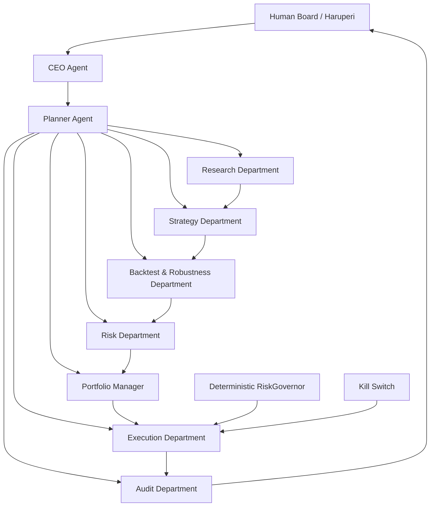

# HaruQuant Agentic Trading Firm Governance Pack

## Overview

This folder contains the foundational governance documents for the HaruQuant Agentic Firm: a human-governed, multi-agent trading system designed to research, create, validate, monitor, and eventually execute trading strategies under strict risk controls.

The purpose of this governance pack is to make HaruQuant safe before it becomes autonomous. Every agent, tool, strategy, risk rule, execution decision, and live-trading action must operate under these documents.

> Core principle: agents may research, propose, analyze, test, and report; deterministic systems and human approval control risk, capital, and live execution.

---

## Folder Location

Place these files in:

```text
docs/agentic_firm/
```

Recommended structure:

```text
docs/
  agentic_firm/
    README.md
    constitution.md
    risk_policy.md
    agent_permissions.md
    strategy_lifecycle.md
    phase2_repository_refactor_plan.md
```

---

## Documents

| Document                  | Purpose                                                                                                                                                          |   Status |
| ------------------------- | ---------------------------------------------------------------------------------------------------------------------------------------------------------------- | -------: |
| `constitution.md`       | Defines the mission, authority structure, allowed/forbidden behavior, Board approval rules, audit requirements, and incident escalation.                         | Complete |
| `risk_policy.md`        | Defines the standard prop-firm-compliant risk profile, exposure limits, spread/slippage/news filters, automation rules, allocation rules, and kill-switch rules. | Complete |
| `agent_permissions.md`  | Defines each agent role, allowed tools, forbidden tools, tool risk classes, approval requirements, and emergency-disable rules.                                  | Complete |
| `strategy_lifecycle.md` | Defines the full lifecycle from idea to live deployment, including promotion, demotion, retirement, and evidence requirements.                                   | Complete |
| `phase2_repository_refactor_plan.md` | Maps the Phase 2 repository/folder target onto the current codebase and defines the additive migration plan.                                      | Complete |

---

## Governance Philosophy

HaruQuant follows a layered control model:

```text
Human Board
→ Firm Constitution
→ Risk Policy
→ Agent Permissions
→ Strategy Lifecycle
→ Tool Registry
→ RiskGovernor
→ Audit System
→ Execution Bridge
```

The system is intentionally designed so that no LLM agent can independently control capital.

Agents can produce recommendations, but the following remain outside agent authority:

1. Risk threshold changes.
2. Live trading activation.
3. Capital allocation increases.
4. RiskGovernor bypasses.
5. Kill-switch overrides.
6. Deletion of audit logs.
7. Unapproved broker/account changes.
8. Unapproved strategy promotion to live trading.

---

## Document 1: `constitution.md`

The constitution is the highest-level governance document.

It defines:

- The mission of the HaruQuant Agentic Firm.
- Human Board authority.
- Allowed and forbidden actions.
- Paper-trading-first policy.
- Live-trading approval law.
- Audit-log requirements.
- Incident escalation.
- Strategy retirement principles.
- Agent authority limits.
- Non-negotiable operating laws.

### Key Principle

```text
No agent may independently deploy, size, approve, or execute live capital without deterministic risk approval and human Board authorization.
```

---

## Document 2: `risk_policy.md`

The risk policy defines one simplified standard prop-firm-compliant profile.

This profile is intentionally conservative and designed to stop HaruQuant before a prop-firm violation occurs.

### Core Prop-Firm Risk Profile

| Rule                        |                               External Limit |                         HaruQuant Internal Control |
| --------------------------- | -------------------------------------------: | -------------------------------------------------: |
| Max daily loss              |                                           5% |   Stop new trades at 4%; emergency state near 4.5% |
| Max total loss              |                                   10% static |   Stop new trades at 8.5%; emergency state near 9% |
| Monthly/cycle profit target |                                          10% |    Target only, never used to justify over-risking |
| News restriction            | 10 minutes before and after high-impact news |             Block new entries in restricted window |
| Weekend/overnight holding   |                        Restricted by default |                 Close or block according to policy |
| Best Day Rule               |     Max single-day profit contribution limit | Warning at 40%, critical at 45%, hard limit at 50% |

### Risk Enforcement Philosophy

The RiskGovernor must enforce risk in code. LLMs may explain risk, but they must never be trusted as the final risk-control mechanism.

---

## Document 3: `agent_permissions.md`

The agent permissions policy defines what each agent can and cannot do.

It separates tools into:

1. Read-only tools.
2. Write tools.
3. Critical tools.
4. Human-approval tools.
5. RiskGovernor-approval tools.

### Permission Model

| Tool Class         | Example                                                     | Approval Required              |
| ------------------ | ----------------------------------------------------------- | ------------------------------ |
| Read-only          | Read market data, read reports, read strategy registry      | No                             |
| Write              | Save strategy spec, run backtest, create report             | Usually no, but audited        |
| Critical           | Request live activation, pause strategy, place order        | Yes                            |
| RiskGovernor-gated | Trade proposal, paper order, live order                     | RiskGovernor approval required |
| Human-gated        | Live activation, allocation increase, risk threshold change | Human Board approval required  |

### Key Principle

```text
Agents receive the minimum tool access required to perform their role.
```

---

## Document 4: `strategy_lifecycle.md`

The lifecycle policy controls how a strategy moves from idea to deployment.

### Lifecycle States

```text
idea
→ spec
→ code_review
→ backtest
→ robustness
→ paper_trading
→ micro_live
→ limited_live
→ normal_live
→ paused
→ retired
→ rejected
```

### Core Promotion Rule

A strategy cannot skip stages.

A strategy must collect evidence before promotion:

| Promotion                   | Required Evidence                                   |
| --------------------------- | --------------------------------------------------- |
| Idea → Spec                | Research brief and feasibility score                |
| Spec → Code Review         | Complete strategy spec                              |
| Code Review → Backtest     | Bias, feasibility, and implementation review        |
| Backtest → Robustness      | Reproducible backtest package                       |
| Robustness → Paper Trading | Robustness score, risk memo, lifecycle approval     |
| Paper Trading → Micro Live | Paper-trading record, risk approval, Board approval |
| Micro Live → Limited Live  | Stable micro-live record and allocation review      |
| Limited Live → Normal Live | Stable live performance and Board approval          |

---

## Agentic Firm Operating Model

HaruQuant should operate as a controlled research and trading firm.



---

## Required Implementation Order

Use this governance pack before building agents.

Recommended dependency order:

```text
1. Constitution
2. Risk Policy
3. Agent Permissions
4. Strategy Lifecycle
5. Schemas
6. Database tables
7. Tool registry
8. Agent registry
9. Planner and CEO Agent
10. Read-only agents
11. Strategy creation agents
12. Backtest and robustness agents
13. RiskGovernor
14. Paper trading
15. Performance reporting
16. Portfolio manager
17. Live execution bridge
18. Kill switch
19. Audit agent
```

Do not implement live execution before the RiskGovernor, kill switch, audit system, and human approval workflow exist.

---

## Minimum Compliance Rules

Every HaruQuant agent must obey these rules:

1. Use only registered tools.
2. Stay within assigned permissions.
3. Produce evidence references for decisions.
4. Never modify risk thresholds.
5. Never bypass RiskGovernor.
6. Never place live trades directly.
7. Never activate live trading.
8. Never delete evidence or audit logs.
9. Escalate critical incidents.
10. Accept emergency disable without override.

---

## Prop-Firm Compliance Rules

HaruQuant’s prop-firm risk posture is based on conservative internal enforcement.

### Mandatory Limits

```yaml
standard_prop_firm_compliance:
  max_daily_loss_external: 0.05
  max_daily_loss_internal_stop: 0.04
  max_total_loss_static_external: 0.10
  max_total_loss_internal_stop: 0.085
  monthly_profit_target: 0.10
  news_block_minutes_before: 10
  news_block_minutes_after: 10
  weekend_holding_restricted: true
  overnight_holding_restricted: true
  best_day_rule_hard_limit: 0.50
  best_day_rule_warning: 0.40
  best_day_rule_critical: 0.45
```

### Important

The profit target is not a reason to increase risk.

If HaruQuant is close to a loss limit, consistency breach, or forbidden-practice boundary, the correct action is to reduce or stop trading, not to “recover” aggressively.

---

## Evidence Requirements

Before a strategy can reach paper trading, it must have:

1. Strategy spec.
2. Code review.
3. Bias review.
4. Backtest package.
5. Analytics summary.
6. Robustness report.
7. Risk memo.
8. Lifecycle approval record.

Before live trading, it must additionally have:

1. Sufficient paper-trading history.
2. Paper execution logs.
3. Prop-firm compliance review.
4. RiskGovernor compatibility review.
5. Portfolio Manager approval.
6. Human Board approval.
7. Kill-switch readiness check.
8. Audit readiness check.

Before increasing allocation, it must have:

1. Current live performance record.
2. Drawdown review.
3. Correlation review.
4. Best Day Rule review.
5. Prop-firm limit usage review.
6. Updated risk memo.
7. Human Board approval.

---

## Emergency Disable Rules

An agent or tool must be disabled immediately if it:

1. Attempts to bypass permissions.
2. Attempts to place unauthorized live orders.
3. Attempts to modify risk rules.
4. Attempts to erase or overwrite audit evidence.
5. Repeatedly produces unsafe recommendations.
6. Makes repeated invalid tool calls.
7. Creates excessive API/broker requests.
8. Causes or contributes to execution anomalies.
9. Violates prop-firm restrictions.
10. Ignores RiskGovernor rejection.

Emergency disable must be logged and escalated to the Human Board.

---

## Recommended Next Files

After this governance pack, build:

```text
backend/app/agents/schemas.py
backend/app/tools/registry.py
backend/app/agents/permissions.py
backend/app/agents/task_manager.py
backend/app/agents/orchestrator.py
backend/app/risk/governor.py
backend/app/risk/kill_switch.py
backend/app/audit/audit_logger.py
```

---

## Implementation Status

| Phase | Deliverable               |   Status |
| ----: | ------------------------- | -------: |
|   1.1 | `constitution.md`       | Complete |
|   1.2 | `risk_policy.md`        | Complete |
|   1.3 | `agent_permissions.md`  | Complete |
|   1.4 | `strategy_lifecycle.md` | Complete |
|   1.5 | Governance README         | Complete |
|   2.0 | Repository and folder structure | Complete |
|   3.0 | Core schemas and contracts | Complete |
|   4.0 | Database tables and audit persistence | Complete |
|   5.0 | Tool registry and permission layer | Complete |
|   6.0 | Agent control plane | Complete |

---

## Design References

This governance pack is aligned with the following design principles:

- NIST AI RMF: govern, map, measure, and manage AI risk.
- OWASP AI Agent Security: least privilege, tool security, memory protection, monitoring, and agent boundary control.
- Model Context Protocol: typed tools, schemas, and explicit tool boundaries.
- Automated-trading risk-control practice: pre-trade controls, kill switches, post-trade monitoring, and system safeguards.
- Prop-firm trading discipline: daily loss limits, total loss limits, news restrictions, weekend/overnight controls, consistency constraints, and forbidden-practice avoidance.

---

## Final Rule

```text
If a strategy or agent cannot be explained, audited, risk-checked, and safely disabled, it is not allowed to operate.
```
