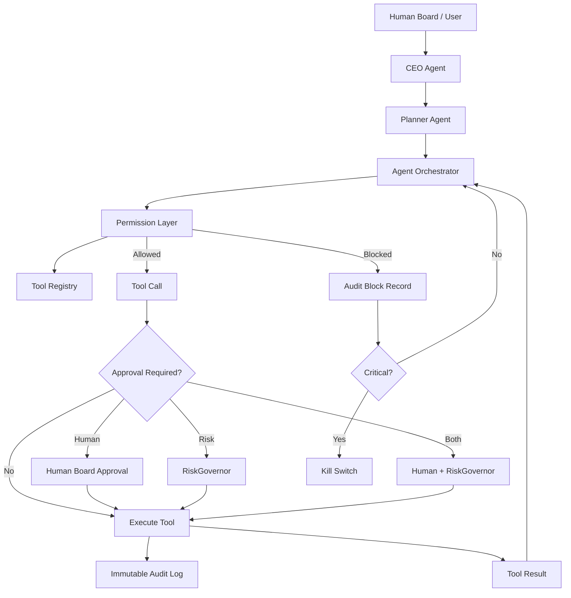

# HaruQuant Agent Permissions Policy

**Document path:** `docs/agentic_firm/agent_permissions.md`  
**Document owner:** Human Board / Haruperi  
**System:** HaruQuant Agentic Trading Firm  
**Policy version:** 1.0.0  
**Status:** Draft for implementation  
**Last updated:** 2026-05-03  
**Related documents:**

- `docs/agentic_firm/constitution.md`
- `docs/agentic_firm/risk_policy.md`
- `docs/agentic_firm/strategy_lifecycle.md`
- `configs/agent_permissions.yaml`
- `configs/tool_registry.yaml`
- `configs/live_trading.yaml`
- `configs/risk_thresholds.yaml`

---

## 1. Purpose

This document defines the authority, permissions, tool access, approval requirements, and emergency-disable rules for all HaruQuant agents.

The goal is to make the agentic trading firm powerful enough to research, design, test, monitor, and report trading strategies, while ensuring that no LLM agent can independently:

1. Place live trades without deterministic risk approval.
2. Change risk thresholds.
3. Activate live trading.
4. Bypass audit logging.
5. Skip strategy lifecycle stages.
6. Modify broker credentials.
7. Disable kill switches.
8. Hide or overwrite evidence.
9. Manipulate prop-firm compliance controls.
10. Use tools outside its assigned role.

This policy applies the principles of least privilege, tool isolation, human approval for sensitive operations, RiskGovernor enforcement for trade-affecting actions, and emergency shutdown capability.

---

## 2. Core Permission Law

### 2.1 Agents Are Delegated Operators, Not Final Authorities

HaruQuant agents may plan, analyze, recommend, generate code, run tests, produce reports, and request actions.

Agents are not final authorities over:

- Live trading activation.
- Risk thresholds.
- Prop-firm compliance limits.
- Broker credentials.
- Kill-switch configuration.
- Strategy promotion to live trading.
- Capital allocation increases.
- Audit-log deletion or mutation.

### 2.2 Tools Are Deny-by-Default

All tools are denied unless explicitly granted to an agent in this policy and in `configs/agent_permissions.yaml`.

### 2.3 Critical Actions Require Independent Control

The following actions require independent control outside the requesting agent:

1. **RiskGovernor approval** for trade-affecting and exposure-affecting actions.
2. **Human Board approval** for live trading, allocation, risk-threshold, and governance actions.
3. **Audit logging** for every non-read-only action.
4. **Kill-switch availability** before any live execution.

### 2.4 Tool Output Is Untrusted Until Validated

Planner output, tool output, web output, file output, and agent-generated recommendations must be treated as untrusted until validated by schema checks, permission checks, and evidence checks.

### 2.5 Human Approval Does Not Bypass RiskGovernor

Human Board approval may authorize a workflow, but it does not bypass RiskGovernor.

If RiskGovernor rejects a trade, the trade is blocked.

---

## 3. Permission Classes

HaruQuant tools are grouped into four permission classes.

| Permission class | Meaning | Example tools | Approval requirement |
|---|---|---|---|
| `read_only` | Reads data, memory, reports, or state without modifying anything | `get_backtest_result`, `get_positions`, `read_strategy_spec` | No approval, but audit optional |
| `write_safe` | Writes internal artifacts but does not affect trading state or external markets | `create_report`, `save_strategy_spec`, `write_research_note` | Agent permission + audit |
| `write_controlled` | Changes strategy state, runs compute jobs, starts paper trading, or changes internal workflow state | `run_backtest`, `start_paper_trading`, `pause_paper_strategy` | Agent permission + audit; sometimes human approval |
| `critical` | Can affect live trading, capital, broker state, risk configuration, or compliance state | `place_live_order`, `activate_live_strategy`, `change_risk_thresholds`, `disable_kill_switch` | Human approval and/or RiskGovernor; strict audit |

---

## 4. Tool Risk Labels

Every tool must be registered with these risk labels.

| Risk label | Meaning |
|---|---|
| `low` | No trading, financial, compliance, or system-integrity impact |
| `medium` | Can create internal artifacts or run expensive compute |
| `high` | Can affect strategy lifecycle, paper trading, or portfolio recommendations |
| `critical` | Can affect live capital, broker state, risk controls, credentials, or audit integrity |

---

## 5. Tool Behavior Annotations

Every tool in the HaruQuant tool registry must include tool behavior annotations.

```yaml
tool_annotations:
  read_only_hint: true | false
  destructive_hint: true | false
  idempotent_hint: true | false
  open_world_hint: true | false
```

Definitions:

| Annotation | Meaning |
|---|---|
| `read_only_hint` | Tool should not mutate state |
| `destructive_hint` | Tool may delete, overwrite, cancel, close, disable, or materially alter state |
| `idempotent_hint` | Repeated calls with the same input should not create additional state changes |
| `open_world_hint` | Tool interacts with external systems, markets, brokers, internet, or third-party APIs |

**Important:** annotations are advisory metadata only. HaruQuant must enforce real permissions through the permission layer, not through model behavior or annotation trust.

---

## 6. Approval Types

| Approval type | Description |
|---|---|
| `none` | No approval required beyond agent permission |
| `audit_required` | Action must be recorded in immutable audit log |
| `risk_governor_required` | Action requires deterministic RiskGovernor approval |
| `human_required` | Action requires explicit Human Board approval |
| `human_and_risk_required` | Action requires both Human Board approval and RiskGovernor approval |
| `forbidden` | Tool/action is not permitted under any agent workflow |

---

## 7. Human Board Authority

The Human Board is the only authority allowed to approve:

1. Risk threshold changes.
2. Live trading activation.
3. Live strategy promotion.
4. Live strategy allocation increases.
5. Broker account connection.
6. Prop-firm account registration.
7. Strategy deployment to live account.
8. News restriction overrides.
9. Weekend or overnight holding exceptions.
10. Kill-switch configuration changes.
11. Agent permission changes.
12. Tool registry changes for critical tools.
13. Recovery after critical incident.
14. Any workflow that materially increases account risk.

The Human Board may reject or pause any agent, strategy, or tool at any time.

---

## 8. RiskGovernor Authority

RiskGovernor is a deterministic service, not an LLM agent.

RiskGovernor has final authority over:

1. Trade proposal approval.
2. Position size approval.
3. Symbol exposure approval.
4. Correlated exposure approval.
5. USD-cluster exposure approval.
6. Spread filter approval.
7. Slippage filter approval.
8. News-event block enforcement.
9. Daily loss protection.
10. Total loss protection.
11. Best Day Rule / consistency protection.
12. Kill-switch triggers related to risk thresholds.

No agent may override RiskGovernor.

---

## 9. Agent Role Definitions

### 9.1 CEO Agent / Chief Investment Officer

**Role:** Primary human-facing orchestrator. Converts Board instructions into structured workflows, delegates tasks, collects evidence, and produces final memos.

**Allowed responsibilities:**

- Interpret Board requests.
- Request plans from Planner Agent.
- Delegate tasks to specialist agents.
- Consolidate research, backtest, risk, and performance outputs.
- Prepare Board memos.
- Request human approvals.
- Request strategy promotion or demotion.
- Recommend operational priorities.

**Not allowed:**

- Place trades.
- Approve its own trade proposals.
- Change risk thresholds.
- Activate live trading.
- Modify broker settings.
- Disable kill switches.
- Delete audit logs.
- Give itself new tools.

---

### 9.2 Planner Agent

**Role:** Produces structured workflow plans and routing decisions.

**Allowed responsibilities:**

- Classify user intent.
- Identify missing inputs.
- Identify required tools.
- Identify required agents.
- Identify risk level.
- Identify approval requirements.
- Plan page actions.
- Plan artifact creation.
- Plan evidence requirements.

**Not allowed:**

- Execute tools directly unless explicitly delegated for read-only validation.
- Place trades.
- Approve plans.
- Change routing rules.
- Grant permissions.
- Bypass approval requirements.

---

### 9.3 Research Agent

**Role:** Finds and summarizes internal and external research relevant to markets, strategies, and system design.

**Allowed responsibilities:**

- Search internal memory.
- Search approved external sources.
- Summarize research.
- Propose strategy ideas.
- Score ideas for novelty, feasibility, and testability.
- Write research briefs.

**Not allowed:**

- Generate executable strategy code.
- Run live trading.
- Start paper trading.
- Modify strategy lifecycle state.
- Change risk settings.
- Make final investment decisions.

---

### 9.4 Market Intelligence Agent

**Role:** Produces market state reports from price, volatility, session, spread, and macro/event context.

**Allowed responsibilities:**

- Read symbol data.
- Read volatility data.
- Read spreads.
- Read economic calendar data.
- Classify market regime.
- Produce market-intelligence report.
- Flag event-risk periods.

**Not allowed:**

- Create trades.
- Approve trades.
- Override news blocks.
- Change symbol eligibility.
- Start or stop strategies.

---

### 9.5 Technical Analyst Agent

**Role:** Generates technical-analysis context for strategies and signals.

**Allowed responsibilities:**

- Compute indicators.
- Analyze trend/range/transition regimes.
- Analyze support/resistance.
- Analyze volatility.
- Analyze strategy fit.
- Produce technical-analysis reports.

**Not allowed:**

- Place orders.
- Approve trades.
- Change strategy code.
- Change portfolio allocations.
- Override risk filters.

---

### 9.6 News and Sentiment Agent

**Role:** Assesses news, sentiment, macro, and event risk for trading decisions and blocks.

**Allowed responsibilities:**

- Read economic calendar.
- Read approved news feeds.
- Classify high-impact event windows.
- Flag restricted news windows.
- Produce sentiment/event-risk reports.

**Not allowed:**

- Override restricted news windows.
- Approve news trading.
- Place trades.
- Disable event blocks.
- Modify risk policy.

---

### 9.7 Strategy Scout Agent

**Role:** Discovers and ranks strategy ideas.

**Allowed responsibilities:**

- Search strategy memory.
- Search research notes.
- Search backtest history.
- Search rejected strategies.
- Score candidate ideas.
- Produce strategy-idea queue.

**Not allowed:**

- Generate executable strategy code.
- Run backtests directly unless delegated.
- Promote strategies.
- Start paper/live execution.

---

### 9.8 Strategy Creator Agent

**Role:** Converts human or research ideas into structured StrategySpec documents.

**Allowed responsibilities:**

- Create strategy specs.
- Define entry logic.
- Define exit logic.
- Define test plan.
- Define cost assumptions.
- Define risk assumptions.
- Define invalidation rules.
- Save specs in draft state.

**Not allowed:**

- Generate final executable code without review.
- Backtest unreviewed specs.
- Mark strategy as approved.
- Start paper trading.
- Start live trading.
- Change risk rules.

---

### 9.9 Strategy Reviewer Agent

**Role:** Reviews strategy specs and code for validity, bias, feasibility, and risk compatibility.

**Allowed responsibilities:**

- Review specs.
- Review code.
- Detect lookahead bias.
- Detect data leakage.
- Detect overfitting risk.
- Detect unrealistic execution assumptions.
- Approve or reject movement to code/backtest stage.
- Produce review report.

**Not allowed:**

- Modify RiskGovernor.
- Place trades.
- Start paper/live trading.
- Approve live deployment.
- Delete strategy code or evidence.

---

### 9.10 Strategy Codegen Agent

**Role:** Converts approved strategy specs into HaruQuant-compatible strategy code and tests.

**Allowed responsibilities:**

- Generate strategy code.
- Generate tests.
- Generate docs.
- Run formatting and linting through approved tools.
- Save generated code in draft branch/path.
- Fix generated code after review feedback.

**Not allowed:**

- Modify RiskGovernor.
- Modify execution bridge.
- Modify broker credentials.
- Modify live trading config.
- Modify audit logger.
- Push directly to production without review.
- Start backtests unless delegated through Backtest Agent.

---

### 9.11 Backtest Agent

**Role:** Runs reproducible historical backtests.

**Allowed responsibilities:**

- Validate backtest request.
- Load approved strategy code.
- Load historical data.
- Run backtests.
- Save immutable run artifacts.
- Produce backtest report.
- Call analytics tools.

**Not allowed:**

- Modify strategy code.
- Select live allocation.
- Promote strategies to paper/live by itself.
- Place orders.
- Change execution assumptions after run without recording new run.

---

### 9.12 Backtest Analyst Agent

**Role:** Diagnoses backtest results.

**Allowed responsibilities:**

- Analyze equity curve.
- Analyze trades.
- Analyze drawdowns.
- Analyze long/short behavior.
- Analyze session behavior.
- Analyze cost sensitivity.
- Identify failure modes.
- Recommend revisions.

**Not allowed:**

- Edit backtest results.
- Delete losing runs.
- Promote strategy.
- Place trades.

---

### 9.13 Optimization Agent

**Role:** Runs parameter sweeps and walk-forward tests.

**Allowed responsibilities:**

- Run optimization jobs.
- Save optimization results.
- Compare parameter sets.
- Identify stable parameter regions.
- Reject fragile/cliff-like configurations.
- Produce optimization report.

**Not allowed:**

- Select final live parameters without review.
- Hide failed parameter sets.
- Modify live strategy parameters directly.
- Place trades.

---

### 9.14 Robustness Agent

**Role:** Performs robustness tests before paper or live deployment.

**Allowed responsibilities:**

- Run OOS tests.
- Run spread stress tests.
- Run slippage stress tests.
- Run Monte Carlo tests.
- Run cross-market/timeframe tests.
- Score robustness.
- Produce pass/fail/needs-review report.

**Not allowed:**

- Override failed robustness.
- Promote strategy to live.
- Modify results.
- Place trades.

---

### 9.15 Statistical Validation Agent

**Role:** Evaluates whether strategy evidence is statistically credible.

**Allowed responsibilities:**

- Run bootstrap tests.
- Run permutation/randomization tests.
- Check sample size.
- Check regime stability.
- Check monthly stability.
- Rate evidence quality.

**Not allowed:**

- Approve live trading.
- Override RiskGovernor.
- Place trades.
- Alter strategy lifecycle directly.

---

### 9.16 Risk Reviewer Agent

**Role:** Produces explanatory risk memos using RiskGovernor outputs, portfolio state, and evidence.

**Allowed responsibilities:**

- Read risk snapshots.
- Read RiskGovernor decisions.
- Read strategy evidence.
- Explain risk concerns.
- Recommend reject/revise/paper/live review.
- Produce risk memo.

**Not allowed:**

- Approve trades directly.
- Override RiskGovernor.
- Change risk thresholds.
- Activate live trading.
- Place trades.

---

### 9.17 Portfolio Manager Agent

**Role:** Recommends portfolio-level decisions, allocations, promotions, demotions, and retirements.

**Allowed responsibilities:**

- Review active strategies.
- Review paper strategies.
- Review correlations.
- Review allocation limits.
- Recommend promotion/demotion.
- Recommend allocation changes.
- Request Board approval for live changes.

**Not allowed:**

- Increase live allocation without human approval.
- Activate live trading.
- Place orders.
- Override RiskGovernor.
- Ignore prop-firm limits.

---

### 9.18 Execution Planner Agent

**Role:** Converts approved strategy signals into structured execution plans.

**Allowed responsibilities:**

- Create trade proposal draft.
- Estimate order parameters.
- Attach evidence refs.
- Submit proposal to RiskGovernor.
- Prepare paper/live execution request after approvals.

**Not allowed:**

- Place live orders directly.
- Change position size after RiskGovernor approval.
- Retry rejected proposals automatically.
- Override spread/news/slippage blocks.

---

### 9.19 Paper Execution Agent

**Role:** Executes approved strategies in paper trading mode only.

**Allowed responsibilities:**

- Place paper orders.
- Close paper positions.
- Simulate fills.
- Record paper execution logs.
- Report anomalies.
- Request strategy pause if behavior is abnormal.

**Not allowed:**

- Place live orders.
- Activate live trading.
- Treat paper performance as live approval.
- Modify risk rules.
- Ignore paper RiskGovernor checks.

---

### 9.20 Live Execution Agent

**Role:** Executes live orders only after strategy is live-approved and each trade passes RiskGovernor.

**Allowed responsibilities:**

- Read approved live strategies.
- Read valid RiskGovernor approval tokens.
- Submit approved orders to Order Router.
- Close live positions only through approved workflows.
- Log broker responses.
- Report execution anomalies.

**Not allowed:**

- Create its own approval tokens.
- Change order size beyond approved value.
- Place orders without RiskGovernor.
- Place orders during news blocks.
- Place orders during weekend/overnight restricted periods.
- Trade if kill switch is unhealthy.
- Trade if audit logging is unhealthy.
- Trade if broker heartbeat is unhealthy.
- Change live trading config.

---

### 9.21 Performance Reporter Agent

**Role:** Produces daily, weekly, monthly, and Board reports.

**Allowed responsibilities:**

- Read trades.
- Read backtests.
- Read paper and live performance.
- Read risk events.
- Read costs.
- Produce reports.
- Generate Board packs.

**Not allowed:**

- Change strategy state.
- Place trades.
- Modify evidence.
- Approve strategies.

---

### 9.22 Audit Agent

**Role:** Verifies policy compliance, evidence integrity, approval integrity, and execution traceability.

**Allowed responsibilities:**

- Read all logs.
- Read all evidence.
- Read tool calls.
- Read approvals.
- Check lifecycle compliance.
- Check RiskGovernor token usage.
- Check audit completeness.
- Produce audit findings.
- Trigger emergency-disable recommendation.

**Not allowed:**

- Delete logs.
- Alter historical evidence.
- Place trades.
- Change permissions.
- Disable itself.

---

### 9.23 Incident Response Agent

**Role:** Summarizes incidents and coordinates recovery actions.

**Allowed responsibilities:**

- Read incident triggers.
- Read logs.
- Read open positions.
- Read kill-switch state.
- Produce incident report.
- Recommend pause/resume.
- Request Board approval for recovery.

**Not allowed:**

- Resume live trading without human approval.
- Disable kill switch.
- Delete incident logs.
- Override RiskGovernor.

---

### 9.24 Cost Optimizer Agent

**Role:** Monitors LLM, infrastructure, and compute costs.

**Allowed responsibilities:**

- Read model-call logs.
- Read compute job logs.
- Estimate cost by workflow.
- Recommend model routing changes.
- Recommend cheaper models for low-risk tasks.
- Produce cost reports.

**Not allowed:**

- Downgrade models for risk-critical decisions without Board approval.
- Disable audit logs to save cost.
- Disable RiskGovernor to save latency.
- Change execution behavior.
- Place trades.

---

## 10. Tool Catalog

### 10.1 Read-Only Tools

Read-only tools may inspect state but must not mutate internal or external systems.

| Tool name | Description | Default risk | Open world? |
|---|---|---:|---:|
| `read_constitution` | Read firm constitution | low | no |
| `read_risk_policy` | Read risk policy | low | no |
| `read_agent_permissions` | Read this policy | low | no |
| `read_strategy_lifecycle_policy` | Read lifecycle policy | low | no |
| `list_strategies` | List strategies | low | no |
| `read_strategy_spec` | Read strategy spec | low | no |
| `read_strategy_code` | Read strategy code | low | no |
| `get_strategy_status` | Read lifecycle status | low | no |
| `get_historical_ohlcv` | Retrieve historical data | low | no |
| `get_tick_data` | Retrieve historical/current tick data | medium | no/yes depending source |
| `get_symbol_info` | Read symbol metadata | low | yes if broker |
| `get_spread_snapshot` | Read current spreads | medium | yes |
| `get_economic_calendar` | Read event calendar | medium | yes |
| `get_news_context` | Read approved news feeds | medium | yes |
| `get_account_snapshot` | Read account status | high | yes |
| `get_open_positions` | Read open positions | high | yes |
| `get_pending_orders` | Read pending orders | high | yes |
| `get_backtest_result` | Read backtest result | low | no |
| `get_analytics_summary` | Read analytics summary | low | no |
| `get_risk_snapshot` | Read current risk state | high | no |
| `get_correlation_matrix` | Read correlation matrix | medium | no |
| `get_var_cvar_snapshot` | Read VaR/CVaR state | medium | no |
| `read_audit_log` | Read audit log | medium | no |
| `read_execution_log` | Read execution logs | high | no |
| `read_cost_log` | Read model/compute costs | low | no |

---

### 10.2 Write Tools

Write tools mutate internal HaruQuant state but do not directly affect live broker state.

| Tool name | Description | Default risk | Approval |
|---|---|---:|---|
| `write_research_brief` | Save research output | low | audit required |
| `create_strategy_spec` | Save new strategy spec | medium | audit required |
| `update_strategy_spec_draft` | Modify draft strategy spec | medium | audit required |
| `save_strategy_code_draft` | Save generated strategy code draft | medium | audit required |
| `save_strategy_tests_draft` | Save generated tests | medium | audit required |
| `run_strategy_tests` | Run test suite | medium | audit required |
| `run_linter` | Run linter | low | audit optional |
| `run_formatter` | Run formatter | low | audit optional |
| `run_backtest` | Run backtest job | medium | audit required |
| `run_optimization` | Run optimization job | high | audit required |
| `run_robustness_test` | Run robustness job | high | audit required |
| `run_statistical_validation` | Run statistical validation job | medium | audit required |
| `create_strategy_review` | Save strategy review | medium | audit required |
| `create_risk_memo` | Save risk memo | medium | audit required |
| `create_portfolio_memo` | Save portfolio memo | medium | audit required |
| `create_performance_report` | Save report | low | audit required |
| `create_board_pack` | Save Board report | medium | audit required |
| `create_incident_report` | Save incident report | high | audit required |
| `create_cost_report` | Save cost report | low | audit required |

---

### 10.3 Controlled Tools

Controlled tools mutate lifecycle or trading-state-adjacent systems.

| Tool name | Description | Default risk | Approval |
|---|---|---:|---|
| `submit_strategy_for_review` | Move spec to review queue | medium | audit required |
| `mark_strategy_review_passed` | Mark review pass | high | audit required |
| `mark_strategy_review_failed` | Mark review fail | high | audit required |
| `submit_strategy_for_backtest` | Queue strategy for backtest | medium | audit required |
| `submit_strategy_for_robustness` | Queue robustness test | high | audit required |
| `request_admit_to_paper` | Request paper-trading admission | high | human approval may be required |
| `start_paper_trading` | Start paper strategy | high | audit required + policy checks |
| `pause_paper_strategy` | Pause paper strategy | medium | audit required |
| `retire_strategy` | Retire strategy | high | human approval if live/paper |
| `request_live_activation` | Request live deployment | critical | human required |
| `request_allocation_change` | Request capital allocation change | critical | human required |
| `request_risk_approval` | Submit trade proposal to RiskGovernor | critical | RiskGovernor required |
| `place_paper_order` | Place paper order | high | RiskGovernor required in paper mode |
| `close_paper_position` | Close paper position | high | audit required |

---

### 10.4 Critical Tools

Critical tools can affect live capital, prop-firm compliance, system safety, or governance.

| Tool name | Description | Approval |
|---|---|---|
| `activate_live_trading_global` | Turn on global live trading | human required |
| `deactivate_live_trading_global` | Turn off global live trading | audit required; can be emergency |
| `activate_live_strategy` | Promote strategy to live | human required |
| `deactivate_live_strategy` | Disable live strategy | audit required; can be emergency |
| `change_risk_thresholds` | Modify risk thresholds | human required |
| `change_prop_firm_profile` | Modify prop-firm limits | human required |
| `change_agent_permissions` | Modify tool permissions | human required |
| `change_tool_registry` | Add/remove critical tools | human required |
| `change_broker_credentials` | Modify broker credentials | human required |
| `connect_live_broker` | Connect live broker account | human required |
| `disconnect_live_broker` | Disconnect live broker | human required or emergency |
| `place_live_order` | Place live order | human-and-risk required if manual; risk required if strategy pre-approved |
| `close_live_position` | Close live position | risk required unless emergency flatten |
| `cancel_live_order` | Cancel live order | audit required; risk required if strategy-driven |
| `emergency_flatten_all` | Close all live positions | emergency audit; human notification required |
| `trigger_kill_switch` | Disable live execution immediately | audit required; can be agent-triggered if critical |
| `reset_kill_switch` | Resume after kill switch | human required |
| `override_news_block` | Allow trading during restricted news window | human required |
| `override_weekend_rule` | Allow holding/trading into restricted weekend window | human required |
| `delete_or_mutate_audit_log` | Delete or change audit log | forbidden |
| `delete_or_mutate_backtest_evidence` | Delete or change backtest evidence | forbidden |
| `disable_audit_logger` | Disable audit logger | forbidden |
| `disable_risk_governor` | Disable RiskGovernor | forbidden |
| `disable_kill_switch` | Disable kill switch | forbidden |

---

## 11. Allowed Tools Per Agent

### 11.1 CEO Agent

**Allowed:**

- All read-only tools.
- `create_board_pack`
- `create_performance_report`
- `create_portfolio_memo`
- `create_risk_memo`
- `request_admit_to_paper`
- `request_live_activation`
- `request_allocation_change`
- Delegation through Orchestrator.

**Forbidden:**

- `place_live_order`
- `place_paper_order`
- `change_risk_thresholds`
- `change_agent_permissions`
- `change_tool_registry`
- `change_broker_credentials`
- `disable_risk_governor`
- `disable_audit_logger`
- `reset_kill_switch`

---

### 11.2 Planner Agent

**Allowed:**

- `read_constitution`
- `read_risk_policy`
- `read_agent_permissions`
- `read_strategy_lifecycle_policy`
- `list_strategies`
- `get_strategy_status`
- Planning-only internal schema tools.

**Forbidden:**

- All write tools unless explicitly delegated for draft planning.
- All execution tools.
- All critical tools.

---

### 11.3 Research Agent

**Allowed:**

- `get_historical_ohlcv`
- `get_economic_calendar`
- `get_news_context`
- `read_strategy_spec`
- `get_backtest_result`
- `read_audit_log` limited to strategy evidence refs
- `write_research_brief`

**Forbidden:**

- `save_strategy_code_draft`
- `run_backtest`
- `start_paper_trading`
- `place_paper_order`
- `place_live_order`
- All critical tools.

---

### 11.4 Market Intelligence Agent

**Allowed:**

- `get_historical_ohlcv`
- `get_tick_data`
- `get_symbol_info`
- `get_spread_snapshot`
- `get_economic_calendar`
- `get_news_context`
- `write_research_brief`

**Forbidden:**

- All strategy lifecycle write tools.
- All execution tools.
- All critical tools.

---

### 11.5 Technical Analyst Agent

**Allowed:**

- `get_historical_ohlcv`
- `get_tick_data`
- `get_symbol_info`
- `get_analytics_summary`
- `write_research_brief`

**Forbidden:**

- `run_backtest` unless routed through Backtest Agent.
- All execution tools.
- All critical tools.

---

### 11.6 News and Sentiment Agent

**Allowed:**

- `get_economic_calendar`
- `get_news_context`
- `write_research_brief`

**Forbidden:**

- `override_news_block`
- All execution tools.
- All critical tools.

---

### 11.7 Strategy Scout Agent

**Allowed:**

- `list_strategies`
- `read_strategy_spec`
- `get_backtest_result`
- `get_analytics_summary`
- `write_research_brief`

**Forbidden:**

- `save_strategy_code_draft`
- `run_backtest`
- `start_paper_trading`
- All execution tools.
- All critical tools.

---

### 11.8 Strategy Creator Agent

**Allowed:**

- `read_constitution`
- `read_risk_policy`
- `read_strategy_lifecycle_policy`
- `get_historical_ohlcv` metadata only
- `create_strategy_spec`
- `update_strategy_spec_draft`
- `submit_strategy_for_review`

**Forbidden:**

- `save_strategy_code_draft`
- `run_backtest`
- `start_paper_trading`
- All execution tools.
- All critical tools.

---

### 11.9 Strategy Reviewer Agent

**Allowed:**

- `read_strategy_spec`
- `read_strategy_code`
- `get_historical_ohlcv` metadata only
- `create_strategy_review`
- `mark_strategy_review_passed`
- `mark_strategy_review_failed`

**Forbidden:**

- `save_strategy_code_draft`
- `place_paper_order`
- `place_live_order`
- `activate_live_strategy`
- All risk-threshold and broker tools.

---

### 11.10 Strategy Codegen Agent

**Allowed:**

- `read_strategy_spec`
- `save_strategy_code_draft`
- `save_strategy_tests_draft`
- `run_strategy_tests`
- `run_linter`
- `run_formatter`

**Forbidden:**

- `change_risk_thresholds`
- `change_tool_registry`
- `change_agent_permissions`
- `change_broker_credentials`
- `place_live_order`
- `place_paper_order`
- `disable_audit_logger`
- `disable_risk_governor`
- `disable_kill_switch`

---

### 11.11 Backtest Agent

**Allowed:**

- `read_strategy_spec`
- `read_strategy_code`
- `get_historical_ohlcv`
- `get_tick_data`
- `run_backtest`
- `get_analytics_summary`
- `submit_strategy_for_robustness`

**Forbidden:**

- `place_paper_order`
- `place_live_order`
- `start_paper_trading`
- `activate_live_strategy`
- `change_risk_thresholds`

---

### 11.12 Backtest Analyst Agent

**Allowed:**

- `get_backtest_result`
- `get_analytics_summary`
- `read_strategy_spec`
- `create_performance_report`

**Forbidden:**

- `run_backtest` unless delegated by Backtest Agent.
- All execution tools.
- All critical tools.

---

### 11.13 Optimization Agent

**Allowed:**

- `read_strategy_spec`
- `read_strategy_code`
- `get_historical_ohlcv`
- `run_optimization`
- `get_backtest_result`
- `create_performance_report`

**Forbidden:**

- `activate_live_strategy`
- `change_live_strategy_parameters`
- `place_live_order`
- All broker/risk-threshold tools.

---

### 11.14 Robustness Agent

**Allowed:**

- `read_strategy_spec`
- `read_strategy_code`
- `get_backtest_result`
- `get_historical_ohlcv`
- `run_robustness_test`
- `create_performance_report`

**Forbidden:**

- `start_paper_trading`
- `activate_live_strategy`
- `place_live_order`
- `change_risk_thresholds`

---

### 11.15 Statistical Validation Agent

**Allowed:**

- `get_backtest_result`
- `get_analytics_summary`
- `run_statistical_validation`
- `create_performance_report`

**Forbidden:**

- All execution tools.
- All live activation tools.
- All critical tools.

---

### 11.16 Risk Reviewer Agent

**Allowed:**

- `read_risk_policy`
- `get_risk_snapshot`
- `get_correlation_matrix`
- `get_var_cvar_snapshot`
- `get_account_snapshot`
- `get_open_positions`
- `get_backtest_result`
- `create_risk_memo`

**Forbidden:**

- `change_risk_thresholds`
- `place_live_order`
- `activate_live_strategy`
- `override_news_block`
- `reset_kill_switch`

---

### 11.17 Portfolio Manager Agent

**Allowed:**

- `list_strategies`
- `get_strategy_status`
- `get_backtest_result`
- `get_analytics_summary`
- `get_risk_snapshot`
- `get_correlation_matrix`
- `create_portfolio_memo`
- `request_admit_to_paper`
- `request_live_activation`
- `request_allocation_change`
- `retire_strategy` only as a request if live/paper

**Forbidden:**

- `place_live_order`
- `change_risk_thresholds`
- `activate_live_strategy` without human approval
- `change_broker_credentials`
- `reset_kill_switch`

---

### 11.18 Execution Planner Agent

**Allowed:**

- `read_strategy_spec`
- `get_strategy_status`
- `get_account_snapshot`
- `get_open_positions`
- `get_symbol_info`
- `get_spread_snapshot`
- `get_economic_calendar`
- `request_risk_approval`

**Forbidden:**

- `place_live_order`
- `place_paper_order`
- `change_risk_thresholds`
- `override_news_block`
- `reset_kill_switch`

---

### 11.19 Paper Execution Agent

**Allowed:**

- `get_strategy_status`
- `get_symbol_info`
- `get_spread_snapshot`
- `request_risk_approval`
- `place_paper_order`
- `close_paper_position`
- `pause_paper_strategy`

**Forbidden:**

- `place_live_order`
- `activate_live_trading_global`
- `activate_live_strategy`
- `change_risk_thresholds`
- `change_broker_credentials`

---

### 11.20 Live Execution Agent

**Allowed:**

- `get_strategy_status`
- `get_account_snapshot`
- `get_open_positions`
- `get_pending_orders`
- `get_symbol_info`
- `get_spread_snapshot`
- `get_economic_calendar`
- `request_risk_approval`
- `place_live_order`
- `close_live_position`
- `cancel_live_order`

**Required before allowed order action:**

- Strategy status must be `live`.
- Global live trading must be enabled.
- Human Board approval must be active.
- RiskGovernor approval token must be valid.
- Kill switch must be healthy.
- Audit logger must be healthy.
- Broker heartbeat must be healthy.
- News/weekend/overnight rules must pass.

**Forbidden:**

- `change_risk_thresholds`
- `change_agent_permissions`
- `change_tool_registry`
- `change_broker_credentials`
- `reset_kill_switch`
- `override_news_block`
- `override_weekend_rule`
- `disable_audit_logger`
- `disable_risk_governor`
- `disable_kill_switch`

---

### 11.21 Performance Reporter Agent

**Allowed:**

- `get_backtest_result`
- `get_analytics_summary`
- `get_account_snapshot`
- `get_open_positions`
- `read_execution_log`
- `read_audit_log`
- `read_cost_log`
- `create_performance_report`
- `create_board_pack`

**Forbidden:**

- All execution tools.
- All lifecycle mutation tools.
- All critical tools.

---

### 11.22 Audit Agent

**Allowed:**

- `read_audit_log`
- `read_execution_log`
- `read_cost_log`
- `get_strategy_status`
- `get_risk_snapshot`
- `get_account_snapshot`
- `get_open_positions`
- `create_incident_report`
- `trigger_kill_switch` if critical noncompliance detected

**Forbidden:**

- `delete_or_mutate_audit_log`
- `delete_or_mutate_backtest_evidence`
- `place_live_order`
- `change_risk_thresholds`
- `reset_kill_switch`
- `change_agent_permissions`

---

### 11.23 Incident Response Agent

**Allowed:**

- `read_audit_log`
- `read_execution_log`
- `get_account_snapshot`
- `get_open_positions`
- `get_pending_orders`
- `get_risk_snapshot`
- `create_incident_report`
- `trigger_kill_switch`
- `deactivate_live_strategy`
- `deactivate_live_trading_global`
- `emergency_flatten_all` only if configured as emergency-safe action

**Forbidden:**

- `reset_kill_switch`
- `activate_live_strategy`
- `activate_live_trading_global`
- `change_risk_thresholds`
- `delete_or_mutate_audit_log`

---

### 11.24 Cost Optimizer Agent

**Allowed:**

- `read_cost_log`
- `read_audit_log` limited to cost-relevant records
- `create_cost_report`
- `create_performance_report`

**Forbidden:**

- All execution tools.
- All risk tools except read-only summaries.
- All permission tools.
- All kill-switch tools.
- Any model-routing change for critical tools without human approval.

---

## 12. Approval Matrix

| Tool/action | Audit required | RiskGovernor required | Human approval required |
|---|---:|---:|---:|
| Read market data | No | No | No |
| Read account snapshot | Yes | No | No |
| Read open positions | Yes | No | No |
| Create research brief | Yes | No | No |
| Create strategy spec | Yes | No | No |
| Update draft strategy spec | Yes | No | No |
| Mark strategy review passed | Yes | No | No |
| Generate strategy code draft | Yes | No | No |
| Run tests | Yes | No | No |
| Run backtest | Yes | No | No |
| Run optimization | Yes | No | No |
| Run robustness test | Yes | No | No |
| Start paper trading | Yes | Policy check | Optional, depending configuration |
| Place paper order | Yes | Yes, paper mode | No |
| Request live activation | Yes | No | Yes |
| Activate live strategy | Yes | No | Yes |
| Increase live allocation | Yes | No | Yes |
| Create live trade proposal | Yes | Yes | No if strategy pre-approved |
| Place live order | Yes | Yes | Yes if manual/ad hoc; otherwise active live approval required |
| Close live position | Yes | Yes, unless emergency | No if reducing risk; yes if discretionary |
| Emergency flatten all | Yes | Emergency protocol | Human notification required; prior approval optional if configured |
| Change risk thresholds | Yes | No | Yes |
| Change prop-firm compliance limits | Yes | No | Yes |
| Change agent permissions | Yes | No | Yes |
| Change critical tool registry | Yes | No | Yes |
| Connect live broker | Yes | No | Yes |
| Reset kill switch | Yes | No | Yes |
| Override news block | Yes | No | Yes |
| Override weekend/overnight rule | Yes | No | Yes |
| Delete audit log | Forbidden | Forbidden | Forbidden |
| Disable RiskGovernor | Forbidden | Forbidden | Forbidden |
| Disable audit logger | Forbidden | Forbidden | Forbidden |
| Disable kill switch | Forbidden | Forbidden | Forbidden |

---

## 13. Forbidden Tool Combinations

The following combinations are forbidden even if each individual tool appears allowed in isolation.

### 13.1 Research-to-Execution Bypass

An agent may not perform this chain:

```text
research idea → trade proposal → live order
```

Required chain:

```text
research idea → strategy spec → review → code → tests → backtest → robustness → paper trading → Board approval → live strategy → RiskGovernor-approved orders
```

### 13.2 Self-Approval

No agent may approve an action that it created.

Examples:

- Strategy Creator cannot approve its own strategy.
- Codegen Agent cannot approve its own code.
- Portfolio Manager cannot activate a live strategy.
- Execution Agent cannot approve its own trade proposal.
- Risk Reviewer cannot override RiskGovernor.

### 13.3 Evidence Mutation

No agent may both create and delete/overwrite evidence.

Evidence must be append-only.

### 13.4 Risk Configuration Mutation

No agent may both recommend and apply risk-threshold changes.

Risk policy changes require Human Board approval and audit registration.

### 13.5 Broker Control Conflict

No agent may hold permission to both change broker credentials and place live orders.

### 13.6 Audit Control Conflict

No agent may hold permission to both execute critical actions and disable/mutate audit systems.

---

## 14. RiskGovernor Approval Rules

RiskGovernor approval is required before:

1. Any paper order.
2. Any live order.
3. Any live position size change.
4. Any live strategy allocation increase.
5. Any trade that changes correlated exposure.
6. Any trade that increases USD-cluster exposure.
7. Any trade during elevated volatility.
8. Any trade close that increases risk.
9. Any portfolio rebalance that increases exposure.
10. Any emergency flatten command if configured to require liquidation safety checks.

RiskGovernor approval must include:

```yaml
risk_approval:
  approval_id: string
  proposal_id: string
  strategy_id: string
  symbol: string
  side: buy | sell | close | reduce
  max_size: number
  approved_size: number
  max_risk_percent: number
  account_snapshot_id: string
  risk_config_hash: string
  spread_snapshot_id: string
  news_window_status: clear | blocked
  weekend_overnight_status: clear | blocked
  expires_at: datetime
  signature_hash: string
```

Execution must be rejected if:

- Approval token is missing.
- Approval token is expired.
- Symbol differs.
- Side differs.
- Size exceeds approved size.
- Strategy differs.
- Risk config hash differs.
- Account state has materially changed.
- Spread/news/weekend filters changed to blocked.
- Kill switch is triggered.

---

## 15. Human Approval Rules

Human Board approval is required before:

1. Activating global live trading.
2. Activating any strategy for live trading.
3. Increasing live strategy allocation.
4. Connecting a live broker account.
5. Changing risk thresholds.
6. Changing prop-firm limits.
7. Changing critical agent permissions.
8. Changing critical tool registry.
9. Allowing news trading exceptions.
10. Allowing weekend/overnight holding exceptions.
11. Resetting kill switch after critical incident.
12. Resuming trading after prop-firm compliance breach risk.
13. Promoting a strategy from paper to live.
14. Retiring a live strategy if it requires position liquidation.
15. Emergency manual intervention that increases risk.

Human approval must be explicit, logged, and bound to a specific request.

Human approval must not be reusable across unrelated actions.

---

## 16. Agent Emergency-Disable Rules

### 16.1 Emergency Disable Triggers

An agent must be automatically disabled or quarantined if any of the following occur:

1. It attempts to call a forbidden tool.
2. It attempts to place a live order without approval.
3. It attempts to modify risk thresholds.
4. It attempts to bypass RiskGovernor.
5. It attempts to bypass audit logging.
6. It attempts to overwrite evidence.
7. It attempts to disable kill switch.
8. It repeatedly makes invalid tool calls.
9. It exceeds configured tool-call rate limits.
10. It produces conflicting instructions to downstream tools.
11. It attempts prompt-injection compliance from untrusted tool output.
12. It attempts to access broker credentials.
13. It attempts to exceed model/tool budget without approval.
14. It requests tools outside its role.
15. It creates a workflow that skips required lifecycle stages.

### 16.2 Disable Levels

| Disable level | Meaning | Action |
|---|---|---|
| `level_1_warn` | Minor policy violation | Log warning, continue |
| `level_2_restrict` | Repeated or medium-risk issue | Restrict to read-only tools |
| `level_3_quarantine` | High-risk issue | Stop active tasks, require human review |
| `level_4_emergency_disable` | Critical issue | Disable agent, trigger audit incident, pause dependent workflows |
| `level_5_system_shutdown` | Systemic risk | Disable live trading, trigger kill switch, require Board recovery |

### 16.3 Emergency Disable Actions

When an agent is disabled:

- Stop all active tasks assigned to the agent.
- Cancel pending tool calls.
- Revoke temporary permissions.
- Mark dependent workflows as blocked.
- Write incident report.
- Notify Human Board.
- Assign Audit Agent to investigate.
- Keep all logs immutable.
- Require human approval before re-enabling if level 3 or higher.

### 16.4 Critical Agent Disable Rules

If the following agents fail, trading must be restricted:

| Agent/service | Failure action |
|---|---|
| RiskGovernor | Block all paper and live trade approvals |
| Audit Agent/audit logger | Block live execution |
| Live Execution Agent | Block new live orders |
| Incident Response Agent | Human Board notified; live remains paused if incident active |
| Portfolio Manager Agent | Block new strategy promotions/allocation increases |
| Planner Agent | Restrict CEO to manual simple workflows |
| CEO Agent | Human Board can use admin console only |
| Kill Switch Service | Block live execution |
| Broker heartbeat monitor | Block live execution |

---

## 17. Tool-Call Rate Limits

### 17.1 General Limits

| Tool class | Default limit |
|---|---:|
| Read-only internal tools | 120 calls/minute |
| External data tools | 30 calls/minute |
| News/web tools | 20 calls/minute |
| Backtest tools | 5 jobs/hour unless batch-approved |
| Optimization tools | 2 jobs/hour unless batch-approved |
| Robustness tools | 2 jobs/hour unless batch-approved |
| Paper execution tools | 60 actions/hour |
| Live execution tools | Strategy-specific; never unlimited |
| Broker state reads | 60 calls/minute unless streaming |
| Broker mutation tools | Strictly event-driven; no polling mutation |

### 17.2 Hyperactivity Protection

An agent or strategy must be disabled if it creates:

- Excessive order submissions.
- Excessive cancellations.
- Repeated rejected broker requests.
- Repeated rejected RiskGovernor requests.
- Abnormal retries after failure.
- Tool-call loops.
- API-rate-limit warnings.
- Broker/server overload warnings.

---

## 18. Secrets and Credential Access

No LLM agent may read raw secrets.

Agents may request broker or data operations only through approved tools.

Forbidden to all agents:

- Reading `.env` secrets.
- Reading broker passwords.
- Reading API keys.
- Printing secrets.
- Writing secrets to logs.
- Sending secrets to external tools.
- Modifying secret storage.

Only the application secret manager and broker connector service may access raw credentials.

---

## 19. Memory and Evidence Permissions

### 19.1 Memory Classes

| Memory class | Examples | Mutation rule |
|---|---|---|
| `working_memory` | Active task context | Mutable during task |
| `institutional_memory` | Lessons, policies, research summaries | Append or version only |
| `strategy_memory` | Strategy specs, lifecycle states | Versioned changes only |
| `performance_memory` | Backtest and trading results | Append-only |
| `audit_memory` | Logs, approvals, tool calls | Immutable append-only |
| `secret_memory` | Credentials, tokens | No agent access |

### 19.2 Evidence Protection

Agents may not:

- Delete evidence.
- Overwrite evidence.
- Hide failed runs.
- Rename evidence to obscure results.
- Change timestamps.
- Remove links between decisions and evidence.
- Mutate audit logs.

If evidence needs correction, a new correction record must be appended.

---

## 20. Policy-as-Code Configuration

The following YAML should be implemented in `configs/agent_permissions.yaml`.

```yaml
policy_version: "1.0.0"
default_permission: "deny"
audit_required_by_default: true

approval_types:
  - none
  - audit_required
  - risk_governor_required
  - human_required
  - human_and_risk_required
  - forbidden

permission_classes:
  - read_only
  - write_safe
  - write_controlled
  - critical

emergency_disable:
  forbidden_tool_attempt:
    disable_level: level_3_quarantine
  live_order_without_approval:
    disable_level: level_4_emergency_disable
    trigger_kill_switch: true
  risk_governor_bypass_attempt:
    disable_level: level_4_emergency_disable
    trigger_kill_switch: true
  audit_bypass_attempt:
    disable_level: level_4_emergency_disable
    block_live_execution: true
  evidence_mutation_attempt:
    disable_level: level_3_quarantine
  repeated_invalid_tool_calls:
    threshold: 5
    window_minutes: 10
    disable_level: level_2_restrict

agents:
  ceo_agent:
    allowed_tools:
      - read_constitution
      - read_risk_policy
      - read_agent_permissions
      - read_strategy_lifecycle_policy
      - list_strategies
      - get_strategy_status
      - get_backtest_result
      - get_analytics_summary
      - get_risk_snapshot
      - create_board_pack
      - create_performance_report
      - create_portfolio_memo
      - create_risk_memo
      - request_admit_to_paper
      - request_live_activation
      - request_allocation_change
    forbidden_tools:
      - place_live_order
      - place_paper_order
      - change_risk_thresholds
      - change_agent_permissions
      - change_tool_registry
      - change_broker_credentials
      - disable_risk_governor
      - disable_audit_logger
      - reset_kill_switch

  planner_agent:
    allowed_tools:
      - read_constitution
      - read_risk_policy
      - read_agent_permissions
      - read_strategy_lifecycle_policy
      - list_strategies
      - get_strategy_status
    forbidden_tools:
      - "*execution*"
      - "*critical*"

  research_agent:
    allowed_tools:
      - get_historical_ohlcv
      - get_economic_calendar
      - get_news_context
      - read_strategy_spec
      - get_backtest_result
      - write_research_brief
    forbidden_tools:
      - save_strategy_code_draft
      - run_backtest
      - start_paper_trading
      - place_paper_order
      - place_live_order

  strategy_creator_agent:
    allowed_tools:
      - read_constitution
      - read_risk_policy
      - read_strategy_lifecycle_policy
      - create_strategy_spec
      - update_strategy_spec_draft
      - submit_strategy_for_review
    forbidden_tools:
      - save_strategy_code_draft
      - run_backtest
      - start_paper_trading
      - place_paper_order
      - place_live_order

  strategy_reviewer_agent:
    allowed_tools:
      - read_strategy_spec
      - read_strategy_code
      - create_strategy_review
      - mark_strategy_review_passed
      - mark_strategy_review_failed
    forbidden_tools:
      - place_paper_order
      - place_live_order
      - activate_live_strategy
      - change_risk_thresholds

  codegen_agent:
    allowed_tools:
      - read_strategy_spec
      - save_strategy_code_draft
      - save_strategy_tests_draft
      - run_strategy_tests
      - run_linter
      - run_formatter
    forbidden_tools:
      - change_risk_thresholds
      - change_tool_registry
      - change_agent_permissions
      - change_broker_credentials
      - place_live_order
      - place_paper_order
      - disable_audit_logger
      - disable_risk_governor
      - disable_kill_switch

  backtest_agent:
    allowed_tools:
      - read_strategy_spec
      - read_strategy_code
      - get_historical_ohlcv
      - get_tick_data
      - run_backtest
      - get_analytics_summary
      - submit_strategy_for_robustness
    forbidden_tools:
      - place_paper_order
      - place_live_order
      - start_paper_trading
      - activate_live_strategy
      - change_risk_thresholds

  risk_reviewer_agent:
    allowed_tools:
      - read_risk_policy
      - get_risk_snapshot
      - get_correlation_matrix
      - get_var_cvar_snapshot
      - get_account_snapshot
      - get_open_positions
      - get_backtest_result
      - create_risk_memo
    forbidden_tools:
      - change_risk_thresholds
      - place_live_order
      - activate_live_strategy
      - override_news_block
      - reset_kill_switch

  portfolio_manager_agent:
    allowed_tools:
      - list_strategies
      - get_strategy_status
      - get_backtest_result
      - get_analytics_summary
      - get_risk_snapshot
      - get_correlation_matrix
      - create_portfolio_memo
      - request_admit_to_paper
      - request_live_activation
      - request_allocation_change
    forbidden_tools:
      - place_live_order
      - change_risk_thresholds
      - change_broker_credentials
      - reset_kill_switch

  execution_planner_agent:
    allowed_tools:
      - read_strategy_spec
      - get_strategy_status
      - get_account_snapshot
      - get_open_positions
      - get_symbol_info
      - get_spread_snapshot
      - get_economic_calendar
      - request_risk_approval
    forbidden_tools:
      - place_live_order
      - place_paper_order
      - change_risk_thresholds
      - override_news_block
      - reset_kill_switch

  paper_execution_agent:
    allowed_tools:
      - get_strategy_status
      - get_symbol_info
      - get_spread_snapshot
      - request_risk_approval
      - place_paper_order
      - close_paper_position
      - pause_paper_strategy
    forbidden_tools:
      - place_live_order
      - activate_live_trading_global
      - activate_live_strategy
      - change_risk_thresholds
      - change_broker_credentials

  live_execution_agent:
    allowed_tools:
      - get_strategy_status
      - get_account_snapshot
      - get_open_positions
      - get_pending_orders
      - get_symbol_info
      - get_spread_snapshot
      - get_economic_calendar
      - request_risk_approval
      - place_live_order
      - close_live_position
      - cancel_live_order
    required_conditions:
      - global_live_trading_enabled
      - strategy_live_approved
      - human_board_approval_active
      - risk_governor_token_valid
      - kill_switch_healthy
      - audit_logger_healthy
      - broker_heartbeat_healthy
      - prop_firm_rules_clear
    forbidden_tools:
      - change_risk_thresholds
      - change_agent_permissions
      - change_tool_registry
      - change_broker_credentials
      - reset_kill_switch
      - override_news_block
      - override_weekend_rule
      - disable_audit_logger
      - disable_risk_governor
      - disable_kill_switch

  performance_reporter_agent:
    allowed_tools:
      - get_backtest_result
      - get_analytics_summary
      - get_account_snapshot
      - get_open_positions
      - read_execution_log
      - read_audit_log
      - read_cost_log
      - create_performance_report
      - create_board_pack
    forbidden_tools:
      - place_live_order
      - place_paper_order
      - change_risk_thresholds
      - activate_live_strategy

  audit_agent:
    allowed_tools:
      - read_audit_log
      - read_execution_log
      - read_cost_log
      - get_strategy_status
      - get_risk_snapshot
      - get_account_snapshot
      - get_open_positions
      - create_incident_report
      - trigger_kill_switch
    forbidden_tools:
      - delete_or_mutate_audit_log
      - delete_or_mutate_backtest_evidence
      - place_live_order
      - change_risk_thresholds
      - reset_kill_switch
      - change_agent_permissions

  incident_response_agent:
    allowed_tools:
      - read_audit_log
      - read_execution_log
      - get_account_snapshot
      - get_open_positions
      - get_pending_orders
      - get_risk_snapshot
      - create_incident_report
      - trigger_kill_switch
      - deactivate_live_strategy
      - deactivate_live_trading_global
      - emergency_flatten_all
    forbidden_tools:
      - reset_kill_switch
      - activate_live_strategy
      - activate_live_trading_global
      - change_risk_thresholds
      - delete_or_mutate_audit_log

  cost_optimizer_agent:
    allowed_tools:
      - read_cost_log
      - create_cost_report
      - create_performance_report
    forbidden_tools:
      - place_live_order
      - place_paper_order
      - request_risk_approval
      - trigger_kill_switch
      - change_agent_permissions
      - change_tool_registry
```

---

## 21. Tool Registry Template

The following template must be used in `configs/tool_registry.yaml`.

```yaml
tools:
  - name: place_live_order
    permission_class: critical
    risk_label: critical
    approval: risk_governor_required
    audit_required: true
    annotations:
      read_only_hint: false
      destructive_hint: false
      idempotent_hint: false
      open_world_hint: true
    required_conditions:
      - global_live_trading_enabled
      - strategy_live_approved
      - risk_governor_token_valid
      - kill_switch_healthy
      - audit_logger_healthy
      - broker_heartbeat_healthy
    forbidden_if:
      - news_window_blocked
      - weekend_overnight_blocked
      - prop_firm_daily_loss_near_limit
      - prop_firm_total_loss_near_limit
      - best_day_rule_critical
```

---

## 22. Enforcement Architecture



---

## 23. Implementation Requirements

### 23.1 Permission Layer Must Check

Before every tool call:

- Agent identity.
- Tool name.
- Tool permission class.
- Tool risk label.
- Agent allowed tools.
- Agent forbidden tools.
- Required approval type.
- RiskGovernor requirement.
- Human approval requirement.
- Audit requirement.
- Tool-call rate limit.
- Open-world status.
- Destructive status.
- Required system health checks.
- Emergency-disable state.
- Current strategy lifecycle state.
- Current prop-firm compliance state.

### 23.2 Audit Layer Must Record

For every tool call:

- Agent name.
- Parent task ID.
- Tool name.
- Tool input hash.
- Tool output hash.
- Approval IDs.
- RiskGovernor token ID.
- Human approval ID.
- Timestamp.
- System state snapshot ID.
- Success/failure state.
- Error message.
- Evidence refs.

### 23.3 Critical Tool Runtime Requirements

Critical tools must fail closed if:

- Permission service unavailable.
- Audit logger unavailable.
- RiskGovernor unavailable.
- Kill switch unavailable.
- Broker heartbeat unavailable.
- Config hash mismatch.
- Approval token expired.
- Tool schema validation fails.
- Agent emergency-disable state is active.

---

## 24. Compliance Checklist

| Requirement | Covered? | Section |
|---|---:|---|
| Create `agent_permissions.md` | Yes | Document header |
| Define each agent role | Yes | Section 9 |
| Define allowed tools per agent | Yes | Section 11 |
| Define forbidden tools per agent | Yes | Section 11 |
| Define read-only tools | Yes | Section 10.1 |
| Define write tools | Yes | Section 10.2 |
| Define critical tools | Yes | Section 10.4 |
| Define which tools require approval | Yes | Section 12 |
| Define which tools require RiskGovernor approval | Yes | Sections 12 and 14 |
| Define which tools require human approval | Yes | Sections 12 and 15 |
| Define emergency-disable rules for agents | Yes | Section 16 |

---

## 25. References

This policy is informed by the following governance and control principles:

1. NIST AI Risk Management Framework: Govern, Map, Measure, and Manage AI risk.
2. OWASP AI Agent Security Cheat Sheet: least privilege, per-tool scoping, and explicit authorization for sensitive operations.
3. Model Context Protocol tool model: named tools, tool schemas, and tool behavior annotations.
4. FIA automated trading risk-control principles: pre-trade controls, system safeguards, post-trade review, and controls for automated trading systems.
5. MiFID II RTS 6 / ESMA algorithmic trading control principles: resilient systems, appropriate controls, monitoring, and kill functionality.
6. HaruQuant Constitution.
7. HaruQuant Risk Policy.
8. HaruQuant Strategy Lifecycle Policy.
