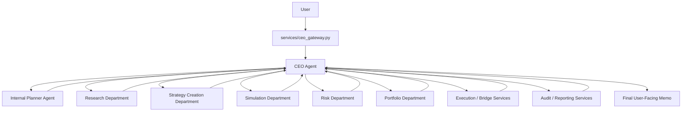

# HaruQuant Agentic AI System — Executive Department

## Goal

Create one clear executive control layer for HaruQuant: the **CEO Agent** is the only user-facing executive interface, and the **Planner Agent** is an internal planning component used only by the CEO Agent.

The Executive Department is different from the other departments. Research, Strategy Creation, Simulation, Risk, and Portfolio agents can be built as independent specialist services. The Planner Agent should not be exposed as an independent runnable department agent. It exists inside the CEO workflow and is called only by the CEO Agent to convert user requests into structured plans.

The CEO Agent is the bridge between the user and all HaruQuant departments:

```text
User
-> services/ceo_gateway.py
-> CEO Agent
-> Internal Planner Agent
-> Specialist Departments
-> CEO Agent synthesis
-> User-facing memo
```

The CEO Agent does not directly execute trades, approve risk, mutate live configuration, or bypass department-level deterministic policies. It coordinates workflows, gathers evidence, enforces governance rules, escalates decisions when needed, and returns a clear final memo.

All Executive Department components must follow the HaruQuant Agent Template principle:

```text
Validate Input
-> Gather Evidence / Context
-> Optional LLM Reasoning
-> Deterministic Policy Decision
-> Structured Output
-> Audit Log
-> Evaluation Test
```

The LLM may reason, summarize, classify, rank, explain, or draft. Final workflow decisions must be controlled by deterministic code.

---

## 1. Department Scope

### 1.1 Primary Responsibilities

* [x] Provide one main user-facing interface through the CEO Agent.
* [x] Receive all user-facing AI trading requests through `services/ceo_gateway.py`.
* [x] Convert user requests into structured executive tasks.
* [x] Use the internal Planner Agent to create workflow plans.
* [x] Delegate work to specialist departments only through approved service interfaces.
* [x] Synthesize outputs from Research, Strategy Creation, Simulation, Risk, Portfolio, Execution, Audit, and Reporting departments.
* [x] Require evidence for all substantive conclusions.
* [x] Enforce firm constitution references.
* [x] Enforce risk policy references.
* [x] Enforce Board escalation rules.
* [x] Enforce refusal rules for unsafe or unsupported requests.
* [x] Enforce governed-action workflows.
* [x] Preserve auditability across all workflows.
* [x] Produce final user-facing memos.
* [x] Track missing inputs and clarification needs.
* [x] Track workflow state.
* [x] Track handoffs between departments.
* [x] Ensure specialist agents are not directly exposed to the chat UI.
* [x] Ensure Planner Agent is not directly exposed to the chat UI.
* [x] Ensure CEO Agent owns the final user-facing synthesis.

### 1.2 Non-Goals

* [x] Do not execute trades.
* [x] Do not approve risk.
* [x] Do not bypass RiskGovernor.
* [x] Do not directly mutate broker, account, portfolio, or execution state.
* [x] Do not allow casual chat requests to trigger live trading actions.
* [x] Do not expose specialist agents directly to the chat UI.
* [x] Do not expose Planner Agent as an independent public service.
* [x] Do not allow raw LLM output to become the final workflow decision.
* [x] Do not invent evidence, backtests, metrics, approvals, or broker state.
* [x] Do not silently ignore missing evidence.
* [x] Do not override department-specific deterministic policies.
* [x] Do not approve live allocation changes without Board approval when required.
* [x] Do not approve execution without RiskGovernor approval.

---

## 2. Executive Department Architecture

The Executive Department contains only two agents:

```text
1. CEO Agent
2. Planner Agent
```

The Planner Agent is internal to the CEO Agent. It can have its own folder, contracts, policy, evaluator, and tests, but it cannot be registered as a public department tool and cannot be called directly by the user, chat gateway, or other departments.

### 2.1 Runtime Flow

```text
User Request
-> CEOChatGateway
-> CEO Agent validates request
-> CEO Agent calls internal Planner Agent
-> Planner returns structured plan
-> CEO deterministic policy validates plan
-> CEO delegates to specialist departments
-> Specialist departments return AgentResponse envelopes
-> CEO verifies evidence and permissions
-> CEO synthesizes final memo
-> CEO audit/evaluator runs
-> User receives final response
```

### 2.2 Mermaid Architecture



### 2.3 Planner Isolation Rule

```text
Planner Agent is not an independent agent from the user's perspective.
Planner Agent is an internal planning engine owned by CEO Agent.
Only CEO Agent may call Planner Agent.
Only CEO Agent may expose Planner results to the user.
Only CEO Agent may use Planner results to delegate department work.
```

### 2.4 Specialist Delegation Rule

```text
CEO Agent delegates work to department services.
CEO Agent does not call raw LLM agents directly.
CEO Agent does not call broker/execution bridges directly except through governed execution services.
CEO Agent does not bypass deterministic policies inside any department.
```

---

## 3. Standard Executive Department Folder Structure

```text
agents/
  executive/
    __init__.py

    ceo_agent/
      __init__.py
      agent.py
      contracts.py
      prompts.py
      deterministic_policy.py
      tools.py
      service.py
      evaluator.py
      README.md
      tests/
        test_contracts.py
        test_deterministic_policy.py
        test_service.py
        test_agent_smoke.py
        test_ceo_planner_integration.py
        test_evidence_requirements.py
        test_board_escalation.py
        test_refusal_rules.py
        test_specialist_delegation.py

      internal/
        planner_agent/
          __init__.py
          agent.py
          contracts.py
          prompts.py
          deterministic_policy.py
          tools.py
          service.py
          evaluator.py
          README.md
          tests/
            test_contracts.py
            test_deterministic_policy.py
            test_service.py
            test_agent_smoke.py
            test_planner_routes.py
            test_missing_inputs.py
            test_governed_action_draft.py

      shared/
        executive_contracts.py
        planner_contracts.py
        routing.py
        response_templates.py
        escalation_rules.py
        refusal_rules.py
        workflow_states.py
        evidence_requirements.py
        permission_profiles.py
        audit.py
        memo_builder.py

services/
  ceo_gateway.py

policies/
  firm_constitution.yaml
  executive_policy.yaml
  board_escalation_policy.yaml
  refusal_policy.yaml
  tool_policy.py
```

### 3.1 Important Folder Rule

Do **not** create these as separate Executive Department agents:

```text
board_governance_agent/
evidence_synthesis_agent/
governance_auditor_agent/
```

Their responsibilities are merged into the CEO Agent and Planner Agent:

| Former Responsibility | New Owner |
|---|---|
| Board escalation and approval checks | CEO Agent deterministic policy |
| Evidence synthesis | CEO Agent synthesis and memo builder |
| Governance audit checks | CEO Agent audit/evaluator and deterministic policy |
| Workflow routing | Internal Planner Agent |
| Missing input detection | Internal Planner Agent, validated by CEO Agent |
| Refusal decisions | CEO Agent deterministic policy |
| Final user-facing memo | CEO Agent |

---

## 4. Recommended Build Order

```text
1. Shared executive contracts
2. Planner contracts and internal planner schemas
3. Internal Planner Agent
4. CEO Agent service
5. CEO deterministic policy
6. CEO response templates
7. Board escalation rules inside CEO policy
8. Refusal rules inside CEO policy
9. Evidence synthesis inside CEO service/memo builder
10. Governance audit checks inside CEO evaluator
11. CEO Gateway integration
12. End-to-end workflow tests
```

---

# 5. CEO Agent

## 5.1 Purpose

The **CEO Agent** is the single user-facing executive interface for HaruQuant. It receives user requests, uses the internal Planner Agent to decide what evidence or department work is required, delegates approved tasks, synthesizes department outputs, applies executive governance, and returns the final memo.

The CEO Agent is the only component that should communicate directly with the user in normal chat workflows.

## 5.2 Required Files

* [x] Create `agents/executive/ceo_agent/__init__.py`.
* [x] Create `agents/executive/ceo_agent/agent.py`.
* [x] Create `agents/executive/ceo_agent/contracts.py`.
* [x] Create `agents/executive/ceo_agent/prompts.py`.
* [x] Create `agents/executive/ceo_agent/deterministic_policy.py`.
* [x] Create `agents/executive/ceo_agent/tools.py`.
* [x] Create `agents/executive/ceo_agent/service.py`.
* [x] Create `agents/executive/ceo_agent/evaluator.py`.
* [x] Create `agents/executive/ceo_agent/README.md`.
* [x] Create `agents/executive/ceo_agent/tests/test_contracts.py`.
* [x] Create `agents/executive/ceo_agent/tests/test_deterministic_policy.py`.
* [x] Create `agents/executive/ceo_agent/tests/test_service.py`.
* [x] Create `agents/executive/ceo_agent/tests/test_agent_smoke.py`.
* [x] Create `agents/executive/ceo_agent/tests/test_ceo_planner_integration.py`.
* [x] Create `agents/executive/ceo_agent/tests/test_evidence_requirements.py`.
* [x] Create `agents/executive/ceo_agent/tests/test_board_escalation.py`.
* [x] Create `agents/executive/ceo_agent/tests/test_refusal_rules.py`.
* [x] Create `agents/executive/ceo_agent/tests/test_specialist_delegation.py`.

## 5.3 Inputs

* [x] User prompt.
* [x] User identity.
* [x] Session context.
* [x] Page context, if available.
* [x] Attached artifacts, if available.
* [x] Current workflow state.
* [x] Portfolio state summary, if required.
* [x] Market state summary, if required.
* [x] Strategy lifecycle state, if required.
* [x] Risk state summary, if required.
* [x] Previous evidence references, if part of an ongoing workflow.
* [x] User permissions.
* [x] Live-mode status.
* [x] Board approval status.

## 5.4 Tools

CEO tools must be workflow-level read/delegation tools, not raw execution tools.

* [x] `call_internal_planner`.
* [x] `read_firm_constitution`.
* [x] `read_executive_policy`.
* [x] `read_board_escalation_policy`.
* [x] `read_refusal_policy`.
* [x] `read_risk_policy_reference`.
* [x] `delegate_to_research_department`.
* [x] `delegate_to_strategy_creation_department`.
* [x] `delegate_to_simulation_department`.
* [x] `delegate_to_risk_department`.
* [x] `delegate_to_portfolio_department`.
* [x] `delegate_to_reporting_or_audit_service`.
* [x] `request_governed_action_draft`.
* [x] `read_evidence_memory`.
* [x] `save_executive_memo`.
* [x] `write_executive_audit_record`.

Forbidden CEO tools:

* [x] No direct `place_order`.
* [x] No direct `close_position`.
* [x] No direct `cancel_order`.
* [x] No direct broker mutation.
* [x] No direct risk-threshold mutation.
* [x] No direct live-mode mutation.
* [x] No direct Board-approval mutation.

## 5.5 Evidence Required

The CEO Agent must require evidence before making substantive conclusions.

* [x] User request evidence.
* [x] Planner output.
* [x] Specialist department outputs.
* [x] Evidence references from specialist responses.
* [x] RiskGovernor output for any trade, allocation, or live decision.
* [x] Backtest evidence for strategy performance claims.
* [x] Robustness evidence for deployment/promotion claims.
* [x] Statistical validation evidence for edge-quality claims.
* [x] Portfolio evidence for allocation claims.
* [x] Execution evidence for live or paper execution claims.
* [x] Audit evidence for compliance claims.
* [x] Cost evidence for cost-optimization claims.

## 5.6 LLM Responsibilities

The CEO Agent LLM may:

* [x] Interpret the user's plain-language request.
* [x] Summarize department outputs.
* [x] Explain trade-offs.
* [x] Draft final memos.
* [x] Explain risk warnings.
* [x] Explain why a request is blocked.
* [x] Explain required next steps.
* [x] Convert technical outputs into user-friendly language.
* [x] Compare evidence across departments.
* [x] Identify contradictions for deterministic policy review.

The CEO Agent LLM must not:

* [x] Approve trades.
* [x] Approve risk.
* [x] Execute orders.
* [x] Override RiskGovernor.
* [x] Override Kill Switch.
* [x] Invent missing evidence.
* [x] Mark a workflow complete when required evidence is missing.
* [x] Convert its own recommendation into a final deterministic decision.

## 5.7 Deterministic Policy Rules

Final CEO workflow decisions must be made in `deterministic_policy.py`.

* [x] If Planner output is invalid, return `needs_more_context` or `error`.
* [x] If Planner proposes a forbidden action, block the action.
* [x] If required evidence is missing, return `needs_more_context`.
* [x] If a live execution request lacks RiskGovernor approval, block it.
* [x] If a live execution request lacks Board approval where required, block it.
* [x] If Kill Switch is active, block live execution and allocation increases.
* [x] If request asks CEO to place trades directly, refuse or route to governed execution proposal workflow.
* [x] If request asks to bypass risk controls, refuse.
* [x] If request asks to alter risk thresholds without governance, block and escalate.
* [x] If request asks for a research/strategy/backtest/reporting task, route to appropriate department.
* [x] If request is ambiguous but safe, ask for clarification.
* [x] If request is broad but actionable, create a phased plan.
* [x] If evidence contradicts the requested action, explain contradiction and block or escalate.
* [x] If Board escalation is required, produce a Board approval request memo.
* [x] If all evidence is sufficient and the action is informational, produce final memo.
* [x] If all evidence is sufficient and the action is governed, produce a governed action draft, not execution.

## 5.8 Board Governance Responsibilities Merged Into CEO

The CEO Agent owns Board escalation checks.

* [x] Detect live allocation changes.
* [x] Detect promotion from paper to micro-live.
* [x] Detect increase in live capital allocation.
* [x] Detect strategy retirement with open risk implications.
* [x] Detect risk-threshold changes.
* [x] Detect live-mode enablement.
* [x] Detect broker connection activation.
* [x] Detect order-routing activation.
* [x] Detect Kill Switch override or reset.
* [x] Detect critical audit incident resolution.
* [x] Detect production deployment requests.
* [x] Require Board approval when policy demands it.
* [x] Produce Board approval request memo.
* [x] Block action until approval exists.
* [x] Save Board escalation audit record.

## 5.9 Evidence Synthesis Responsibilities Merged Into CEO

The CEO Agent owns evidence synthesis.

* [x] Read all specialist `AgentResponse` envelopes.
* [x] Validate `request_id` consistency.
* [x] Validate `agent_name`.
* [x] Validate status.
* [x] Validate evidence exists when required.
* [x] Validate audit exists.
* [x] Validate policy version exists.
* [x] Validate prompt version exists where LLM was used.
* [x] Validate tools used.
* [x] Validate permission profile.
* [x] Validate confidence level.
* [x] Validate risk level.
* [x] Identify supporting evidence.
* [x] Identify contradicting evidence.
* [x] Identify missing evidence.
* [x] Identify stale evidence.
* [x] Identify weak evidence.
* [x] Merge evidence into final executive memo.
* [x] Preserve evidence references in audit metadata.

## 5.10 Governance Audit Responsibilities Merged Into CEO

The CEO Agent owns executive governance audit checks.

* [x] Check Planner was called for non-trivial tasks.
* [x] Check specialist departments were called only through approved services.
* [x] Check no forbidden tools were used.
* [x] Check all governed actions have required approvals.
* [x] Check all live actions have RiskGovernor approval where applicable.
* [x] Check all Board-required actions are escalated.
* [x] Check all final memos include evidence summary when evidence was used.
* [x] Check refusal decisions include reasons.
* [x] Check missing-context decisions include required missing fields.
* [x] Check audit metadata is complete.
* [x] Check no raw LLM text became the final deterministic decision.
* [x] Check no hidden failed tool calls were ignored.

## 5.11 Allowed Actions

* [x] `answer_general_question`.
* [x] `summarize_evidence`.
* [x] `delegate_research`.
* [x] `delegate_strategy_creation`.
* [x] `delegate_strategy_codegen`.
* [x] `delegate_strategy_review`.
* [x] `delegate_backtest`.
* [x] `delegate_backtest_diagnosis`.
* [x] `delegate_optimization_comparison`.
* [x] `delegate_robustness_review`.
* [x] `delegate_statistical_validation`.
* [x] `delegate_risk_review`.
* [x] `delegate_portfolio_review`.
* [x] `delegate_paper_execution_review`.
* [x] `delegate_reporting`.
* [x] `create_governed_action_draft`.
* [x] `create_board_approval_request`.
* [x] `request_clarification`.
* [x] `refuse_unsafe_request`.

## 5.12 Blocked Actions

* [x] `place_trade`.
* [x] `close_position_directly`.
* [x] `cancel_order_directly`.
* [x] `approve_risk`.
* [x] `override_risk_governor`.
* [x] `override_kill_switch`.
* [x] `enable_live_trading_directly`.
* [x] `increase_live_allocation_without_board_approval`.
* [x] `modify_risk_thresholds_without_governance`.
* [x] `delete_audit_logs`.
* [x] `hide_evidence`.
* [x] `call_planner_publicly`.

## 5.13 Output Artifacts

* [x] Executive memo.
* [x] Research memo.
* [x] Strategy proposal memo.
* [x] Backtest summary memo.
* [x] Optimization comparison memo.
* [x] Robustness memo.
* [x] Risk memo.
* [x] Portfolio allocation memo.
* [x] Paper promotion memo.
* [x] Board approval request memo.
* [x] Rejection memo.
* [x] Blocked-by-risk memo.
* [x] Clarification request.
* [x] Governed action draft.
* [x] Audit record.

## 5.14 Tests Required

* [x] Normal informational request.
* [x] Strategy creation request.
* [x] Research request.
* [x] Backtest diagnosis request.
* [x] Optimization comparison request.
* [x] Risk review request.
* [x] Portfolio allocation request.
* [x] Execution proposal request.
* [x] Board escalation request.
* [x] Missing evidence case.
* [x] Missing input case.
* [x] Unsafe request case.
* [x] Bypass-risk request case.
* [x] Planner invalid-output case.
* [x] Specialist failure case.
* [x] Contradictory evidence case.
* [x] LLM override attempt.
* [x] Audit metadata completeness.

---

# 6. Internal Planner Agent

## 6.1 Purpose

The **Planner Agent** is an internal component of the CEO Agent. Its job is to convert the user's request and current context into a structured execution plan that the CEO Agent can validate and execute.

The Planner Agent does not communicate with the user directly. It does not synthesize the final answer. It does not execute workflows by itself. It proposes a plan; the CEO deterministic policy validates the plan and decides what to do.

## 6.2 Required Files

* [x] Create `agents/executive/ceo_agent/internal/planner_agent/__init__.py`.
* [x] Create `agents/executive/ceo_agent/internal/planner_agent/agent.py`.
* [x] Create `agents/executive/ceo_agent/internal/planner_agent/contracts.py`.
* [x] Create `agents/executive/ceo_agent/internal/planner_agent/prompts.py`.
* [x] Create `agents/executive/ceo_agent/internal/planner_agent/deterministic_policy.py`.
* [x] Create `agents/executive/ceo_agent/internal/planner_agent/tools.py`.
* [x] Create `agents/executive/ceo_agent/internal/planner_agent/service.py`.
* [x] Create `agents/executive/ceo_agent/internal/planner_agent/evaluator.py`.
* [x] Create `agents/executive/ceo_agent/internal/planner_agent/README.md`.
* [x] Create `agents/executive/ceo_agent/internal/planner_agent/tests/test_contracts.py`.
* [x] Create `agents/executive/ceo_agent/internal/planner_agent/tests/test_deterministic_policy.py`.
* [x] Create `agents/executive/ceo_agent/internal/planner_agent/tests/test_service.py`.
* [x] Create `agents/executive/ceo_agent/internal/planner_agent/tests/test_agent_smoke.py`.
* [x] Create `agents/executive/ceo_agent/internal/planner_agent/tests/test_planner_routes.py`.
* [x] Create `agents/executive/ceo_agent/internal/planner_agent/tests/test_missing_inputs.py`.
* [x] Create `agents/executive/ceo_agent/internal/planner_agent/tests/test_governed_action_draft.py`.

## 6.3 Planner Visibility Rule

* [x] Planner Agent must not be registered as a public chat tool.
* [x] Planner Agent must not be called by `services/ceo_gateway.py` directly.
* [x] Planner Agent must not be called by specialist departments.
* [x] Planner Agent must not produce final user-facing messages.
* [x] Planner Agent must return only structured planner output.
* [x] CEO Agent must validate Planner output before executing it.

## 6.4 Inputs

* [x] Normalized user request from CEO Agent.
* [x] Session context from CEO Agent.
* [x] Page context, if any.
* [x] Attached tools or artifacts, if any.
* [x] Current workflow state.
* [x] Available department capabilities.
* [x] User permission profile.
* [x] Live-mode status.
* [x] Board approval state.
* [x] Risk policy summary.
* [x] Evidence requirements.

## 6.5 Structured Planner Output Fields

* [x] `plan_id`.
* [x] `request_id`.
* [x] `intent`.
* [x] `workflow_type`.
* [x] `task_summary`.
* [x] `missing_inputs`.
* [x] `context_needed`.
* [x] `evidence_required`.
* [x] `departments_to_call`.
* [x] `agents_to_call`.
* [x] `backend_tools_to_run`.
* [x] `attached_tools`.
* [x] `page_actions_to_plan`.
* [x] `artifact_expected`.
* [x] `risk_level`.
* [x] `requires_risk_governor`.
* [x] `requires_board_approval`.
* [x] `requires_human_confirmation`.
* [x] `governed_action_type`.
* [x] `allowed_actions`.
* [x] `blocked_actions`.
* [x] `execution_order`.
* [x] `fallback_plan`.
* [x] `final_response_template`.
* [x] `audit_tags`.
* [x] `confidence`.

## 6.6 Supported Workflow Types

* [x] `research`.
* [x] `strategy_creation`.
* [x] `strategy_codegen`.
* [x] `strategy_review`.
* [x] `backtest`.
* [x] `backtest_diagnosis`.
* [x] `optimization_comparison`.
* [x] `robustness_review`.
* [x] `statistical_validation`.
* [x] `risk_review`.
* [x] `portfolio_review`.
* [x] `allocation_review`.
* [x] `paper_trading_review`.
* [x] `execution_proposal`.
* [x] `reporting`.
* [x] `audit_review`.
* [x] `cost_review`.
* [x] `page_action`.
* [x] `clarification`.
* [x] `governed_action_draft`.
* [x] `unsafe_or_forbidden`.

## 6.7 Planner Tools

Planner tools should be metadata and capability tools only.

* [x] `get_available_departments`.
* [x] `get_available_agent_capabilities`.
* [x] `get_workflow_requirements`.
* [x] `get_evidence_requirements`.
* [x] `get_board_escalation_rules`.
* [x] `get_refusal_rules`.
* [x] `get_permission_profile`.
* [x] `get_current_workflow_state`.

Forbidden Planner tools:

* [x] No broker tools.
* [x] No execution tools.
* [x] No database mutation tools.
* [x] No risk-threshold mutation tools.
* [x] No direct department execution tools unless invoked through CEO service wrapper.

## 6.8 LLM Responsibilities

The Planner Agent LLM may:

* [x] Classify intent.
* [x] Identify missing inputs.
* [x] Identify context needed.
* [x] Select department workflow type.
* [x] Select evidence requirements.
* [x] Propose execution order.
* [x] Propose response template.
* [x] Identify likely risk level.
* [x] Identify likely Board escalation requirement.

The Planner Agent LLM must not:

* [x] Execute the plan.
* [x] Call specialist departments directly.
* [x] Produce the final user answer.
* [x] Approve risk.
* [x] Execute trades.
* [x] Override CEO deterministic policy.
* [x] Invent capabilities that do not exist.
* [x] Route to forbidden tools.

## 6.9 Deterministic Policy Rules

* [x] Validate planner output schema.
* [x] Reject unknown workflow types.
* [x] Reject unknown departments.
* [x] Reject unknown agents.
* [x] Reject forbidden backend tools.
* [x] Reject direct execution tools.
* [x] Reject live execution routing without governed-action flow.
* [x] Mark missing inputs when required fields are absent.
* [x] Mark `requires_risk_governor` for trade, execution, allocation, or portfolio-risk workflows.
* [x] Mark `requires_board_approval` for live allocation changes, live-mode activation, risk-threshold changes, and critical incident recovery.
* [x] Mark `requires_human_confirmation` when policy demands confirmation.
* [x] Normalize broad requests into phased plans.
* [x] Route vague but safe requests to clarification.
* [x] Route unsafe requests to CEO refusal workflow.
* [x] Ensure final response template matches workflow type.
* [x] Ensure all planned actions are allowed by the user's permission profile.

## 6.10 Allowed Actions

* [x] `classify_intent`.
* [x] `identify_missing_inputs`.
* [x] `identify_context_needed`.
* [x] `select_workflow_type`.
* [x] `select_departments_to_call`.
* [x] `select_response_template`.
* [x] `draft_execution_plan`.
* [x] `flag_governance_requirements`.
* [x] `flag_board_escalation`.
* [x] `flag_risk_governor_requirement`.

## 6.11 Blocked Actions

* [x] `execute_workflow`.
* [x] `call_specialist_directly`.
* [x] `call_broker`.
* [x] `approve_risk`.
* [x] `approve_allocation`.
* [x] `produce_final_user_answer`.
* [x] `mutate_state`.
* [x] `skip_ceo_validation`.

## 6.12 Tests Required

* [x] Research routing.
* [x] Strategy creation routing.
* [x] Strategy codegen routing.
* [x] Strategy review routing.
* [x] Backtest routing.
* [x] Backtest diagnosis routing.
* [x] Optimization comparison routing.
* [x] Risk review routing.
* [x] Portfolio review routing.
* [x] Execution proposal routing.
* [x] Reporting routing.
* [x] Audit review routing.
* [x] Page action routing.
* [x] Clarification routing.
* [x] Governed action draft routing.
* [x] Missing symbol case.
* [x] Missing timeframe case.
* [x] Missing strategy ID case.
* [x] Forbidden execution tool case.
* [x] Unknown department case.
* [x] Unknown workflow case.
* [x] LLM override attempt.

---

## 7. Shared Executive Contracts

## 7.1 CEO Request Contract

* [x] `request_id`.
* [x] `user_id`.
* [x] `session_id`.
* [x] `user_message`.
* [x] `normalized_task`.
* [x] `attachments`.
* [x] `page_context`.
* [x] `workflow_context`.
* [x] `permission_profile`.
* [x] `constraints`.
* [x] `created_at`.

## 7.2 CEO Response Contract

* [x] `request_id`.
* [x] `agent_name`.
* [x] `status`.
* [x] `planner_output`.
* [x] `specialist_responses`.
* [x] `evidence_summary`.
* [x] `final_memo`.
* [x] `decision`.
* [x] `allowed_actions`.
* [x] `blocked_actions`.
* [x] `required_next_steps`.
* [x] `board_escalation`.
* [x] `audit`.

## 7.3 Planner Output Contract

* [x] `plan_id`.
* [x] `request_id`.
* [x] `intent`.
* [x] `workflow_type`.
* [x] `task_summary`.
* [x] `missing_inputs`.
* [x] `context_needed`.
* [x] `evidence_required`.
* [x] `departments_to_call`.
* [x] `agents_to_call`.
* [x] `backend_tools_to_run`.
* [x] `risk_level`.
* [x] `requires_risk_governor`.
* [x] `requires_board_approval`.
* [x] `requires_human_confirmation`.
* [x] `execution_order`.
* [x] `final_response_template`.
* [x] `confidence`.

## 7.4 Executive Decision Contract

* [x] `status`.
* [x] `decision_type`.
* [x] `decision`.
* [x] `confidence`.
* [x] `risk_level`.
* [x] `allowed_actions`.
* [x] `blocked_actions`.
* [x] `reasons`.
* [x] `required_evidence`.
* [x] `missing_evidence`.
* [x] `requires_board_approval`.
* [x] `requires_risk_governor`.
* [x] `requires_human_confirmation`.

---

## 8. CEO Response Templates

## 8.1 Research Memo Template

* [x] Research question.
* [x] Sources/evidence reviewed.
* [x] Market context.
* [x] Technical context.
* [x] Macro/news context, if available.
* [x] Candidate ideas.
* [x] Risks and limitations.
* [x] Recommended next steps.
* [x] Confidence.
* [x] Evidence references.

## 8.2 Strategy Proposal Template

* [x] Strategy name.
* [x] Strategy family.
* [x] Symbol/timeframe.
* [x] Market hypothesis.
* [x] Entry concept.
* [x] Exit concept.
* [x] Risk assumptions.
* [x] Data requirements.
* [x] Cost assumptions.
* [x] Invalidation rules.
* [x] Test plan.
* [x] Required next step.

## 8.3 Strategy Codegen Review Template

* [x] Strategy spec reviewed.
* [x] Generated files.
* [x] Template compliance.
* [x] `on_bar()` compliance.
* [x] `get_signal()` compliance.
* [x] `on_event()` compliance, if stateful.
* [x] Lookahead-bias review.
* [x] Required tests.
* [x] Reviewer decision.

## 8.4 Backtest Report Template

* [x] Strategy tested.
* [x] Backtest period.
* [x] Data source.
* [x] Execution assumptions.
* [x] Cost assumptions.
* [x] Key metrics.
* [x] Drawdown summary.
* [x] Trade distribution.
* [x] Long/short split.
* [x] IS/OOS summary.
* [x] Acceptance decision.
* [x] Evidence package path.

## 8.5 Optimization Comparison Template

* [x] Strategy.
* [x] Parameter grid.
* [x] Best result.
* [x] Stable regions.
* [x] IS/OOS behavior.
* [x] Parameter cliffs.
* [x] Fragile settings.
* [x] Recommended robust region.
* [x] Rejected overfit settings.

## 8.6 Risk Memo Template

* [x] Strategy summary.
* [x] Evidence reviewed.
* [x] RiskGovernor result.
* [x] Key risk metrics.
* [x] Portfolio impact.
* [x] Correlation concerns.
* [x] Drawdown concerns.
* [x] Cost concerns.
* [x] Failure modes.
* [x] Recommendation.
* [x] Required Board action, if any.

## 8.7 Portfolio Memo Template

* [x] Portfolio state.
* [x] Strategy lifecycle state.
* [x] Live strategy performance.
* [x] Paper strategy performance.
* [x] Correlation clusters.
* [x] Allocation constraints.
* [x] RiskGovernor constraints.
* [x] Recommended promotions/demotions.
* [x] Recommended allocation changes.
* [x] Board approval requirement.

## 8.8 Board Approval Request Template

* [x] Decision required.
* [x] Proposed action.
* [x] Evidence reviewed.
* [x] RiskGovernor status.
* [x] Expected benefit.
* [x] Key risks.
* [x] Worst-case impact.
* [x] Rollback plan.
* [x] Expiration of approval.
* [x] Required approval fields.

## 8.9 Rejection Template

* [x] Request summary.
* [x] Rejection reason.
* [x] Policy or evidence basis.
* [x] Missing requirements, if any.
* [x] Safer alternative.
* [x] Required next step.

## 8.10 Blocked-by-Risk Template

* [x] Requested action.
* [x] RiskGovernor result.
* [x] Block reason.
* [x] Risk metrics snapshot.
* [x] Required remediation.
* [x] Whether Board escalation is allowed.
* [x] Whether retry is allowed.

## 8.11 Clarification Template

* [x] What can be done.
* [x] What is missing.
* [x] Why it matters.
* [x] Required fields.
* [x] Safe default option, if applicable.

---

## 9. Executive Routing Rules

## 9.1 Research Requests

* [x] Route market-condition questions to Research Department.
* [x] Route strategy-idea discovery to Research Department.
* [x] Route news/macro/sentiment questions to Research Department.
* [x] Route seasonality/intermarket questions to Research Department.
* [x] CEO synthesizes research memo.

## 9.2 Strategy Creation Requests

* [x] Route strategy specification requests to Strategy Creator Agent.
* [x] Route code generation requests to Strategy Codegen Agent.
* [x] Route code review requests to Strategy Reviewer Agent.
* [x] Require research evidence when strategy idea is research-derived.
* [x] CEO synthesizes strategy proposal or review memo.

## 9.3 Simulation Requests

* [x] Route backtest runs to Backtest Agent.
* [x] Route backtest explanations to Backtest Analyst Agent.
* [x] Route optimization comparisons to Optimization Comparator Agent.
* [x] Route robustness reviews to Robustness Agent.
* [x] Route statistical validation to Statistical Validation Agent.
* [x] CEO synthesizes simulation memo.

## 9.4 Risk Requests

* [x] Route deterministic risk approval checks to RiskGovernor service.
* [x] Route risk explanation requests to Risk Reviewer Agent.
* [x] Route VaR/CVaR questions to Risk Department services.
* [x] Route correlation/concentration concerns to Risk Department services.
* [x] CEO synthesizes risk memo.

## 9.5 Portfolio Requests

* [x] Route allocation reviews to Portfolio Manager Agent.
* [x] Route lifecycle reviews to Strategy Lifecycle Agent.
* [x] Route paper promotion questions to Portfolio Department.
* [x] Route execution-readiness questions to Portfolio/Execution services.
* [x] CEO synthesizes portfolio memo.

## 9.6 Execution Requests

* [x] Route live execution requests only to governed action draft workflow.
* [x] Require RiskGovernor approval.
* [x] Require live-mode status.
* [x] Require strategy live status.
* [x] Require Kill Switch healthy status.
* [x] Require Board approval when policy demands it.
* [x] CEO never executes directly.

## 9.7 Reporting and Audit Requests

* [x] Route daily/weekly/monthly report requests to Performance Reporter.
* [x] Route audit questions to Audit Agent or audit service.
* [x] Route cost questions to Cost Optimizer Agent.
* [x] CEO synthesizes reporting memo.

---

## 10. Board Escalation Rules

CEO Agent must escalate when the request involves:

* [x] Enabling live trading.
* [x] Connecting a live broker for trading.
* [x] Promoting paper strategy to micro-live.
* [x] Increasing live capital allocation.
* [x] Decreasing allocation if it affects open risk or operational policy.
* [x] Retiring a live strategy.
* [x] Changing risk thresholds.
* [x] Overriding Kill Switch.
* [x] Resuming after critical incident.
* [x] Changing execution bridge behavior.
* [x] Changing order router rules.
* [x] Deploying generated strategy code to production.
* [x] Approving a new strategy for live operation.
* [x] Any request classified as critical risk.

Board escalation output must include:

* [x] Action requested.
* [x] Evidence reviewed.
* [x] RiskGovernor status.
* [x] Expected benefit.
* [x] Worst-case impact.
* [x] Rollback plan.
* [x] Approval expiration.
* [x] Required human approval fields.

---

## 11. Refusal and Safety Rules

CEO Agent must refuse or block requests that:

* [x] Ask to bypass RiskGovernor.
* [x] Ask to bypass Kill Switch.
* [x] Ask to hide risk, losses, audit records, or broker errors.
* [x] Ask to execute without approval token.
* [x] Ask to increase risk beyond policy without governance.
* [x] Ask to delete or tamper with audit logs.
* [x] Ask to fabricate backtest, evidence, or performance results.
* [x] Ask to deploy unreviewed strategy code live.
* [x] Ask to use unapproved tools for external research, execution, or broker access.
* [x] Ask to ignore missing evidence.
* [x] Ask the Planner Agent to act directly.

Refusal output must include:

* [x] What was requested.
* [x] Why it cannot be done.
* [x] Which policy or safety rule applies.
* [x] Safer alternative.
* [x] Next valid workflow step, if any.

---

## 12. Permission Model

## 12.1 CEO Agent Permissions

```python
CEO_AGENT_PERMISSIONS = {
    "can_read_user_request": True,
    "can_call_internal_planner": True,
    "can_delegate_to_departments": True,
    "can_read_evidence": True,
    "can_write_executive_memo": True,
    "can_write_audit_record": True,
    "can_create_governed_action_draft": True,
    "can_request_board_approval": True,
    "can_execute_trade": False,
    "can_approve_risk": False,
    "can_override_risk_governor": False,
    "can_override_kill_switch": False,
    "can_modify_risk_thresholds": False,
    "can_enable_live_trading": False,
}
```

## 12.2 Internal Planner Permissions

```python
PLANNER_AGENT_PERMISSIONS = {
    "can_read_normalized_user_request": True,
    "can_read_capability_registry": True,
    "can_read_evidence_requirements": True,
    "can_read_policy_summaries": True,
    "can_propose_workflow_plan": True,
    "can_classify_intent": True,
    "can_identify_missing_inputs": True,
    "can_call_specialist_departments": False,
    "can_answer_user_directly": False,
    "can_execute_trade": False,
    "can_approve_risk": False,
    "can_mutate_state": False,
}
```

---

## 13. Audit Requirements

Every CEO workflow must log:

* [x] `request_id`.
* [x] `session_id`.
* [x] `user_id`.
* [x] `start_time`.
* [x] `end_time`.
* [x] `ceo_agent_version`.
* [x] `planner_agent_version`.
* [x] `planner_called`.
* [x] `planner_plan_id`.
* [x] `workflow_type`.
* [x] `departments_called`.
* [x] `agents_called`.
* [x] `tools_called`.
* [x] `evidence_refs`.
* [x] `missing_evidence`.
* [x] `llm_used`.
* [x] `model_provider`.
* [x] `model_name`.
* [x] `fallback_used`.
* [x] `permission_profile`.
* [x] `policy_version`.
* [x] `prompt_version`.
* [x] `board_escalation_required`.
* [x] `risk_governor_required`.
* [x] `human_confirmation_required`.
* [x] `allowed_actions`.
* [x] `blocked_actions`.
* [x] `final_decision`.
* [x] `error_if_any`.

Planner audit must be nested inside CEO audit and must not be treated as a separate public workflow audit.

---

## 14. Evaluator Requirements

## 14.1 CEO Evaluator

* [x] Check CEO response envelope is valid.
* [x] Check Planner output exists for non-trivial requests.
* [x] Check Planner output passed schema validation.
* [x] Check specialist responses are valid `AgentResponse` envelopes.
* [x] Check evidence exists when required.
* [x] Check no forbidden tools were used.
* [x] Check live/execution requests were blocked or governed.
* [x] Check RiskGovernor requirement is enforced.
* [x] Check Board escalation requirement is enforced.
* [x] Check final memo matches response template.
* [x] Check audit metadata exists.
* [x] Check LLM did not override deterministic decision.

## 14.2 Planner Evaluator

* [x] Check planner output schema is valid.
* [x] Check workflow type is allowed.
* [x] Check departments are known.
* [x] Check agents are known.
* [x] Check required evidence is specified.
* [x] Check missing inputs are correctly identified.
* [x] Check forbidden tools are absent.
* [x] Check governed-action flags are correctly set.
* [x] Check Board escalation flags are correctly set.
* [x] Check RiskGovernor flags are correctly set.
* [x] Check confidence is present.

---

## 15. Handoff Contracts

## 15.1 CEO to Research Department

* [x] `research_question`.
* [x] `symbols`.
* [x] `timeframes`.
* [x] `market_context_needed`.
* [x] `strategy_family_interest`.
* [x] `evidence_required`.
* [x] `constraints`.

## 15.2 CEO to Strategy Creation Department

* [x] `strategy_request`.
* [x] `research_evidence_refs`.
* [x] `strategy_family`.
* [x] `symbol`.
* [x] `timeframe`.
* [x] `entry_concept`.
* [x] `exit_concept`.
* [x] `risk_assumptions`.
* [x] `test_plan_required`.

## 15.3 CEO to Simulation Department

* [x] `strategy_id`.
* [x] `strategy_code_hash`.
* [x] `config`.
* [x] `data_window`.
* [x] `cost_assumptions`.
* [x] `execution_mode`.
* [x] `acceptance_rules`.

## 15.4 CEO to Risk Department

* [x] `proposal_id`.
* [x] `strategy_id`.
* [x] `portfolio_state_ref`.
* [x] `risk_policy_ref`.
* [x] `action_type`.
* [x] `proposed_size_or_allocation`.
* [x] `evidence_refs`.

## 15.5 CEO to Portfolio Department

* [x] `portfolio_decision_type`.
* [x] `strategy_id`.
* [x] `lifecycle_state`.
* [x] `performance_evidence_refs`.
* [x] `risk_evidence_refs`.
* [x] `allocation_constraints`.
* [x] `board_approval_status`.

## 15.6 CEO to Execution Services

Execution handoff must be rare and governed.

* [x] `governed_action_id`.
* [x] `proposal_id`.
* [x] `strategy_id`.
* [x] `symbol`.
* [x] `side`.
* [x] `size`.
* [x] `order_type`.
* [x] `risk_approval_token`.
* [x] `live_mode_status`.
* [x] `kill_switch_status`.
* [x] `board_approval_ref`, if required.

---

## 16. Done Definition

The Executive Department is complete only when:

```text
1. It contains only CEO Agent and internal Planner Agent.
2. Planner Agent is physically and architecturally internal to CEO Agent.
3. Planner Agent cannot be called directly by users, chat gateway, or departments.
4. CEO Agent is the only bridge between user and departments.
5. CEO Agent validates Planner output before action.
6. CEO Agent delegates only through approved department services.
7. CEO Agent synthesizes all final user-facing memos.
8. Board governance is handled inside CEO deterministic policy.
9. Evidence synthesis is handled inside CEO service/memo builder.
10. Governance audit is handled inside CEO evaluator/audit logic.
11. No Executive component can execute trades.
12. No Executive component can approve risk.
13. No Executive component can bypass RiskGovernor or Kill Switch.
14. All outputs use structured contracts.
15. All final decisions pass through deterministic policy.
16. Audit metadata is complete.
17. Tests cover routing, governance, evidence, refusal, and Planner isolation.
18. CEOChatGateway integrates only with CEO Agent.
```

---

## 17. Final Architecture Rule

```text
The CEO Agent is the executive interface.
The Planner Agent is the CEO Agent's internal planning engine.
The user never talks to Planner directly.
Specialist departments never call Planner directly.
All department orchestration flows through CEO Agent.
```

This keeps the Executive Department simple, avoids agent proliferation, and prevents confusion between user-facing authority, internal planning, department delegation, and final governance.
