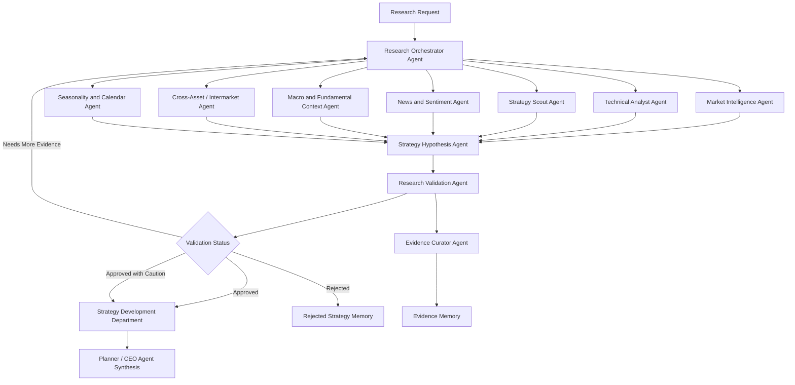

# HaruQuant Agentic AI System — Research Department Specification

## Purpose

The Research Department transforms raw market data, technical context, macro/fundamental context, news, sentiment, historical strategy memory, cross-asset behavior, seasonality, and prior evidence into validated, testable strategy hypotheses.

The Research Department does **not** directly create production strategies, approve risk, modify portfolios, or execute trades. Its job is to research, evaluate, validate, document, and hand off approved strategy hypotheses to the Strategy Development Department with enough evidence, assumptions, constraints, and acceptance criteria for implementation and testing.

## Core Department Rule

Every Research Department agent must follow the HaruQuant Agent Template execution pattern:

```text
Validate Input
-> Gather Evidence / Context
-> Optional LLM Reasoning
-> Deterministic Policy Decision
-> Structured Output
-> Audit Log
-> Evaluation Test
```

The LLM may assist with analysis, summarization, classification, ranking, explanation, report drafting, and idea generation. The LLM must not make the final uncontrolled decision.

```text
LLM output = proposal
Deterministic policy = final decision
```

## Research Department Restrictions

All Research Department agents must obey these restrictions:

```text
No trade execution.
No order placement.
No position sizing approval.
No final risk approval.
No portfolio modification.
No production deployment approval.
No direct chat UI invocation.
No unrestricted external tools.
```

Research agents may expose read-only summaries to the broader HaruQuant agentic firm, but the AI chat UI must enter through `services/ceo_gateway.py`; Planner decides which research evidence is needed; CEO Agent owns the final user-facing synthesis.

## Standard File Structure for Every Research Agent

Every individual Research Department agent must use the standard HaruQuant agent folder structure:

```text
agents/research/<agent_name>/
  __init__.py
  agent.py
  contracts.py
  prompts.py
  deterministic_policy.py
  tools.py
  service.py
  evaluator.py
  README.md
  tests/
    test_contracts.py
    test_deterministic_policy.py
    test_service.py
    test_agent_smoke.py
```

## Required File Responsibilities

| File | Responsibility |
|---|---|
| `__init__.py` | Marks the agent package and exposes stable imports where needed. |
| `agent.py` | Creates the optional LLM runtime wrapper or adapter boundary. |
| `contracts.py` | Defines Pydantic input, output, artifact, evidence, and handoff schemas. |
| `prompts.py` | Stores versioned prompts and role instructions. |
| `deterministic_policy.py` | Converts evidence and optional LLM analysis into final deterministic decisions. |
| `tools.py` | Declares the read-only tools the agent is allowed to call. |
| `service.py` | Stable public interface: `service.run(request, context) -> AgentResponse`. |
| `evaluator.py` | Agent-specific quality, safety, permission, and output checks. |
| `README.md` | Human-readable documentation for the agent. |
| `tests/` | Unit, policy, service, and smoke tests. |

## Standard Agent Completion Checklist

Every Research Department agent is complete only when:

* [x] The agent has the standard folder structure.
* [x] The agent has Pydantic input/output contracts.
* [x] The agent accepts `AgentRequest` and `AgentContext`.
* [x] The agent returns the standard `AgentResponse` envelope.
* [x] The agent has clearly scoped read-only tools.
* [x] The agent has versioned prompts in `prompts.py`.
* [x] The agent has optional LLM reasoning isolated in `agent.py` or the approved runtime adapter.
* [x] The agent makes final decisions only in `deterministic_policy.py`.
* [x] The agent handles missing evidence safely.
* [x] The agent handles invalid input safely.
* [x] The agent includes audit metadata.
* [x] The agent logs start, finish, tools used, evidence count, decision, risk level, and errors.
* [x] The agent has `test_contracts.py`.
* [x] The agent has `test_deterministic_policy.py`.
* [x] The agent has `test_service.py`.
* [x] The agent has `test_agent_smoke.py`.
* [x] The agent can run standalone without the full multi-agent system.
* [x] The agent can later be registered with Planner.
* [x] The agent can later be surfaced through CEOChatGateway.

---

# 1. Research Department Shared Foundation

## Purpose

The shared foundation provides common contracts, scoring models, evidence models, logging utilities, permission profiles, and report builders used by every Research Department agent.

## Required Folders and Files

* [x] Create `agents/research/__init__.py`.
* [x] Create `agents/research/shared/__init__.py`.
* [x] Create `agents/research/shared/contracts.py`.
* [x] Create `agents/research/shared/schemas.py`.
* [x] Create `agents/research/shared/evidence.py`.
* [x] Create `agents/research/shared/scoring.py`.
* [x] Create `agents/research/shared/report_builder.py`.
* [x] Create `agents/research/shared/constants.py`.
* [x] Create `agents/research/shared/permissions.py`.
* [x] Create `agents/research/shared/validation.py`.
* [x] Create `agents/research/shared/timeframes.py`.
* [x] Create `agents/research/shared/regime_labels.py`.

## Shared Contracts Checklist

* [x] Define `ResearchRequestPayload`.
* [x] Define `ResearchAgentArtifact` base model.
* [x] Define `ResearchReportArtifact`.
* [x] Define `ResearchEvidenceRef`.
* [x] Define `ResearchSourceRef`.
* [x] Define `MarketContext`.
* [x] Define `TechnicalContext`.
* [x] Define `MacroContext`.
* [x] Define `SentimentContext`.
* [x] Define `CrossAssetContext`.
* [x] Define `SeasonalityContext`.
* [x] Define `StrategyIdea`.
* [x] Define `StrategyHypothesis`.
* [x] Define `ResearchValidationResult`.
* [x] Define `ResearchToStrategyHandoff`.
* [x] Define common enums for regime, confidence, validation status, source type, strategy family, and evidence quality.
* [x] Ensure every shared schema serializes to JSON.
* [x] Ensure every schema can be consumed through the standard `AgentResponse.artifacts` field.

## Shared Permission Checklist

* [x] Define `research_read_only_v1` permission profile.
* [x] Allow read-only market data access.
* [x] Allow read-only historical data access.
* [x] Allow read-only evidence memory access.
* [x] Allow approved external research lookup only through approved tools.
* [x] Forbid trade execution.
* [x] Forbid risk approval.
* [x] Forbid portfolio modification.
* [x] Forbid database mutation except approved evidence-memory write operations.
* [x] Forbid direct broker, MT5, or cTrader execution access.
* [x] Ensure every research tool passes through a permission check before use.

## Shared Audit Checklist

Every Research Department agent response must include:

* [x] `agent_name`.
* [x] `department`.
* [x] `request_id`.
* [x] `context_revision`.
* [x] `prompt_version`.
* [x] `policy_version`.
* [x] `llm_used`.
* [x] `tools_used`.
* [x] `permission_profile`.
* [x] `evidence_refs`.
* [x] `model_provider`.
* [x] `model_name`.
* [x] `fallback_used`.
* [x] `input_validation_status`.
* [x] `evidence_count`.
* [x] `decision`.
* [x] `risk_level`.
* [x] `allowed_actions`.
* [x] `blocked_actions`.
* [x] `error_if_any`.

---

# 2. Research Department Orchestrator Agent

## Purpose

The Research Department Orchestrator coordinates all research agents, decides which agents are required for each research request, merges findings, resolves conflicts, and produces the final research package.

## Non-Goals

* [x] Do not execute trades.
* [x] Do not approve risk.
* [x] Do not create final production strategy code.
* [x] Do not bypass Planner or CEOChatGateway for chat-facing workflows.
* [x] Do not use unrestricted external tools.

## Required Files

* [x] Create `agents/research/research_orchestrator_agent/__init__.py`.
* [x] Create `agents/research/research_orchestrator_agent/agent.py`.
* [x] Create `agents/research/research_orchestrator_agent/contracts.py`.
* [x] Create `agents/research/research_orchestrator_agent/prompts.py`.
* [x] Create `agents/research/research_orchestrator_agent/deterministic_policy.py`.
* [x] Create `agents/research/research_orchestrator_agent/tools.py`.
* [x] Create `agents/research/research_orchestrator_agent/service.py`.
* [x] Create `agents/research/research_orchestrator_agent/evaluator.py`.
* [x] Create `agents/research/research_orchestrator_agent/README.md`.
* [x] Create `agents/research/research_orchestrator_agent/tests/test_contracts.py`.
* [x] Create `agents/research/research_orchestrator_agent/tests/test_deterministic_policy.py`.
* [x] Create `agents/research/research_orchestrator_agent/tests/test_service.py`.
* [x] Create `agents/research/research_orchestrator_agent/tests/test_agent_smoke.py`.

## Inputs

* [x] Accept `research_question`.
* [x] Accept `symbol` or `symbols`.
* [x] Accept `asset_class`.
* [x] Accept `timeframe` or `timeframes`.
* [x] Accept `data_window`.
* [x] Accept `research_objective`.
* [x] Accept `constraints`.
* [x] Accept `context_revision`.
* [x] Accept optional existing evidence references.

## Tools

* [x] Declare read-only access to research agent services.
* [x] Declare read-only access to evidence memory retrieval.
* [x] Declare controlled write access to save final research package.
* [x] Declare no execution tools.
* [x] Declare no risk-approval tools.

## Evidence Required

* [x] Research request.
* [x] Available market context.
* [x] Available technical context.
* [x] Available historical evidence.
* [x] Available strategy memory.
* [x] Available source metadata.

## LLM Responsibilities

* [x] Propose research plan.
* [x] Summarize findings from specialist agents.
* [x] Identify possible contradictions.
* [x] Draft final research package summary.
* [x] Suggest follow-up research questions.

## Deterministic Decision Rules

* [x] Validate required request fields before routing.
* [x] If symbol is missing, return `NEEDS_MORE_CONTEXT`.
* [x] If timeframe is missing, use configured default only if allowed by constraints.
* [x] If required data is unavailable, block hypothesis handoff.
* [x] If specialist findings conflict, mark final report as `needs_more_evidence` unless deterministic conflict rules resolve it.
* [x] If validation status is `rejected`, block Strategy Development handoff.
* [x] If validation status is `approved` or `approved_with_caution`, allow Strategy Development handoff.
* [x] Never let LLM recommendation override validation status.

## Allowed Actions

* [x] `create_research_plan`.
* [x] `route_research_tasks`.
* [x] `merge_research_reports`.
* [x] `resolve_research_conflicts`.
* [x] `produce_final_research_package`.
* [x] `save_research_package`.
* [x] `handoff_approved_hypothesis`.

## Blocked Actions

* [x] `place_trade`.
* [x] `execute_order`.
* [x] `approve_risk`.
* [x] `modify_portfolio`.
* [x] `deploy_strategy`.

## Output Artifacts

* [x] `research_execution_plan`.
* [x] `agent_routing_plan`.
* [x] `merged_research_package`.
* [x] `conflict_resolution_notes`.
* [x] `final_research_report`.
* [x] `research_to_strategy_handoff` where approved.

## Functional Checklist

* [x] Receive research request.
* [x] Validate request schema.
* [x] Parse research question.
* [x] Identify target symbol or symbols.
* [x] Identify target asset class.
* [x] Identify target timeframe or timeframes.
* [x] Identify research objective.
* [x] Identify missing inputs.
* [x] Identify required market data.
* [x] Identify required internal memory sources.
* [x] Identify required approved external tools.
* [x] Determine required research agents.
* [x] Create research execution plan.
* [x] Route market-context tasks to Market Intelligence Agent.
* [x] Route technical-analysis tasks to Technical Analyst Agent.
* [x] Route strategy-discovery tasks to Strategy Scout Agent.
* [x] Route news and sentiment tasks to News and Sentiment Agent.
* [x] Route macro and fundamental tasks to Macro and Fundamental Context Agent.
* [x] Route cross-asset tasks to Cross-Asset / Intermarket Agent.
* [x] Route seasonality tasks to Seasonality and Calendar Agent.
* [x] Route hypothesis generation to Strategy Hypothesis Agent.
* [x] Route evidence review to Research Validation Agent.
* [x] Route memory operations to Evidence Curator Agent.
* [x] Run required agents in correct dependency order.
* [x] Run independent agents in parallel where safe.
* [x] Collect all agent responses.
* [x] Validate every response envelope.
* [x] Detect missing reports.
* [x] Detect contradictions across reports.
* [x] Detect duplicated findings across reports.
* [x] Detect unsupported claims across reports.
* [x] Resolve conflicting findings deterministically where possible.
* [x] Request refinement when findings are weak.
* [x] Merge valid findings into final research package.
* [x] Produce final Research Department report.
* [x] Save final report to evidence memory.
* [x] Route approved hypotheses to Strategy Development Department.
* [x] Route risk concerns to Risk and Portfolio Department.
* [x] Route data issues to Data Department.
* [x] Route execution concerns to Execution Department.
* [x] Route portfolio concerns to Portfolio Management Agent.
* [x] Maintain full audit trail.

## Tests Required

* [x] Normal research request.
* [x] Missing symbol request.
* [x] Missing timeframe request.
* [x] Conflicting specialist reports.
* [x] Rejected validation blocks handoff.
* [x] Approved validation allows handoff.
* [x] LLM override attempt cannot bypass deterministic validation.
* [x] Audit metadata is complete.

---

# 3. Market Intelligence Agent

## Purpose

The Market Intelligence Agent studies current and historical market behavior for a symbol or group of symbols. It identifies market regimes, liquidity conditions, volatility behavior, session behavior, spread behavior, and symbol personality.

## Non-Goals

* [x] Do not generate final strategy code.
* [x] Do not approve trade signals.
* [x] Do not execute trades.
* [x] Do not approve risk.
* [x] Do not override the Risk Governor.

## Required Files

* [x] Create `agents/research/market_intelligence_agent/__init__.py`.
* [x] Create `agents/research/market_intelligence_agent/agent.py`.
* [x] Create `agents/research/market_intelligence_agent/contracts.py`.
* [x] Create `agents/research/market_intelligence_agent/prompts.py`.
* [x] Create `agents/research/market_intelligence_agent/deterministic_policy.py`.
* [x] Create `agents/research/market_intelligence_agent/tools.py`.
* [x] Create `agents/research/market_intelligence_agent/service.py`.
* [x] Create `agents/research/market_intelligence_agent/evaluator.py`.
* [x] Create `agents/research/market_intelligence_agent/README.md`.
* [x] Create `agents/research/market_intelligence_agent/tests/test_contracts.py`.
* [x] Create `agents/research/market_intelligence_agent/tests/test_deterministic_policy.py`.
* [x] Create `agents/research/market_intelligence_agent/tests/test_service.py`.
* [x] Create `agents/research/market_intelligence_agent/tests/test_agent_smoke.py`.

## Inputs

* [x] Accept `symbol`.
* [x] Accept `timeframes`.
* [x] Accept `data_window`.
* [x] Accept `include_tick_data`.
* [x] Accept `include_spread_analysis`.
* [x] Accept `include_session_context`.
* [x] Accept `include_volatility_context`.

## Tools

* [x] `get_ohlcv_data` — read-only.
* [x] `get_tick_data` — read-only.
* [x] `get_spread_history` — read-only.
* [x] `get_session_calendar` — read-only.
* [x] `get_volatility_regime_history` — read-only.
* [x] `get_symbol_metadata` — read-only.
* [x] `save_market_intelligence_report` — controlled evidence-memory write.

## Evidence Required

* [x] OHLCV history.
* [x] Tick history where available.
* [x] Spread history.
* [x] Volatility history.
* [x] Session calendar.
* [x] Symbol metadata.
* [x] Prior market regime labels where available.

## LLM Responsibilities

* [x] Summarize market behavior.
* [x] Explain regime observations.
* [x] Highlight unusual conditions.
* [x] Draft market intelligence narrative.
* [x] Suggest strategy families for investigation.

## Deterministic Decision Rules

* [x] If OHLCV data is missing, return `NEEDS_MORE_CONTEXT`.
* [x] If data quality score is below threshold, mark report confidence as `LOW`.
* [x] If spread is above configured threshold, add `trade_execution` to blocked actions.
* [x] If volatility is extreme, add `position_scaling` and `trade_execution` to blocked actions.
* [x] If sample size is insufficient, block strategy-family recommendation.
* [x] If regime classifier confidence is low, mark regime as `unknown`.
* [x] LLM cannot override regime labels, spread thresholds, volatility thresholds, or data quality status.

## Allowed Actions

* [x] `summarize_market_context`.
* [x] `classify_market_regime`.
* [x] `flag_spread_risk`.
* [x] `flag_volatility_risk`.
* [x] `flag_liquidity_risk`.
* [x] `recommend_research_strategy_families`.
* [x] `save_market_report`.

## Blocked Actions

* [x] `place_trade`.
* [x] `approve_trade`.
* [x] `execute_order`.
* [x] `size_position`.
* [x] `override_risk_governor`.

## Output Artifacts

* [x] `market_intelligence_report`.
* [x] `symbol_regime_profile`.
* [x] `symbol_behavior_profile`.
* [x] `volatility_regime_snapshot`.
* [x] `spread_risk_summary`.
* [x] `session_behavior_summary`.
* [x] `strategy_family_suitability_scores`.

## Functional Checklist

* [x] Read symbol data.
* [x] Read multi-timeframe OHLCV data.
* [x] Read tick data where available.
* [x] Read volatility regimes.
* [x] Read spread data.
* [x] Read session behavior.
* [x] Read volume or tick-volume behavior.
* [x] Read liquidity conditions.
* [x] Read historical regime labels where available.
* [x] Detect trending regimes.
* [x] Detect ranging regimes.
* [x] Detect transition regimes.
* [x] Detect volatility compression.
* [x] Detect volatility expansion.
* [x] Detect volatility spikes.
* [x] Detect volatility clustering.
* [x] Detect abnormal spread periods.
* [x] Detect spread widening around sessions.
* [x] Detect spread widening around news windows.
* [x] Detect liquidity deterioration.
* [x] Detect liquidity improvement.
* [x] Detect session open behavior.
* [x] Detect session close behavior.
* [x] Detect London session behavior.
* [x] Detect New York session behavior.
* [x] Detect Asia session behavior.
* [x] Detect London/New York overlap behavior.
* [x] Detect rollover behavior.
* [x] Detect swap-sensitive periods.
* [x] Detect market gaps.
* [x] Detect market microstructure changes.
* [x] Detect abnormal price movement.
* [x] Detect symbol personality.
* [x] Classify symbol as trend-friendly where applicable.
* [x] Classify symbol as mean-reverting where applicable.
* [x] Classify symbol as breakout-friendly where applicable.
* [x] Classify symbol as noisy or choppy where applicable.
* [x] Classify symbol as spread-sensitive where applicable.
* [x] Classify symbol as session-sensitive where applicable.
* [x] Score market tradability.
* [x] Score data quality.
* [x] Score liquidity quality.
* [x] Score volatility quality.
* [x] Score strategy-family suitability.
* [x] Recommend preferred trading sessions.
* [x] Recommend avoided trading sessions.
* [x] Recommend suitable strategy families.
* [x] Flag unsuitable market conditions.
* [x] Output market intelligence report.
* [x] Output symbol regime profile.
* [x] Output symbol behavior profile.
* [x] Save report to evidence memory.
* [x] Save regime snapshots to evidence memory.
* [x] Save market condition labels for downstream backtesting.

## Tests Required

* [x] Normal market context case.
* [x] Missing OHLCV case.
* [x] Low data quality case.
* [x] High spread case.
* [x] Extreme volatility case.
* [x] Insufficient sample size case.
* [x] LLM override attempt.
* [x] Audit metadata completeness.

---

# 4. Technical Analyst Agent

## Purpose

The Technical Analyst Agent analyzes price structure, indicators, trend, volatility, support and resistance, momentum, mean-reversion suitability, breakout suitability, trend-following suitability, and technical clarity.

## Non-Goals

* [x] Do not approve trades.
* [x] Do not execute trades.
* [x] Do not create production strategy code.
* [x] Do not approve risk.
* [x] Do not replace backtesting or validation.

## Required Files

* [x] Create `agents/research/technical_analyst_agent/__init__.py`.
* [x] Create `agents/research/technical_analyst_agent/agent.py`.
* [x] Create `agents/research/technical_analyst_agent/contracts.py`.
* [x] Create `agents/research/technical_analyst_agent/prompts.py`.
* [x] Create `agents/research/technical_analyst_agent/deterministic_policy.py`.
* [x] Create `agents/research/technical_analyst_agent/tools.py`.
* [x] Create `agents/research/technical_analyst_agent/service.py`.
* [x] Create `agents/research/technical_analyst_agent/evaluator.py`.
* [x] Create `agents/research/technical_analyst_agent/README.md`.
* [x] Create `agents/research/technical_analyst_agent/tests/test_contracts.py`.
* [x] Create `agents/research/technical_analyst_agent/tests/test_deterministic_policy.py`.
* [x] Create `agents/research/technical_analyst_agent/tests/test_service.py`.
* [x] Create `agents/research/technical_analyst_agent/tests/test_agent_smoke.py`.

## Inputs

* [x] Accept `symbol`.
* [x] Accept `timeframes`.
* [x] Accept `indicator_set`.
* [x] Accept `data_window`.
* [x] Accept `strategy_families_to_score`.
* [x] Accept optional market regime context.

## Tools

* [x] `get_ohlcv_data` — read-only.
* [x] `compute_indicators` — deterministic compute.
* [x] `detect_support_resistance` — deterministic compute.
* [x] `detect_market_structure` — deterministic compute.
* [x] `get_regime_labels` — read-only.
* [x] `save_technical_analysis_report` — controlled evidence-memory write.

## Evidence Required

* [x] OHLCV data.
* [x] Indicator values.
* [x] Market structure labels.
* [x] Support/resistance levels.
* [x] Volatility metrics.
* [x] Multi-timeframe trend state.

## LLM Responsibilities

* [x] Explain technical context.
* [x] Summarize confluence and conflicts.
* [x] Draft technical analysis narrative.
* [x] Suggest technical hypotheses for later validation.

## Deterministic Decision Rules

* [x] If market data is missing, return `NEEDS_MORE_CONTEXT`.
* [x] If indicators fail calculation, return `ERROR` or degraded artifact depending on severity.
* [x] If multi-timeframe signals conflict, mark technical clarity lower.
* [x] If support/resistance confidence is low, do not include it as hard evidence.
* [x] If data quality is below threshold, lower confidence.
* [x] LLM cannot override calculated indicator values, levels, trend labels, or confidence thresholds.

## Allowed Actions

* [x] `summarize_technical_context`.
* [x] `classify_trend_state`.
* [x] `score_strategy_family_fit`.
* [x] `flag_technical_conflicts`.
* [x] `save_technical_report`.

## Blocked Actions

* [x] `place_trade`.
* [x] `approve_trade`.
* [x] `execute_order`.
* [x] `approve_risk`.
* [x] `deploy_strategy`.

## Output Artifacts

* [x] `technical_analysis_report`.
* [x] `indicator_context`.
* [x] `trend_context`.
* [x] `support_resistance_context`.
* [x] `volatility_context`.
* [x] `technical_bias_scores`.
* [x] `strategy_family_fit_scores`.
* [x] `technical_hypothesis_candidates`.

## Functional Checklist

* [x] Read market data.
* [x] Read multi-timeframe market data.
* [x] Compute indicator context.
* [x] Analyze trend direction.
* [x] Analyze trend strength.
* [x] Analyze trend persistence.
* [x] Analyze trend maturity.
* [x] Analyze market structure.
* [x] Analyze momentum.
* [x] Analyze volatility.
* [x] Analyze volatility expansion.
* [x] Analyze volatility compression.
* [x] Analyze volatility clustering.
* [x] Analyze support and resistance.
* [x] Analyze dynamic support and resistance.
* [x] Analyze range boundaries.
* [x] Analyze breakout levels.
* [x] Analyze false-breakout behavior.
* [x] Analyze breakout follow-through.
* [x] Analyze pullback behavior.
* [x] Analyze reversal behavior.
* [x] Analyze impulse and correction structure.
* [x] Analyze candle structure.
* [x] Analyze wick behavior.
* [x] Analyze ADR behavior.
* [x] Analyze ATR behavior.
* [x] Analyze moving-average structure.
* [x] Analyze oscillator behavior.
* [x] Analyze overbought and oversold behavior.
* [x] Analyze divergence signals.
* [x] Analyze mean-reversion suitability.
* [x] Analyze breakout suitability.
* [x] Analyze trend-following suitability.
* [x] Analyze scalping suitability.
* [x] Analyze grid suitability.
* [x] Analyze martingale suitability.
* [x] Analyze pyramiding suitability.
* [x] Analyze volatility-strategy suitability.
* [x] Analyze session-strategy suitability.
* [x] Analyze higher-timeframe bias.
* [x] Analyze lower-timeframe execution context.
* [x] Analyze multi-timeframe alignment.
* [x] Detect indicator conflicts.
* [x] Detect technical confluence zones.
* [x] Detect technical invalidation zones.
* [x] Score long bias.
* [x] Score short bias.
* [x] Score neutral or no-trade bias.
* [x] Score technical clarity.
* [x] Score indicator reliability by regime.
* [x] Score strategy-family fit.
* [x] Output technical analysis report.
* [x] Output technical hypothesis candidates.
* [x] Save technical findings to evidence memory.

## Tests Required

* [x] Normal technical context case.
* [x] Missing market data case.
* [x] Indicator calculation failure case.
* [x] Conflicting multi-timeframe case.
* [x] Low support/resistance confidence case.
* [x] LLM override attempt.
* [x] Audit metadata completeness.

---

# 5. Strategy Scout Agent

## Purpose

The Strategy Scout Agent searches internal and approved external sources for strategy ideas, compares them with historical performance memory, rejected ideas, previous backtests, and current market context, then ranks the best candidates.

## Non-Goals

* [x] Do not generate final production strategy code.
* [x] Do not approve strategy deployment.
* [x] Do not execute trades.
* [x] Do not approve risk.
* [x] Do not use unapproved external research sources.

## Required Files

* [x] Create `agents/research/strategy_scout_agent/__init__.py`.
* [x] Create `agents/research/strategy_scout_agent/agent.py`.
* [x] Create `agents/research/strategy_scout_agent/contracts.py`.
* [x] Create `agents/research/strategy_scout_agent/prompts.py`.
* [x] Create `agents/research/strategy_scout_agent/deterministic_policy.py`.
* [x] Create `agents/research/strategy_scout_agent/tools.py`.
* [x] Create `agents/research/strategy_scout_agent/service.py`.
* [x] Create `agents/research/strategy_scout_agent/evaluator.py`.
* [x] Create `agents/research/strategy_scout_agent/README.md`.
* [x] Create `agents/research/strategy_scout_agent/tests/test_contracts.py`.
* [x] Create `agents/research/strategy_scout_agent/tests/test_deterministic_policy.py`.
* [x] Create `agents/research/strategy_scout_agent/tests/test_service.py`.
* [x] Create `agents/research/strategy_scout_agent/tests/test_agent_smoke.py`.

## Inputs

* [x] Accept `research_question`.
* [x] Accept `symbol` or `symbols`.
* [x] Accept `timeframes`.
* [x] Accept `market_context`.
* [x] Accept `technical_context`.
* [x] Accept `allowed_strategy_families`.
* [x] Accept `excluded_strategy_families`.
* [x] Accept `source_policy`.

## Tools

* [x] `search_strategy_memory` — read-only.
* [x] `search_backtest_memory` — read-only.
* [x] `search_rejected_strategy_memory` — read-only.
* [x] `search_optimization_memory` — read-only.
* [x] `search_robustness_memory` — read-only.
* [x] `search_live_performance_memory` — read-only.
* [x] `search_approved_external_research` — approved read-only.
* [x] `save_strategy_idea_cards` — controlled evidence-memory write.

## Evidence Required

* [x] Internal strategy memory.
* [x] Past backtests.
* [x] Rejected strategies.
* [x] Failed hypotheses.
* [x] Optimization results.
* [x] Robustness results.
* [x] Live performance memory where available.
* [x] Approved external research where enabled.

## LLM Responsibilities

* [x] Generate candidate strategy ideas.
* [x] Summarize related historical ideas.
* [x] Explain novelty and plausibility.
* [x] Draft strategy idea cards.
* [x] Suggest backtest design proposals.

## Deterministic Decision Rules

* [x] Reject ideas that duplicate already rejected strategies unless new evidence exists.
* [x] Reject ideas using unavailable data.
* [x] Reject ideas requiring forbidden tools.
* [x] Reject ideas violating source policy.
* [x] Penalize ideas with high overlap to existing portfolio exposure.
* [x] Penalize ideas with high overfitting risk.
* [x] Block handoff when evidence quality is below threshold.
* [x] LLM cannot override duplicate detection, source policy, score thresholds, or rejection rules.

## Allowed Actions

* [x] `search_strategy_memory`.
* [x] `rank_strategy_ideas`.
* [x] `produce_strategy_idea_cards`.
* [x] `save_strategy_idea_lineage`.

## Blocked Actions

* [x] `create_production_strategy`.
* [x] `deploy_strategy`.
* [x] `execute_trade`.
* [x] `approve_risk`.
* [x] `use_unapproved_source`.

## Output Artifacts

* [x] `strategy_idea_cards`.
* [x] `strategy_similarity_report`.
* [x] `rejected_duplicate_report`.
* [x] `strategy_idea_scores`.
* [x] `minimum_viable_backtest_suggestions`.

## Functional Checklist

* [x] Search internal strategy memory.
* [x] Search past backtests.
* [x] Search rejected strategies.
* [x] Search failed hypotheses.
* [x] Search previous optimization results.
* [x] Search robustness test outcomes.
* [x] Search live-trading performance memory.
* [x] Search symbol-specific edge memory.
* [x] Search market regime memory.
* [x] Search internal strategy templates.
* [x] Search approved research papers.
* [x] Search approved external research only through approved tools.
* [x] Enforce external source whitelist.
* [x] Reject unapproved research sources.
* [x] Detect duplicate strategy ideas.
* [x] Detect strategy overlap with existing portfolio.
* [x] Detect strategy-family saturation.
* [x] Detect overused indicators.
* [x] Detect overused entry logic.
* [x] Detect overused exit logic.
* [x] Detect overfitting-prone ideas.
* [x] Detect implementation complexity.
* [x] Detect execution sensitivity.
* [x] Detect spread sensitivity.
* [x] Detect slippage sensitivity.
* [x] Detect data requirements.
* [x] Classify strategy idea by family.
* [x] Classify trend-following ideas.
* [x] Classify mean-reversion ideas.
* [x] Classify breakout ideas.
* [x] Classify momentum ideas.
* [x] Classify reversal ideas.
* [x] Classify volatility ideas.
* [x] Classify session-based ideas.
* [x] Classify news-filtered ideas.
* [x] Classify portfolio-hedging ideas.
* [x] Classify grid ideas.
* [x] Classify martingale ideas.
* [x] Classify pyramiding ideas.
* [x] Classify basket strategy ideas.
* [x] Classify pairs or correlation strategy ideas.
* [x] Score ideas by novelty.
* [x] Score ideas by feasibility.
* [x] Score ideas by edge plausibility.
* [x] Score ideas by testability.
* [x] Score ideas by risk compatibility.
* [x] Score ideas by expected robustness.
* [x] Score ideas by implementation complexity.
* [x] Score ideas by explainability.
* [x] Score ideas by portfolio diversification value.
* [x] Score ideas by live-trading practicality.
* [x] Score ideas by historical precedent.
* [x] Score ideas by parameter sensitivity risk.
* [x] Score ideas by regime dependency.
* [x] Recommend minimum viable backtest design.
* [x] Recommend required datasets.
* [x] Recommend initial parameter ranges.
* [x] Recommend validation tests.
* [x] Recommend rejection criteria.
* [x] Output top strategy ideas.
* [x] Output strategy idea cards.
* [x] Save strategy idea lineage to memory.

## Tests Required

* [x] Normal strategy scouting case.
* [x] Duplicate rejected idea case.
* [x] Unapproved external source case.
* [x] Unavailable data requirement case.
* [x] High overfitting risk case.
* [x] LLM override attempt.
* [x] Audit metadata completeness.

---

# 6. News and Sentiment Agent

## Purpose

The News and Sentiment Agent analyzes approved news, economic events, market commentary, and sentiment sources to determine whether current fundamental information creates opportunity, risk, regime warnings, volatility warnings, trade filters, or no actionable signal.

## Non-Goals

* [x] Do not trade news directly.
* [x] Do not execute trades.
* [x] Do not approve risk.
* [x] Do not use unapproved sources.
* [x] Do not treat sentiment as deterministic trade permission.

## Required Files

* [x] Create `agents/research/news_sentiment_agent/__init__.py`.
* [x] Create `agents/research/news_sentiment_agent/agent.py`.
* [x] Create `agents/research/news_sentiment_agent/contracts.py`.
* [x] Create `agents/research/news_sentiment_agent/prompts.py`.
* [x] Create `agents/research/news_sentiment_agent/deterministic_policy.py`.
* [x] Create `agents/research/news_sentiment_agent/tools.py`.
* [x] Create `agents/research/news_sentiment_agent/service.py`.
* [x] Create `agents/research/news_sentiment_agent/evaluator.py`.
* [x] Create `agents/research/news_sentiment_agent/README.md`.
* [x] Create `agents/research/news_sentiment_agent/tests/test_contracts.py`.
* [x] Create `agents/research/news_sentiment_agent/tests/test_deterministic_policy.py`.
* [x] Create `agents/research/news_sentiment_agent/tests/test_service.py`.
* [x] Create `agents/research/news_sentiment_agent/tests/test_agent_smoke.py`.

## Inputs

* [x] Accept `symbol` or `symbols`.
* [x] Accept `currencies`.
* [x] Accept `asset_class`.
* [x] Accept `lookback_window`.
* [x] Accept `lookahead_window`.
* [x] Accept `source_policy`.
* [x] Accept `event_impact_threshold`.

## Tools

* [x] `get_economic_calendar` — approved read-only.
* [x] `get_approved_news` — approved read-only.
* [x] `get_central_bank_events` — approved read-only.
* [x] `get_sentiment_snapshot` — approved read-only.
* [x] `get_market_reaction_around_events` — read-only.
* [x] `save_news_sentiment_report` — controlled evidence-memory write.

## Evidence Required

* [x] Approved news items.
* [x] Economic calendar events.
* [x] Central bank events.
* [x] Source timestamps.
* [x] Source reliability metadata.
* [x] Symbol/currency relevance mapping.
* [x] Price reaction around events where available.

## LLM Responsibilities

* [x] Summarize relevant news.
* [x] Classify news themes.
* [x] Explain sentiment context.
* [x] Identify possible contradictions between sources.
* [x] Draft event-risk commentary.

## Deterministic Decision Rules

* [x] Reject unapproved sources.
* [x] If high-impact event is within blackout window, block `new_trade_signal_generation`.
* [x] If source timestamp is stale, lower confidence.
* [x] If sentiment sources conflict, mark sentiment confidence lower.
* [x] If no approved source exists, return `NEEDS_MORE_CONTEXT`.
* [x] LLM cannot override source whitelist, event blackout rules, or timestamp freshness rules.

## Allowed Actions

* [x] `summarize_news_context`.
* [x] `classify_event_risk`.
* [x] `score_sentiment_context`.
* [x] `recommend_blackout_window`.
* [x] `save_news_sentiment_report`.

## Blocked Actions

* [x] `execute_news_trade`.
* [x] `approve_trade`.
* [x] `approve_risk`.
* [x] `override_blackout_window`.
* [x] `use_unapproved_source`.

## Output Artifacts

* [x] `news_sentiment_report`.
* [x] `symbol_sentiment_scores`.
* [x] `currency_sentiment_scores`.
* [x] `event_risk_warnings`.
* [x] `blackout_window_recommendations`.
* [x] `post_event_cooldown_recommendations`.

## Functional Checklist

* [x] Read approved news sources.
* [x] Read approved economic calendar sources.
* [x] Read approved central bank sources.
* [x] Read approved market commentary sources.
* [x] Read approved sentiment sources.
* [x] Search only through approved tools.
* [x] Enforce source whitelist.
* [x] Reject unapproved sources.
* [x] Track source reliability.
* [x] Track source timestamp.
* [x] Track source region.
* [x] Track source asset relevance.
* [x] Classify news by asset class.
* [x] Classify news by symbol relevance.
* [x] Classify news by currency relevance.
* [x] Classify news by country or region relevance.
* [x] Classify news by central bank relevance.
* [x] Classify news by inflation relevance.
* [x] Classify news by employment relevance.
* [x] Classify news by GDP or growth relevance.
* [x] Classify news by PMI relevance.
* [x] Classify news by retail sales relevance.
* [x] Classify news by geopolitical relevance.
* [x] Classify news by war or conflict relevance.
* [x] Classify news by sanctions relevance.
* [x] Classify news by fiscal policy relevance.
* [x] Classify news by monetary policy relevance.
* [x] Classify news by earnings relevance.
* [x] Classify news by risk-on or risk-off relevance.
* [x] Classify news by liquidity crisis relevance.
* [x] Classify news by banking stress relevance.
* [x] Classify news by expected impact.
* [x] Classify news by time horizon.
* [x] Detect bullish sentiment.
* [x] Detect bearish sentiment.
* [x] Detect neutral sentiment.
* [x] Detect sentiment strength.
* [x] Detect sentiment change.
* [x] Detect sentiment conflict between sources.
* [x] Detect sentiment consensus.
* [x] Detect sentiment divergence from price action.
* [x] Detect risk-on environment.
* [x] Detect risk-off environment.
* [x] Detect safe-haven demand.
* [x] Detect USD strength or weakness context.
* [x] Detect gold risk sentiment.
* [x] Detect equity index risk sentiment.
* [x] Detect bond yield pressure.
* [x] Detect oil or commodity pressure.
* [x] Generate sentiment score per asset.
* [x] Generate sentiment score per currency.
* [x] Generate sentiment score per symbol.
* [x] Detect upcoming high-impact events.
* [x] Detect recently released high-impact events.
* [x] Detect event surprise.
* [x] Detect post-news volatility.
* [x] Detect pre-news liquidity reduction.
* [x] Detect spread widening around events.
* [x] Detect whether trading should be paused.
* [x] Detect whether risk should be reduced.
* [x] Detect whether strategy signals need filtering.
* [x] Detect whether backtests should exclude or mark news periods.
* [x] Recommend event blackout windows.
* [x] Recommend post-event cooldown windows.
* [x] Output news sentiment report.
* [x] Output symbol-level sentiment.
* [x] Output currency-level sentiment.
* [x] Output event-risk warnings.
* [x] Save news evidence to evidence memory.
* [x] Save sentiment snapshots to research memory.
* [x] Save event-risk labels for backtesting.

## Tests Required

* [x] Normal news sentiment case.
* [x] Unapproved source case.
* [x] Stale source case.
* [x] High-impact event blackout case.
* [x] Conflicting sentiment case.
* [x] Missing approved source case.
* [x] LLM override attempt.
* [x] Audit metadata completeness.

---

# 7. Macro and Fundamental Context Agent

## Purpose

The Macro and Fundamental Context Agent analyzes broader fundamental drivers such as rates, inflation, growth, central banks, yields, commodities, geopolitics, and risk sentiment.

## Non-Goals

* [x] Do not execute trades.
* [x] Do not approve risk.
* [x] Do not replace the News and Sentiment Agent.
* [x] Do not use unapproved macro data sources.
* [x] Do not make final trade recommendations.

## Required Files

* [x] Create `agents/research/macro_fundamental_agent/__init__.py`.
* [x] Create `agents/research/macro_fundamental_agent/agent.py`.
* [x] Create `agents/research/macro_fundamental_agent/contracts.py`.
* [x] Create `agents/research/macro_fundamental_agent/prompts.py`.
* [x] Create `agents/research/macro_fundamental_agent/deterministic_policy.py`.
* [x] Create `agents/research/macro_fundamental_agent/tools.py`.
* [x] Create `agents/research/macro_fundamental_agent/service.py`.
* [x] Create `agents/research/macro_fundamental_agent/evaluator.py`.
* [x] Create `agents/research/macro_fundamental_agent/README.md`.
* [x] Create `agents/research/macro_fundamental_agent/tests/test_contracts.py`.
* [x] Create `agents/research/macro_fundamental_agent/tests/test_deterministic_policy.py`.
* [x] Create `agents/research/macro_fundamental_agent/tests/test_service.py`.
* [x] Create `agents/research/macro_fundamental_agent/tests/test_agent_smoke.py`.

## Inputs

* [x] Accept `symbols`.
* [x] Accept `currencies`.
* [x] Accept `asset_class`.
* [x] Accept `macro_window`.
* [x] Accept `regions`.
* [x] Accept `source_policy`.

## Tools

* [x] `get_rates_data` — approved read-only.
* [x] `get_inflation_data` — approved read-only.
* [x] `get_growth_data` — approved read-only.
* [x] `get_employment_data` — approved read-only.
* [x] `get_central_bank_policy_context` — approved read-only.
* [x] `get_yield_data` — approved read-only.
* [x] `get_commodity_context` — approved read-only.
* [x] `save_macro_context_report` — controlled evidence-memory write.

## Evidence Required

* [x] Interest-rate data.
* [x] Inflation data.
* [x] Growth data.
* [x] Employment data.
* [x] Central bank stance.
* [x] Yield behavior.
* [x] Commodity context.
* [x] Risk sentiment context.

## LLM Responsibilities

* [x] Summarize macro backdrop.
* [x] Explain currency and asset bias.
* [x] Identify macro contradictions.
* [x] Draft macro risk commentary.
* [x] Suggest macro-sensitive strategy filters.

## Deterministic Decision Rules

* [x] Reject unapproved macro sources.
* [x] If macro data is stale, lower confidence.
* [x] If macro drivers conflict, mark macro bias as mixed.
* [x] If required macro source is unavailable, return degraded confidence or `NEEDS_MORE_CONTEXT` depending on request criticality.
* [x] LLM cannot override source policy, freshness rules, or deterministic macro score thresholds.

## Allowed Actions

* [x] `summarize_macro_context`.
* [x] `score_currency_bias`.
* [x] `score_asset_macro_bias`.
* [x] `flag_macro_risk`.
* [x] `save_macro_report`.

## Blocked Actions

* [x] `place_trade`.
* [x] `approve_trade`.
* [x] `approve_risk`.
* [x] `modify_portfolio`.
* [x] `override_risk_governor`.

## Output Artifacts

* [x] `macro_context_report`.
* [x] `currency_bias_scores`.
* [x] `asset_macro_bias_scores`.
* [x] `macro_risk_warnings`.
* [x] `macro_strategy_family_recommendations`.

## Functional Checklist

* [x] Read interest-rate data.
* [x] Read inflation data.
* [x] Read employment data.
* [x] Read GDP or growth data.
* [x] Read central bank policy stance.
* [x] Read bond yield behavior.
* [x] Read yield curve behavior.
* [x] Read commodity fundamentals.
* [x] Read fiscal policy context.
* [x] Read geopolitical context.
* [x] Read risk sentiment context.
* [x] Analyze currency strength.
* [x] Analyze currency weakness.
* [x] Analyze interest-rate differentials.
* [x] Analyze central bank divergence.
* [x] Analyze inflation divergence.
* [x] Analyze growth divergence.
* [x] Analyze safe-haven flows.
* [x] Analyze carry-trade environment.
* [x] Analyze USD regime.
* [x] Analyze EUR regime.
* [x] Analyze GBP regime.
* [x] Analyze JPY regime.
* [x] Analyze CHF regime.
* [x] Analyze AUD regime.
* [x] Analyze NZD regime.
* [x] Analyze CAD regime.
* [x] Analyze commodity currency behavior.
* [x] Analyze real yields for gold.
* [x] Analyze USD pressure on gold.
* [x] Analyze inflation-expectation pressure on gold.
* [x] Analyze safe-haven demand for gold.
* [x] Analyze geopolitical risk impact on gold.
* [x] Analyze central bank gold demand where available.
* [x] Analyze earnings environment for indices.
* [x] Analyze rate pressure on indices.
* [x] Analyze liquidity conditions for indices.
* [x] Analyze risk appetite for indices.
* [x] Analyze sector rotation where available.
* [x] Score fundamental bias per currency.
* [x] Score fundamental bias per forex pair.
* [x] Score macro bias per asset.
* [x] Score gold macro bias.
* [x] Score equity index macro bias.
* [x] Output macro context report.
* [x] Output asset-level macro bias.
* [x] Output currency-level macro bias.
* [x] Output symbol-level macro bias.
* [x] Output macro risk warnings.
* [x] Output strategy-family recommendation.
* [x] Save macro context to evidence memory.

## Tests Required

* [x] Normal macro context case.
* [x] Stale macro data case.
* [x] Unapproved source case.
* [x] Conflicting macro drivers case.
* [x] Missing macro data case.
* [x] LLM override attempt.
* [x] Audit metadata completeness.

---

# 8. Cross-Asset / Intermarket Agent

## Purpose

The Cross-Asset / Intermarket Agent studies relationships between markets so that HaruQuant does not analyze each symbol in isolation.

## Non-Goals

* [x] Do not execute trades.
* [x] Do not approve portfolio changes.
* [x] Do not approve risk.
* [x] Do not replace the Portfolio Manager Agent.
* [x] Do not directly modify exposure limits.

## Required Files

* [x] Create `agents/research/cross_asset_agent/__init__.py`.
* [x] Create `agents/research/cross_asset_agent/agent.py`.
* [x] Create `agents/research/cross_asset_agent/contracts.py`.
* [x] Create `agents/research/cross_asset_agent/prompts.py`.
* [x] Create `agents/research/cross_asset_agent/deterministic_policy.py`.
* [x] Create `agents/research/cross_asset_agent/tools.py`.
* [x] Create `agents/research/cross_asset_agent/service.py`.
* [x] Create `agents/research/cross_asset_agent/evaluator.py`.
* [x] Create `agents/research/cross_asset_agent/README.md`.
* [x] Create `agents/research/cross_asset_agent/tests/test_contracts.py`.
* [x] Create `agents/research/cross_asset_agent/tests/test_deterministic_policy.py`.
* [x] Create `agents/research/cross_asset_agent/tests/test_service.py`.
* [x] Create `agents/research/cross_asset_agent/tests/test_agent_smoke.py`.

## Inputs

* [x] Accept `symbols`.
* [x] Accept `benchmark_symbols`.
* [x] Accept `asset_classes`.
* [x] Accept `timeframes`.
* [x] Accept `correlation_window`.
* [x] Accept optional portfolio state snapshot.

## Tools

* [x] `get_multi_symbol_data` — read-only.
* [x] `get_currency_proxy_data` — read-only.
* [x] `get_cross_asset_proxy_data` — read-only.
* [x] `compute_correlations` — deterministic compute.
* [x] `compute_betas` — deterministic compute.
* [x] `compute_lead_lag` — deterministic compute.
* [x] `save_cross_asset_report` — controlled evidence-memory write.

## Evidence Required

* [x] Multi-symbol price data.
* [x] Currency proxy data.
* [x] Index proxy data.
* [x] Gold proxy data.
* [x] Oil/commodity proxy data.
* [x] Yield proxy data where available.
* [x] Optional portfolio exposure snapshot.

## LLM Responsibilities

* [x] Explain intermarket relationships.
* [x] Summarize correlation regimes.
* [x] Identify possible exposure crowding concerns.
* [x] Draft intermarket commentary.

## Deterministic Decision Rules

* [x] If insufficient overlapping data exists, return `NEEDS_MORE_CONTEXT`.
* [x] If correlation exceeds configured threshold, flag crowding risk.
* [x] If correlation regime shift is detected, lower confidence in old historical relationship.
* [x] If portfolio state is not provided, do not make portfolio-specific conclusions.
* [x] LLM cannot override correlation calculations, beta calculations, or exposure threshold flags.

## Allowed Actions

* [x] `summarize_cross_asset_context`.
* [x] `flag_correlation_risk`.
* [x] `flag_duplicate_exposure`.
* [x] `recommend_correlation_filters`.
* [x] `save_cross_asset_report`.

## Blocked Actions

* [x] `modify_portfolio`.
* [x] `approve_risk`.
* [x] `execute_trade`.
* [x] `change_exposure_limits`.
* [x] `override_risk_governor`.

## Output Artifacts

* [x] `cross_asset_report`.
* [x] `correlation_matrix_snapshot`.
* [x] `beta_snapshot`.
* [x] `lead_lag_summary`.
* [x] `exposure_crowding_warnings`.
* [x] `diversification_value_scores`.

## Functional Checklist

* [x] Read multi-symbol data.
* [x] Read currency index or proxy data.
* [x] Read gold data.
* [x] Read oil data.
* [x] Read index data.
* [x] Read bond or yield proxy data where available.
* [x] Compute rolling correlations.
* [x] Compute rolling beta.
* [x] Compute rolling covariance.
* [x] Compute lead-lag relationships.
* [x] Compute co-movement clusters.
* [x] Detect correlation breakdowns.
* [x] Detect correlation regime shifts.
* [x] Detect USD-driven market regime.
* [x] Detect risk-on regime.
* [x] Detect risk-off regime.
* [x] Detect commodity-led regime.
* [x] Detect rates-led regime.
* [x] Detect safe-haven regime.
* [x] Detect portfolio crowding risk.
* [x] Detect duplicate exposure across symbols.
* [x] Detect synthetic long USD exposure.
* [x] Detect synthetic short USD exposure.
* [x] Detect synthetic long-risk exposure.
* [x] Detect synthetic short-risk exposure.
* [x] Detect synthetic gold or safe-haven exposure.
* [x] Detect synthetic commodity exposure.
* [x] Score diversification value of each symbol.
* [x] Score uniqueness of each trading opportunity.
* [x] Recommend correlation filters.
* [x] Recommend exposure constraints.
* [x] Recommend portfolio-level research warnings.
* [x] Output intermarket report.
* [x] Save correlation regime evidence to memory.

## Tests Required

* [x] Normal cross-asset case.
* [x] Insufficient overlapping data case.
* [x] High correlation crowding case.
* [x] Correlation regime shift case.
* [x] Missing portfolio state case.
* [x] LLM override attempt.
* [x] Audit metadata completeness.

---

# 9. Seasonality and Calendar Agent

## Purpose

The Seasonality and Calendar Agent studies recurring time-based behavior such as hour-of-day, day-of-week, session, month-end, holidays, and pre/post-news behavior.

## Non-Goals

* [x] Do not execute trades.
* [x] Do not approve risk.
* [x] Do not treat seasonality as a standalone trade signal without validation.
* [x] Do not modify strategy schedules directly.

## Required Files

* [x] Create `agents/research/seasonality_calendar_agent/__init__.py`.
* [x] Create `agents/research/seasonality_calendar_agent/agent.py`.
* [x] Create `agents/research/seasonality_calendar_agent/contracts.py`.
* [x] Create `agents/research/seasonality_calendar_agent/prompts.py`.
* [x] Create `agents/research/seasonality_calendar_agent/deterministic_policy.py`.
* [x] Create `agents/research/seasonality_calendar_agent/tools.py`.
* [x] Create `agents/research/seasonality_calendar_agent/service.py`.
* [x] Create `agents/research/seasonality_calendar_agent/evaluator.py`.
* [x] Create `agents/research/seasonality_calendar_agent/README.md`.
* [x] Create `agents/research/seasonality_calendar_agent/tests/test_contracts.py`.
* [x] Create `agents/research/seasonality_calendar_agent/tests/test_deterministic_policy.py`.
* [x] Create `agents/research/seasonality_calendar_agent/tests/test_service.py`.
* [x] Create `agents/research/seasonality_calendar_agent/tests/test_agent_smoke.py`.

## Inputs

* [x] Accept `symbol`.
* [x] Accept `timeframe`.
* [x] Accept `data_window`.
* [x] Accept `calendar_rules`.
* [x] Accept `session_definitions`.
* [x] Accept `event_calendar` where available.

## Tools

* [x] `get_ohlcv_data` — read-only.
* [x] `get_spread_history` — read-only.
* [x] `get_session_calendar` — read-only.
* [x] `get_holiday_calendar` — read-only.
* [x] `get_economic_calendar` — approved read-only.
* [x] `compute_calendar_statistics` — deterministic compute.
* [x] `save_seasonality_report` — controlled evidence-memory write.

## Evidence Required

* [x] Historical market data.
* [x] Session definitions.
* [x] Holiday calendar.
* [x] Economic calendar where available.
* [x] Spread history.
* [x] Volatility by time bucket.

## LLM Responsibilities

* [x] Summarize calendar behavior.
* [x] Explain best and worst windows.
* [x] Draft session-behavior commentary.
* [x] Suggest calendar filters for later testing.

## Deterministic Decision Rules

* [x] If sample size per time bucket is below threshold, mark result low confidence.
* [x] If holiday calendar is missing, avoid holiday-specific conclusions.
* [x] If event calendar is missing, avoid pre/post-news conclusions.
* [x] If spread is high in a window, flag window as execution-sensitive.
* [x] LLM cannot override sample-size thresholds, calendar availability, or deterministic time-window scores.

## Allowed Actions

* [x] `summarize_calendar_behavior`.
* [x] `score_time_windows`.
* [x] `recommend_session_filters`.
* [x] `recommend_calendar_blackouts`.
* [x] `save_seasonality_report`.

## Blocked Actions

* [x] `execute_trade`.
* [x] `approve_risk`.
* [x] `modify_live_strategy_schedule`.
* [x] `override_execution_rules`.

## Output Artifacts

* [x] `seasonality_report`.
* [x] `hour_of_day_statistics`.
* [x] `day_of_week_statistics`.
* [x] `session_statistics`.
* [x] `holiday_behavior_summary`.
* [x] `calendar_filter_recommendations`.

## Functional Checklist

* [x] Analyze hour-of-day behavior.
* [x] Analyze day-of-week behavior.
* [x] Analyze week-of-month behavior.
* [x] Analyze month-of-year behavior.
* [x] Analyze quarter-end behavior.
* [x] Analyze month-end behavior.
* [x] Analyze holiday behavior.
* [x] Analyze pre-news behavior.
* [x] Analyze post-news behavior.
* [x] Analyze Asia session behavior.
* [x] Analyze London session behavior.
* [x] Analyze New York session behavior.
* [x] Analyze London/New York overlap behavior.
* [x] Analyze rollover behavior.
* [x] Analyze volatility by time window.
* [x] Analyze spread by time window.
* [x] Analyze liquidity by time window.
* [x] Analyze win/loss tendency by time window.
* [x] Analyze trend tendency by time window.
* [x] Analyze reversal tendency by time window.
* [x] Analyze breakout tendency by time window.
* [x] Analyze mean-reversion tendency by time window.
* [x] Detect session traps.
* [x] Detect best trading windows.
* [x] Detect worst trading windows.
* [x] Detect low-quality time windows.
* [x] Recommend session filters.
* [x] Recommend time-of-day filters.
* [x] Recommend day-of-week filters.
* [x] Recommend calendar blackout rules.
* [x] Output seasonality report.
* [x] Save calendar behavior to evidence memory.

## Tests Required

* [x] Normal seasonality case.
* [x] Insufficient sample size case.
* [x] Missing holiday calendar case.
* [x] Missing event calendar case.
* [x] High-spread time window case.
* [x] LLM override attempt.
* [x] Audit metadata completeness.

---

# 10. Strategy Hypothesis Agent

## Purpose

The Strategy Hypothesis Agent converts research findings into precise, testable strategy hypotheses that can be handed off to the Strategy Development Department.

## Non-Goals

* [x] Do not write production strategy code.
* [x] Do not backtest the strategy.
* [x] Do not approve deployment.
* [x] Do not approve risk.
* [x] Do not execute trades.

## Required Files

* [x] Create `agents/research/strategy_hypothesis_agent/__init__.py`.
* [x] Create `agents/research/strategy_hypothesis_agent/agent.py`.
* [x] Create `agents/research/strategy_hypothesis_agent/contracts.py`.
* [x] Create `agents/research/strategy_hypothesis_agent/prompts.py`.
* [x] Create `agents/research/strategy_hypothesis_agent/deterministic_policy.py`.
* [x] Create `agents/research/strategy_hypothesis_agent/tools.py`.
* [x] Create `agents/research/strategy_hypothesis_agent/service.py`.
* [x] Create `agents/research/strategy_hypothesis_agent/evaluator.py`.
* [x] Create `agents/research/strategy_hypothesis_agent/README.md`.
* [x] Create `agents/research/strategy_hypothesis_agent/tests/test_contracts.py`.
* [x] Create `agents/research/strategy_hypothesis_agent/tests/test_deterministic_policy.py`.
* [x] Create `agents/research/strategy_hypothesis_agent/tests/test_service.py`.
* [x] Create `agents/research/strategy_hypothesis_agent/tests/test_agent_smoke.py`.

## Inputs

* [x] Accept market intelligence report.
* [x] Accept technical analysis report.
* [x] Accept strategy scout report.
* [x] Accept news sentiment report.
* [x] Accept macro context report.
* [x] Accept cross-asset report.
* [x] Accept seasonality report.
* [x] Accept research scoring constraints.

## Tools

* [x] `read_research_reports` — read-only.
* [x] `read_strategy_idea_cards` — read-only.
* [x] `read_evidence_refs` — read-only.
* [x] `save_strategy_hypothesis` — controlled evidence-memory write.

## Evidence Required

* [x] At least one strategy idea.
* [x] Supporting market context.
* [x] Supporting technical context.
* [x] Evidence references.
* [x] Known risks and assumptions.
* [x] Strategy-family fit scores.

## LLM Responsibilities

* [x] Convert research findings into clear hypothesis drafts.
* [x] Explain edge rationale.
* [x] Suggest entry, exit, and risk concepts.
* [x] Suggest initial parameter ranges.
* [x] Draft backtest and robustness test plan.

## Deterministic Decision Rules

* [x] If idea has no evidence refs, reject hypothesis creation.
* [x] If required fields are missing, return `NEEDS_MORE_CONTEXT`.
* [x] If research score is below threshold, block handoff.
* [x] If risk compatibility score is below threshold, block handoff.
* [x] If idea duplicates rejected memory, block handoff unless new evidence is present.
* [x] LLM cannot override evidence requirements, minimum score thresholds, or rejection criteria.

## Allowed Actions

* [x] `draft_strategy_hypothesis`.
* [x] `score_hypothesis_quality`.
* [x] `define_backtest_requirements`.
* [x] `define_acceptance_criteria`.
* [x] `save_strategy_hypothesis`.

## Blocked Actions

* [x] `write_production_strategy_code`.
* [x] `run_live_backtest_approval`.
* [x] `approve_risk`.
* [x] `execute_trade`.
* [x] `deploy_strategy`.

## Output Artifacts

* [x] `strategy_hypothesis_document`.
* [x] `hypothesis_scorecard`.
* [x] `recommended_backtest_plan`.
* [x] `recommended_robustness_tests`.
* [x] `acceptance_criteria`.
* [x] `rejection_criteria`.

## Functional Checklist

* [x] Read market intelligence report.
* [x] Read technical analysis report.
* [x] Read strategy scout report.
* [x] Read news sentiment report.
* [x] Read macro context report.
* [x] Read cross-asset report.
* [x] Read seasonality report.
* [x] Convert research findings into testable hypotheses.
* [x] Define hypothesis title.
* [x] Define hypothesis rationale.
* [x] Define target symbol or symbols.
* [x] Define target timeframe or timeframes.
* [x] Define target market regime.
* [x] Define entry logic concept.
* [x] Define exit logic concept.
* [x] Define risk logic concept.
* [x] Define position management concept.
* [x] Define invalidation condition.
* [x] Define required data.
* [x] Define required indicators.
* [x] Define required tools.
* [x] Define expected behavior.
* [x] Define expected trade frequency.
* [x] Define expected holding period.
* [x] Define expected edge source.
* [x] Define behavioral edge hypotheses.
* [x] Define structural edge hypotheses.
* [x] Define volatility edge hypotheses.
* [x] Define trend-persistence edge hypotheses.
* [x] Define mean-reversion edge hypotheses.
* [x] Define liquidity edge hypotheses.
* [x] Define session-effect edge hypotheses.
* [x] Define macro edge hypotheses.
* [x] Define sentiment edge hypotheses.
* [x] Define backtest requirements.
* [x] Define minimum sample size.
* [x] Define robustness tests.
* [x] Define pass/fail criteria.
* [x] Define expected failure modes.
* [x] Score hypothesis quality.
* [x] Score hypothesis testability.
* [x] Score hypothesis risk compatibility.
* [x] Score hypothesis novelty.
* [x] Score hypothesis portfolio value.
* [x] Score hypothesis implementation complexity.
* [x] Output strategy hypothesis document.
* [x] Save hypothesis to research memory.
* [x] Hand off approved hypotheses to Strategy Development Department only after validation.

## Tests Required

* [x] Normal hypothesis creation case.
* [x] Missing evidence refs case.
* [x] Low research score case.
* [x] Low risk compatibility case.
* [x] Duplicate rejected idea case.
* [x] LLM override attempt.
* [x] Audit metadata completeness.

---

# 11. Research Validation Agent

## Purpose

The Research Validation Agent challenges research conclusions before they are allowed to enter strategy development.

## Non-Goals

* [x] Do not execute trades.
* [x] Do not approve risk.
* [x] Do not run final backtest validation.
* [x] Do not create production strategy code.
* [x] Do not approve deployment.

## Required Files

* [x] Create `agents/research/research_validation_agent/__init__.py`.
* [x] Create `agents/research/research_validation_agent/agent.py`.
* [x] Create `agents/research/research_validation_agent/contracts.py`.
* [x] Create `agents/research/research_validation_agent/prompts.py`.
* [x] Create `agents/research/research_validation_agent/deterministic_policy.py`.
* [x] Create `agents/research/research_validation_agent/tools.py`.
* [x] Create `agents/research/research_validation_agent/service.py`.
* [x] Create `agents/research/research_validation_agent/evaluator.py`.
* [x] Create `agents/research/research_validation_agent/README.md`.
* [x] Create `agents/research/research_validation_agent/tests/test_contracts.py`.
* [x] Create `agents/research/research_validation_agent/tests/test_deterministic_policy.py`.
* [x] Create `agents/research/research_validation_agent/tests/test_service.py`.
* [x] Create `agents/research/research_validation_agent/tests/test_agent_smoke.py`.

## Inputs

* [x] Accept research report.
* [x] Accept strategy hypothesis.
* [x] Accept evidence refs.
* [x] Accept scoring thresholds.
* [x] Accept source policy.
* [x] Accept validation constraints.

## Tools

* [x] `read_research_report` — read-only.
* [x] `read_evidence_refs` — read-only.
* [x] `read_rejected_strategy_memory` — read-only.
* [x] `read_existing_strategy_memory` — read-only.
* [x] `compute_validation_scores` — deterministic compute.
* [x] `save_research_validation_report` — controlled evidence-memory write.

## Evidence Required

* [x] Research report.
* [x] Strategy hypothesis.
* [x] Evidence references.
* [x] Source metadata.
* [x] Scorecard values.
* [x] Prior rejected ideas where available.
* [x] Existing strategy memory where available.

## LLM Responsibilities

* [x] Critique research conclusions.
* [x] Identify weak assumptions.
* [x] Identify missing evidence.
* [x] Explain potential biases.
* [x] Draft validation notes.

## Deterministic Decision Rules

* [x] If evidence refs are missing, validation status is `needs_more_evidence` or `rejected`.
* [x] If source quality is below threshold, block approval.
* [x] If data sample is insufficient, block approval.
* [x] If lookahead bias risk is high, reject.
* [x] If idea duplicates rejected strategy without new evidence, reject.
* [x] If risk compatibility is below threshold, reject.
* [x] If all required thresholds pass, status may be `approved`.
* [x] If thresholds pass but warnings exist, status may be `approved_with_caution`.
* [x] LLM cannot override validation thresholds or rejection rules.

## Allowed Actions

* [x] `validate_research_evidence`.
* [x] `score_research_quality`.
* [x] `flag_bias_risk`.
* [x] `assign_validation_status`.
* [x] `save_validation_report`.

## Blocked Actions

* [x] `approve_risk`.
* [x] `execute_trade`.
* [x] `deploy_strategy`.
* [x] `modify_portfolio`.
* [x] `override_rejection_rule`.

## Output Artifacts

* [x] `research_validation_report`.
* [x] `validation_status`.
* [x] `validation_scorecard`.
* [x] `bias_warnings`.
* [x] `missing_evidence_report`.
* [x] `approval_or_rejection_reasons`.

## Functional Checklist

* [x] Review all research reports.
* [x] Check evidence quality.
* [x] Check source quality.
* [x] Check data recency.
* [x] Check sample size.
* [x] Check statistical significance.
* [x] Check regime dependency.
* [x] Check overfitting risk.
* [x] Check lookahead bias risk.
* [x] Check survivorship bias risk.
* [x] Check selection bias risk.
* [x] Check data-snooping risk.
* [x] Check multiple-testing risk.
* [x] Check execution realism.
* [x] Check spread sensitivity.
* [x] Check slippage sensitivity.
* [x] Check commission sensitivity.
* [x] Check swap sensitivity.
* [x] Check whether conclusion follows evidence.
* [x] Check contradictions between agents.
* [x] Check missing evidence.
* [x] Check weak assumptions.
* [x] Check whether idea was already rejected historically.
* [x] Check whether idea duplicates an existing strategy.
* [x] Check whether idea conflicts with Risk Governor rules.
* [x] Check whether idea conflicts with portfolio exposure constraints.
* [x] Check whether idea requires unavailable data.
* [x] Check whether idea requires unavailable tools.
* [x] Assign validation status.
* [x] Mark status as `approved` where evidence is strong.
* [x] Mark status as `approved_with_caution` where evidence is acceptable but risk exists.
* [x] Mark status as `needs_more_evidence` where research is incomplete.
* [x] Mark status as `rejected` where evidence is weak or invalid.
* [x] Output validation report.
* [x] Save validation result to evidence memory.
* [x] Block weak hypotheses from handoff.

## Tests Required

* [x] Approved validation case.
* [x] Approved with caution case.
* [x] Missing evidence case.
* [x] Low source quality case.
* [x] Lookahead bias rejection case.
* [x] Duplicate rejected idea case.
* [x] LLM override attempt.
* [x] Audit metadata completeness.

---

# 12. Evidence Curator Agent

## Purpose

The Evidence Curator Agent manages the Research Department evidence memory. It keeps research findings searchable, auditable, deduplicated, versioned, fresh, and linked to strategies, backtests, and validation outcomes.

## Non-Goals

* [x] Do not alter trading decisions.
* [x] Do not approve risk.
* [x] Do not execute trades.
* [x] Do not fabricate evidence.
* [x] Do not delete evidence without governed retention policy.

## Required Files

* [x] Create `agents/research/evidence_curator_agent/__init__.py`.
* [x] Create `agents/research/evidence_curator_agent/agent.py`.
* [x] Create `agents/research/evidence_curator_agent/contracts.py`.
* [x] Create `agents/research/evidence_curator_agent/prompts.py`.
* [x] Create `agents/research/evidence_curator_agent/deterministic_policy.py`.
* [x] Create `agents/research/evidence_curator_agent/tools.py`.
* [x] Create `agents/research/evidence_curator_agent/service.py`.
* [x] Create `agents/research/evidence_curator_agent/evaluator.py`.
* [x] Create `agents/research/evidence_curator_agent/README.md`.
* [x] Create `agents/research/evidence_curator_agent/tests/test_contracts.py`.
* [x] Create `agents/research/evidence_curator_agent/tests/test_deterministic_policy.py`.
* [x] Create `agents/research/evidence_curator_agent/tests/test_service.py`.
* [x] Create `agents/research/evidence_curator_agent/tests/test_agent_smoke.py`.

## Inputs

* [x] Accept report artifact.
* [x] Accept evidence refs.
* [x] Accept source metadata.
* [x] Accept artifact type.
* [x] Accept retention policy.
* [x] Accept expiry rules.

## Tools

* [x] `save_evidence_item` — controlled evidence-memory write.
* [x] `search_evidence_memory` — read-only.
* [x] `deduplicate_evidence` — deterministic compute.
* [x] `link_evidence_to_report` — controlled evidence-memory write.
* [x] `mark_evidence_stale` — controlled evidence-memory write.
* [x] `mark_report_superseded` — controlled evidence-memory write.

## Evidence Required

* [x] Report artifact.
* [x] Source metadata.
* [x] Evidence references.
* [x] Existing evidence memory matches.
* [x] Retention and expiry policy.

## LLM Responsibilities

* [x] Summarize evidence for searchability.
* [x] Suggest tags.
* [x] Draft human-readable evidence summaries.
* [x] Identify likely duplicate evidence candidates.

## Deterministic Decision Rules

* [x] If evidence source is missing, reject save operation.
* [x] If evidence ID already exists, update only through versioning rules.
* [x] If source is unapproved, mark evidence as untrusted or reject according to source policy.
* [x] If evidence is expired, mark stale.
* [x] If report supersedes older report, link versions.
* [x] LLM cannot create evidence IDs, override source policy, delete evidence, or bypass retention rules.

## Allowed Actions

* [x] `save_research_report`.
* [x] `save_evidence_ref`.
* [x] `deduplicate_evidence`.
* [x] `link_evidence`.
* [x] `mark_stale`.
* [x] `build_evidence_index`.

## Blocked Actions

* [x] `delete_evidence_without_policy`.
* [x] `fabricate_evidence`.
* [x] `approve_risk`.
* [x] `execute_trade`.
* [x] `modify_portfolio`.

## Output Artifacts

* [x] `evidence_memory_index`.
* [x] `saved_evidence_refs`.
* [x] `deduplication_report`.
* [x] `stale_evidence_report`.
* [x] `lineage_map`.

## Functional Checklist

* [x] Save research reports.
* [x] Save evidence references.
* [x] Save source metadata.
* [x] Save generated hypotheses.
* [x] Save rejected ideas.
* [x] Save approved ideas.
* [x] Save market regime snapshots.
* [x] Save symbol behavior profiles.
* [x] Save sentiment snapshots.
* [x] Save macro context snapshots.
* [x] Save cross-asset correlation snapshots.
* [x] Save seasonality snapshots.
* [x] Save validation decisions.
* [x] Deduplicate evidence.
* [x] Link evidence to research reports.
* [x] Link evidence to strategy ideas.
* [x] Link strategy ideas to backtests.
* [x] Link backtests to validation outcomes.
* [x] Track idea lineage.
* [x] Track hypothesis version history.
* [x] Track source reliability.
* [x] Track stale evidence.
* [x] Expire outdated research.
* [x] Mark superseded reports.
* [x] Retrieve relevant past research.
* [x] Retrieve similar historical hypotheses.
* [x] Retrieve past failures before approving new ideas.
* [x] Output evidence memory index.
* [x] Maintain audit trail.

## Tests Required

* [x] Normal evidence save case.
* [x] Duplicate evidence case.
* [x] Missing source metadata case.
* [x] Unapproved source case.
* [x] Expired evidence case.
* [x] LLM override attempt.
* [x] Audit metadata completeness.

---

# 13. Research Report Schema

## Purpose

The Research Report Schema standardizes all reports produced by Research Department agents.

## Checklist

* [x] Add `report_id`.
* [x] Add `report_type`.
* [x] Add `agent_name`.
* [x] Add `department`.
* [x] Add `agent_version`.
* [x] Add `created_at`.
* [x] Add `research_question`.
* [x] Add `symbol`.
* [x] Add `asset_class`.
* [x] Add `timeframes`.
* [x] Add `data_window`.
* [x] Add `data_sources`.
* [x] Add `sources_used`.
* [x] Add `data_quality_score`.
* [x] Add `research_scope`.
* [x] Add `assumptions`.
* [x] Add `limitations`.
* [x] Add `market_context`.
* [x] Add `market_regime`.
* [x] Add `volatility_regime`.
* [x] Add `liquidity_regime`.
* [x] Add `session_context`.
* [x] Add `macro_context`.
* [x] Add `sentiment_context`.
* [x] Add `technical_context`.
* [x] Add `intermarket_context`.
* [x] Add `seasonality_context`.
* [x] Add `strategy_family_suitability`.
* [x] Add `candidate_ideas`.
* [x] Add `hypotheses`.
* [x] Add `rejected_ideas`.
* [x] Add `risks`.
* [x] Add `supporting_evidence`.
* [x] Add `contradicting_evidence`.
* [x] Add `unknowns`.
* [x] Add `bias_warnings`.
* [x] Add `execution_warnings`.
* [x] Add `risk_warnings`.
* [x] Add `portfolio_warnings`.
* [x] Add `recommended_next_steps`.
* [x] Add `confidence`.
* [x] Add `evidence_refs`.
* [x] Add `validation_status`.
* [x] Add `validation_notes`.
* [x] Add `handoff_target`.
* [x] Add `handoff_payload`.
* [x] Add `expiry_date`.
* [x] Add `requires_refresh`.
* [x] Add `parent_report_ids`.
* [x] Add `linked_strategy_ids`.
* [x] Add `linked_backtest_ids`.
* [x] Add `linked_evidence_ids`.
* [x] Add `audit`.

---

# 14. Strategy Idea Schema

## Purpose

The Strategy Idea Schema standardizes candidate strategy ideas before they become formal strategy hypotheses.

## Checklist

* [x] Add `idea_id`.
* [x] Add `idea_name`.
* [x] Add `idea_family`.
* [x] Add `symbol`.
* [x] Add `timeframe`.
* [x] Add `market_regime`.
* [x] Add `edge_hypothesis`.
* [x] Add `entry_concept`.
* [x] Add `exit_concept`.
* [x] Add `risk_concept`.
* [x] Add `position_management_concept`.
* [x] Add `required_indicators`.
* [x] Add `required_data`.
* [x] Add `expected_trade_frequency`.
* [x] Add `expected_holding_period`.
* [x] Add `expected_market_condition`.
* [x] Add `expected_failure_condition`.
* [x] Add `novelty_score`.
* [x] Add `feasibility_score`.
* [x] Add `edge_plausibility_score`.
* [x] Add `testability_score`.
* [x] Add `risk_compatibility_score`.
* [x] Add `portfolio_value_score`.
* [x] Add `complexity_score`.
* [x] Add `execution_sensitivity_score`.
* [x] Add `overfitting_risk_score`.
* [x] Add `overall_research_score`.
* [x] Add `recommended_backtest_plan`.
* [x] Add `recommended_robustness_tests`.
* [x] Add `minimum_acceptance_criteria`.
* [x] Add `rejection_criteria`.
* [x] Add `evidence_refs`.
* [x] Add `status`.
* [x] Add `audit`.

---

# 15. Strategy Hypothesis Schema

## Purpose

The Strategy Hypothesis Schema turns a strategy idea into a testable research hypothesis ready for validation and handoff.

## Checklist

* [x] Add `hypothesis_id`.
* [x] Add `parent_idea_id`.
* [x] Add `hypothesis_title`.
* [x] Add `hypothesis_statement`.
* [x] Add `edge_rationale`.
* [x] Add `target_symbols`.
* [x] Add `target_timeframes`.
* [x] Add `target_market_regimes`.
* [x] Add `entry_logic_concept`.
* [x] Add `exit_logic_concept`.
* [x] Add `risk_logic_concept`.
* [x] Add `position_management_concept`.
* [x] Add `required_data`.
* [x] Add `required_indicators`.
* [x] Add `expected_trade_frequency`.
* [x] Add `expected_holding_period`.
* [x] Add `expected_failure_modes`.
* [x] Add `backtest_requirements`.
* [x] Add `minimum_sample_size`.
* [x] Add `robustness_tests`.
* [x] Add `acceptance_criteria`.
* [x] Add `rejection_criteria`.
* [x] Add `evidence_refs`.
* [x] Add `validation_status`.
* [x] Add `audit`.

---

# 16. Evidence Reference Schema

## Purpose

The Evidence Reference Schema standardizes the evidence used by research agents and creates an audit trail from source to report to strategy.

## Checklist

* [x] Add `evidence_id`.
* [x] Add `source_type`.
* [x] Add `source_name`.
* [x] Add `source_url_or_path`.
* [x] Add `retrieved_at`.
* [x] Add `published_at`.
* [x] Add `symbol_relevance`.
* [x] Add `timeframe_relevance`.
* [x] Add `claim_supported`.
* [x] Add `evidence_summary`.
* [x] Add `confidence`.
* [x] Add `reliability_score`.
* [x] Add `freshness_score`.
* [x] Add `contradiction_flag`.
* [x] Add `used_by_report_ids`.
* [x] Add `used_by_strategy_ids`.
* [x] Add `expiry_date`.
* [x] Add `permission_profile`.
* [x] Add `audit`.

---

# 17. Research Scoring System

## Purpose

The Research Scoring System standardizes how candidate ideas and hypotheses are ranked before handoff to the Strategy Development Department.

## Checklist

* [x] Add `novelty_score`.
* [x] Add `feasibility_score`.
* [x] Add `edge_plausibility_score`.
* [x] Add `testability_score`.
* [x] Add `risk_compatibility_score`.
* [x] Add `portfolio_fit_score`.
* [x] Add `execution_realism_score`.
* [x] Add `robustness_expectation_score`.
* [x] Add `data_quality_score`.
* [x] Add `evidence_quality_score`.
* [x] Add `overfitting_risk_score`.
* [x] Add `complexity_score`.
* [x] Add `confidence_score`.
* [x] Add weighted `research_score`.
* [x] Define score range.
* [x] Define score interpretation.
* [x] Define minimum score for Strategy Development handoff.
* [x] Define minimum evidence-quality threshold.
* [x] Define maximum acceptable overfitting-risk score.
* [x] Define maximum acceptable complexity score.
* [x] Define score normalization method.
* [x] Define scoring explanation requirements.

## Suggested Formula

```text
research_score =
    0.15 * novelty_score
  + 0.15 * feasibility_score
  + 0.20 * edge_plausibility_score
  + 0.15 * testability_score
  + 0.15 * risk_compatibility_score
  + 0.10 * portfolio_fit_score
  + 0.10 * execution_realism_score
  - 0.10 * overfitting_risk_score
  - 0.05 * complexity_score
```

---

# 18. Research-to-Strategy Handoff Contract

## Purpose

The Research-to-Strategy Handoff Contract standardizes what the Research Department must provide before the Strategy Development Department can build a strategy.

## Checklist

* [x] Create `ResearchToStrategyHandoff` Pydantic model.
* [x] Include `handoff_id`.
* [x] Include `research_report_id`.
* [x] Include `approved_hypothesis_id`.
* [x] Include `target_symbol`.
* [x] Include `target_asset_class`.
* [x] Include `target_timeframe`.
* [x] Include `strategy_family`.
* [x] Include `market_regime`.
* [x] Include `volatility_regime`.
* [x] Include `session_context`.
* [x] Include `entry_concept`.
* [x] Include `exit_concept`.
* [x] Include `risk_concept`.
* [x] Include `position_management_concept`.
* [x] Include `required_indicators`.
* [x] Include `required_datasets`.
* [x] Include `initial_parameter_suggestions`.
* [x] Include `backtest_design`.
* [x] Include `robustness_test_recommendations`.
* [x] Include `minimum_acceptance_criteria`.
* [x] Include `rejection_criteria`.
* [x] Include `evidence_refs`.
* [x] Include `validation_notes`.
* [x] Include `risk_warnings`.
* [x] Include `execution_warnings`.
* [x] Include `portfolio_warnings`.
* [x] Include `validation_status`.
* [x] Include `handoff_status`.
* [x] Include `audit`.
* [x] Send approved handoff to Strategy Creator Agent.
* [x] Send risk warnings to Risk Governor.
* [x] Send execution warnings to Execution Department.
* [x] Save handoff contract to evidence memory.

---

# 19. Research Department Workflow

## Purpose

The Research Department workflow defines how research moves from a user request or system request into validated strategy hypotheses.

## Checklist

* [x] Start with research request.
* [x] Research Orchestrator validates request.
* [x] Research Orchestrator creates research plan.
* [x] Market Intelligence Agent analyzes market conditions.
* [x] Technical Analyst Agent analyzes technical context.
* [x] Strategy Scout Agent discovers possible strategy ideas.
* [x] News and Sentiment Agent analyzes news and sentiment risk.
* [x] Macro and Fundamental Context Agent analyzes broader drivers.
* [x] Cross-Asset / Intermarket Agent analyzes related markets and exposures.
* [x] Seasonality and Calendar Agent analyzes time-based behavior.
* [x] Strategy Hypothesis Agent converts findings into testable hypotheses.
* [x] Research Validation Agent reviews evidence and challenges conclusions.
* [x] Evidence Curator Agent saves reports, evidence, and decisions.
* [x] Approved hypotheses are sent to Strategy Development Department.
* [x] Rejected hypotheses are saved to rejected strategy memory.
* [x] Incomplete hypotheses are sent back for more research.
* [x] CEO Agent synthesizes final user-facing memo where the request came from chat.

## Workflow Diagram



---

# 20. Research Department Build Order

## Purpose

The Research Department should be built in a sequence that creates shared infrastructure first, then core agents, then validation and orchestration.

## Checklist

* [x] Build shared contracts and base research schemas.
* [x] Build shared permission profile.
* [x] Build shared evidence models.
* [x] Build shared scoring functions.
* [x] Build Market Intelligence Agent.
* [x] Build Technical Analyst Agent.
* [x] Build Strategy Scout Agent.
* [x] Build News and Sentiment Agent.
* [x] Build Macro and Fundamental Context Agent.
* [x] Build Cross-Asset / Intermarket Agent.
* [x] Build Seasonality and Calendar Agent.
* [x] Build Strategy Hypothesis Agent.
* [x] Build Research Validation Agent.
* [x] Build Evidence Curator Agent.
* [x] Build Research Department Orchestrator Agent.
* [x] Register completed agents with Planner.
* [x] Surface research summaries through CEOChatGateway.

---

# 21. Research Department Completion Criteria

## Purpose

This section defines what must be true before the Research Department can be considered complete enough for production use.

## Checklist

* [x] Every Research Department agent has its own folder.
* [x] Every Research Department agent has `__init__.py`.
* [x] Every Research Department agent has `agent.py`.
* [x] Every Research Department agent has `contracts.py`.
* [x] Every Research Department agent has `prompts.py`.
* [x] Every Research Department agent has `deterministic_policy.py`.
* [x] Every Research Department agent has `tools.py`.
* [x] Every Research Department agent has `service.py`.
* [x] Every Research Department agent has `evaluator.py`.
* [x] Every Research Department agent has `README.md`.
* [x] Every Research Department agent has `tests/test_contracts.py`.
* [x] Every Research Department agent has `tests/test_deterministic_policy.py`.
* [x] Every Research Department agent has `tests/test_service.py`.
* [x] Every Research Department agent has `tests/test_agent_smoke.py`.
* [x] Every agent validates input.
* [x] Every agent gathers evidence/context.
* [x] Every agent uses optional LLM reasoning only as proposal generation.
* [x] Every agent makes final decisions in deterministic policy code.
* [x] Every agent returns structured output through `AgentResponse`.
* [x] Every agent writes audit metadata.
* [x] Every agent has evaluator checks.
* [x] Every agent logs required runtime fields.
* [x] Every agent declares allowed and blocked actions.
* [x] Every agent declares allowed tools.
* [x] Every default chat-facing tool is read-only.
* [x] Every report includes evidence references.
* [x] Every research claim can be traced to data or source evidence.
* [x] Every strategy idea receives standardized scoring.
* [x] Every hypothesis receives validation before handoff.
* [x] Every rejected idea is saved to memory.
* [x] Every approved hypothesis has a handoff contract.
* [x] Every handoff contract includes acceptance and rejection criteria.
* [x] Every high-risk recommendation is routed to Risk and Portfolio Department.
* [x] Every execution-sensitive idea is routed to Execution Department.
* [x] Every portfolio-sensitive idea is routed to Portfolio Management Agent.
* [x] Every stale report can be marked for refresh.
* [x] Every research output is auditable.
* [x] No Research Department agent can execute trades.
* [x] No Research Department agent can approve risk.
* [x] No Research Department agent can bypass Planner or CEOChatGateway for chat-facing workflows.
