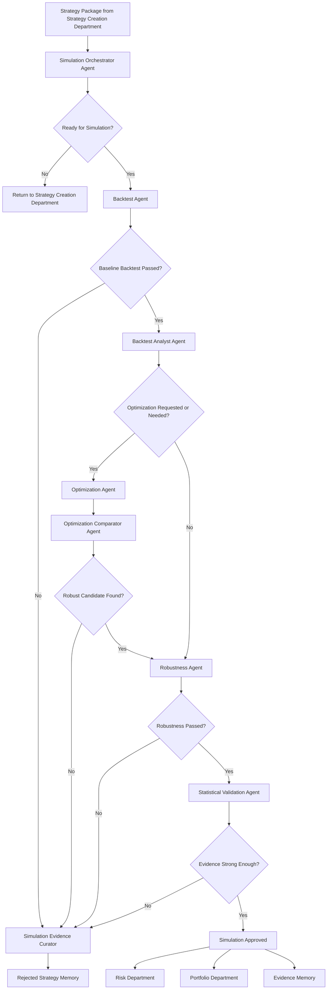

# HaruQuant Simulation Department

## Goal

Build a production-grade Simulation Department that can run reproducible historical tests, analyze strategy behavior, compare optimization candidates, stress-test robustness, and validate whether a strategy edge is statistically believable before any strategy can move toward paper trading or live deployment.

The Simulation Department must follow the HaruQuant Agent Template rule:

```text
Validate Input
-> Gather Evidence / Context
-> Optional LLM Reasoning
-> Deterministic Policy Decision
-> Structured Output
-> Audit Log
-> Evaluation Test
```

All Simulation Department agents are deterministic services with optional LLM reasoning. The LLM may analyze, summarize, classify, explain, rank, or propose improvements, but final acceptance, rejection, scoring, routing, and lifecycle decisions must be made by deterministic policy code.

```text
LLM output = proposal
Deterministic policy = final decision
```

## Dependency

Strategy Creation Department complete enough to provide a validated strategy specification, strategy code package, strategy hash, and review status.

Research Department complete enough to provide linked research evidence where the strategy originated from research hypotheses.

Analytics stack available:

```text
metrics.py
returns.py
drawdowns.py
ratios.py
risks.py
efficiency.py
distributions.py
benchmark.py
statistical_tests.py
```

---

# 1. Department Responsibilities

## 1.1 Primary Responsibilities

- [x] Run reproducible historical simulations.
- [x] Validate that strategy code, data, configuration, and assumptions are complete before testing.
- [x] Produce immutable backtest result packages.
- [x] Analyze strategy behavior beyond headline metrics.
- [x] Diagnose why a strategy performed well or poorly.
- [x] Run parameter sweeps and walk-forward optimization.
- [x] Compare parameter sets without selecting overfit results.
- [x] Stress-test strategies under adverse conditions.
- [x] Run Monte Carlo and randomized robustness tests.
- [x] Validate statistical credibility of the claimed edge.
- [x] Produce pass/fail/needs-review decisions.
- [x] Route approved results to Risk and Portfolio review.
- [x] Route rejected results to rejected-strategy memory.
- [x] Save all evidence, artifacts, logs, and audit metadata.

## 1.2 Non-Goals

- [x] Do not create strategy ideas.
- [x] Do not write strategy code unless explicitly routed back to Strategy Codegen.
- [x] Do not approve live trading.
- [x] Do not approve risk.
- [x] Do not execute trades.
- [x] Do not modify broker accounts.
- [x] Do not bypass Risk Governor.
- [x] Do not hide failed tests.
- [x] Do not overwrite immutable backtest evidence.

## 1.3 Hard Restrictions

```text
No Simulation Department agent can execute trades.
No Simulation Department agent can approve risk.
No Simulation Department agent can approve live deployment.
No Simulation Department agent can mutate historical run artifacts after finalization.
No LLM output can decide strategy acceptance without deterministic policy validation.
```

---

# 2. Department Agents

The Simulation Department should contain these production-grade agents and services:

```text
1. Simulation Orchestrator Agent
2. Backtest Agent
3. Backtest Analyst Agent
4. Optimization Agent
5. Optimization Comparator Agent
6. Robustness Agent
7. Statistical Validation Agent
8. Simulation Evidence Curator Agent
```

The original Backtest Agent, Backtest Analyst, Optimization Comparator, Robustness, and Statistical Validation requirements are preserved and expanded into these agents.

---

# 3. Standard Folder Structure

Use the HaruQuant agent template structure for every Simulation Department agent.

```text
agents/
  simulation/
    simulation_orchestrator_agent/
      __init__.py
      agent.py
      contracts.py
      prompts.py
      deterministic_policy.py
      tools.py
      service.py
      evaluator.py
      README.md
      tests/
        test_contracts.py
        test_deterministic_policy.py
        test_service.py
        test_agent_smoke.py

    backtest_agent/
      __init__.py
      agent.py
      contracts.py
      prompts.py
      deterministic_policy.py
      tools.py
      service.py
      evaluator.py
      README.md
      tests/
        test_contracts.py
        test_deterministic_policy.py
        test_service.py
        test_agent_smoke.py

    backtest_analyst_agent/
      __init__.py
      agent.py
      contracts.py
      prompts.py
      deterministic_policy.py
      tools.py
      service.py
      evaluator.py
      README.md
      tests/
        test_contracts.py
        test_deterministic_policy.py
        test_service.py
        test_agent_smoke.py

    optimization_agent/
      __init__.py
      agent.py
      contracts.py
      prompts.py
      deterministic_policy.py
      tools.py
      service.py
      evaluator.py
      README.md
      tests/
        test_contracts.py
        test_deterministic_policy.py
        test_service.py
        test_agent_smoke.py

    optimization_comparator_agent/
      __init__.py
      agent.py
      contracts.py
      prompts.py
      deterministic_policy.py
      tools.py
      service.py
      evaluator.py
      README.md
      tests/
        test_contracts.py
        test_deterministic_policy.py
        test_service.py
        test_agent_smoke.py

    robustness_agent/
      __init__.py
      agent.py
      contracts.py
      prompts.py
      deterministic_policy.py
      tools.py
      service.py
      evaluator.py
      README.md
      tests/
        test_contracts.py
        test_deterministic_policy.py
        test_service.py
        test_agent_smoke.py

    statistical_validation_agent/
      __init__.py
      agent.py
      contracts.py
      prompts.py
      deterministic_policy.py
      tools.py
      service.py
      evaluator.py
      README.md
      tests/
        test_contracts.py
        test_deterministic_policy.py
        test_service.py
        test_agent_smoke.py

    simulation_evidence_curator_agent/
      __init__.py
      agent.py
      contracts.py
      prompts.py
      deterministic_policy.py
      tools.py
      service.py
      evaluator.py
      README.md
      tests/
        test_contracts.py
        test_deterministic_policy.py
        test_service.py
        test_agent_smoke.py

    shared/
      contracts.py
      scoring.py
      acceptance_rules.py
      artifact_paths.py
      run_manifest.py
      reproducibility.py
      report_builder.py
      constants.py
```

---

# 4. Department-Level Permission Profile

## 4.1 Standard Permissions

```python
SIMULATION_DEPARTMENT_PERMISSIONS = {
    "can_read_strategy_specs": True,
    "can_read_strategy_code": True,
    "can_read_market_data": True,
    "can_read_backtest_results": True,
    "can_read_analytics_results": True,
    "can_write_backtest_artifacts": True,
    "can_write_simulation_memory": True,
    "can_run_backtests": True,
    "can_run_optimizations": True,
    "can_run_robustness_tests": True,
    "can_run_statistical_tests": True,
    "can_generate_reports": True,
    "can_modify_strategy_code": False,
    "can_approve_risk": False,
    "can_execute_trade": False,
    "can_modify_broker_account": False,
    "can_deploy_strategy_live": False,
}
```

## 4.2 Allowed Actions

- [x] Validate simulation request.
- [x] Validate strategy package.
- [x] Validate data availability.
- [x] Run backtest.
- [x] Run analytics.
- [x] Run optimization.
- [x] Run robustness tests.
- [x] Run statistical validation.
- [x] Generate diagnosis report.
- [x] Generate evidence package.
- [x] Save immutable artifacts.
- [x] Recommend review outcome.
- [x] Route to next department.

## 4.3 Forbidden Actions

- [x] Place trade.
- [x] Modify live position.
- [x] Approve risk.
- [x] Override Risk Governor.
- [x] Deploy strategy live.
- [x] Modify broker configuration.
- [x] Rewrite strategy logic without routing to Strategy Codegen.
- [x] Delete finalized simulation evidence.
- [x] Hide failed simulation runs.

---

# 5. Shared Simulation Contracts

Create shared contracts that can be used across all Simulation Department agents.

## 5.1 Simulation Request Contract

```python
class SimulationRequestPayload(BaseModel):
    strategy_id: str
    strategy_version: str
    strategy_code_hash: str
    strategy_spec_id: str | None = None
    symbol: str
    timeframe: str
    data_start: str
    data_end: str
    initial_balance: float
    commission_model: dict[str, Any]
    spread_model: dict[str, Any]
    slippage_model: dict[str, Any]
    swap_model: dict[str, Any] | None = None
    execution_mode: str
    data_mode: str = "ohlcv"
    margin_mode: str | None = None
    benchmark_symbol: str | None = None
    tags: list[str] = Field(default_factory=list)
```

## 5.2 Backtest Run Manifest

```python
class BacktestRunManifest(BaseModel):
    run_id: str
    strategy_id: str
    strategy_version: str
    strategy_code_hash: str
    strategy_spec_id: str | None
    symbol: str
    timeframe: str
    data_start: str
    data_end: str
    data_hash: str
    config_hash: str
    engine_version: str
    analytics_version: str
    created_at: str
    artifact_root: str
    status: str
```

## 5.3 Simulation Decision Contract

```python
class SimulationDecisionArtifact(BaseModel):
    lifecycle_state: str
    acceptance_status: str
    evidence_quality: str
    deployment_recommendation: str
    reasons: list[str]
    blocked_next_steps: list[str]
    allowed_next_steps: list[str]
    required_followups: list[str]
```

## 5.4 Result Package Contract

```python
class BacktestResultPackage(BaseModel):
    run_id: str
    artifact_root: str
    config_path: str
    trades_path: str
    orders_path: str
    deals_path: str
    equity_curve_path: str
    metrics_path: str
    analytics_path: str
    report_path: str
    audit_path: str
    manifest_path: str
```

---

# 6. Standard Simulation Artifact Structure

Every simulation run must produce a full immutable result package.

```text
backtests/
  runs/
    <run_id>/
      manifest.json
      config.yaml
      strategy_spec.yaml
      strategy_snapshot.py
      strategy_code_hash.txt
      data_manifest.json
      engine_config.json
      trades.parquet
      orders.parquet
      deals.parquet
      positions.parquet
      equity_curve.parquet
      balance_curve.parquet
      drawdown_curve.parquet
      exposure_curve.parquet
      margin_curve.parquet
      costs.json
      metrics.json
      analytics.json
      statistical_tests.json
      report.md
      audit.json
      logs/
        backtest.log
        engine.log
        analytics.log
        errors.log
      plots/
        equity_curve.png
        drawdown_curve.png
        monthly_returns.png
        trade_distribution.png
      diagnostics/
        edge_diagnosis.json
        failure_modes.json
        regime_analysis.json
        cost_sensitivity.json
      robustness/
        spread_stress.json
        slippage_stress.json
        commission_stress.json
        monte_carlo.json
      optimization/
        grid.parquet
        candidate_runs.parquet
        parameter_clusters.json
```

Rules:

- [x] Never overwrite a finalized run package.
- [x] Every run must have a unique `run_id`.
- [x] Every run must store strategy code hash.
- [x] Every run must store data hash or data manifest.
- [x] Every run must store engine version.
- [x] Every run must store analytics version.
- [x] Every run must store configuration hash.
- [x] Every run must store audit metadata.
- [x] Every result package must be reproducible from saved artifacts.

---

# 7. Simulation Orchestrator Agent

## 7.1 Purpose

Coordinate the full Simulation Department workflow from strategy package intake to final simulation decision.

## 7.2 Required Folder

```text
agents/simulation/simulation_orchestrator_agent/
```

## 7.3 Inputs

- [x] Strategy specification.
- [x] Strategy code package.
- [x] Strategy review status.
- [x] Research evidence references.
- [x] Requested symbol.
- [x] Requested timeframe.
- [x] Requested backtest period.
- [x] Requested execution model.
- [x] Cost assumptions.
- [x] Data requirements.
- [x] Optimization request, if any.
- [x] Robustness request, if any.
- [x] Statistical validation request, if any.

## 7.4 Tools

- [x] `validate_strategy_simulation_readiness`.
- [x] `create_simulation_plan`.
- [x] `dispatch_backtest_agent`.
- [x] `dispatch_backtest_analyst_agent`.
- [x] `dispatch_optimization_agent`.
- [x] `dispatch_optimization_comparator_agent`.
- [x] `dispatch_robustness_agent`.
- [x] `dispatch_statistical_validation_agent`.
- [x] `dispatch_simulation_evidence_curator_agent`.

## 7.5 Evidence Required

- [x] Strategy spec ID.
- [x] Strategy code hash.
- [x] Strategy review status.
- [x] Data availability summary.
- [x] Cost model summary.
- [x] Execution model summary.
- [x] Simulation plan.
- [x] Child agent responses.

## 7.6 LLM Responsibilities

- [x] Summarize requested simulation workflow.
- [x] Explain why certain tests are required.
- [x] Draft final user-facing simulation memo.
- [x] Summarize child-agent findings.
- [x] Identify contradictions between simulation outputs.

## 7.7 Deterministic Policy Rules

- [x] Reject if strategy has not passed Strategy Reviewer.
- [x] Reject if strategy code hash is missing.
- [x] Reject if simulation period is invalid.
- [x] Reject if required market data is missing.
- [x] Reject if cost assumptions are missing.
- [x] Reject if execution mode is missing.
- [x] Require Backtest Agent before Backtest Analyst.
- [x] Require Backtest Agent before Robustness Agent.
- [x] Require Backtest Agent before Statistical Validation Agent.
- [x] Require Optimization Comparator after Optimization Agent.
- [x] Route successful backtests to Backtest Analyst.
- [x] Route optimization requests to Optimization Agent and Optimization Comparator.
- [x] Route candidate strategies to Robustness Agent only after baseline backtest passes minimum quality gates.
- [x] Route candidate strategies to Statistical Validation Agent after sufficient trades exist.
- [x] Produce final department decision only after required child agents return valid `AgentResponse` envelopes.

## 7.8 Allowed Actions

- [x] create_simulation_plan
- [x] request_backtest
- [x] request_analysis
- [x] request_optimization
- [x] request_robustness_tests
- [x] request_statistical_validation
- [x] summarize_simulation_result
- [x] route_to_risk_review
- [x] route_to_strategy_revision
- [x] route_to_rejected_strategy_memory

## 7.9 Blocked Actions

- [x] execute_trade
- [x] approve_live_deployment
- [x] approve_risk
- [x] modify_strategy_code
- [x] bypass_backtest
- [x] bypass_robustness_gate

## 7.10 Output Artifacts

- [x] Simulation plan.
- [x] Department-level simulation package.
- [x] Child-agent response index.
- [x] Final simulation decision.
- [x] Routing recommendation.
- [x] Audit metadata.

## 7.11 Tests Required

- [x] Normal full workflow.
- [x] Missing strategy hash.
- [x] Missing data.
- [x] Failed Strategy Reviewer status.
- [x] Backtest fails acceptance gate.
- [x] Optimization requested without valid baseline backtest.
- [x] Robustness requested with insufficient trade count.
- [x] LLM attempts to approve live deployment.

---

# 8. Backtest Agent

## 8.1 Purpose

Run reproducible historical tests using the HaruQuant engine and produce immutable backtest evidence packages.

## 8.2 Required Folder

```text
agents/simulation/backtest_agent/
```

## 8.3 Inputs

- [x] Strategy ID.
- [x] Strategy version.
- [x] Strategy spec ID.
- [x] Strategy code hash.
- [x] Strategy code snapshot.
- [x] Symbol.
- [x] Timeframe.
- [x] Backtest start date.
- [x] Backtest end date.
- [x] Historical data path or query.
- [x] Initial balance.
- [x] Commission model.
- [x] Spread model.
- [x] Slippage model.
- [x] Swap model.
- [x] Execution mode.
- [x] Data mode.
- [x] Margin mode.
- [x] Position mode.
- [x] Benchmark configuration.

## 8.4 Tools

- [x] `validate_data_availability`.
- [x] `validate_strategy_code_hash`.
- [x] `validate_backtest_config`.
- [x] `load_historical_data`.
- [x] `load_strategy_snapshot`.
- [x] `run_haruquant_engine`.
- [x] `save_backtest_artifacts`.
- [x] `call_analytics_stack`.
- [x] `build_backtest_report`.
- [x] `write_backtest_audit`.

## 8.5 Evidence Required

- [x] Data availability report.
- [x] Data quality report.
- [x] Strategy hash validation.
- [x] Backtest config validation.
- [x] Engine configuration.
- [x] Cost model validation.
- [x] Execution model validation.
- [x] Backtest run result.
- [x] Saved artifact manifest.

## 8.6 LLM Responsibilities

- [x] Summarize backtest configuration.
- [x] Explain major assumptions.
- [x] Draft human-readable backtest report sections.
- [x] Identify suspicious result patterns for deterministic review.

## 8.7 Deterministic Policy Rules

- [x] Reject if data is unavailable.
- [x] Reject if data has missing required OHLCV columns.
- [x] Reject if data period does not cover requested test window.
- [x] Reject if strategy code hash is missing.
- [x] Reject if strategy code hash does not match the reviewed version.
- [x] Reject if backtest start date is after end date.
- [x] Reject if backtest period is too short for requested timeframe.
- [x] Reject if initial balance is less than or equal to zero.
- [x] Reject if commission model is missing.
- [x] Reject if spread model is missing.
- [x] Reject if slippage model is missing.
- [x] Reject if execution mode is unsupported.
- [x] Reject if margin mode is unsupported.
- [x] Reject if strategy cannot be loaded.
- [x] Reject if strategy parameter validation fails.
- [x] Reject if engine result cannot be reproduced from saved config.
- [x] Mark run as failed if trades, equity, or metrics cannot be saved.
- [x] Require immutable artifact package before returning success.

## 8.8 Backtest Execution Checklist

- [x] Validate data availability.
- [x] Validate data quality.
- [x] Validate strategy code hash.
- [x] Validate strategy spec version.
- [x] Validate backtest period.
- [x] Validate initial balance.
- [x] Validate commission.
- [x] Validate spread.
- [x] Validate slippage.
- [x] Validate swap.
- [x] Validate execution mode.
- [x] Validate data mode.
- [x] Validate margin mode.
- [x] Validate position mode.
- [x] Validate benchmark data if benchmark is requested.
- [x] Create run ID.
- [x] Create run manifest.
- [x] Snapshot strategy spec.
- [x] Snapshot strategy code.
- [x] Save config.
- [x] Run backtest.
- [x] Save trades.
- [x] Save orders.
- [x] Save deals.
- [x] Save positions.
- [x] Save balance curve.
- [x] Save equity curve.
- [x] Save drawdown curve.
- [x] Save exposure curve.
- [x] Save margin curve.
- [x] Save costs.
- [x] Save metrics.
- [x] Save analytics.
- [x] Save config.
- [x] Save logs.
- [x] Save report.
- [x] Save audit file.
- [x] Save manifest.

## 8.9 Analytics Integration Checklist

- [x] Call `metrics.py`.
- [x] Call `returns.py`.
- [x] Call `drawdowns.py`.
- [x] Call `ratios.py`.
- [x] Call `risks.py`.
- [x] Call `efficiency.py`.
- [x] Call `distributions.py`.
- [x] Call `benchmark.py`.
- [x] Call `statistical_tests.py`.
- [x] Save analytics output to `analytics.json`.
- [x] Record analytics module versions.
- [x] Record analytics input data hashes.
- [x] Validate analytics output schema.

## 8.10 Backtest Acceptance Rules

- [x] Reject if too few trades.
- [x] Reject if profit comes from one trade.
- [x] Reject if top 5 trades dominate total net profit beyond policy.
- [x] Reject if long/short split is unstable for a dual-side strategy.
- [x] Reject if OOS is much worse than IS.
- [x] Reject if drawdown exceeds policy.
- [x] Reject if costs destroy edge.
- [x] Reject if spread sensitivity is too high.
- [x] Reject if slippage sensitivity is too high.
- [x] Reject if exposure is unrealistic.
- [x] Reject if margin usage breaches policy.
- [x] Reject if trade frequency is unrealistic for data resolution.
- [x] Reject if results cannot be reproduced.
- [x] Mark `needs_review` if strategy is profitable but sample size is weak.
- [x] Mark `needs_review` if performance is concentrated in one regime.
- [x] Mark `needs_review` if performance is concentrated in one month or year.

## 8.11 Allowed Actions

- [x] run_backtest
- [x] save_backtest_package
- [x] calculate_analytics
- [x] generate_backtest_report
- [x] flag_backtest_quality
- [x] recommend_next_simulation_step

## 8.12 Blocked Actions

- [x] execute_trade
- [x] approve_live_deployment
- [x] approve_risk
- [x] modify_strategy_logic
- [x] ignore_failed_artifacts
- [x] overwrite_finalized_run

## 8.13 Output Artifacts

- [x] `backtests/runs/<run_id>/manifest.json`.
- [x] `backtests/runs/<run_id>/config.yaml`.
- [x] `backtests/runs/<run_id>/strategy_spec.yaml`.
- [x] `backtests/runs/<run_id>/strategy_snapshot.py`.
- [x] `backtests/runs/<run_id>/strategy_code_hash.txt`.
- [x] `backtests/runs/<run_id>/data_manifest.json`.
- [x] `backtests/runs/<run_id>/trades.parquet`.
- [x] `backtests/runs/<run_id>/orders.parquet`.
- [x] `backtests/runs/<run_id>/deals.parquet`.
- [x] `backtests/runs/<run_id>/positions.parquet`.
- [x] `backtests/runs/<run_id>/equity_curve.parquet`.
- [x] `backtests/runs/<run_id>/balance_curve.parquet`.
- [x] `backtests/runs/<run_id>/drawdown_curve.parquet`.
- [x] `backtests/runs/<run_id>/metrics.json`.
- [x] `backtests/runs/<run_id>/analytics.json`.
- [x] `backtests/runs/<run_id>/report.md`.
- [x] `backtests/runs/<run_id>/audit.json`.

## 8.14 Tests Required

- [x] Valid backtest request.
- [x] Missing symbol.
- [x] Missing timeframe.
- [x] Missing data.
- [x] Invalid period.
- [x] Invalid initial balance.
- [x] Missing cost model.
- [x] Strategy hash mismatch.
- [x] Unsupported execution mode.
- [x] Engine failure handling.
- [x] Artifact save failure handling.
- [x] Analytics failure handling.
- [x] Reproducibility check.
- [x] LLM tries to override deterministic rejection.

---

# 9. Backtest Analyst Agent

## 9.1 Purpose

Explain why a strategy performed well or poorly. This agent turns raw metrics and artifacts into a structured diagnosis that can guide strategy revision, robustness testing, or rejection.

## 9.2 Required Folder

```text
agents/simulation/backtest_analyst_agent/
```

## 9.3 Inputs

- [x] Backtest run ID.
- [x] Backtest result package.
- [x] Trades.
- [x] Orders.
- [x] Deals.
- [x] Equity curve.
- [x] Balance curve.
- [x] Drawdown curve.
- [x] Exposure curve.
- [x] Metrics.
- [x] Analytics.
- [x] Strategy spec.
- [x] Strategy family.
- [x] Symbol/timeframe.
- [x] Market regime labels, if available.
- [x] Session labels, if available.
- [x] Cost model.

## 9.4 Tools

- [x] `load_backtest_package`.
- [x] `load_trades`.
- [x] `load_equity_curve`.
- [x] `load_metrics`.
- [x] `analyze_equity_curve`.
- [x] `analyze_drawdowns`.
- [x] `analyze_period_returns`.
- [x] `analyze_trade_distribution`.
- [x] `analyze_long_short_split`.
- [x] `analyze_session_performance`.
- [x] `analyze_regime_dependency`.
- [x] `analyze_cost_sensitivity`.
- [x] `build_diagnosis_report`.

## 9.5 Evidence Required

- [x] Equity curve evidence.
- [x] Drawdown evidence.
- [x] Period performance evidence.
- [x] Trade distribution evidence.
- [x] Cost contribution evidence.
- [x] Long/short split evidence.
- [x] Session performance evidence.
- [x] Regime dependency evidence.
- [x] Benchmark comparison evidence.

## 9.6 LLM Responsibilities

- [x] Explain performance behavior in plain language.
- [x] Summarize failure modes.
- [x] Draft improvement recommendations.
- [x] Explain metric conflicts.
- [x] Produce a readable diagnosis report.

## 9.7 Deterministic Policy Rules

- [x] Reject analysis if run package is missing.
- [x] Reject analysis if trades file is missing.
- [x] Reject analysis if equity curve is missing.
- [x] Reject analysis if metrics are missing.
- [x] Mark analysis as low confidence if trade count is below threshold.
- [x] Mark analysis as low confidence if data quality is weak.
- [x] Flag unstable edge if performance is concentrated in very few trades.
- [x] Flag unstable edge if performance is concentrated in one month or year.
- [x] Flag side imbalance if only long or only short performs in a dual-side strategy.
- [x] Flag regime dependency if performance only works in one regime.
- [x] Flag cost fragility if net edge disappears under realistic costs.
- [x] Flag drawdown concern if drawdown duration or depth breaches policy.
- [x] Require deterministic diagnosis fields before returning success.

## 9.8 Analysis Checklist

- [x] Analyze equity curve.
- [x] Analyze balance curve.
- [x] Analyze drawdown curve.
- [x] Analyze underwater periods.
- [x] Analyze recovery times.
- [x] Analyze monthly performance.
- [x] Analyze weekly performance.
- [x] Analyze daily performance.
- [x] Analyze rolling returns.
- [x] Analyze trade distribution.
- [x] Analyze R-multiple distribution where available.
- [x] Analyze MAE/MFE where available.
- [x] Analyze long vs short.
- [x] Analyze buy-side performance.
- [x] Analyze sell-side performance.
- [x] Analyze session performance.
- [x] Analyze hour-of-day performance.
- [x] Analyze day-of-week performance.
- [x] Analyze symbol/timeframe suitability.
- [x] Analyze spread sensitivity.
- [x] Analyze slippage sensitivity.
- [x] Analyze commission sensitivity.
- [x] Analyze swap sensitivity.
- [x] Analyze regime dependency.
- [x] Analyze volatility-regime performance.
- [x] Analyze trend/range regime performance.
- [x] Analyze benchmark-relative performance.
- [x] Analyze trade clustering.
- [x] Analyze exposure behavior.
- [x] Analyze margin usage.
- [x] Analyze whether strategy behaves according to its stated hypothesis.
- [x] Output improvement recommendations.

## 9.9 Diagnosis Output Fields

- [x] `edge_quality`.
- [x] `failure_modes`.
- [x] `risk_concerns`.
- [x] `parameter_concerns`.
- [x] `market_regime_dependency`.
- [x] `cost_fragility`.
- [x] `side_dependency`.
- [x] `session_dependency`.
- [x] `sample_quality`.
- [x] `behavior_consistency`.
- [x] `recommended_changes`.
- [x] `recommended_next_tests`.
- [x] `deployment_recommendation`.

## 9.10 Allowed Actions

- [x] analyze_backtest
- [x] diagnose_edge_quality
- [x] identify_failure_modes
- [x] recommend_strategy_revision
- [x] recommend_robustness_tests
- [x] recommend_rejection

## 9.11 Blocked Actions

- [x] modify_strategy_code
- [x] approve_risk
- [x] approve_live_deployment
- [x] execute_trade
- [x] override_acceptance_rules

## 9.12 Output Artifacts

- [x] `diagnostics/edge_diagnosis.json`.
- [x] `diagnostics/failure_modes.json`.
- [x] `diagnostics/regime_analysis.json`.
- [x] `diagnostics/cost_sensitivity.json`.
- [x] `diagnostics/diagnosis_report.md`.
- [x] Agent response with structured decision.

## 9.13 Tests Required

- [x] Normal profitable strategy diagnosis.
- [x] Losing strategy diagnosis.
- [x] Strategy with too few trades.
- [x] Strategy with one-trade profit concentration.
- [x] Strategy with long/short instability.
- [x] Strategy with cost fragility.
- [x] Strategy with regime dependency.
- [x] Missing run package.
- [x] Missing metrics.
- [x] LLM tries to recommend deployment despite deterministic rejection.

---

# 10. Optimization Agent

## 10.1 Purpose

Run parameter sweeps, walk-forward optimization, and candidate parameter simulations while preserving reproducibility and avoiding result cherry-picking.

## 10.2 Required Folder

```text
agents/simulation/optimization_agent/
```

## 10.3 Inputs

- [x] Strategy ID.
- [x] Strategy version.
- [x] Strategy code hash.
- [x] Base backtest configuration.
- [x] Parameter search space.
- [x] Parameter constraints.
- [x] Optimization objective.
- [x] Optimization limits.
- [x] IS/OOS split settings.
- [x] Walk-forward settings.
- [x] Cost model.
- [x] Data manifest.
- [x] Random seed policy.

## 10.4 Tools

- [x] `validate_parameter_grid`.
- [x] `validate_parameter_constraints`.
- [x] `build_parameter_sweep_plan`.
- [x] `run_parameter_sweep`.
- [x] `run_walk_forward_optimization`.
- [x] `save_optimization_grid`.
- [x] `save_candidate_run_results`.
- [x] `save_parameter_metadata`.
- [x] `write_optimization_audit`.

## 10.5 Evidence Required

- [x] Search space definition.
- [x] Parameter constraints.
- [x] Optimization objective.
- [x] Run count.
- [x] Candidate run metadata.
- [x] IS/OOS split manifest.
- [x] Walk-forward window manifest.
- [x] Optimization result grid.

## 10.6 LLM Responsibilities

- [x] Explain optimization objective.
- [x] Summarize parameter search behavior.
- [x] Draft optimization report text.
- [x] Identify suspicious optimization patterns for deterministic review.

## 10.7 Deterministic Policy Rules

- [x] Reject optimization if base strategy is not valid.
- [x] Reject if parameter grid is empty.
- [x] Reject if parameter values violate declared parameter types.
- [x] Reject if parameter values violate constraints.
- [x] Reject if optimization objective is missing.
- [x] Reject if search space is too broad for available compute policy.
- [x] Reject if search space is too narrow to prove robustness.
- [x] Reject if IS/OOS split is missing when required.
- [x] Reject if walk-forward windows overlap incorrectly.
- [x] Require every candidate run to store config and metrics.
- [x] Require optimization grid to include failed runs and reasons.
- [x] Require deterministic audit before success.

## 10.8 Optimization Checklist

- [x] Validate strategy code hash.
- [x] Validate base simulation config.
- [x] Validate parameter search space.
- [x] Validate parameter constraints.
- [x] Validate optimization objective.
- [x] Validate compute budget.
- [x] Validate random seed policy.
- [x] Run parameter sweeps.
- [x] Run walk-forward optimization if enabled.
- [x] Save optimization grid.
- [x] Save each run result.
- [x] Save failed run metadata.
- [x] Save parameter set metadata.
- [x] Save IS/OOS split results.
- [x] Save WFO window results.
- [x] Save logs.
- [x] Save audit.

## 10.9 Allowed Actions

- [x] run_parameter_sweep
- [x] run_walk_forward_optimization
- [x] save_optimization_results
- [x] generate_optimization_report
- [x] route_to_optimization_comparator

## 10.10 Blocked Actions

- [x] select_live_parameters_without_comparator
- [x] hide_failed_parameter_runs
- [x] approve_live_deployment
- [x] approve_risk
- [x] execute_trade

## 10.11 Output Artifacts

- [x] `optimization/grid.parquet`.
- [x] `optimization/candidate_runs.parquet`.
- [x] `optimization/failed_runs.parquet`.
- [x] `optimization/parameter_metadata.json`.
- [x] `optimization/is_oos_results.json`.
- [x] `optimization/wfo_results.json`.
- [x] `optimization/optimization_report.md`.
- [x] `optimization/audit.json`.

## 10.12 Tests Required

- [x] Valid parameter grid.
- [x] Empty parameter grid.
- [x] Invalid parameter type.
- [x] Constraint violation.
- [x] Missing objective.
- [x] Excessive grid size.
- [x] WFO split validation.
- [x] Candidate run failure handling.
- [x] Failed run is recorded.
- [x] LLM tries to pick isolated best parameter set.

---

# 11. Optimization Comparator Agent

## 11.1 Purpose

Compare optimization results and recommend robust parameter regions rather than isolated overfit best results.

## 11.2 Required Folder

```text
agents/simulation/optimization_comparator_agent/
```

## 11.3 Inputs

- [x] Optimization run ID.
- [x] Optimization grid.
- [x] Candidate run results.
- [x] Failed run metadata.
- [x] IS/OOS results.
- [x] WFO results.
- [x] Parameter constraints.
- [x] Robustness preferences.
- [x] Strategy family.
- [x] Acceptance policy.

## 11.4 Tools

- [x] `load_optimization_grid`.
- [x] `rank_parameter_sets`.
- [x] `detect_stable_regions`.
- [x] `detect_parameter_cliffs`.
- [x] `detect_fragile_settings`.
- [x] `compare_is_oos`.
- [x] `compare_wfo_windows`.
- [x] `cluster_parameter_regions`.
- [x] `build_comparator_report`.

## 11.5 Evidence Required

- [x] Best result metrics.
- [x] Stable region metrics.
- [x] Parameter sensitivity maps.
- [x] IS/OOS degradation evidence.
- [x] WFO consistency evidence.
- [x] Parameter cliff evidence.
- [x] Candidate cluster evidence.

## 11.6 LLM Responsibilities

- [x] Explain parameter-region tradeoffs.
- [x] Summarize stable clusters.
- [x] Explain why isolated best settings are dangerous.
- [x] Draft comparator report text.

## 11.7 Deterministic Policy Rules

- [x] Reject isolated best settings when neighboring parameters perform poorly.
- [x] Reject parameter sets with severe IS/OOS degradation.
- [x] Reject parameter sets with WFO inconsistency.
- [x] Reject parameter sets that depend on one lucky period.
- [x] Reject parameter sets with excessive drawdown sensitivity.
- [x] Prefer robust clusters over top single metric.
- [x] Prefer lower complexity when performance is similar.
- [x] Prefer parameter regions with acceptable cost tolerance.
- [x] Prefer parameter regions with stable trade counts.
- [x] Require comparator report before recommending candidate parameters.

## 11.8 Comparator Checklist

- [x] Compare best result.
- [x] Compare top-N candidates.
- [x] Compare stable regions.
- [x] Compare IS vs OOS.
- [x] Compare WFO windows.
- [x] Detect parameter cliffs.
- [x] Detect fragile settings.
- [x] Detect isolated best settings.
- [x] Detect over-optimized settings.
- [x] Detect low-trade-count winners.
- [x] Detect cost-sensitive winners.
- [x] Detect drawdown-sensitive winners.
- [x] Cluster parameter regions.
- [x] Prefer robust clusters.
- [x] Reject isolated best settings.
- [x] Output recommended candidate parameters.
- [x] Output rejected parameter candidates.
- [x] Output parameter risk notes.

## 11.9 Allowed Actions

- [x] compare_optimization_results
- [x] recommend_parameter_region
- [x] reject_fragile_parameters
- [x] route_candidates_to_robustness
- [x] route_back_to_optimization

## 11.10 Blocked Actions

- [x] approve_live_parameters
- [x] approve_risk
- [x] execute_trade
- [x] hide_overfit_results
- [x] select_isolated_best_without_policy

## 11.11 Output Artifacts

- [x] `optimization/parameter_clusters.json`.
- [x] `optimization/parameter_cliffs.json`.
- [x] `optimization/recommended_candidates.json`.
- [x] `optimization/rejected_candidates.json`.
- [x] `optimization/comparator_report.md`.
- [x] Agent response with deterministic recommendation.

## 11.12 Tests Required

- [x] Stable region selected over isolated best.
- [x] Isolated best rejected.
- [x] Severe IS/OOS degradation rejected.
- [x] Parameter cliff detected.
- [x] Fragile cost-sensitive candidate rejected.
- [x] WFO-inconsistent candidate rejected.
- [x] Missing optimization grid.
- [x] LLM tries to select prettiest result.

---

# 12. Robustness Agent

## 12.1 Purpose

Test whether a strategy survives stress and variation. No strategy should reach paper trading from a single backtest.

## 12.2 Required Folder

```text
agents/simulation/robustness_agent/
```

## 12.3 Inputs

- [x] Baseline backtest run ID.
- [x] Strategy ID.
- [x] Strategy version.
- [x] Strategy code hash.
- [x] Candidate parameters.
- [x] Baseline configuration.
- [x] Historical data manifest.
- [x] Cost models.
- [x] Robustness test plan.
- [x] Monte Carlo settings.
- [x] Cross-market settings.
- [x] Cross-timeframe settings.
- [x] Second OOS settings.

## 12.4 Tools

- [x] `run_second_oos_test`.
- [x] `run_spread_stress_test`.
- [x] `run_slippage_stress_test`.
- [x] `run_commission_stress_test`.
- [x] `run_swap_stress_test`.
- [x] `run_cross_market_test`.
- [x] `run_cross_timeframe_test`.
- [x] `run_monte_carlo_trade_order_randomization`.
- [x] `run_monte_carlo_trade_resampling`.
- [x] `run_monte_carlo_skipped_trades`.
- [x] `run_monte_carlo_parameter_randomization`.
- [x] `run_randomized_history_test`.
- [x] `run_combined_monte_carlo`.
- [x] `run_final_full_period_confirmation`.
- [x] `calculate_robustness_scorecard`.

## 12.5 Evidence Required

- [x] Baseline backtest evidence.
- [x] Second OOS result.
- [x] Spread stress result.
- [x] Slippage stress result.
- [x] Commission stress result.
- [x] Swap stress result.
- [x] Cross-market result.
- [x] Cross-timeframe result.
- [x] Monte Carlo result.
- [x] Randomized history result.
- [x] Full-period confirmation result.
- [x] Robustness scorecard.

## 12.6 LLM Responsibilities

- [x] Explain robustness failures.
- [x] Summarize stress-test behavior.
- [x] Draft robustness report text.
- [x] Suggest follow-up tests.
- [x] Explain why a strategy should be rejected or reviewed.

## 12.7 Deterministic Policy Rules

- [x] Reject robustness run if baseline backtest is missing.
- [x] Reject if candidate parameters are missing.
- [x] Reject if baseline has too few trades for Monte Carlo.
- [x] Reject if second OOS fails policy threshold.
- [x] Reject if costs destroy edge.
- [x] Reject if spread stress fails threshold.
- [x] Reject if slippage stress fails threshold.
- [x] Reject if drawdown explodes under stress.
- [x] Reject if Monte Carlo survival rate is below threshold.
- [x] Reject if randomized history test fails threshold.
- [x] Reject if strategy only works on one narrow market condition.
- [x] Reject if final full-period confirmation fails.
- [x] Mark `needs_review` if optional cross-market or cross-timeframe tests fail but the strategy was intended to be symbol-specific.
- [x] Produce pass/fail/needs-review only through deterministic scorecard.

## 12.8 Robustness Test Checklist

- [x] Run second OOS test.
- [x] Run spread stress test.
- [x] Run slippage stress test.
- [x] Run commission stress test.
- [x] Run swap stress test.
- [x] Run cross-market test.
- [x] Run cross-timeframe test.
- [x] Run Monte Carlo trade-order randomization.
- [x] Run Monte Carlo trade resampling.
- [x] Run Monte Carlo skipped trades.
- [x] Run Monte Carlo parameter randomization.
- [x] Run randomized history test.
- [x] Run combined Monte Carlo.
- [x] Run final full-period confirmation.
- [x] Save each test configuration.
- [x] Save each test result.
- [x] Save failed test reasons.
- [x] Save robustness report.
- [x] Save robustness audit.

## 12.9 Robustness Scorecard Checklist

- [x] Score profitability durability.
- [x] Score drawdown durability.
- [x] Score parameter stability.
- [x] Score OOS stability.
- [x] Score cost tolerance.
- [x] Score trade-count quality.
- [x] Score regime stability.
- [x] Score Monte Carlo survival.
- [x] Score randomized history survival.
- [x] Score full-period confirmation.
- [x] Produce pass/fail/needs-review.

## 12.10 Suggested Robustness Score Formula

```text
robustness_score =
    0.15 * profitability_durability_score
  + 0.15 * drawdown_durability_score
  + 0.15 * parameter_stability_score
  + 0.15 * oos_stability_score
  + 0.10 * cost_tolerance_score
  + 0.10 * trade_count_quality_score
  + 0.10 * regime_stability_score
  + 0.10 * monte_carlo_survival_score
```

## 12.11 Allowed Actions

- [x] run_robustness_tests
- [x] calculate_robustness_score
- [x] reject_non_robust_strategy
- [x] recommend_more_testing
- [x] route_to_statistical_validation
- [x] route_to_risk_review

## 12.12 Blocked Actions

- [x] approve_live_deployment
- [x] approve_risk
- [x] execute_trade
- [x] ignore_failed_stress_tests
- [x] mark_strategy_robust_from_single_backtest

## 12.13 Output Artifacts

- [x] `robustness/second_oos.json`.
- [x] `robustness/spread_stress.json`.
- [x] `robustness/slippage_stress.json`.
- [x] `robustness/commission_stress.json`.
- [x] `robustness/swap_stress.json`.
- [x] `robustness/cross_market.json`.
- [x] `robustness/cross_timeframe.json`.
- [x] `robustness/monte_carlo_trade_order.json`.
- [x] `robustness/monte_carlo_resampling.json`.
- [x] `robustness/monte_carlo_skipped_trades.json`.
- [x] `robustness/monte_carlo_parameter_randomization.json`.
- [x] `robustness/randomized_history.json`.
- [x] `robustness/combined_monte_carlo.json`.
- [x] `robustness/final_full_period.json`.
- [x] `robustness/scorecard.json`.
- [x] `robustness/report.md`.
- [x] `robustness/audit.json`.

## 12.14 Tests Required

- [x] Normal robust strategy.
- [x] Strategy fails second OOS.
- [x] Strategy fails spread stress.
- [x] Strategy fails slippage stress.
- [x] Strategy fails Monte Carlo survival.
- [x] Strategy fails randomized history.
- [x] Strategy has too few trades for Monte Carlo.
- [x] Symbol-specific strategy fails cross-market but is not automatically rejected.
- [x] Final full-period confirmation failure.
- [x] LLM tries to pass failed robustness scorecard.

---

# 13. Statistical Validation Agent

## 13.1 Purpose

Check whether the strategy edge is statistically believable. A strategy can be profitable but still not statistically convincing.

## 13.2 Required Folder

```text
agents/simulation/statistical_validation_agent/
```

## 13.3 Inputs

- [x] Backtest run ID.
- [x] Strategy ID.
- [x] Strategy version.
- [x] Trades.
- [x] Equity curve.
- [x] Returns.
- [x] Benchmark returns.
- [x] Regime labels.
- [x] Monthly returns.
- [x] Trade distribution.
- [x] Robustness result, if available.
- [x] Acceptance policy.

## 13.4 Tools

- [x] `check_minimum_sample_size`.
- [x] `run_bootstrap_confidence_intervals`.
- [x] `run_permutation_tests`.
- [x] `run_randomization_tests`.
- [x] `check_monthly_stability`.
- [x] `check_regime_stability`.
- [x] `analyze_return_distribution`.
- [x] `calculate_skew_kurtosis`.
- [x] `calculate_tail_risk`.
- [x] `calculate_benchmark_alpha`.
- [x] `calculate_probability_of_ruin`.
- [x] `calculate_evidence_quality_rating`.

## 13.5 Evidence Required

- [x] Trade sample size.
- [x] Return sample size.
- [x] Bootstrap confidence intervals.
- [x] Permutation test results.
- [x] Randomization test results.
- [x] Monthly stability results.
- [x] Regime stability results.
- [x] Distribution statistics.
- [x] Tail-risk statistics.
- [x] Benchmark alpha results.
- [x] Probability-of-ruin estimate.
- [x] Evidence rating.

## 13.6 LLM Responsibilities

- [x] Explain statistical results.
- [x] Explain evidence strength.
- [x] Explain why profitability may not equal credible edge.
- [x] Draft validation report text.
- [x] Suggest additional data or tests.

## 13.7 Deterministic Policy Rules

- [x] Reject validation if trades are missing.
- [x] Reject validation if equity curve is missing.
- [x] Mark evidence as `weak` if sample size is below policy.
- [x] Mark evidence as `weak` if confidence intervals include unacceptable loss behavior.
- [x] Mark evidence as `weak` if permutation tests do not reject randomness.
- [x] Mark evidence as `weak` if monthly stability is poor.
- [x] Mark evidence as `weak` if regime stability is poor.
- [x] Mark evidence as `moderate` only if sample size and stability meet minimum standards.
- [x] Mark evidence as `strong` only if edge survives statistical, stability, and robustness checks.
- [x] Mark evidence as `institutional_grade` only if all high-quality evidence thresholds pass and robustness is strong.
- [x] Never allow LLM explanation to upgrade evidence rating.

## 13.8 Statistical Validation Checklist

- [x] Check minimum sample size.
- [x] Check trade-count quality.
- [x] Check return sample quality.
- [x] Run bootstrap confidence intervals.
- [x] Run permutation tests.
- [x] Run randomization tests.
- [x] Check monthly stability.
- [x] Check quarterly stability.
- [x] Check yearly stability.
- [x] Check regime stability.
- [x] Check return distribution.
- [x] Check trade distribution.
- [x] Check skew.
- [x] Check kurtosis.
- [x] Check tail risk.
- [x] Check benchmark alpha.
- [x] Check beta where benchmark is available.
- [x] Check probability of ruin.
- [x] Check probability of strategy degradation.
- [x] Check confidence interval for expectancy.
- [x] Check confidence interval for Sharpe/Sortino where appropriate.
- [x] Check whether observed edge could plausibly be random.
- [x] Output evidence quality rating.

## 13.9 Evidence Rating Checklist

- [x] `weak`.
- [x] `moderate`.
- [x] `strong`.
- [x] `institutional_grade`.

## 13.10 Evidence Rating Rules

### Weak

- [x] Too few trades.
- [x] Unstable monthly results.
- [x] Edge disappears after costs.
- [x] Confidence interval too wide.
- [x] Randomization tests are not convincing.
- [x] Profit concentrated in few trades.

### Moderate

- [x] Acceptable sample size.
- [x] Basic profitability survives costs.
- [x] Drawdown is within policy.
- [x] Some monthly or regime stability exists.
- [x] Statistical tests are not conclusive but not alarming.

### Strong

- [x] Good sample size.
- [x] Edge survives costs.
- [x] Bootstrap results are favorable.
- [x] Randomization tests support non-random behavior.
- [x] Monthly and regime stability are acceptable.
- [x] Robustness tests are acceptable.

### Institutional Grade

- [x] Large and diverse sample.
- [x] Strong OOS behavior.
- [x] Strong robustness survival.
- [x] Strong statistical validation.
- [x] Stable performance across regimes.
- [x] Realistic execution assumptions.
- [x] Low probability of ruin.
- [x] Clear evidence lineage.

## 13.11 Allowed Actions

- [x] validate_statistical_edge
- [x] rate_evidence_quality
- [x] reject_statistically_weak_strategy
- [x] recommend_more_data
- [x] recommend_more_tests
- [x] route_to_risk_review

## 13.12 Blocked Actions

- [x] approve_live_deployment
- [x] approve_risk
- [x] execute_trade
- [x] upgrade_evidence_rating_from_llm_text
- [x] ignore_low_sample_size

## 13.13 Output Artifacts

- [x] `statistical_tests/bootstrap_confidence_intervals.json`.
- [x] `statistical_tests/permutation_tests.json`.
- [x] `statistical_tests/randomization_tests.json`.
- [x] `statistical_tests/monthly_stability.json`.
- [x] `statistical_tests/regime_stability.json`.
- [x] `statistical_tests/distribution_report.json`.
- [x] `statistical_tests/tail_risk.json`.
- [x] `statistical_tests/benchmark_alpha.json`.
- [x] `statistical_tests/probability_of_ruin.json`.
- [x] `statistical_tests/evidence_rating.json`.
- [x] `statistical_tests/report.md`.
- [x] `statistical_tests/audit.json`.

## 13.14 Tests Required

- [x] Weak evidence due to few trades.
- [x] Weak evidence due to unstable months.
- [x] Moderate evidence.
- [x] Strong evidence.
- [x] Institutional-grade evidence.
- [x] Missing trades.
- [x] Missing equity curve.
- [x] Confidence interval failure.
- [x] Randomization test failure.
- [x] Regime instability.
- [x] LLM tries to upgrade rating.

---

# 14. Simulation Evidence Curator Agent

## 14.1 Purpose

Maintain simulation evidence, run lineage, reproducibility metadata, and lifecycle transitions. This agent keeps the Simulation Department auditable and prevents successful and failed tests from being lost.

## 14.2 Required Folder

```text
agents/simulation/simulation_evidence_curator_agent/
```

## 14.3 Inputs

- [x] Backtest result packages.
- [x] Optimization packages.
- [x] Robustness packages.
- [x] Statistical validation packages.
- [x] Diagnosis reports.
- [x] Agent responses.
- [x] Audit metadata.
- [x] Strategy lifecycle state.

## 14.4 Tools

- [x] `index_simulation_artifacts`.
- [x] `save_simulation_memory_record`.
- [x] `link_run_to_strategy`.
- [x] `link_run_to_research_evidence`.
- [x] `link_run_to_optimization`.
- [x] `link_run_to_robustness`.
- [x] `link_run_to_statistical_validation`.
- [x] `mark_run_finalized`.
- [x] `mark_strategy_lifecycle_state`.
- [x] `retrieve_similar_past_runs`.
- [x] `retrieve_failed_runs_for_strategy_family`.

## 14.5 Evidence Required

- [x] Run manifest.
- [x] Artifact package paths.
- [x] Strategy ID.
- [x] Strategy version.
- [x] Strategy code hash.
- [x] Data hash.
- [x] Config hash.
- [x] Agent decision outputs.
- [x] Audit files.
- [x] Lifecycle state change request.

## 14.6 LLM Responsibilities

- [x] Summarize simulation evidence lineage.
- [x] Explain lifecycle state transitions.
- [x] Draft evidence index descriptions.

## 14.7 Deterministic Policy Rules

- [x] Reject memory write if run manifest is missing.
- [x] Reject memory write if strategy ID is missing.
- [x] Reject memory write if strategy code hash is missing.
- [x] Reject memory write if artifact package is incomplete.
- [x] Reject lifecycle promotion if required tests are missing.
- [x] Reject lifecycle promotion if required deterministic decisions are failed.
- [x] Prevent overwriting finalized evidence.
- [x] Preserve failed run records.
- [x] Link every simulation artifact to strategy version and code hash.
- [x] Link every simulation artifact to evidence references where available.

## 14.8 Evidence Curation Checklist

- [x] Save backtest run index.
- [x] Save optimization run index.
- [x] Save robustness run index.
- [x] Save statistical validation index.
- [x] Save diagnosis index.
- [x] Save failed runs.
- [x] Save rejected candidates.
- [x] Save accepted candidates.
- [x] Save lifecycle transitions.
- [x] Save run lineage.
- [x] Save strategy-to-run links.
- [x] Save research-to-run links.
- [x] Save run-to-report links.
- [x] Save reproducibility metadata.
- [x] Save audit metadata.
- [x] Mark stale evidence.
- [x] Mark superseded runs.
- [x] Retrieve comparable historical strategies.
- [x] Retrieve failed historical simulations before approving similar strategy.

## 14.9 Allowed Actions

- [x] save_simulation_evidence
- [x] index_result_package
- [x] link_strategy_run
- [x] mark_lifecycle_state
- [x] retrieve_past_simulation_evidence

## 14.10 Blocked Actions

- [x] delete_finalized_evidence
- [x] overwrite_finalized_artifacts
- [x] approve_risk
- [x] approve_live_deployment
- [x] execute_trade

## 14.11 Output Artifacts

- [x] Simulation evidence index.
- [x] Strategy run lineage record.
- [x] Lifecycle state update record.
- [x] Evidence memory references.
- [x] Audit metadata.

## 14.12 Tests Required

- [x] Save complete run package.
- [x] Reject incomplete run package.
- [x] Preserve failed run.
- [x] Prevent overwrite of finalized run.
- [x] Link run to strategy.
- [x] Link run to research evidence.
- [x] Reject lifecycle promotion when robustness failed.
- [x] LLM tries to hide failed evidence.

---

# 15. Department-Level Acceptance Gates

## 15.1 Baseline Backtest Gate

- [x] Data availability passed.
- [x] Data quality passed.
- [x] Strategy hash validated.
- [x] Backtest config validated.
- [x] Backtest reproduced successfully.
- [x] Minimum trade count passed.
- [x] Profit concentration check passed.
- [x] Drawdown policy passed.
- [x] Cost realism passed.
- [x] Metrics saved.
- [x] Artifacts saved.
- [x] Audit saved.

## 15.2 Diagnosis Gate

- [x] Edge quality classified.
- [x] Failure modes identified.
- [x] Risk concerns identified.
- [x] Parameter concerns identified.
- [x] Regime dependency analyzed.
- [x] Cost sensitivity analyzed.
- [x] Deployment recommendation produced.

## 15.3 Optimization Gate

- [x] Search space validated.
- [x] Parameter constraints validated.
- [x] Candidate runs saved.
- [x] Failed runs saved.
- [x] IS/OOS comparison completed.
- [x] WFO completed if enabled.
- [x] Parameter cliffs detected.
- [x] Robust cluster selected.
- [x] Isolated best settings rejected.

## 15.4 Robustness Gate

- [x] Second OOS passed.
- [x] Spread stress passed.
- [x] Slippage stress passed.
- [x] Commission stress passed.
- [x] Swap stress passed if relevant.
- [x] Monte Carlo survival passed.
- [x] Randomized history passed.
- [x] Final full-period confirmation passed.
- [x] Robustness scorecard passed.

## 15.5 Statistical Validation Gate

- [x] Sample size passed.
- [x] Bootstrap confidence intervals acceptable.
- [x] Randomization/permutation tests acceptable.
- [x] Monthly stability acceptable.
- [x] Regime stability acceptable.
- [x] Tail risk acceptable.
- [x] Probability of ruin acceptable.
- [x] Evidence rating assigned.

---

# 16. Lifecycle States

Simulation Department agents may recommend lifecycle transitions, but cannot approve live deployment or risk.

```text
spec
-> coded
-> reviewed
-> backtested
-> diagnosed
-> optimized
-> robustness_tested
-> statistically_validated
-> simulation_approved
-> risk_review_required
-> paper_trading_candidate
-> rejected
```

## 16.1 State Transition Rules

- [x] `coded` requires Strategy Codegen output.
- [x] `reviewed` requires Strategy Reviewer approval.
- [x] `backtested` requires successful Backtest Agent result.
- [x] `diagnosed` requires Backtest Analyst output.
- [x] `optimized` requires Optimization Comparator output if optimization was requested.
- [x] `robustness_tested` requires Robustness Agent output.
- [x] `statistically_validated` requires Statistical Validation Agent output.
- [x] `simulation_approved` requires all required gates to pass.
- [x] `risk_review_required` routes to Risk Department.
- [x] `paper_trading_candidate` requires Risk Governor approval later.
- [x] `rejected` requires rejection reason and evidence record.

---

# 17. Standard Agent Output Envelope

Every Simulation Department agent must return the standard `AgentResponse` envelope:

```json
{
  "request_id": "abc-123",
  "agent_name": "backtest_agent",
  "status": "success",
  "evidence": [],
  "llm_analysis": {
    "summary": "...",
    "observations": [],
    "risks": [],
    "suggestions": []
  },
  "decision": {
    "status": "success",
    "decision": "backtest_complete",
    "confidence": "high",
    "risk_level": "medium",
    "allowed_actions": [],
    "blocked_actions": [],
    "reasons": []
  },
  "artifacts": {},
  "audit": {
    "agent_name": "backtest_agent",
    "prompt_version": "backtest_agent_prompt_v1",
    "policy_version": "deterministic_policy_v1",
    "llm_used": true,
    "tools_used": [],
    "permission_profile": "simulation_read_write_artifacts_no_execution_v1",
    "evidence_refs": [],
    "context_revision": "ctx-...",
    "model_provider": "configured_runtime",
    "model_name": "from_HARUQUANT_AGENT_MODEL",
    "fallback_used": false
  }
}
```

---

# 18. Standard Audit Requirements

Every Simulation Department agent response must include:

- [x] `request_id`.
- [x] `agent_name`.
- [x] `run_id`, if applicable.
- [x] `strategy_id`.
- [x] `strategy_version`.
- [x] `strategy_code_hash`.
- [x] `strategy_spec_id`, if applicable.
- [x] `data_manifest_id`.
- [x] `config_hash`.
- [x] `engine_version`.
- [x] `analytics_version`.
- [x] `prompt_version`.
- [x] `policy_version`.
- [x] `llm_used`.
- [x] `tools_used`.
- [x] `permission_profile`.
- [x] `evidence_refs`.
- [x] `artifact_refs`.
- [x] `context_revision`.
- [x] `model_provider`.
- [x] `model_name`.
- [x] `fallback_used`.
- [x] `start_time`.
- [x] `end_time`.
- [x] `duration_ms`.
- [x] `decision`.
- [x] `allowed_actions`.
- [x] `blocked_actions`.
- [x] `error_if_any`.

Audit rules:

- [x] Audit must be machine-readable.
- [x] Audit must not contain secrets.
- [x] Audit must include evidence references.
- [x] Audit must include artifact references.
- [x] Audit must include deterministic policy version.
- [x] Audit must support reproducibility.

---

# 19. Standard Logging Requirements

Each Simulation Department agent must log:

- [x] request_id
- [x] agent_name
- [x] run_id
- [x] strategy_id
- [x] strategy_version
- [x] strategy_code_hash
- [x] start_time
- [x] end_time
- [x] input_validation_status
- [x] tools_called
- [x] evidence_count
- [x] artifact_count
- [x] llm_used
- [x] deterministic_policy_version
- [x] decision
- [x] confidence
- [x] risk_level
- [x] allowed_actions
- [x] blocked_actions
- [x] error_if_any
- [x] context_revision
- [x] evidence_refs
- [x] artifact_refs
- [x] permission_profile
- [x] model_provider
- [x] model_name
- [x] fallback_used

---

# 20. Standard Test Requirements

Every Simulation Department agent must include:

```text
test_contracts.py
test_deterministic_policy.py
test_service.py
test_agent_smoke.py
```

## 20.1 Contract Tests

- [x] Valid request schema.
- [x] Valid response schema.
- [x] Invalid payload rejection.
- [x] Missing required fields.
- [x] Output can serialize to JSON.
- [x] Artifact paths serialize correctly.

## 20.2 Deterministic Policy Tests

- [x] Normal case.
- [x] Missing evidence case.
- [x] High-risk case.
- [x] Rejection case.
- [x] Edge-threshold case.
- [x] LLM override attempt.
- [x] Missing artifact case.
- [x] Failed child-agent response case.

## 20.3 Service Tests

- [x] Service returns `AgentResponse`.
- [x] Audit exists.
- [x] Evidence exists.
- [x] Decision exists.
- [x] Artifacts are referenced.
- [x] Allowed actions and blocked actions are populated.
- [x] Errors are handled cleanly.
- [x] Logs are emitted.

## 20.4 Smoke Tests

- [x] Optional LLM wrapper can be constructed.
- [x] Agent can receive a simple request.
- [x] Agent does not crash at runtime.
- [x] Agent does not call forbidden tools.

---

# 21. Department Workflow



---

# 22. Research and Strategy Handoff Inputs

The Simulation Department should be able to consume the following from earlier departments:

## 22.1 From Research Department

- [x] Research report ID.
- [x] Hypothesis ID.
- [x] Evidence references.
- [x] Market regime assumption.
- [x] Symbol/timeframe recommendation.
- [x] Strategy-family suitability.
- [x] Risk warnings.
- [x] Expected failure modes.

## 22.2 From Strategy Creation Department

- [x] Strategy spec ID.
- [x] Strategy code package path.
- [x] Strategy code hash.
- [x] Strategy review report.
- [x] Strategy type.
- [x] Strategy parameters.
- [x] Risk assumptions.
- [x] Cost assumptions.
- [x] Data requirements.
- [x] Invalidation rules.
- [x] Test plan.

---

# 23. Simulation-to-Risk Handoff Contract

A strategy can only move to Risk Department if the Simulation Department produces a structured handoff package.

## 23.1 Required Fields

- [x] `strategy_id`.
- [x] `strategy_version`.
- [x] `strategy_code_hash`.
- [x] `strategy_spec_id`.
- [x] `baseline_backtest_run_id`.
- [x] `diagnosis_report_id`.
- [x] `optimization_run_id`, if applicable.
- [x] `recommended_parameter_set_id`, if applicable.
- [x] `robustness_report_id`.
- [x] `statistical_validation_report_id`.
- [x] `evidence_rating`.
- [x] `robustness_score`.
- [x] `simulation_acceptance_status`.
- [x] `known_failure_modes`.
- [x] `risk_concerns`.
- [x] `cost_sensitivity`.
- [x] `drawdown_profile`.
- [x] `tail_risk_profile`.
- [x] `recommended_risk_limits`.
- [x] `blocked_conditions`.
- [x] `paper_trading_recommendation`.
- [x] `evidence_refs`.
- [x] `artifact_refs`.
- [x] `audit_refs`.

## 23.2 Handoff Rules

- [x] Do not hand off to Risk Department if baseline backtest failed.
- [x] Do not hand off to Risk Department if robustness failed.
- [x] Do not hand off to Risk Department if statistical evidence is weak.
- [x] Do not hand off to Risk Department if artifacts are incomplete.
- [x] Do not hand off to Risk Department without known failure modes.
- [x] Do not hand off to Risk Department without cost sensitivity notes.
- [x] Mark handoff as `risk_review_required`, not `approved_for_live`.

---

# 24. Prompt Requirements for Simulation Agents

Every Simulation Department prompt must state:

- [x] The agent may analyze, explain, summarize, rank, and recommend.
- [x] The agent must not approve live trading.
- [x] The agent must not approve risk.
- [x] The agent must not execute trades.
- [x] The agent must not hide failed results.
- [x] The agent must not invent metrics or artifacts.
- [x] The agent must not treat LLM judgment as final decision.
- [x] The deterministic policy layer makes the final decision.

---

# 25. Implementation Build Order

Build the Simulation Department in this order:

```text
1. Shared simulation contracts.
2. Shared artifact path utilities.
3. Shared run manifest utilities.
4. Shared reproducibility utilities.
5. Shared acceptance rules.
6. Backtest Agent.
7. Backtest Analyst Agent.
8. Statistical Validation Agent.
9. Robustness Agent.
10. Optimization Agent.
11. Optimization Comparator Agent.
12. Simulation Evidence Curator Agent.
13. Simulation Orchestrator Agent.
14. Planner registration.
15. CEOAgent synthesis integration.
16. CEOChatGateway surfacing.
```

Reason for this order:

- [x] Backtesting is the foundation.
- [x] Diagnosis explains baseline behavior.
- [x] Statistical validation can run on baseline results.
- [x] Robustness expands test coverage.
- [x] Optimization and comparator should be added after baseline simulation is reliable.
- [x] Evidence curation should preserve every result.
- [x] Orchestration should come after specialist services work alone.

---

# 26. Definition of Done for Simulation Department

The Simulation Department is complete only when:

- [x] Every agent uses the standard HaruQuant agent folder structure.
- [x] Every agent has `contracts.py`.
- [x] Every agent has `prompts.py`.
- [x] Every agent has `deterministic_policy.py`.
- [x] Every agent has `tools.py`.
- [x] Every agent has `service.py`.
- [x] Every agent has `evaluator.py`.
- [x] Every agent has `README.md`.
- [x] Every agent has required tests.
- [x] Every agent returns the standard `AgentResponse` envelope.
- [x] Every final decision is made by deterministic policy code.
- [x] Every run produces immutable artifacts.
- [x] Every run records strategy code hash.
- [x] Every run records data manifest.
- [x] Every run records engine and analytics versions.
- [x] Every run records audit metadata.
- [x] Backtests are reproducible.
- [x] Backtest metrics are generated through the analytics stack.
- [x] Backtest Analyst explains strategy behavior.
- [x] Optimization Comparator selects robust regions, not isolated best results.
- [x] Robustness Agent prevents single-backtest promotion.
- [x] Statistical Validation Agent can say profitable but statistically weak.
- [x] Simulation Evidence Curator preserves passed and failed evidence.
- [x] Simulation Orchestrator coordinates the full workflow.
- [x] Planner can route simulation requests to the department.
- [x] CEOAgent can synthesize simulation findings for the user.
- [x] CEOChatGateway does not call specialist agents directly.

---

# 27. Final Department Rule

```text
The Simulation Department does not exist to prove a strategy works.
It exists to find out whether the strategy survives realistic historical testing, stress, statistics, and reproducibility checks.
```

A strategy should only move forward when the evidence package is complete, reproducible, explainable, statistically credible, and robust enough for Risk Department review.

