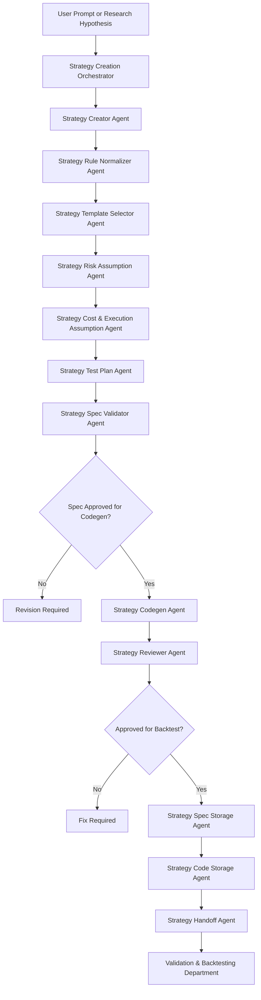

# HaruQuant Agentic AI Trading Firm
# Strategy Creation Department

## Goal

Turn approved research ideas, validated hypotheses, and user prompts into formal, testable, reviewable, code-ready HaruQuant strategy packages.

The Strategy Creation Department is responsible for moving a strategy idea from vague concept to structured specification, implementation plan, generated strategy code, reviewer feedback, and a validated handoff package for backtesting and robustness testing.

The department does **not** execute trades, approve risk, deploy live strategies, bypass validation, or override the Risk Governor.

Every agent in this department must follow the HaruQuant Agent Template execution pattern:

```text
Validate Input
-> Gather Evidence / Context
-> Optional LLM Reasoning
-> Deterministic Policy Decision
-> Structured Output
-> Audit Log
-> Evaluation Test
```

Core rule:

```text
LLM output = proposal
Deterministic policy = final decision
```

The Strategy Creation Department must also follow the HaruQuant Strategy Creation Template rule:

```text
on_bar() creates market truth.
get_signal() converts simple market truth into SignalDict.
on_event() converts market truth + portfolio state into TradeAction objects.
risk controls decide whether those actions are allowed.
execution engine performs approved actions.
```

---

## Dependency

Phase 8: Research Department complete.

The Strategy Creation Department consumes outputs from the Research Department, especially:

- approved research reports
- validated strategy hypotheses
- market intelligence reports
- technical analysis reports
- macro/fundamental context reports
- news/sentiment risk warnings
- cross-asset/correlation warnings
- seasonality reports
- evidence references
- research validation status
- rejected idea memory
- strategy idea lineage

---

## 1. Department Scope

### 1.1 Primary Responsibilities

* [x] Convert natural language strategy requests into structured strategy specifications.
* [x] Convert approved research hypotheses into structured strategy specifications.
* [x] Convert strategy specs into implementation-ready strategy design packages.
* [x] Generate HaruQuant-compatible strategy code.
* [x] Review generated strategy code against HaruQuant strategy standards.
* [x] Validate strategy specs before code generation.
* [x] Validate generated code before backtesting handoff.
* [x] Support both simple and complex stateful strategies.
* [x] Enforce the universal strategy lifecycle.
* [x] Enforce `on_bar()` as the universal feature/signal-preparation layer.
* [x] Enforce `get_signal()` for simple signal parsing.
* [x] Enforce `on_event()` for complex stateful trade management.
* [x] Ensure complex strategies consume `on_bar()` activators wherever possible.
* [x] Define symbol, timeframe, market regime, and strategy family.
* [x] Define entry logic.
* [x] Define exit logic.
* [x] Define position management logic.
* [x] Define risk-control assumptions.
* [x] Define position sizing assumptions.
* [x] Define execution assumptions.
* [x] Define spread, slippage, commission, and swap assumptions.
* [x] Define data requirements.
* [x] Define indicator requirements.
* [x] Define state requirements for complex strategies.
* [x] Define invalidation rules.
* [x] Define test plans.
* [x] Define robustness requirements.
* [x] Save and version strategy specs.
* [x] Save and version generated strategy code artifacts.
* [x] Link every spec and generated strategy to research evidence.
* [x] Produce handoff packages for Validation & Backtesting Department.

### 1.2 Non-Goals

* [x] Do not execute trades.
* [x] Do not approve live trading.
* [x] Do not approve risk.
* [x] Do not override the Risk Governor.
* [x] Do not bypass backtesting.
* [x] Do not bypass robustness testing.
* [x] Do not mark a strategy as production-ready.
* [x] Do not silently invent missing market data.
* [x] Do not silently invent unavailable indicators or services.
* [x] Do not produce vague or untestable strategy rules.
* [x] Do not create future-looking rules.
* [x] Do not allow lookahead bias.
* [x] Do not directly modify live trading configuration.
* [x] Do not directly connect specialist agents to the chat UI.
* [x] Do not generate broker execution code inside strategy files.

---

## 2. Department Architecture

### 2.1 Core Agents

The department must include these three core agents:

* [x] Strategy Creator Agent.
* [x] Strategy Codegen Agent.
* [x] Strategy Reviewer Agent.

These are the core production workflow agents:

```text
Research/User Request
-> Strategy Creator Agent
-> Strategy Spec Validator / Rule Normalizer / Template Selector
-> Strategy Codegen Agent
-> Strategy Reviewer Agent
-> Strategy Storage / Handoff
-> Validation & Backtesting Department
```

### 2.2 Supporting Specialist Agents

The department may include supporting agents/services to keep the core agents focused and deterministic:

* [x] Strategy Creation Orchestrator Agent.
* [x] Strategy Spec Validator Agent.
* [x] Strategy Rule Normalizer Agent.
* [x] Strategy Template Selector Agent.
* [x] Strategy Risk Assumption Agent.
* [x] Strategy Cost & Execution Assumption Agent.
* [x] Strategy Test Plan Agent.
* [x] Strategy Spec Storage Agent.
* [x] Strategy Code Storage Agent.
* [x] Strategy Handoff Agent.

### 2.3 Required Folder Structure

```text
agents/
  strategy_development/
    strategy_creation_orchestrator_agent/
      __init__.py
      agent.py
      contracts.py
      prompts.py
      deterministic_policy.py
      tools.py
      service.py
      evaluator.py
      README.md
      tests/
        test_contracts.py
        test_deterministic_policy.py
        test_service.py
        test_agent_smoke.py

    strategy_creator_agent/
      __init__.py
      agent.py
      contracts.py
      prompts.py
      deterministic_policy.py
      tools.py
      service.py
      evaluator.py
      README.md
      tests/
        test_contracts.py
        test_deterministic_policy.py
        test_service.py
        test_agent_smoke.py

    strategy_codegen_agent/
      __init__.py
      agent.py
      contracts.py
      prompts.py
      deterministic_policy.py
      tools.py
      service.py
      evaluator.py
      README.md
      tests/
        test_contracts.py
        test_deterministic_policy.py
        test_service.py
        test_agent_smoke.py

    strategy_reviewer_agent/
      __init__.py
      agent.py
      contracts.py
      prompts.py
      deterministic_policy.py
      tools.py
      service.py
      evaluator.py
      README.md
      tests/
        test_contracts.py
        test_deterministic_policy.py
        test_service.py
        test_agent_smoke.py

    strategy_spec_validator_agent/
      __init__.py
      agent.py
      contracts.py
      prompts.py
      deterministic_policy.py
      tools.py
      service.py
      evaluator.py
      README.md
      tests/

    strategy_rule_normalizer_agent/
      __init__.py
      agent.py
      contracts.py
      prompts.py
      deterministic_policy.py
      tools.py
      service.py
      evaluator.py
      README.md
      tests/

    strategy_template_selector_agent/
      __init__.py
      agent.py
      contracts.py
      prompts.py
      deterministic_policy.py
      tools.py
      service.py
      evaluator.py
      README.md
      tests/

    strategy_risk_assumption_agent/
      __init__.py
      agent.py
      contracts.py
      prompts.py
      deterministic_policy.py
      tools.py
      service.py
      evaluator.py
      README.md
      tests/

    strategy_cost_execution_agent/
      __init__.py
      agent.py
      contracts.py
      prompts.py
      deterministic_policy.py
      tools.py
      service.py
      evaluator.py
      README.md
      tests/

    strategy_test_plan_agent/
      __init__.py
      agent.py
      contracts.py
      prompts.py
      deterministic_policy.py
      tools.py
      service.py
      evaluator.py
      README.md
      tests/

    strategy_spec_storage_agent/
      __init__.py
      agent.py
      contracts.py
      prompts.py
      deterministic_policy.py
      tools.py
      service.py
      evaluator.py
      README.md
      tests/

    strategy_handoff_agent/
      __init__.py
      agent.py
      contracts.py
      prompts.py
      deterministic_policy.py
      tools.py
      service.py
      evaluator.py
      README.md
      tests/

    shared/
      contracts.py
      scoring.py
      strategy_template_rules.py
      code_quality_rules.py
      handoff.py
      constants.py
```

### 2.4 Generated Strategy Folder Structure

Generated production strategies should use this structure:

```text
haruquant/
  strategies/
    <strategy_name>/
      __init__.py
      strategy.py
      config.py
      README.md
      tests/
        test_params.py
        test_on_bar.py
        test_get_signal.py
        test_no_lookahead.py
        test_on_event.py
        test_state_reset.py
        test_action_metadata.py
        test_risk_limits.py
        test_group_ids.py
```

Minimum generated strategy tests:

```text
test_params.py
test_on_bar.py
test_no_lookahead.py
```

Additional tests for complex strategies:

```text
test_on_event.py
test_state_reset.py
test_action_metadata.py
test_risk_limits.py
test_group_ids.py
```

---

## 3. Shared Strategy Creation Standard

### 3.1 Universal Strategy Lifecycle

* [x] Validate strategy parameters.
* [x] Initialize strategy state.
* [x] Calculate features in `on_bar()`.
* [x] Generate signal columns and activator columns in `on_bar()`.
* [x] Parse simple signals with `get_signal()`.
* [x] Use `on_event()` only for stateful position/order/basket management.
* [x] Return `SignalDict` for simple strategies.
* [x] Return `list[TradeAction]` for stateful strategies.
* [x] Send proposed actions to risk controls.
* [x] Let execution engine execute only approved actions.

### 3.2 Strategy Types Supported

* [x] EMA crossover.
* [x] RSI mean reversion.
* [x] Breakout.
* [x] Pending order strategy.
* [x] Session breakout strategy.
* [x] Volatility expansion strategy.
* [x] Trend-following strategy.
* [x] Pullback strategy.
* [x] Reversal strategy.
* [x] Martingale strategy.
* [x] Pyramiding strategy.
* [x] Trade decomposition strategy.
* [x] Hedge/grid strategy.
* [x] Basket strategy.
* [x] Multi-timeframe structure strategy.
* [x] Hybrid simple/stateful strategy.

### 3.3 Universal Strategy Contract Requirements

* [x] Strategy must inherit from `BaseStrategy`.
* [x] Stateful strategy must also use `StatefulStrategyMixin`.
* [x] Strategy must define `strategy_name`.
* [x] Strategy must define `strategy_type`: `simple`, `stateful`, or `hybrid`.
* [x] Strategy must define `signal_schema_version`.
* [x] Stateful strategy must define `action_schema_version`.
* [x] Strategy must implement `__init__()`.
* [x] Strategy must load parameters explicitly.
* [x] Strategy must validate parameters explicitly.
* [x] Strategy must implement `on_init()`.
* [x] Strategy must implement `on_bar()`.
* [x] Simple strategy must implement or inherit safe `get_signal()`.
* [x] Stateful strategy must implement `on_event()`.
* [x] Strategy must not execute trades directly.
* [x] Strategy must not call broker APIs directly.
* [x] Strategy must not approve risk.
* [x] Strategy must not mutate portfolio state directly.

### 3.4 Required `on_bar()` Signal Columns

Every generated strategy must ensure these columns exist:

* [x] `entry_signal`.
* [x] `exit_signal`.
* [x] `pending_signal`.
* [x] `cancel_pending_signal`.
* [x] `pending_signal_2`.
* [x] `cancel_pending_signal_2`.
* [x] `price`.
* [x] `price_2`.
* [x] `stop_loss`.
* [x] `take_profit`.
* [x] `signal_reason`.
* [x] `setup_id`.
* [x] `group_id`.

### 3.5 Standard Complex Strategy Activator Columns

Complex strategies should use activator columns in `on_bar()`:

* [x] `buy_setup_active`.
* [x] `sell_setup_active`.
* [x] `buy_add_active`.
* [x] `sell_add_active`.
* [x] `buy_exit_active`.
* [x] `sell_exit_active`.
* [x] `buy_pyramid_active`.
* [x] `sell_pyramid_active`.
* [x] `buy_martingale_active`.
* [x] `sell_martingale_active`.
* [x] `buy_decompose_active`.
* [x] `sell_decompose_active`.
* [x] `buy_trail_active`.
* [x] `sell_trail_active`.

### 3.6 Lookahead Bias Rules

* [x] If execution occurs at bar N open, signals must be based on bar N-1 or earlier.
* [x] Shift indicator values before they are used for current-bar execution.
* [x] Do not use current bar close for a signal executed at current bar open.
* [x] Higher-timeframe features must update only after higher-timeframe candle close.
* [x] Multi-timeframe joins must avoid forward filling unavailable future values.
* [x] README must document whether the strategy executes at open, close, or event boundary.
* [x] Tests must verify no lookahead bias.

### 3.7 TradeAction Metadata Rules

Every generated `TradeAction` must include:

* [x] `action_type`.
* [x] `symbol`.
* [x] `side`.
* [x] `volume`.
* [x] `price`.
* [x] `stop_loss`.
* [x] `take_profit`.
* [x] `ticket` where applicable.
* [x] `setup_id`.
* [x] `group_id`.
* [x] `metadata`.
* [x] `reason`.

Metadata must include:

* [x] strategy name.
* [x] strategy ID.
* [x] setup type.
* [x] step number for martingale/grid/pyramiding where applicable.
* [x] source: `on_event` or `get_signal`.
* [x] signal schema version.
* [x] action schema version where applicable.
* [x] parent/child relation for decomposition strategies.

---

## 4. Strategy Creation Orchestrator Agent

### 4.1 Purpose

Coordinate the department workflow from request intake to final handoff package.

### 4.2 Checklist

* [x] Create `agents/strategy_development/strategy_creation_orchestrator_agent`.
* [x] Validate incoming request.
* [x] Determine whether request came from user, CEO Agent, Planner Agent, or Research Department.
* [x] Determine whether request is a new strategy, revision, code generation request, or review request.
* [x] Determine required agents.
* [x] Determine missing inputs.
* [x] Gather research evidence.
* [x] Gather approved hypothesis.
* [x] Gather existing strategy memory.
* [x] Gather rejected strategy memory.
* [x] Run Strategy Creator Agent.
* [x] Run Strategy Spec Validator Agent.
* [x] Run Strategy Rule Normalizer Agent.
* [x] Run Strategy Template Selector Agent.
* [x] Run Strategy Risk Assumption Agent.
* [x] Run Strategy Cost & Execution Assumption Agent.
* [x] Run Strategy Test Plan Agent.
* [x] Run Strategy Codegen Agent when the spec is code-ready.
* [x] Run Strategy Reviewer Agent after code generation.
* [x] Run Strategy Spec Storage Agent.
* [x] Run Strategy Handoff Agent.
* [x] Resolve conflicts between agents.
* [x] Block handoff if required contracts are missing.
* [x] Produce final strategy creation package.
* [x] Save audit metadata.

### 4.3 Deterministic Policy Rules

* [x] If no symbol is supplied and cannot be inferred from approved research, return `NEEDS_MORE_CONTEXT`.
* [x] If no timeframe is supplied and cannot be inferred from approved research, return `NEEDS_MORE_CONTEXT`.
* [x] If strategy rules are untestable, block code generation.
* [x] If research validation status is rejected, block strategy creation unless explicitly creating a rejected-memory review.
* [x] If generated code fails review, block backtesting handoff.
* [x] If risk assumptions are missing, block validation handoff.
* [x] If cost assumptions are missing, block validation handoff.

---

## 5. Strategy Creator Agent

### 5.1 Purpose

Convert natural language requests, approved research ideas, and validated hypotheses into a formal `StrategySpec`.

The Strategy Creator Agent creates the **strategy design**, not the final production code.

### 5.2 Inputs

* [x] User prompt.
* [x] Approved research hypothesis.
* [x] Research report ID.
* [x] Evidence references.
* [x] Symbol.
* [x] Timeframe.
* [x] Strategy family.
* [x] Market regime.
* [x] Technical context.
* [x] Macro/news context.
* [x] User constraints.
* [x] Existing strategy memory.
* [x] Rejected strategy memory.

### 5.3 Checklist

* [x] Create `agents/strategy_development/strategy_creator_agent`.
* [x] Convert natural language request into `StrategySpec`.
* [x] Convert approved research hypothesis into `StrategySpec`.
* [x] Support simple strategies.
* [x] Support stateful strategies.
* [x] Support hybrid strategies.
* [x] Support symbol.
* [x] Support timeframe.
* [x] Support execution timeframe.
* [x] Support signal timeframe.
* [x] Support filter timeframe.
* [x] Support higher timeframe.
* [x] Support lower timeframe.
* [x] Support strategy family.
* [x] Support market regime.
* [x] Support entry logic.
* [x] Support exit logic.
* [x] Support position sizing.
* [x] Support position management.
* [x] Support risk assumptions.
* [x] Support data requirements.
* [x] Support indicator requirements.
* [x] Support cost assumptions.
* [x] Support execution assumptions.
* [x] Support invalidation rules.
* [x] Support test plan.
* [x] Support robustness plan.
* [x] Support state requirements for complex strategies.
* [x] Support `on_bar()` feature preparation requirements.
* [x] Support `get_signal()` requirements for simple strategies.
* [x] Support `on_event()` requirements for stateful strategies.
* [x] Support standard signal columns.
* [x] Support standard activator columns.
* [x] Support `SignalDict` output rules.
* [x] Support `TradeAction` output rules.
* [x] Define lookahead-bias handling.
* [x] Define parameter list with types and defaults.
* [x] Define parameter validation rules.
* [x] Define local strategy risk controls.
* [x] Define generated strategy folder target.
* [x] Define expected generated files.
* [x] Define README requirements.
* [x] Output strategy spec.
* [x] Output implementation brief.
* [x] Save creation evidence to audit.

### 5.4 Strategy Creator LLM Responsibilities

* [x] Interpret user intent.
* [x] Draft initial strategy logic.
* [x] Translate informal strategy descriptions into structured rules.
* [x] Suggest parameter names and defaults.
* [x] Suggest indicator requirements.
* [x] Suggest strategy type: simple, stateful, or hybrid.
* [x] Suggest whether `on_event()` is required.
* [x] Suggest test plan.
* [x] Suggest invalidation rules.

### 5.5 Strategy Creator Deterministic Policy Rules

* [x] Final `StrategySpec` must be schema-valid.
* [x] Strategy must have symbol.
* [x] Strategy must have timeframe.
* [x] Strategy must have strategy type.
* [x] Strategy must have entry logic.
* [x] Strategy must have exit logic.
* [x] Strategy must have data requirements.
* [x] Strategy must have cost assumptions.
* [x] Strategy must have execution assumptions.
* [x] Strategy must have risk assumptions.
* [x] Strategy must have test plan.
* [x] Strategy must define whether it is simple, stateful, or hybrid.
* [x] Stateful or hybrid strategies must define `on_event()` role.
* [x] Complex strategies must define activator columns generated in `on_bar()`.
* [x] Strategy must not contain broker execution calls.
* [x] Strategy must not contain risk-approval logic.
* [x] Strategy must not contain future-looking logic.
* [x] Strategy must not be marked code-ready until validation passes.

### 5.6 Output Artifacts

* [x] `StrategySpec` JSON/YAML.
* [x] Strategy implementation brief.
* [x] Parameter catalog.
* [x] Signal column plan.
* [x] Event activator plan.
* [x] Position management plan.
* [x] Risk-control assumptions.
* [x] Cost/execution assumptions.
* [x] Test plan.
* [x] Handoff readiness status.

---

## 6. Strategy Spec Validator Agent

### 6.1 Purpose

Validate that a `StrategySpec` is complete, testable, non-vague, non-future-looking, and compatible with the HaruQuant strategy template.

### 6.2 Checklist

* [x] Create `agents/strategy_development/strategy_spec_validator_agent`.
* [x] Reject missing symbol.
* [x] Reject missing timeframe.
* [x] Reject missing strategy type.
* [x] Reject missing strategy family.
* [x] Reject untestable strategy.
* [x] Reject vague entry rules.
* [x] Reject vague exit rules.
* [x] Reject vague position management rules.
* [x] Reject missing cost assumptions.
* [x] Reject missing data requirements.
* [x] Reject missing execution assumptions.
* [x] Reject missing risk assumptions.
* [x] Reject impossible live conditions.
* [x] Reject future-looking rules.
* [x] Reject lookahead-prone logic.
* [x] Reject ambiguous indicator definitions.
* [x] Reject missing parameter defaults.
* [x] Reject missing parameter validation rules.
* [x] Reject missing invalidation rules.
* [x] Reject missing test plan.
* [x] Reject missing robustness plan.
* [x] Reject stateful strategies without state definition.
* [x] Reject complex strategies without `on_event()` design.
* [x] Reject complex strategies that calculate core market setup only in `on_event()`.
* [x] Reject strategies that bypass `on_bar()` feature/activator preparation.
* [x] Reject strategies that directly execute trades.
* [x] Reject strategies that approve risk internally.
* [x] Reject strategies that modify live portfolio state.
* [x] Output validation report.
* [x] Output fix recommendations.

### 6.3 Deterministic Policy Rules

* [x] `APPROVED_FOR_CODEGEN` only if all required fields pass.
* [x] `NEEDS_REVISION` if missing fields are fixable.
* [x] `REJECTED` if rules are untestable, future-looking, or unsafe.
* [x] `REJECTED` if strategy cannot be expressed through HaruQuant lifecycle.
* [x] `REJECTED` if strategy requires unavailable data.
* [x] `REJECTED` if strategy requires direct execution from the strategy file.

---

## 7. Strategy Rule Normalizer Agent

### 7.1 Purpose

Normalize vague or natural-language strategy rules into deterministic, testable rule blocks.

### 7.2 Checklist

* [x] Create `agents/strategy_development/strategy_rule_normalizer_agent`.
* [x] Normalize entry rules.
* [x] Normalize exit rules.
* [x] Normalize pending order rules.
* [x] Normalize cancellation rules.
* [x] Normalize stop-loss rules.
* [x] Normalize take-profit rules.
* [x] Normalize trailing-stop rules.
* [x] Normalize breakeven rules.
* [x] Normalize pyramiding rules.
* [x] Normalize martingale rules.
* [x] Normalize grid rules.
* [x] Normalize hedge rules.
* [x] Normalize decomposition rules.
* [x] Normalize multi-timeframe alignment rules.
* [x] Normalize session filters.
* [x] Normalize news filters.
* [x] Normalize spread filters.
* [x] Normalize volatility filters.
* [x] Convert subjective words into numeric thresholds.
* [x] Convert indicator references into exact period/source definitions.
* [x] Convert timeframe references into explicit fields.
* [x] Convert risk words into explicit risk-control fields.
* [x] Output normalized rule set.

### 7.3 Deterministic Policy Rules

* [x] If a rule cannot be made deterministic, mark it as unresolved.
* [x] If unresolved rules affect entry, exit, or risk, block code generation.
* [x] If normalized rules conflict, return `NEEDS_REVISION`.
* [x] If normalized rules introduce lookahead risk, return `REJECTED`.

---

## 8. Strategy Template Selector Agent

### 8.1 Purpose

Select the correct implementation pattern for the strategy: simple, stateful, or hybrid.

### 8.2 Checklist

* [x] Create `agents/strategy_development/strategy_template_selector_agent`.
* [x] Determine whether strategy is simple.
* [x] Determine whether strategy is stateful.
* [x] Determine whether strategy is hybrid.
* [x] Determine whether `get_signal()` is sufficient.
* [x] Determine whether `on_event()` is required.
* [x] Select simple `BaseStrategy` template.
* [x] Select stateful `StatefulStrategyMixin + BaseStrategy` template.
* [x] Select hybrid template when both `get_signal()` and `on_event()` are needed.
* [x] Select martingale template.
* [x] Select pyramiding template.
* [x] Select trade decomposition template.
* [x] Select hedge/grid template.
* [x] Select multi-timeframe template.
* [x] Select pending order template.
* [x] Select breakout template.
* [x] Define required files for generated strategy.
* [x] Define required tests for generated strategy.
* [x] Output template selection report.

### 8.3 Deterministic Policy Rules

* [x] If strategy has basket, layers, martingale, grid, pyramiding, decomposition, or position lifecycle state, require `on_event()`.
* [x] If strategy only emits bar-level entry/exit signals, use simple `get_signal()` path.
* [x] If strategy has simple entries but stateful exits or scaling, classify as hybrid.
* [x] If multi-timeframe logic is used, require explicit timeframe alignment rules.
* [x] If strategy type cannot be classified, return `NEEDS_MORE_CONTEXT`.

---

## 9. Strategy Risk Assumption Agent

### 9.1 Purpose

Define strategy-level risk assumptions and local risk-control compatibility, without approving risk.

### 9.2 Checklist

* [x] Create `agents/strategy_development/strategy_risk_assumption_agent`.
* [x] Define initial position size assumptions.
* [x] Define fixed-lot assumptions.
* [x] Define percent-risk assumptions where applicable.
* [x] Define max open positions per strategy.
* [x] Define max layers per setup.
* [x] Define max martingale step.
* [x] Define max total lots.
* [x] Define max symbol exposure.
* [x] Define max strategy drawdown assumption.
* [x] Define whether multiple action batches per event are allowed.
* [x] Define local sanity checks.
* [x] Define global Risk Governor handoff requirements.
* [x] Define risk fields needed for backtesting.
* [x] Define risk fields needed for live simulation.
* [x] Flag risk-dangerous designs.
* [x] Flag uncapped martingale/grid designs.
* [x] Flag strategies with unlimited scaling.
* [x] Flag strategies without exit logic.
* [x] Output risk assumption report.

### 9.3 Deterministic Policy Rules

* [x] Reject uncapped martingale.
* [x] Reject uncapped grid.
* [x] Reject unlimited pyramiding.
* [x] Reject unlimited position decomposition.
* [x] Reject strategies without max position or max exposure constraints.
* [x] Reject strategies where local risk assumptions conflict with global Risk Governor constraints.
* [x] Mark all risk decisions as assumptions only, not approval.

---

## 10. Strategy Cost & Execution Assumption Agent

### 10.1 Purpose

Define realistic cost and execution assumptions for the strategy spec and test plan.

### 10.2 Checklist

* [x] Create `agents/strategy_development/strategy_cost_execution_agent`.
* [x] Define spread assumptions.
* [x] Define slippage assumptions.
* [x] Define commission assumptions.
* [x] Define swap assumptions.
* [x] Define minimum stop distance assumptions.
* [x] Define pip/tick size assumptions.
* [x] Define lot step assumptions.
* [x] Define minimum lot assumptions.
* [x] Define maximum lot assumptions.
* [x] Define order type assumptions.
* [x] Define market order assumptions.
* [x] Define pending order assumptions.
* [x] Define stop-loss assumptions.
* [x] Define take-profit assumptions.
* [x] Define partial close assumptions.
* [x] Define modify-order assumptions.
* [x] Define session restrictions.
* [x] Define rollover restrictions.
* [x] Define news blackout restrictions.
* [x] Flag unrealistic execution requirements.
* [x] Flag strategies too sensitive to spread.
* [x] Flag strategies too sensitive to slippage.
* [x] Output cost/execution assumption report.

### 10.3 Deterministic Policy Rules

* [x] Block code-ready status if cost assumptions are missing.
* [x] Block code-ready status if execution assumptions are impossible in MT5/cTrader.
* [x] Block code-ready status if order types are unsupported.
* [x] Block code-ready status if partial close/modify logic is required but unsupported by the target engine.

---

## 11. Strategy Test Plan Agent

### 11.1 Purpose

Create the required backtest, unit test, and robustness test plan for each strategy.

### 11.2 Checklist

* [x] Create `agents/strategy_development/strategy_test_plan_agent`.
* [x] Define unit tests for parameters.
* [x] Define unit tests for `on_bar()`.
* [x] Define unit tests for `get_signal()` where applicable.
* [x] Define unit tests for `on_event()` where applicable.
* [x] Define no-lookahead tests.
* [x] Define state reset tests.
* [x] Define action metadata tests.
* [x] Define risk-limit tests.
* [x] Define group ID tests.
* [x] Define simple smoke backtest.
* [x] Define full historical backtest.
* [x] Define IS/OOS split.
* [x] Define walk-forward or walk-forward matrix requirements where appropriate.
* [x] Define spread stress test.
* [x] Define slippage stress test.
* [x] Define Monte Carlo tests.
* [x] Define parameter sensitivity tests.
* [x] Define cross-market test where relevant.
* [x] Define cross-timeframe test where relevant.
* [x] Define minimum acceptance criteria.
* [x] Define rejection criteria.
* [x] Output test plan artifact.

### 11.3 Deterministic Policy Rules

* [x] Every strategy must have `test_params.py`, `test_on_bar.py`, and `test_no_lookahead.py`.
* [x] Stateful strategies must have `test_on_event.py`, `test_state_reset.py`, `test_action_metadata.py`, and `test_risk_limits.py`.
* [x] Multi-position strategies must have `test_group_ids.py`.
* [x] Strategies without a test plan are not code-ready.
* [x] Generated code without tests is not review-approved.

---

## 12. Strategy Codegen Agent

### 12.1 Purpose

Generate HaruQuant-compatible strategy implementation files from an approved `StrategySpec`.

The Strategy Codegen Agent writes strategy code artifacts, but it does **not** approve them for backtesting. The Strategy Reviewer Agent must review them first.

### 12.2 Inputs

* [x] Approved `StrategySpec`.
* [x] Template selection report.
* [x] Normalized rule set.
* [x] Risk assumption report.
* [x] Cost/execution assumption report.
* [x] Test plan artifact.
* [x] Existing BaseStrategy conventions.
* [x] Existing StatefulStrategyMixin conventions.
* [x] Target folder path.
* [x] Code generation constraints.

### 12.3 Checklist

* [x] Create `agents/strategy_development/strategy_codegen_agent`.
* [x] Generate strategy folder.
* [x] Generate `__init__.py`.
* [x] Generate `strategy.py`.
* [x] Generate `config.py`.
* [x] Generate `README.md`.
* [x] Generate `tests/test_params.py`.
* [x] Generate `tests/test_on_bar.py`.
* [x] Generate `tests/test_no_lookahead.py`.
* [x] Generate `tests/test_get_signal.py` for simple strategies.
* [x] Generate `tests/test_on_event.py` for stateful/hybrid strategies.
* [x] Generate `tests/test_state_reset.py` for stateful/hybrid strategies.
* [x] Generate `tests/test_action_metadata.py` for stateful/hybrid strategies.
* [x] Generate `tests/test_risk_limits.py` for stateful/hybrid strategies.
* [x] Generate `tests/test_group_ids.py` for multi-position strategies.
* [x] Implement `BaseStrategy` inheritance.
* [x] Implement `StatefulStrategyMixin` inheritance when required.
* [x] Implement `strategy_name`.
* [x] Implement `strategy_type`.
* [x] Implement `signal_schema_version`.
* [x] Implement `action_schema_version` when required.
* [x] Implement parameter loading.
* [x] Implement parameter validation.
* [x] Implement `on_init()`.
* [x] Implement `on_bar()`.
* [x] Implement `_calculate_indicators()`.
* [x] Implement `_shift_features()`.
* [x] Implement `_ensure_signal_columns()`.
* [x] Implement `_generate_simple_signals()` where applicable.
* [x] Implement `_generate_event_activators()` where applicable.
* [x] Implement `get_signal()` or safely inherit base parser.
* [x] Implement `on_event()` for stateful/hybrid strategies.
* [x] Implement `_should_process_event()`.
* [x] Implement `_process_side()` where applicable.
* [x] Implement `_initial_entry_actions()` where applicable.
* [x] Implement `_exit_actions()` where applicable.
* [x] Implement `_add_position_actions()` where applicable.
* [x] Implement `_modify_position_actions()` where applicable.
* [x] Implement `_post_process_actions()` where applicable.
* [x] Implement `_make_group_id()` where applicable.
* [x] Ensure standard signal columns are always created.
* [x] Ensure standard activator columns are created for complex strategies.
* [x] Ensure indicator shifting prevents lookahead bias.
* [x] Ensure every `TradeAction` includes reason and metadata.
* [x] Ensure no broker/execution API calls exist in strategy code.
* [x] Ensure no risk approval code exists in strategy code.
* [x] Ensure code is formatted.
* [x] Ensure generated files are review-ready.
* [x] Output generated code package.

### 12.4 Strategy Codegen LLM Responsibilities

* [x] Draft implementation code.
* [x] Draft config defaults.
* [x] Draft README.
* [x] Draft tests.
* [x] Translate structured rules into code.
* [x] Explain implementation decisions.

### 12.5 Strategy Codegen Deterministic Policy Rules

* [x] Generate code only from an approved `StrategySpec`.
* [x] Generate code only after template selection is complete.
* [x] Generate code only after risk assumptions exist.
* [x] Generate code only after cost/execution assumptions exist.
* [x] Generate code only after test plan exists.
* [x] Block code generation if strategy is untestable.
* [x] Block code generation if strategy type is unresolved.
* [x] Block code generation if target engine compatibility is unresolved.
* [x] Block code generation if required BaseStrategy interfaces are unknown.
* [x] Generated code status must be `generated_pending_review`.
* [x] Generated code must not be marked approved by Codegen Agent.

### 12.6 Output Artifacts

* [x] Strategy code package.
* [x] Generated file manifest.
* [x] Codegen assumptions.
* [x] Codegen warnings.
* [x] Generated tests.
* [x] README.
* [x] Review handoff package.

---

## 13. Strategy Reviewer Agent

### 13.1 Purpose

Review generated strategy specs and code against HaruQuant strategy standards before backtesting handoff.

The Strategy Reviewer Agent does not approve live deployment. It only approves whether the strategy package is ready for validation/backtesting.

### 13.2 Inputs

* [x] `StrategySpec`.
* [x] Generated code package.
* [x] Generated tests.
* [x] README.
* [x] Template selection report.
* [x] Rule normalization report.
* [x] Risk assumption report.
* [x] Cost/execution assumption report.
* [x] Test plan artifact.
* [x] Research evidence references.

### 13.3 Checklist

* [x] Create `agents/strategy_development/strategy_reviewer_agent`.
* [x] Review strategy spec completeness.
* [x] Review strategy code structure.
* [x] Review generated file manifest.
* [x] Review `BaseStrategy` inheritance.
* [x] Review `StatefulStrategyMixin` inheritance when required.
* [x] Review `strategy_name`.
* [x] Review `strategy_type`.
* [x] Review schema versions.
* [x] Review parameter loading.
* [x] Review parameter casting.
* [x] Review parameter validation.
* [x] Review `on_init()`.
* [x] Review `on_bar()`.
* [x] Review `_calculate_indicators()`.
* [x] Review `_shift_features()`.
* [x] Review `_ensure_signal_columns()`.
* [x] Review `_generate_simple_signals()`.
* [x] Review `_generate_event_activators()`.
* [x] Review `get_signal()`.
* [x] Review `on_event()` when applicable.
* [x] Review state initialization.
* [x] Review side-specific state.
* [x] Review state reset logic.
* [x] Review `TradeAction` creation.
* [x] Review `TradeAction` metadata.
* [x] Review setup ID logic.
* [x] Review group ID logic.
* [x] Review parent/child metadata for decomposition.
* [x] Review martingale step caps.
* [x] Review pyramiding caps.
* [x] Review grid/hedge caps.
* [x] Review no-lookahead handling.
* [x] Review multi-timeframe alignment.
* [x] Review spread/slippage assumptions in README/config.
* [x] Review cost assumptions in README/config.
* [x] Review risk-control compatibility.
* [x] Review forbidden broker/execution calls.
* [x] Review forbidden risk approval logic.
* [x] Review forbidden live portfolio mutation.
* [x] Review tests.
* [x] Review README.
* [x] Output review report.
* [x] Output required fixes.
* [x] Output approval status for backtesting handoff.

### 13.4 Strategy Reviewer LLM Responsibilities

* [x] Explain code issues.
* [x] Summarize reviewer findings.
* [x] Suggest fixes.
* [x] Identify implementation inconsistencies.
* [x] Identify strategy-template violations.
* [x] Identify ambiguous code behavior.

### 13.5 Strategy Reviewer Deterministic Policy Rules

* [x] Reject if standard strategy files are missing.
* [x] Reject if required tests are missing.
* [x] Reject if `on_bar()` does not guarantee standard signal columns.
* [x] Reject if current-bar execution uses unshifted current-bar information.
* [x] Reject if stateful strategy lacks `on_event()`.
* [x] Reject if complex strategy fails to use `on_bar()` activators.
* [x] Reject if `TradeAction` metadata is missing.
* [x] Reject if group IDs are missing for multi-position logic.
* [x] Reject if state reset is missing for basket/group strategies.
* [x] Reject if broker APIs are called directly.
* [x] Reject if strategy approves risk internally.
* [x] Reject if code mutates portfolio state directly.
* [x] Reject if parameter validation is missing.
* [x] Reject if tests cannot serialize or run.
* [x] Approve for backtesting only when structure, contracts, safety, and tests pass.

### 13.6 Output Artifacts

* [x] Code review report.
* [x] Strategy-template compliance report.
* [x] Safety review report.
* [x] No-lookahead review report.
* [x] Test completeness report.
* [x] Fix list.
* [x] Backtesting handoff readiness status.

---

## 14. Strategy Spec Storage Agent

### 14.1 Purpose

Persist strategy specs, versions, lineage, and lifecycle state.

### 14.2 Checklist

* [x] Create `agents/strategy_development/strategy_spec_storage_agent`.
* [x] Save spec to database.
* [x] Save spec to `memory/strategies/`.
* [x] Save spec as JSON.
* [x] Save spec as YAML where useful.
* [x] Version each spec.
* [x] Link spec to research evidence.
* [x] Link spec to research report ID.
* [x] Link spec to hypothesis ID.
* [x] Link spec to user request ID.
* [x] Link spec to generated code package.
* [x] Link spec to review report.
* [x] Assign lifecycle state `spec`.
* [x] Assign lifecycle state `approved_for_codegen`.
* [x] Assign lifecycle state `generated_pending_review`.
* [x] Assign lifecycle state `review_failed`.
* [x] Assign lifecycle state `approved_for_backtest`.
* [x] Maintain version history.
* [x] Maintain audit history.
* [x] Output storage receipt.

### 14.3 Deterministic Policy Rules

* [x] Do not overwrite prior spec versions without version increment.
* [x] Do not store a spec without schema validation.
* [x] Do not mark `approved_for_codegen` unless validation passed.
* [x] Do not mark `approved_for_backtest` unless reviewer passed.
* [x] Do not remove rejected or failed versions from memory.

---

## 15. Strategy Code Storage Agent

### 15.1 Purpose

Persist generated strategy code artifacts and link them to specs and review results.

### 15.2 Checklist

* [x] Create `agents/strategy_development/strategy_code_storage_agent`.
* [x] Save generated strategy package.
* [x] Save generated file manifest.
* [x] Save generated tests.
* [x] Save generated README.
* [x] Save codegen assumptions.
* [x] Save codegen warnings.
* [x] Link code package to spec ID.
* [x] Link code package to strategy version.
* [x] Link code package to review report.
* [x] Track code lifecycle state.
* [x] Track generated files checksum.
* [x] Track generator prompt version.
* [x] Track policy version.
* [x] Output code storage receipt.

### 15.3 Deterministic Policy Rules

* [x] Do not store code without a valid spec ID.
* [x] Do not overwrite generated strategy code without a new version.
* [x] Do not mark code approved unless reviewer passes.
* [x] Do not persist generated code if it contains blocked imports or direct execution calls.

---

## 16. Strategy Handoff Agent

### 16.1 Purpose

Package approved strategy specs and reviewed code for Validation & Backtesting Department.

### 16.2 Checklist

* [x] Create `agents/strategy_development/strategy_handoff_agent`.
* [x] Create handoff payload for Backtest Agent.
* [x] Include strategy spec ID.
* [x] Include code package ID.
* [x] Include strategy version.
* [x] Include generated file manifest.
* [x] Include target symbol.
* [x] Include target timeframe.
* [x] Include data requirements.
* [x] Include cost assumptions.
* [x] Include execution assumptions.
* [x] Include risk assumptions.
* [x] Include test plan.
* [x] Include robustness requirements.
* [x] Include research evidence references.
* [x] Include reviewer status.
* [x] Include known limitations.
* [x] Include expected failure modes.
* [x] Include lifecycle state.
* [x] Output handoff package.

### 16.3 Deterministic Policy Rules

* [x] Handoff only if spec status is `approved_for_backtest`.
* [x] Handoff only if generated code package exists.
* [x] Handoff only if Strategy Reviewer approved.
* [x] Handoff only if required tests exist.
* [x] Handoff only if cost and risk assumptions exist.
* [x] Handoff only if evidence lineage exists.

---

## 17. Shared Contracts

### 17.1 StrategySpec

The Strategy Creation Department should standardize a `StrategySpec` contract.

Required fields:

* [x] `spec_id`.
* [x] `strategy_name`.
* [x] `strategy_family`.
* [x] `strategy_type`.
* [x] `lifecycle_state`.
* [x] `symbol`.
* [x] `asset_class`.
* [x] `timeframe`.
* [x] `execution_timeframe`.
* [x] `signal_timeframe`.
* [x] `filter_timeframe`.
* [x] `higher_timeframe`.
* [x] `lower_timeframe`.
* [x] `market_regime`.
* [x] `research_question`.
* [x] `hypothesis_id`.
* [x] `research_report_ids`.
* [x] `evidence_refs`.
* [x] `entry_rules`.
* [x] `exit_rules`.
* [x] `pending_order_rules`.
* [x] `cancel_order_rules`.
* [x] `position_sizing_rules`.
* [x] `position_management_rules`.
* [x] `risk_controls`.
* [x] `cost_assumptions`.
* [x] `execution_assumptions`.
* [x] `data_requirements`.
* [x] `indicator_requirements`.
* [x] `state_requirements`.
* [x] `signal_columns`.
* [x] `activator_columns`.
* [x] `trade_action_types`.
* [x] `parameter_schema`.
* [x] `parameter_defaults`.
* [x] `parameter_validation_rules`.
* [x] `lookahead_handling`.
* [x] `invalidation_rules`.
* [x] `test_plan`.
* [x] `robustness_plan`.
* [x] `expected_failure_modes`.
* [x] `generated_files_expected`.
* [x] `created_at`.
* [x] `created_by_agent`.
* [x] `version`.

### 17.2 StrategyImplementationBrief

Required fields:

* [x] `brief_id`.
* [x] `spec_id`.
* [x] `template_type`.
* [x] `base_classes`.
* [x] `required_imports`.
* [x] `strategy_file_path`.
* [x] `config_file_path`.
* [x] `readme_file_path`.
* [x] `test_file_paths`.
* [x] `methods_to_implement`.
* [x] `signal_columns_to_generate`.
* [x] `activator_columns_to_generate`.
* [x] `state_fields`.
* [x] `trade_action_metadata_fields`.
* [x] `risk_control_fields`.
* [x] `lookahead_rules`.

### 17.3 StrategyCodePackage

Required fields:

* [x] `code_package_id`.
* [x] `spec_id`.
* [x] `strategy_version`.
* [x] `files`.
* [x] `file_manifest`.
* [x] `generated_tests`.
* [x] `readme`.
* [x] `codegen_warnings`.
* [x] `blocked_imports_detected`.
* [x] `direct_execution_calls_detected`.
* [x] `risk_approval_calls_detected`.
* [x] `status`.

### 17.4 StrategyReviewReport

Required fields:

* [x] `review_id`.
* [x] `spec_id`.
* [x] `code_package_id`.
* [x] `review_status`.
* [x] `blocking_issues`.
* [x] `non_blocking_issues`.
* [x] `template_compliance_score`.
* [x] `contract_compliance_score`.
* [x] `lookahead_safety_score`.
* [x] `risk_compatibility_score`.
* [x] `test_completeness_score`.
* [x] `readiness_for_backtest`.
* [x] `required_fixes`.
* [x] `audit_refs`.

---

## 18. Department Permissions

### 18.1 Allowed Actions

* [x] Read research reports.
* [x] Read approved hypotheses.
* [x] Read strategy memory.
* [x] Read rejected strategy memory.
* [x] Read current strategy template standards.
* [x] Generate strategy specs.
* [x] Generate strategy code artifacts.
* [x] Generate tests.
* [x] Generate README files.
* [x] Save specs to strategy memory.
* [x] Save generated code artifacts.
* [x] Review generated strategy code.
* [x] Create validation/backtesting handoff packages.

### 18.2 Forbidden Actions

* [x] Execute trades.
* [x] Send orders to MT5/cTrader.
* [x] Approve risk.
* [x] Override Risk Governor.
* [x] Modify live portfolio.
* [x] Modify broker configuration.
* [x] Deploy strategy to production.
* [x] Mark strategy as live-approved.
* [x] Bypass Validation & Backtesting Department.
* [x] Bypass Risk & Portfolio Department.

### 18.3 Permission Profiles

* [x] `strategy_creation_read_only_v1`.
* [x] `strategy_spec_write_v1`.
* [x] `strategy_codegen_write_v1`.
* [x] `strategy_review_read_only_v1`.
* [x] `strategy_handoff_write_v1`.

---

## 19. Department Audit Requirements

Every agent response must include:

* [x] `request_id`.
* [x] `agent_name`.
* [x] `department`.
* [x] `prompt_version`.
* [x] `policy_version`.
* [x] `llm_used`.
* [x] `tools_called`.
* [x] `permission_profile`.
* [x] `context_revision`.
* [x] `evidence_refs`.
* [x] `research_report_ids`.
* [x] `spec_id` where applicable.
* [x] `code_package_id` where applicable.
* [x] `review_id` where applicable.
* [x] `model_provider`.
* [x] `model_name`.
* [x] `fallback_used`.
* [x] `lifecycle_state_before`.
* [x] `lifecycle_state_after`.
* [x] `decision`.
* [x] `risk_level`.
* [x] `allowed_actions`.
* [x] `blocked_actions`.
* [x] `reasons`.

---

## 20. Department Evaluation Requirements

### 20.1 Agent-Level Tests

Every department agent must include:

* [x] `test_contracts.py`.
* [x] `test_deterministic_policy.py`.
* [x] `test_service.py`.
* [x] `test_agent_smoke.py`.

### 20.2 Strategy Creator Tests

* [x] Valid prompt becomes valid `StrategySpec`.
* [x] Approved research hypothesis becomes valid `StrategySpec`.
* [x] Missing symbol returns `NEEDS_MORE_CONTEXT`.
* [x] Missing timeframe returns `NEEDS_MORE_CONTEXT`.
* [x] Untestable strategy is rejected.
* [x] Future-looking strategy is rejected.
* [x] Complex strategy includes `on_event()` requirement.
* [x] Simple strategy includes `get_signal()` path.

### 20.3 Strategy Codegen Tests

* [x] Codegen rejects unapproved spec.
* [x] Codegen generates required files.
* [x] Codegen generates required tests.
* [x] Codegen generates standard signal columns.
* [x] Codegen shifts indicators to avoid lookahead.
* [x] Codegen does not generate broker calls.
* [x] Codegen does not generate risk approval calls.
* [x] Codegen marks output `generated_pending_review`.

### 20.4 Strategy Reviewer Tests

* [x] Reviewer rejects missing files.
* [x] Reviewer rejects missing tests.
* [x] Reviewer rejects missing signal columns.
* [x] Reviewer rejects lookahead-prone code.
* [x] Reviewer rejects direct broker calls.
* [x] Reviewer rejects internal risk approval.
* [x] Reviewer rejects missing action metadata.
* [x] Reviewer approves compliant strategy package for backtesting.

---

## 21. Department Workflow



---

## 22. Recommended Build Order

* [x] Create shared contracts for Strategy Creation Department.
* [x] Create `StrategySpec` schema.
* [x] Create `StrategyImplementationBrief` schema.
* [x] Create `StrategyCodePackage` schema.
* [x] Create `StrategyReviewReport` schema.
* [x] Create Strategy Creator Agent.
* [x] Create Strategy Spec Validator Agent.
* [x] Create Strategy Rule Normalizer Agent.
* [x] Create Strategy Template Selector Agent.
* [x] Create Strategy Risk Assumption Agent.
* [x] Create Strategy Cost & Execution Assumption Agent.
* [x] Create Strategy Test Plan Agent.
* [x] Create Strategy Codegen Agent.
* [x] Create Strategy Reviewer Agent.
* [x] Create Strategy Spec Storage Agent.
* [x] Create Strategy Code Storage Agent.
* [x] Create Strategy Handoff Agent.
* [x] Create Strategy Creation Orchestrator Agent.
* [x] Register Strategy Creation Orchestrator with Planner.
* [x] Surface final summaries only through CEO Agent and CEOChatGateway.

---

## 23. Department Definition of Done

The Strategy Creation Department is complete when:

* [x] A request like `create a EURUSD H1 mean-reversion strategy` becomes a structured strategy spec.
* [x] The strategy spec passes deterministic validation.
* [x] The strategy spec uses HaruQuant strategy-template conventions.
* [x] The strategy spec defines `on_bar()` responsibilities.
* [x] The strategy spec defines `get_signal()` responsibilities where applicable.
* [x] The strategy spec defines `on_event()` responsibilities where applicable.
* [x] The strategy spec defines standard signal columns.
* [x] The strategy spec defines activator columns for complex strategies.
* [x] The strategy spec defines parameters and validation rules.
* [x] The strategy spec defines cost assumptions.
* [x] The strategy spec defines execution assumptions.
* [x] The strategy spec defines risk assumptions.
* [x] The strategy spec defines test plan and robustness plan.
* [x] The Strategy Codegen Agent can generate a compliant strategy package.
* [x] The generated strategy package includes strategy code, config, README, and tests.
* [x] The Strategy Reviewer Agent can approve or reject the generated package deterministically.
* [x] The department can save specs and generated code with version history.
* [x] The department can create a handoff package for Validation & Backtesting Department.
* [x] Every agent returns the standard `AgentResponse` envelope.
* [x] Every agent has deterministic policy rules.
* [x] Every agent has audit metadata.
* [x] Every agent has evaluator checks.
* [x] Every agent has required tests.
* [x] No department agent can execute trades.
* [x] No department agent can approve risk.
* [x] No department agent can bypass CEO/Planner orchestration.

---

## 24. Final Rule

The Strategy Creation Department must make strategy creation deterministic, testable, reviewable, and safe:

```text
Research creates hypotheses.
Strategy Creator creates the spec.
Strategy Codegen creates implementation artifacts.
Strategy Reviewer blocks unsafe or non-compliant code.
Backtesting proves or rejects the strategy historically.
Risk Governor approves or rejects risk later.
Execution Bridge executes only approved actions later.
```

The department succeeds when strategy ideas stop being vague prompts and become auditable, versioned, code-ready trading systems that follow HaruQuant's strategy lifecycle.
