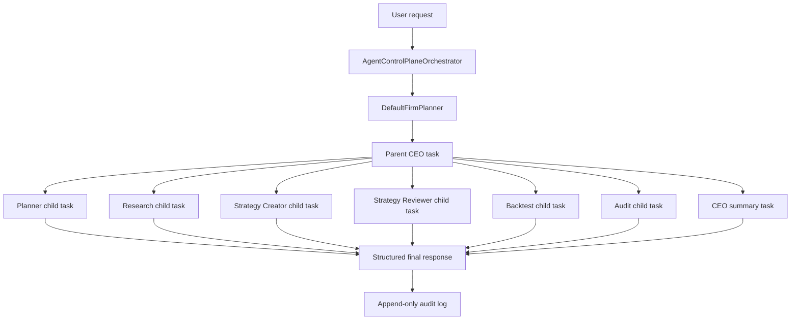

# Phase 6 Usage Example: Agent Control Plane

This example shows what Phase 6 added: a user request enters the firm through a single control plane, gets planned, becomes a parent CEO task, is delegated into child agent tasks, and is returned with a traceable final response.

## Example Request

```text
Create and backtest a EURUSD H1 mean reversion strategy.
```

## Minimal In-Memory Example

Use this when you want to see the control-plane object flow without writing to the database.

```python
from backend_retiring.agents.orchestrator import AgentControlPlaneOrchestrator

orchestrator = AgentControlPlaneOrchestrator()

result = orchestrator.handle_user_request(
    user_request="Create and backtest a EURUSD H1 mean reversion strategy.",
)

print(result.workflow_id)
print(result.parent_task_id)
print(result.planner_result.allowed_agents)
print(result.child_task_ids)
print(result.final_response["summary"])
```

Expected shape:

```text
workflow_id: wf-...
parent_task_id: task-...
allowed_agents:
  research
  strategy_creator
  strategy_reviewer
  backtest
  audit
  ceo
child_task_ids:
  planner task
  research task
  strategy creator task
  strategy reviewer task
  backtest task
  audit task
  ceo task
summary:
  CEO Agent completed delegated firm workflow.
```

## Persisted Example With Audit

Use this when the Phase 4 database migrations have been applied and you want the full persisted workflow/task/audit trace.

```python
from backend_retiring.agents.orchestrator import AgentControlPlaneOrchestrator
from backend_retiring.agents.task_manager import AgentTaskManager
from data.database import apply_pending_migrations, default_migrations_dir
from data.database.repositories.agentic_firm_repository import AgenticFirmRepository

database_path = "agentic_firm_example.db"
apply_pending_migrations(database_path, default_migrations_dir())

repository = AgenticFirmRepository(database_path)
task_manager = AgentTaskManager(repository=repository)
orchestrator = AgentControlPlaneOrchestrator(task_manager=task_manager)

result = orchestrator.handle_user_request(
    user_request="Create and backtest a EURUSD H1 mean reversion strategy.",
    workflow_id="wf-example-001",
    request_id="req-example-001",
)

task_tree = task_manager.get_task_tree(result.parent_task_id)
audit_record = repository.get_audit_log(result.audit_id)

print(task_tree.task.status)
print([child.task.owner_agent for child in task_tree.children])
print(audit_record.action_type)
```

Expected outcome:

```text
parent task status: completed
child owners:
  planner
  research
  strategy_creator
  strategy_reviewer
  backtest
  audit
  ceo
audit action:
  agent_control_plane_run
```

## What Happens Internally



## Why This Matters

Before Phase 6, agents were mostly individual specialists. After Phase 6, HaruQuant has a top-down control plane:

- `AgentRegistry` defines which departments exist and what tools each can use.
- `AgentTaskManager` turns work into a task tree with strict status transitions.
- `AgentControlPlaneOrchestrator` plans, delegates, collects outputs, finishes the parent task, and writes audit.
- `BaseAgent` gives every department the same lifecycle: `plan -> act -> observe -> evaluate -> finalize`.

This is the first operating shell of the Agentic Trading Firm. Phase 7 can now plug stronger CEO and Planner behavior into the same control plane instead of creating a separate system.
