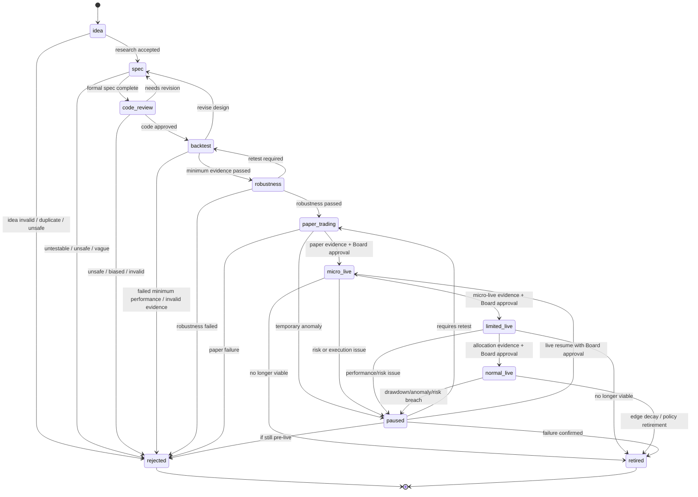

# HaruQuant Agentic Firm — Strategy Lifecycle Policy

**File:** `docs/agentic_firm/strategy_lifecycle.md`  
**Document Owner:** HaruQuant Human Board / Haruperi  
**Applies To:** Research agents, strategy agents, code-generation agents, backtest agents, robustness agents, risk agents, portfolio agents, execution agents, and reporting agents  
**Status:** Governance Policy  
**Version:** 1.0.0  
**Last Updated:** 2026-05-03  

---

## 1. Purpose

This document defines the official lifecycle policy for every trading strategy inside the HaruQuant Agentic Firm.

The purpose is to prevent any strategy from moving from an idea to live capital without passing through controlled, auditable, evidence-based stages.

This policy exists because HaruQuant is designed as a multi-agent trading firm where agents can research, design, test, review, monitor, and recommend strategies, but cannot bypass governance, risk controls, or human approval. The lifecycle follows the same broad governance logic recommended by AI risk-management frameworks: govern the system, map risks, measure performance and risk, then manage deployment and monitoring continuously.

---

## 2. Core Law

No strategy may trade live capital unless it has passed through the required lifecycle states, produced the required evidence, passed RiskGovernor checks, and received the required human Board approval.

The standard lifecycle is:

```text
idea
→ spec
→ code_review
→ backtest
→ robustness
→ paper_trading
→ micro_live
→ limited_live
→ normal_live
```

A strategy may also enter one of these non-forward states:

```text
paused
retired
rejected
```

---

## 3. Lifecycle Principles

### 3.1 Evidence Before Promotion

Every promotion must be backed by stored evidence.

Agents may recommend promotion, but promotion is invalid unless the required evidence exists.

### 3.2 Paper Before Live

Every strategy must enter paper trading before any live deployment.

No strategy may move directly from backtest or robustness into live trading.

### 3.3 Small Live Before Normal Live

A strategy must pass through `micro_live` and `limited_live` before reaching `normal_live`.

### 3.4 Human Approval Before Live Capital

Human Board approval is mandatory before:

1. Entering `micro_live`.
2. Entering `limited_live`.
3. Entering `normal_live`.
4. Increasing live capital allocation.
5. Re-enabling a paused live strategy.
6. Restoring live mode after a critical incident.
7. Changing lifecycle policy thresholds.

### 3.5 RiskGovernor Before Execution

Even if a strategy is approved for live trading, every trade proposal must still pass RiskGovernor.

Lifecycle approval does not equal order approval.

### 3.6 Immutable Evidence

Backtest results, robustness results, risk reviews, paper-trading results, live-trading logs, and promotion decisions must be stored as immutable evidence.

Agents may add new evidence, but must not overwrite old evidence.

### 3.7 Strategy Versioning

Every strategy version has its own lifecycle.

A code change, parameter change, timeframe change, symbol change, position-sizing change, or risk-rule change creates a new strategy version or requires a version review.

---

## 4. Lifecycle State Machine



---

## 5. Official Lifecycle States

| State | Meaning | Capital Allowed | Agent Authority | Human Approval Required |
|---|---|---:|---|---:|
| `idea` | Raw strategy concept or research hypothesis | No | Research and analysis only | No |
| `spec` | Formal strategy specification exists | No | Strategy Creator and Reviewer may work | No |
| `code_review` | Strategy code exists and is under review | No | Codegen and Reviewer may work | No |
| `backtest` | Historical testing is underway or completed | No | Backtest Agent may run tests | No |
| `robustness` | Stress, OOS, Monte Carlo, and sensitivity tests are underway | No | Robustness Agent may run tests | No |
| `paper_trading` | Strategy trades in simulated/paper mode | No live capital | Paper Execution Agent only | No for entry; Yes if policy exception |
| `micro_live` | Smallest approved live deployment | Minimal live capital | Live Execution Agent under RiskGovernor | Yes |
| `limited_live` | Restricted live allocation | Limited live capital | Live Execution Agent under RiskGovernor | Yes |
| `normal_live` | Fully approved live allocation within policy limits | Approved live capital | Live Execution Agent under RiskGovernor | Yes |
| `paused` | Temporarily disabled | No new entries unless explicitly allowed | Monitoring only | Yes for live resume |
| `retired` | Permanently removed from active use | No | Read-only historical access | Yes if live strategy |
| `rejected` | Failed or invalid before deployment | No | Read-only historical access | No |

---

## 6. State: `idea`

### 6.1 Definition

An `idea` is a raw trading hypothesis, pattern, strategy concept, external inspiration, research note, or agent-generated proposal that has not yet been converted into a formal strategy specification.

### 6.2 Allowed Activities

Agents may:

1. Research the idea.
2. Compare it against existing strategies.
3. Check whether data is available.
4. Estimate feasibility.
5. Identify required indicators, symbols, and timeframes.
6. Score novelty, feasibility, risk compatibility, and implementation cost.

### 6.3 Forbidden Activities

Agents must not:

1. Generate live signals from an idea.
2. Paper trade an idea.
3. Live trade an idea.
4. Optimize an idea before a formal spec exists.
5. Claim the idea has edge without evidence.

### 6.4 Promotion Requirement: `idea` → `spec`

To promote an idea to `spec`, the following evidence is required:

- [ ] Research brief exists.
- [ ] Strategy hypothesis is clear.
- [ ] Target market is defined.
- [ ] Symbol or symbol universe is defined.
- [ ] Timeframe is defined.
- [ ] Strategy class is identified: trend, mean reversion, breakout, volatility, carry, arbitrage, event-driven, or hybrid.
- [ ] Data requirements are available or obtainable.
- [ ] Initial risk concerns are documented.
- [ ] Duplicate-strategy check is complete.
- [ ] No forbidden practice is detected.

### 6.5 Rejection Conditions

An idea must be rejected if:

1. It depends on unavailable data.
2. It requires broker/platform behavior that cannot be tested.
3. It is based on forbidden practices.
4. It duplicates an existing strategy without improvement.
5. It cannot be expressed as testable rules.
6. It requires violating prop-firm rules.

---

## 7. State: `spec`

### 7.1 Definition

A `spec` is a formal, testable strategy specification that defines what the strategy is supposed to do before code is written or generated.

### 7.2 Required Strategy Specification Fields

A strategy spec must include:

- [ ] Strategy name.
- [ ] Strategy version.
- [ ] Market.
- [ ] Symbol or symbol universe.
- [ ] Timeframe.
- [ ] Data requirements.
- [ ] Indicator requirements.
- [ ] Entry logic.
- [ ] Exit logic.
- [ ] Position-sizing logic.
- [ ] Risk assumptions.
- [ ] Cost assumptions.
- [ ] Spread assumptions.
- [ ] Slippage assumptions.
- [ ] Session rules.
- [ ] News rules.
- [ ] Weekend/overnight rules.
- [ ] Invalid conditions.
- [ ] Test plan.
- [ ] Expected failure modes.
- [ ] Deployment recommendation.

### 7.3 Promotion Requirement: `spec` → `code_review`

To promote a spec to `code_review`, the following must be true:

- [ ] Spec is complete.
- [ ] Entry rules are objective and testable.
- [ ] Exit rules are objective and testable.
- [ ] Position sizing is defined.
- [ ] No live-only assumptions exist.
- [ ] No future data is required.
- [ ] Risk assumptions are compatible with `risk_policy.md`.
- [ ] Prop-firm constraints are referenced.
- [ ] Strategy Reviewer marks the spec as code-ready.

### 7.4 Demotion Requirement: `spec` → `idea`

The strategy must return to `idea` if:

1. The concept needs more research.
2. The target market is unclear.
3. The spec depends on missing assumptions.
4. The initial hypothesis changes materially.

### 7.5 Rejection Conditions

The strategy must enter `rejected` if:

1. It cannot be turned into objective rules.
2. It requires prohibited practices.
3. It cannot be tested with available data.
4. It conflicts with the prop-firm risk policy.
5. It requires manual discretion that agents cannot safely execute.

---

## 8. State: `code_review`

### 8.1 Definition

`code_review` means strategy code exists and must be reviewed before backtesting.

This applies to human-written code, agent-generated code, imported strategy code, or modified strategy code.

### 8.2 Required Code Review Evidence

The following evidence is required:

- [ ] Strategy source file.
- [ ] Strategy spec reference.
- [ ] Code version hash.
- [ ] Parameter manifest.
- [ ] Unit tests.
- [ ] Static review report.
- [ ] Bias review report.
- [ ] Risk compatibility review.
- [ ] Execution feasibility review.

### 8.3 Code Review Checks

The Strategy Reviewer must check:

- [ ] Lookahead bias.
- [ ] Repainting risk.
- [ ] Data leakage.
- [ ] Indicator warmup handling.
- [ ] Timezone handling.
- [ ] Session handling.
- [ ] News handling.
- [ ] Spread/slippage realism.
- [ ] Stop-loss and take-profit logic.
- [ ] Position-sizing logic.
- [ ] RiskGovernor compatibility.
- [ ] Broker execution compatibility.
- [ ] Error handling.
- [ ] Test coverage.
- [ ] Logging.
- [ ] Reproducibility.

### 8.4 Promotion Requirement: `code_review` → `backtest`

To promote to `backtest`:

- [ ] All required tests pass.
- [ ] Code review is approved.
- [ ] Bias review is approved.
- [ ] Strategy file is versioned.
- [ ] Parameters are frozen for the first backtest.
- [ ] Backtest request is created.
- [ ] Backtest configuration is saved.
- [ ] Audit log records reviewer and approval.

### 8.5 Demotion Requirement: `code_review` → `spec`

The strategy must return to `spec` if:

1. The code cannot implement the spec cleanly.
2. The spec is ambiguous.
3. Entry/exit logic requires redesign.
4. Risk logic conflicts with implementation.

### 8.6 Rejection Conditions

The strategy must be rejected if:

1. Bias cannot be removed.
2. Code requires forbidden practices.
3. Code cannot be made deterministic.
4. Tests cannot be made reliable.
5. Strategy logic materially conflicts with the approved spec.

---

## 9. State: `backtest`

### 9.1 Definition

`backtest` means the strategy is being tested on historical data under controlled, reproducible assumptions.

### 9.2 Required Backtest Evidence

Backtest evidence must include:

- [ ] Strategy ID.
- [ ] Strategy version.
- [ ] Code hash.
- [ ] Data version.
- [ ] Data source.
- [ ] Symbol/timeframe.
- [ ] Backtest period.
- [ ] In-sample and out-of-sample split.
- [ ] Initial balance.
- [ ] Spread model.
- [ ] Slippage model.
- [ ] Commission model.
- [ ] Swap model.
- [ ] Execution model.
- [ ] Position-sizing model.
- [ ] Orders.
- [ ] Deals.
- [ ] Trades.
- [ ] Equity curve.
- [ ] Drawdown curve.
- [ ] Metrics JSON.
- [ ] Backtest report.
- [ ] Audit record.

### 9.3 Minimum Backtest Metrics

The Backtest Agent must compute:

- [ ] Net profit.
- [ ] Profit factor.
- [ ] Win rate.
- [ ] Loss rate.
- [ ] Average win.
- [ ] Average loss.
- [ ] Expectancy.
- [ ] R-multiple expectancy.
- [ ] Maximum drawdown.
- [ ] Drawdown duration.
- [ ] Sharpe ratio.
- [ ] Sortino ratio.
- [ ] Calmar ratio.
- [ ] Omega ratio.
- [ ] VaR.
- [ ] CVaR.
- [ ] Monthly returns.
- [ ] Long/short split.
- [ ] Trade count.
- [ ] Cost sensitivity.
- [ ] Exposure.

### 9.4 Promotion Requirement: `backtest` → `robustness`

To promote to `robustness`, the strategy must pass the minimum evidence gate:

- [ ] Backtest is reproducible.
- [ ] Trade count is sufficient for the strategy type.
- [ ] Performance is not dependent on one trade.
- [ ] Maximum drawdown is within policy.
- [ ] Prop-firm 5% daily and 10% total loss rules are not violated in simulation.
- [ ] Cost-adjusted profitability remains positive.
- [ ] Out-of-sample performance is acceptable.
- [ ] Long/short split is reviewed.
- [ ] No unexplained equity spikes exist.
- [ ] Backtest Analyst recommends robustness testing.

### 9.5 Demotion Requirement: `backtest` → `spec`

The strategy must return to `spec` if:

1. Rules need redesign.
2. Cost assumptions are unrealistic.
3. Session filters need redesign.
4. Exit rules need redesign.
5. Risk logic needs redesign.

### 9.6 Rejection Conditions

The strategy must be rejected if:

1. It fails minimum risk limits.
2. It has negative expectancy after costs.
3. It only works because of one or two trades.
4. It violates prop-firm daily/total loss constraints.
5. It fails out-of-sample testing badly.
6. It cannot be reproduced.
7. It depends on bad or invalid data.

---

## 10. State: `robustness`

### 10.1 Definition

`robustness` means the strategy has passed basic backtesting and must now prove that its edge survives stress, randomness, parameter variation, and market-regime changes.

### 10.2 Required Robustness Tests

The Robustness Agent must run or explicitly waive with reason:

- [ ] Second OOS test.
- [ ] Spread stress test.
- [ ] Slippage stress test.
- [ ] Commission stress test.
- [ ] Swap stress test.
- [ ] Monte Carlo trade-order randomization.
- [ ] Monte Carlo trade resampling.
- [ ] Monte Carlo skipped-trade test.
- [ ] Parameter sensitivity test.
- [ ] Parameter stability test.
- [ ] Randomized history test.
- [ ] Cross-market test, if applicable.
- [ ] Cross-timeframe test, if applicable.
- [ ] Walk-forward matrix test, if applicable.
- [ ] Full-period final confirmation.

### 10.3 Promotion Requirement: `robustness` → `paper_trading`

To promote to paper trading:

- [ ] Robustness report exists.
- [ ] Robustness score passes the required threshold.
- [ ] Strategy survives realistic spread stress.
- [ ] Strategy survives realistic slippage stress.
- [ ] Strategy does not break under Monte Carlo testing.
- [ ] Parameter region is stable.
- [ ] Strategy does not rely on fragile over-optimization.
- [ ] Simulated drawdowns remain inside prop-firm limits.
- [ ] Risk Reviewer approves paper-trading admission.
- [ ] Portfolio Manager confirms strategy is not an obvious duplicate.
- [ ] Strategy lifecycle record is updated.

### 10.4 Demotion Requirement: `robustness` → `backtest`

The strategy must return to `backtest` if:

1. Robustness failure appears caused by fixable parameters.
2. More backtest variants are required.
3. OOS split needs to be redesigned.
4. Cost model needs to be corrected.

### 10.5 Rejection Conditions

The strategy must be rejected if:

1. It fails Monte Carlo survival.
2. It fails realistic spread/slippage stress.
3. It has severe parameter cliff behavior.
4. It fails multiple OOS windows.
5. It appears overfit.
6. It cannot satisfy prop-firm constraints under stress.

---

## 11. State: `paper_trading`

### 11.1 Definition

`paper_trading` means the strategy is running in simulated execution using live or live-like market data without risking capital.

### 11.2 Required Evidence Before Paper Trading

A strategy may not enter paper trading unless the following exist:

- [ ] Approved strategy spec.
- [ ] Approved code review.
- [ ] Passing unit tests.
- [ ] Reproducible backtest.
- [ ] Backtest metrics report.
- [ ] Robustness report.
- [ ] Risk review memo.
- [ ] Portfolio duplication check.
- [ ] Prop-firm compliance check.
- [ ] Paper execution configuration.
- [ ] Paper trading risk limits.
- [ ] Audit entry.

### 11.3 Paper Trading Operating Rules

During paper trading:

- [ ] RiskGovernor still applies.
- [ ] Prop-firm daily and total loss limits are simulated.
- [ ] News restrictions are enforced.
- [ ] Weekend/overnight restrictions are enforced.
- [ ] Spread filters are enforced.
- [ ] Slippage filters are simulated.
- [ ] All orders are logged.
- [ ] All rejected orders are logged.
- [ ] Strategy health is reported daily.
- [ ] Performance is compared against expected backtest distribution.

### 11.4 Promotion Requirement: `paper_trading` → `micro_live`

To promote to micro live:

- [ ] Minimum paper-trading period is complete.
- [ ] Minimum paper trade count is met.
- [ ] Paper performance is within expected statistical range.
- [ ] No prop-firm daily loss breach occurs in paper mode.
- [ ] No prop-firm total loss breach occurs in paper mode.
- [ ] Best Day Rule consistency score is acceptable.
- [ ] No forbidden practice is detected.
- [ ] Execution behavior is stable.
- [ ] Slippage and spread behavior are acceptable.
- [ ] Risk Reviewer approves live consideration.
- [ ] Portfolio Manager approves micro-live candidate status.
- [ ] Human Board approves micro-live deployment.

### 11.5 Demotion Requirement: `paper_trading` → `robustness`

The strategy must return to `robustness` if:

1. Paper performance is worse than expected.
2. Execution quality is materially different from backtest assumptions.
3. Strategy behavior changes across regimes.
4. Spread/slippage sensitivity is higher than expected.

### 11.6 Rejection Conditions

The strategy must be rejected if:

1. It fails paper trading materially.
2. It violates prop-firm rules in paper simulation.
3. It triggers repeated RiskGovernor rejection.
4. It cannot execute cleanly.
5. It relies on unrealistic fills.
6. It violates the Best Day Rule consistently.

---

## 12. State: `micro_live`

### 12.1 Definition

`micro_live` is the smallest allowed live deployment stage.

The purpose is to test real execution, broker behavior, spread, slippage, swap, latency, and operational stability with minimal account risk.

### 12.2 Required Evidence Before Live Trading

A strategy may not enter `micro_live` unless the following exist:

- [ ] Approved strategy spec.
- [ ] Approved code review.
- [ ] Backtest evidence.
- [ ] Robustness evidence.
- [ ] Paper-trading evidence.
- [ ] Paper trading minimum duration completed.
- [ ] Paper trading minimum trade count completed.
- [ ] Risk review memo.
- [ ] Portfolio Manager memo.
- [ ] Prop-firm compliance review.
- [ ] Human Board approval.
- [ ] Live configuration record.
- [ ] RiskGovernor approval path tested.
- [ ] Kill switch tested.
- [ ] Broker connection tested.
- [ ] Audit logger health confirmed.

### 12.3 Micro-Live Operating Rules

- [ ] Use the smallest approved risk level.
- [ ] Use reduced strategy allocation.
- [ ] Enforce all prop-firm rules.
- [ ] Enforce all news restrictions.
- [ ] Enforce weekend/overnight restrictions.
- [ ] Enforce RiskGovernor per trade.
- [ ] Enforce kill switch.
- [ ] Daily review is mandatory.
- [ ] Any anomaly pauses the strategy.

### 12.4 Promotion Requirement: `micro_live` → `limited_live`

To promote to `limited_live`:

- [ ] Minimum micro-live period is complete.
- [ ] Minimum live trade count is met.
- [ ] No prop-firm breach or near-breach occurs.
- [ ] Real slippage is within approved range.
- [ ] Real spread is within approved range.
- [ ] Execution errors are below threshold.
- [ ] Performance is within expected paper/backtest range.
- [ ] Best Day Rule score is acceptable.
- [ ] Risk Reviewer approves promotion.
- [ ] Portfolio Manager approves allocation increase.
- [ ] Human Board approves promotion.

### 12.5 Demotion Requirement: `micro_live` → `paper_trading`

The strategy must return to paper trading if:

1. Execution quality is uncertain.
2. Real slippage exceeds limits.
3. Strategy behavior diverges from paper mode.
4. There are repeated broker/order errors.
5. RiskGovernor blocks too many trades.

### 12.6 Pause Conditions

The strategy must enter `paused` if:

1. Daily internal stop is hit.
2. Total drawdown internal stop is hit.
3. News restriction is violated.
4. Weekend/overnight restriction is violated.
5. Broker disconnect occurs during active exposure.
6. Kill switch triggers.
7. Audit logging fails.

---

## 13. State: `limited_live`

### 13.1 Definition

`limited_live` means the strategy has passed micro-live and is allowed to trade with restricted but meaningful live allocation.

### 13.2 Promotion Requirement: `limited_live` → `normal_live`

To promote to `normal_live`:

- [ ] Minimum limited-live period is complete.
- [ ] Minimum limited-live trade count is met.
- [ ] Live performance remains inside expected range.
- [ ] Drawdown remains inside internal limits.
- [ ] No external prop-firm breach occurs.
- [ ] No serious operational incidents occur.
- [ ] Best Day Rule score remains acceptable.
- [ ] Strategy does not dominate portfolio P&L.
- [ ] Correlation impact is acceptable.
- [ ] Portfolio concentration is acceptable.
- [ ] Risk Reviewer approves normal-live promotion.
- [ ] Portfolio Manager approves normal allocation.
- [ ] Human Board approves normal-live promotion.

### 13.3 Demotion Requirement: `limited_live` → `micro_live`

The strategy must return to micro live if:

1. Live execution degrades.
2. Drawdown approaches internal limits.
3. Strategy becomes too correlated with other live systems.
4. Best Day Rule score becomes unhealthy.
5. Allocation appears too high for the evidence.

### 13.4 Pause Conditions

The strategy must enter `paused` if:

1. Internal daily stop is hit.
2. Internal total drawdown stop is hit.
3. Prop-firm breach risk becomes critical.
4. Strategy violates execution policy.
5. Broker or platform instability is detected.
6. Audit or RiskGovernor is unavailable.

---

## 14. State: `normal_live`

### 14.1 Definition

`normal_live` means the strategy is approved to run at its standard allocation under the current prop-firm compliant risk policy.

### 14.2 Operating Requirements

A normal live strategy must have:

- [ ] Active human Board approval.
- [ ] Active strategy lifecycle record.
- [ ] Active RiskGovernor enforcement.
- [ ] Active kill switch.
- [ ] Active audit logging.
- [ ] Daily performance monitoring.
- [ ] Weekly strategy review.
- [ ] Monthly lifecycle review.
- [ ] Allocation cap.
- [ ] Correlation cap.
- [ ] Prop-firm rule monitoring.

### 14.3 Evidence Required Before Increasing Allocation

A normal live strategy may not receive increased allocation unless the following evidence exists:

- [ ] Current allocation record.
- [ ] Requested allocation change.
- [ ] Updated live performance report.
- [ ] Updated drawdown report.
- [ ] Updated prop-firm compliance report.
- [ ] Updated Best Day Rule score.
- [ ] Updated correlation report.
- [ ] Updated portfolio exposure report.
- [ ] Updated VaR/CVaR impact report.
- [ ] Updated margin impact report.
- [ ] Updated strategy capacity assessment.
- [ ] Updated RiskGovernor simulation.
- [ ] Risk Reviewer approval.
- [ ] Portfolio Manager approval.
- [ ] Human Board approval.
- [ ] Audit entry.

### 14.4 Demotion Requirement: `normal_live` → `limited_live`

The strategy must be demoted to limited live if:

1. Drawdown exceeds warning threshold.
2. Best Day Rule consistency deteriorates.
3. Live edge weakens but remains viable.
4. Correlation with other strategies increases.
5. Portfolio concentration becomes excessive.
6. Execution quality degrades.
7. Market regime changes materially.

### 14.5 Pause Conditions

The strategy must enter `paused` if:

1. Internal hard stop is hit.
2. Prop-firm breach risk is critical.
3. Kill switch triggers.
4. Audit logger fails.
5. RiskGovernor fails.
6. Broker connection is unstable.
7. Strategy generates abnormal order flow.
8. Forbidden practice is detected.
9. Human Board manually pauses it.

---

## 15. State: `paused`

### 15.1 Definition

`paused` means a strategy is temporarily disabled from opening new trades.

A paused strategy may still be monitored, analyzed, or allowed to close risk according to the risk policy.

### 15.2 Pause Reasons

A strategy may be paused because of:

- [ ] Drawdown warning.
- [ ] Internal risk stop.
- [ ] Prop-firm near-breach.
- [ ] Broker disconnect.
- [ ] Platform instability.
- [ ] Abnormal spread.
- [ ] Abnormal slippage.
- [ ] News restriction issue.
- [ ] Weekend/overnight restriction issue.
- [ ] Audit failure.
- [ ] RiskGovernor failure.
- [ ] Strategy anomaly.
- [ ] Code defect.
- [ ] Human Board decision.

### 15.3 Resume Requirement

A paused strategy may resume only when:

- [ ] Pause reason is resolved.
- [ ] Incident report is complete.
- [ ] Risk review is complete.
- [ ] Portfolio review is complete if live.
- [ ] Human Board approval is given if live.
- [ ] RiskGovernor is healthy.
- [ ] Kill switch is healthy.
- [ ] Audit logger is healthy.
- [ ] Broker connection is healthy.

### 15.4 Demotion from Paused

Depending on severity, a paused strategy may be moved to:

1. `paper_trading` for re-validation.
2. `micro_live` for reduced live restart.
3. `limited_live` for reduced allocation.
4. `retired` if no longer viable.
5. `rejected` if it failed before live deployment.

---

## 16. State: `retired`

### 16.1 Definition

`retired` means the strategy is permanently removed from active use.

Retired strategies remain available for historical review, lessons learned, and future research, but cannot trade without being restarted as a new lifecycle version.

### 16.2 Retirement Rules

A strategy must be retired if:

1. It no longer has statistical edge.
2. It repeatedly fails paper/live validation.
3. It violates prop-firm constraints.
4. It becomes operationally unsafe.
5. It depends on obsolete market conditions.
6. It becomes redundant with a better strategy.
7. It experiences unacceptable live drawdown.
8. It triggers repeated kill-switch events.
9. It violates forbidden-practice rules.
10. Human Board retires it.

### 16.3 Required Retirement Evidence

Retirement requires:

- [ ] Retirement memo.
- [ ] Final performance report.
- [ ] Final risk report.
- [ ] Failure-mode analysis.
- [ ] Lessons-learned record.
- [ ] Final lifecycle status update.
- [ ] Audit entry.
- [ ] Human Board approval if strategy was live.

### 16.4 Restart Rule

A retired strategy cannot be resumed directly.

To reuse it:

1. Create a new strategy version.
2. Start at `idea` or `spec`.
3. Repeat the lifecycle gates.

---

## 17. State: `rejected`

### 17.1 Definition

`rejected` means the strategy failed before being accepted into an active deployment path.

Rejected strategies are not allowed to trade in paper or live mode.

### 17.2 Rejection Reasons

A strategy must be rejected if:

- [ ] It is not testable.
- [ ] It is not reproducible.
- [ ] It fails code review.
- [ ] It fails backtesting.
- [ ] It fails robustness.
- [ ] It fails paper trading.
- [ ] It violates prop-firm rules.
- [ ] It requires forbidden practices.
- [ ] It has unacceptable overfitting risk.
- [ ] It has unacceptable execution risk.
- [ ] It has insufficient evidence quality.

### 17.3 Required Rejection Evidence

Rejected strategies must store:

- [ ] Rejection reason.
- [ ] Stage of rejection.
- [ ] Evidence reviewed.
- [ ] Agent recommendation.
- [ ] Human decision, if applicable.
- [ ] Lessons learned.
- [ ] Audit entry.

### 17.4 Reconsideration Rule

A rejected strategy cannot be reactivated directly.

To reconsider it:

1. Create a new version.
2. Document what changed.
3. Restart from `idea` or `spec`.

---

## 18. Promotion Authority Matrix

| Promotion | Agent Recommendation Required | Risk Review Required | Portfolio Review Required | RiskGovernor Required | Human Board Required |
|---|---:|---:|---:|---:|---:|
| `idea` → `spec` | Yes | No | No | No | No |
| `spec` → `code_review` | Yes | No | No | No | No |
| `code_review` → `backtest` | Yes | No | No | No | No |
| `backtest` → `robustness` | Yes | Optional | Optional | No | No |
| `robustness` → `paper_trading` | Yes | Yes | Yes | Paper-mode risk check | No |
| `paper_trading` → `micro_live` | Yes | Yes | Yes | Yes | Yes |
| `micro_live` → `limited_live` | Yes | Yes | Yes | Yes | Yes |
| `limited_live` → `normal_live` | Yes | Yes | Yes | Yes | Yes |
| Allocation increase | Yes | Yes | Yes | Yes | Yes |
| Resume from live pause | Yes | Yes | Yes | Yes | Yes |
| Retire live strategy | Yes | Yes | Yes | Optional | Yes |

---

## 19. Demotion Rules

A strategy must be demoted when evidence weakens but the strategy is not yet invalid.

### 19.1 General Demotion Triggers

- [ ] Performance degrades materially.
- [ ] Drawdown exceeds warning threshold.
- [ ] Best Day Rule score deteriorates.
- [ ] Correlation risk increases.
- [ ] Portfolio concentration increases.
- [ ] Execution quality worsens.
- [ ] Slippage increases.
- [ ] Spread environment changes.
- [ ] Market regime changes.
- [ ] RiskGovernor rejection rate increases.
- [ ] Audit warnings increase.
- [ ] Strategy fails monthly review.

### 19.2 Demotion Paths

| Current State | Demotion Path |
|---|---|
| `spec` | `idea` |
| `code_review` | `spec` |
| `backtest` | `spec` |
| `robustness` | `backtest` |
| `paper_trading` | `robustness` or `rejected` |
| `micro_live` | `paper_trading` or `paused` |
| `limited_live` | `micro_live` or `paused` |
| `normal_live` | `limited_live` or `paused` |
| `paused` | `paper_trading`, `micro_live`, `limited_live`, `retired`, or `rejected` |

---

## 20. Evidence Required Before Paper Trading

A strategy must not enter `paper_trading` unless all of the following are stored:

| Evidence | Required |
|---|---:|
| Strategy idea brief | Yes |
| Formal strategy spec | Yes |
| Strategy code file | Yes |
| Code version hash | Yes |
| Unit tests | Yes |
| Code review report | Yes |
| Bias review report | Yes |
| Backtest configuration | Yes |
| Backtest results | Yes |
| Trades/deals/orders data | Yes |
| Equity curve | Yes |
| Metrics report | Yes |
| Drawdown report | Yes |
| Cost sensitivity report | Yes |
| Robustness report | Yes |
| Prop-firm compliance review | Yes |
| Risk review memo | Yes |
| Portfolio duplication check | Yes |
| Paper execution configuration | Yes |
| Audit log entry | Yes |

---

## 21. Evidence Required Before Live Trading

A strategy must not enter `micro_live`, `limited_live`, or `normal_live` unless the following are stored:

| Evidence | `micro_live` | `limited_live` | `normal_live` |
|---|---:|---:|---:|
| Approved spec | Yes | Yes | Yes |
| Approved code review | Yes | Yes | Yes |
| Reproducible backtest | Yes | Yes | Yes |
| Robustness pass | Yes | Yes | Yes |
| Paper-trading report | Yes | Yes | Yes |
| Paper trade count satisfied | Yes | Yes | Yes |
| Paper duration satisfied | Yes | Yes | Yes |
| Live execution readiness check | Yes | Yes | Yes |
| Prop-firm compliance check | Yes | Yes | Yes |
| Best Day Rule score | Yes | Yes | Yes |
| Risk review memo | Yes | Yes | Yes |
| Portfolio Manager memo | Yes | Yes | Yes |
| RiskGovernor simulation | Yes | Yes | Yes |
| Kill switch test | Yes | Yes | Yes |
| Broker connectivity test | Yes | Yes | Yes |
| Audit logger test | Yes | Yes | Yes |
| Human Board approval | Yes | Yes | Yes |
| Prior live evidence | No | Micro-live evidence | Limited-live evidence |

---

## 22. Evidence Required Before Increasing Allocation

A strategy allocation must not increase unless all of the following exist:

- [ ] Current allocation record.
- [ ] Requested new allocation.
- [ ] Reason for allocation increase.
- [ ] Updated live performance report.
- [ ] Updated drawdown report.
- [ ] Updated risk report.
- [ ] Updated portfolio correlation report.
- [ ] Updated concentration report.
- [ ] Updated VaR/CVaR impact report.
- [ ] Updated margin impact report.
- [ ] Updated prop-firm compliance report.
- [ ] Updated Best Day Rule score.
- [ ] Updated execution quality report.
- [ ] Updated strategy capacity assessment.
- [ ] RiskGovernor approval simulation.
- [ ] Risk Reviewer approval.
- [ ] Portfolio Manager approval.
- [ ] Human Board approval.
- [ ] Audit log entry.

---

## 23. Strategy Version Change Rules

A new strategy version is required if any of the following changes:

- [ ] Entry logic.
- [ ] Exit logic.
- [ ] Symbol or symbol universe.
- [ ] Timeframe.
- [ ] Position-sizing model.
- [ ] Stop-loss logic.
- [ ] Take-profit logic.
- [ ] Session filter.
- [ ] News filter.
- [ ] Weekend/overnight behavior.
- [ ] Indicator parameters.
- [ ] Optimization parameters.
- [ ] Risk assumptions.
- [ ] Execution model.
- [ ] Broker venue.
- [ ] Market type.

### 23.1 Minor Change

A minor change may restart from `code_review`.

Examples:

1. Logging improvement.
2. Non-trading refactor.
3. Documentation update.
4. Test expansion.

### 23.2 Moderate Change

A moderate change must restart from `backtest`.

Examples:

1. Indicator parameter adjustment.
2. Exit tuning.
3. Session filter adjustment.
4. Spread filter adjustment.

### 23.3 Major Change

A major change must restart from `spec`.

Examples:

1. New entry logic.
2. New timeframe.
3. New symbol universe.
4. New position-sizing method.
5. New execution model.

---

## 24. Monthly Lifecycle Review

Every active strategy must undergo monthly review.

### 24.1 Review Inputs

- [ ] Current lifecycle state.
- [ ] Current allocation.
- [ ] Monthly return.
- [ ] Monthly drawdown.
- [ ] Trade count.
- [ ] Win/loss behavior.
- [ ] Best Day Rule score.
- [ ] Prop-firm compliance status.
- [ ] RiskGovernor rejection rate.
- [ ] Correlation report.
- [ ] Execution quality report.
- [ ] Incident history.
- [ ] Agent recommendation.

### 24.2 Possible Monthly Decisions

- [ ] Keep current state.
- [ ] Promote.
- [ ] Demote.
- [ ] Pause.
- [ ] Retire.
- [ ] Create new version.
- [ ] Reduce allocation.
- [ ] Request increased allocation.

---

## 25. Agent Responsibilities by Lifecycle Stage

| Stage | Primary Agent | Supporting Agents |
|---|---|---|
| `idea` | Research Agent | CEO, Market Intelligence, Technical Analyst |
| `spec` | Strategy Creator Agent | Research Agent, Strategy Reviewer |
| `code_review` | Strategy Reviewer Agent | Codegen Agent, Audit Agent |
| `backtest` | Backtest Agent | Backtest Analyst, Analytics Tools |
| `robustness` | Robustness Agent | Statistical Validation Agent, Risk Reviewer |
| `paper_trading` | Paper Execution Agent | Risk Reviewer, Portfolio Manager, Performance Reporter |
| `micro_live` | Live Execution Agent | RiskGovernor, Risk Reviewer, Portfolio Manager, Audit Agent |
| `limited_live` | Live Execution Agent | RiskGovernor, Portfolio Manager, Performance Reporter |
| `normal_live` | Portfolio Manager | RiskGovernor, Execution Agent, Audit Agent |
| `paused` | Risk Reviewer | Incident Agent, Portfolio Manager, Audit Agent |
| `retired` | Portfolio Manager | Audit Agent, Performance Reporter |
| `rejected` | Strategy Reviewer or Risk Reviewer | Audit Agent |

---

## 26. Audit Requirements

Every lifecycle transition must write an audit record containing:

- [ ] Strategy ID.
- [ ] Strategy version.
- [ ] Previous state.
- [ ] New state.
- [ ] Transition reason.
- [ ] Agent recommendation.
- [ ] Human approval, if required.
- [ ] Evidence references.
- [ ] Risk review reference, if required.
- [ ] Portfolio review reference, if required.
- [ ] RiskGovernor reference, if required.
- [ ] Timestamp.
- [ ] Actor.
- [ ] Configuration hash.
- [ ] Policy version.

---

## 27. Invalid Transitions

The following transitions are forbidden:

- [ ] `idea` → `backtest`.
- [ ] `idea` → `paper_trading`.
- [ ] `idea` → `micro_live`.
- [ ] `spec` → `backtest` without `code_review`.
- [ ] `code_review` → `robustness` without `backtest`.
- [ ] `backtest` → `paper_trading` without `robustness`.
- [ ] `robustness` → `micro_live` without `paper_trading`.
- [ ] `paper_trading` → `limited_live` without `micro_live`.
- [ ] `paper_trading` → `normal_live`.
- [ ] `micro_live` → `normal_live` without `limited_live`.
- [ ] `rejected` → any active state without new version.
- [ ] `retired` → any active state without new version.
- [ ] Any state → `normal_live` without human Board approval.
- [ ] Any state → live trading without RiskGovernor path.

---

## 28. Recommended Configuration

```yaml
strategy_lifecycle:
  version: "1.0.0"
  default_start_state: "idea"

  required_states:
    - idea
    - spec
    - code_review
    - backtest
    - robustness
    - paper_trading
    - micro_live
    - limited_live
    - normal_live

  terminal_states:
    - rejected
    - retired

  suspended_state:
    - paused

  paper_trading:
    min_days: 30
    min_trades: 30
    require_risk_review: true
    require_portfolio_review: true
    require_prop_firm_check: true

  micro_live:
    min_days: 20
    min_trades: 20
    max_strategy_allocation_pct: 10
    require_human_approval: true
    require_risk_governor: true

  limited_live:
    min_days: 30
    min_trades: 30
    max_strategy_allocation_pct: 25
    require_human_approval: true
    require_risk_governor: true

  normal_live:
    max_strategy_allocation_pct: 40
    require_human_approval: true
    require_risk_governor: true
    require_monthly_review: true

  allocation_increase:
    require_risk_review: true
    require_portfolio_review: true
    require_human_approval: true
    require_risk_governor_simulation: true

  consistency:
    best_day_warning_pct: 40
    best_day_critical_pct: 45
    best_day_hard_limit_pct: 50

  prop_firm_limits:
    max_daily_loss_pct: 5
    max_total_loss_pct: 10
    monthly_profit_target_pct: 10
    news_block_minutes_before: 10
    news_block_minutes_after: 10
    weekend_overnight_restricted: true

  audit:
    require_transition_audit: true
    immutable_evidence: true
    block_missing_evidence: true
```

---

## 29. Database Fields Required

The lifecycle system should persist at least the following:

```text
strategy_id
strategy_version
strategy_name
current_state
previous_state
state_entered_at
state_exited_at
promotion_reason
demotion_reason
rejection_reason
retirement_reason
evidence_refs
risk_review_ref
portfolio_review_ref
human_approval_ref
risk_governor_ref
config_hash
policy_version
created_by
approved_by
updated_at
```

---

## 30. Final 1.4 Coverage Checklist

| Requirement | Covered |
|---|---:|
| Create `strategy_lifecycle.md` | Yes |
| Define `idea` state | Yes |
| Define `spec` state | Yes |
| Define `code_review` state | Yes |
| Define `backtest` state | Yes |
| Define `robustness` state | Yes |
| Define `paper_trading` state | Yes |
| Define `micro_live` state | Yes |
| Define `limited_live` state | Yes |
| Define `normal_live` state | Yes |
| Define `paused` state | Yes |
| Define `retired` state | Yes |
| Define `rejected` state | Yes |
| Define promotion requirements for each state | Yes |
| Define demotion rules | Yes |
| Define retirement rules | Yes |
| Define evidence required before paper trading | Yes |
| Define evidence required before live trading | Yes |
| Define evidence required before increasing allocation | Yes |

---

## 31. References

This policy is informed by the following governance and trading-system control references:

1. NIST AI Risk Management Framework — Govern, Map, Measure, and Manage functions for AI risk management.  
   https://www.nist.gov/itl/ai-risk-management-framework

2. FINRA Artificial Intelligence in the Securities Industry — guidance that firms should assess AI tools based on their business models, use cases, supervision, books and records, and model-risk considerations.  
   https://www.finra.org/rules-guidance/key-topics/fintech/report/artificial-intelligence-in-the-securities-industry/key-challenges

3. FIA Best Practices for Automated Trading Risk Controls — automated trading risk-control practices including pre-trade controls, post-trade controls, monitoring, and kill-switch concepts.  
   https://www.fia.org/sites/default/files/2024-07/FIA_WP_AUTOMATED%20TRADING%20RISK%20CONTROLS_FINAL_0.pdf

4. CFTC Pre-Trade Risk Controls — risk controls designed to prevent disruptive automated orders and accumulation of excessive order/execution/position volume.  
   https://www.cftc.gov/LawRegulation/FederalRegister/finalrules/2013-22185.html

5. TradingAgents — multi-agent financial trading framework using specialized analysts, researchers, trader, risk management, and portfolio-style coordination.  
   https://tradingagents-ai.github.io/

---

## 32. Policy Statement

The HaruQuant Agentic Firm must treat every strategy as a controlled asset with a lifecycle, evidence trail, risk profile, and approval state.

Agents may propose and evaluate strategies, but no agent may skip lifecycle gates, remove evidence, bypass RiskGovernor, or authorize live capital without human Board approval.

The lifecycle is therefore not documentation only. It is an enforceable control system.
