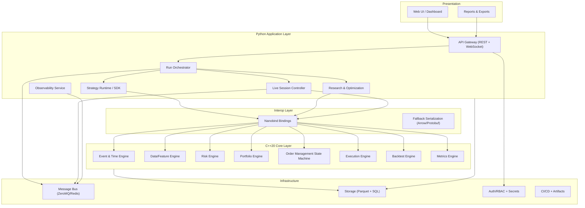
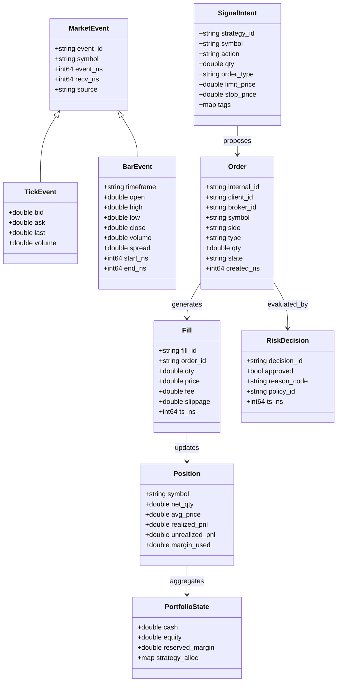
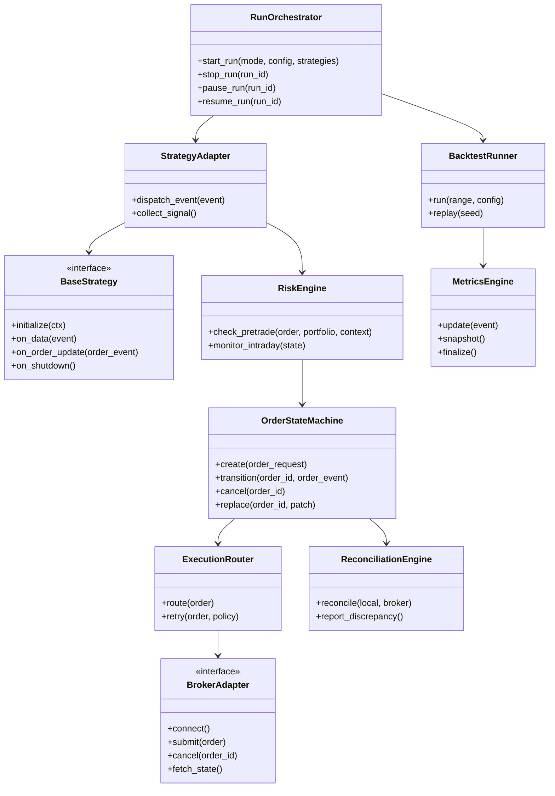
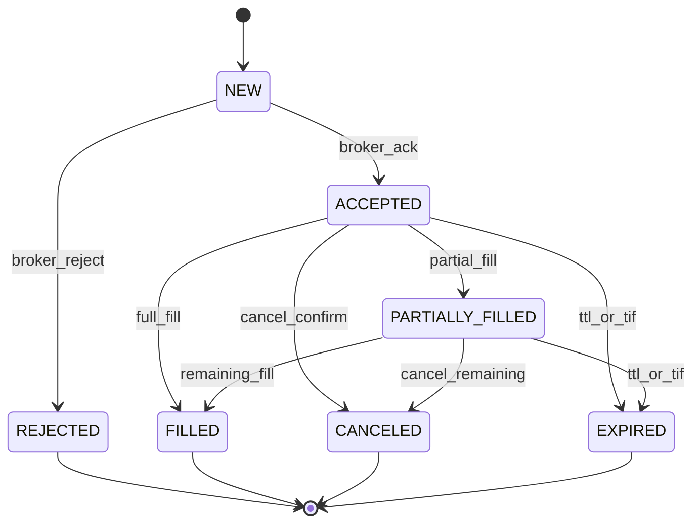
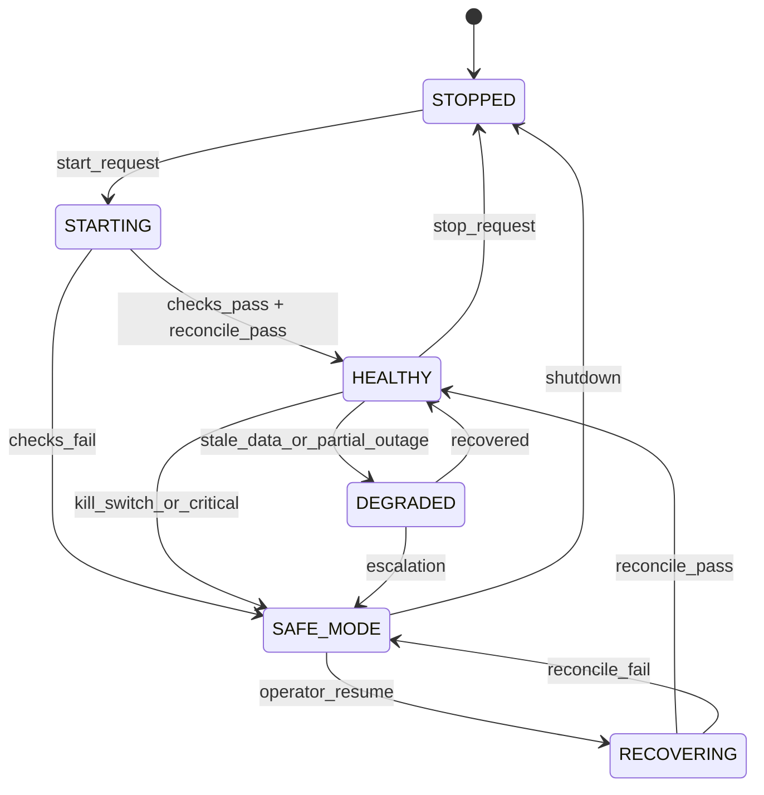
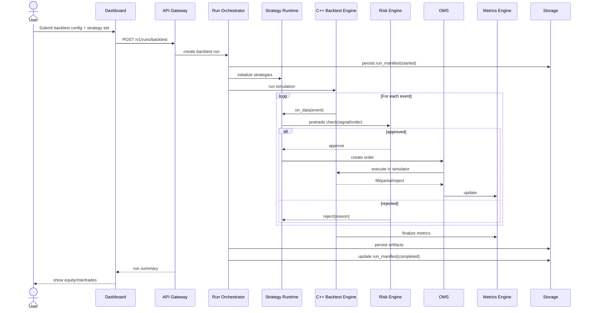
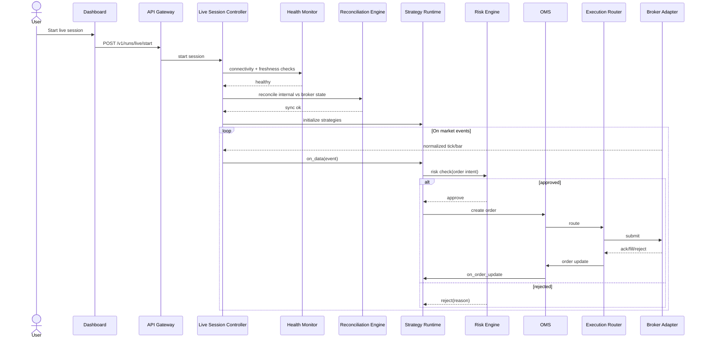
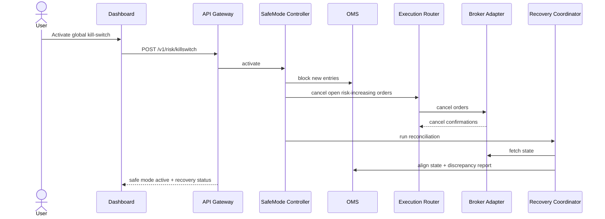

([Past chat][1])([Past chat][2])([Past chat][1])([Past chat][3])

Absolutely — agreed.
If `01_software_requirements_specification.md` changed significantly, `02_system_design.md` should be regenerated from scratch so design decisions, interfaces, and flows stay consistent.

Below is a **fully rewritten** `02_system_design.md` that is requirements-driven and implementation-ready.

---

# 02_system_design.md

## System Design Document

**System:** Hybrid C++/Python Quantitative Trading & Backtesting Platform
**Architecture Pattern:** Sandwich Architecture (C++20 Core → Nanobind Bridge → Python Application Layer)
**Status:** Rewritten Baseline
**Primary Input:** `01_software_requirements_specification.md` (edited version)
**Purpose:** Translate SRS requirements into concrete technical design, implementation structures, and interaction contracts.

---

## 1. Document Objectives

This System Design Document (SDD) defines the technical blueprint for implementation. It provides:

* concrete architectural decisions and rationale,
* subsystem decomposition and responsibilities,
* class-level structures and relationships,
* interface and contract definitions,
* canonical data model and persistence design,
* runtime interaction patterns (backtest/research/live),
* resilience, observability, security, and scalability mechanics.

This document is **authoritative for engineering implementation** and must remain synchronized with the SRS.

---

## 2. Design Principles and Constraints

## 2.1 Design Principles

1. **Performance-Critical Path in C++**

   * Event processing, risk checks, OMS transitions, and simulation kernels run in C++20.

2. **Flexibility in Python**

   * Strategy authoring, orchestration, research, APIs, and UI remain in Python for fast iteration.

3. **Interop Without Copies**

   * Nanobind + buffer views are first-class; serialization used only when necessary.

4. **Deterministic Research**

   * Backtests and optimizations are reproducible with run manifest + snapshot + seed + code version.

5. **Fail-Safe Live Operation**

   * Uncertain state (broker/data/risk) forces safe/degraded mode and blocks risk-increasing actions.

6. **Schema-First Contracts**

   * APIs, messages, and storage records are versioned and validated.

7. **Auditability by Default**

   * Critical decisions (risk, order actions, overrides) are immutable and traceable.

## 2.2 Technical Constraints

* **C++20** core implementation
* **Python 3.11+** orchestration layer
* **Nanobind** interoperability layer
* Linux-first production runtime
* Modular deployment support (single process in dev, decomposed services in prod)

---

## 3. Architecture Overview

## 3.1 Layered Sandwich Architecture



## 3.2 Runtime Modes

* **DEV:** local development, simplified services
* **BACKTEST:** historical simulation
* **PAPER:** live market data + simulated execution
* **LIVE:** real broker execution with hard risk controls

Mode policy is enforced in orchestrator and risk configuration.

---

## 4. Key Architectural Decisions

## 4.1 Decision A — Canonical Contracts Shared Across Modes

Backtest and live consume/emit the same strategy, signal, and order contracts to guarantee parity and reduce drift.

## 4.2 Decision B — Authoritative Internal State

OMS internal state is source of truth. Broker state is reconciled into it; mismatches trigger alerts/recovery.

## 4.3 Decision C — Event-Sourced Journaling + Snapshots

Append-only journals capture transitions and decisions; periodic snapshots accelerate recovery and replay.

## 4.4 Decision D — Bridge First, Serialization Second

Nanobind buffer views for hot path. Serialization (Arrow/Protobuf) only for incompatible memory or cross-process needs.

## 4.5 Decision E — Safety-First Degradation

Any uncertainty in broker connectivity, stale data, or risk engine health transitions system into safe/degraded mode.

---

## 5. Component Design

## 5.1 C++ Core Components

### 5.1.1 Event & Time Engine

**Responsibilities**

* canonical timestamp normalization,
* deterministic event ordering (per-stream and merged),
* replay clock for deterministic backtests.

**Core classes**

* `ClockService`
* `EventSequencer`
* `ReplayClock`
* `SessionCalendar`

### 5.1.2 Data & Feature Engine

**Responsibilities**

* normalized tick/bar ingestion into efficient buffers,
* indicator and feature computation (streaming + batch),
* data quality checks for missing/out-of-order/duplicate events.

**Core classes**

* `MarketDataBuffer`
* `DataNormalizer`
* `FeaturePipeline`
* `IndicatorKernel`
* `DataQualityGuard`

### 5.1.3 Portfolio Engine

**Responsibilities**

* account/portfolio state updates,
* multi-strategy allocation tracking,
* exposure aggregation and rebalance suggestions.

**Core classes**

* `PortfolioState`
* `AllocationModel`
* `ExposureBook`
* `RebalancePlanner`

### 5.1.4 Risk Engine

**Responsibilities**

* pre-trade validation,
* in-trade monitoring,
* circuit breaker and kill-switch policies.

**Core classes**

* `RiskPolicySet`
* `RiskEngine`
* `ExposureGuard`
* `DrawdownGuard`
* `KillSwitchController`

### 5.1.5 OMS Engine

**Responsibilities**

* order lifecycle state machine,
* idempotency enforcement,
* position book updates and reconciliation hooks.

**Core classes**

* `OrderAggregate`
* `OrderStateMachine`
* `PositionBook`
* `OrderJournalWriter`
* `ReconciliationEngine`

### 5.1.6 EMS Engine

**Responsibilities**

* route orders to broker adapters,
* execute baseline algos (TWAP/VWAP),
* handle partial fills/retries/cancellations.

**Core classes**

* `ExecutionRouter`
* `ExecutionPolicy`
* `ExecutionAlgoTWAP`
* `ExecutionAlgoVWAP`
* `FillProcessor`

### 5.1.7 Backtest Engine

**Responsibilities**

* event-driven and vectorized simulation modes,
* realistic fill simulation and cost modeling,
* deterministic replay across runs.

**Core classes**

* `BacktestRunner`
* `SimulationClock`
* `FillSimulator`
* `TransactionCostModel`
* `ReplayVerifier`

### 5.1.8 Metrics Engine

**Responsibilities**

* trade/strategy/portfolio metrics,
* incremental metrics updates,
* final snapshots and report serialization.

**Core classes**

* `MetricsEngine`
* `ReturnMetricsCalculator`
* `RiskMetricsCalculator`
* `MetricsSnapshotWriter`

---

## 5.2 Interop Layer (Nanobind)

## 5.2.1 Binding Modules

* `hq_core._event`
* `hq_core._data`
* `hq_core._feature`
* `hq_core._portfolio`
* `hq_core._risk`
* `hq_core._oms`
* `hq_core._execution`
* `hq_core._backtest`
* `hq_core._metrics`

## 5.2.2 Ownership & Lifetime Rules

* **C++ owned, Python view:** hot data buffers and transient event arrays
* **Shared ownership:** long-lived state objects crossing call boundaries
* **Python owned:** orchestration metadata not consumed in hot path

## 5.2.3 Exception Mapping

C++ exceptions map into typed Python exceptions:

* `ConfigurationError`
* `ValidationError`
* `RiskViolationError`
* `OrderStateError`
* `ExecutionError`
* `TransientConnectivityError`
* `FatalEngineError`

## 5.2.4 Transfer Strategy

1. Try zero-copy view.
2. If unsafe/incompatible, use Arrow.
3. If schema-bound messaging/cross-service needed, use Protobuf.

---

## 5.3 Python Application Components

### 5.3.1 Run Orchestrator

* orchestrates lifecycle for backtest/research/live runs,
* creates and persists run manifests,
* applies mode policy gates.

Classes:

* `RunOrchestrator`
* `RunManifestService`
* `ModePolicyResolver`
* `LifecycleSupervisor`

### 5.3.2 Strategy Runtime / SDK

* canonical strategy interface and adapters,
* dispatches events to strategy callbacks,
* routes signal intents for risk evaluation.

Classes:

* `BaseStrategy`
* `StrategyContext`
* `StrategyAdapter`
* `SignalRouter`

### 5.3.3 Research & Optimization

* parameter sweeps and algorithmic optimization,
* walk-forward and Monte Carlo workflows,
* experiment metadata + artifact registry.

Classes:

* `ExperimentManager`
* `OptimizationRunner`
* `WalkForwardRunner`
* `MonteCarloRunner`
* `SensitivityAnalyzer`

### 5.3.4 Live Session Control

* live startup checks and readiness,
* heartbeat/degraded mode handling,
* controlled recovery and resume gating.

Classes:

* `LiveSessionController`
* `HealthMonitor`
* `SafeModeController`
* `RecoveryCoordinator`

### 5.3.5 API Gateway

* REST for control plane and query APIs,
* WebSocket streaming for live events and telemetry,
* RBAC enforcement and correlation IDs.

Classes:

* `ApiGateway`
* `WebSocketHub`
* `AuthService`
* `PolicyEnforcer`

### 5.3.6 UI Backend & Query Layer

* powers dashboard cards/charts/tables,
* unifies live and research models for visualization.

Classes:

* `DashboardQueryService`
* `ReportService`
* `ExportService`

### 5.3.7 Observability Service

* centralized metrics/log/trace ingestion,
* alert routing and incident timeline support.

Classes:

* `TelemetryCollector`
* `AlertRouter`
* `SLOEvaluator`
* `IncidentService`

---

## 6. Class Diagrams

## 6.1 Core Trading Domain Model



## 6.2 Runtime Orchestration Model



---

## 7. Interface Design

## 7.1 Strategy Event Contract

```python
class StrategyEvent:
    event_id: str
    event_type: Literal["tick", "bar", "timer", "order_update", "session"]
    symbol: str
    event_ts: datetime
    recv_ts: datetime
    payload: dict
    trace_id: str
```

## 7.2 Signal Contract

```python
class SignalIntent:
    strategy_id: str
    symbol: str
    action: Literal["BUY", "SELL", "EXIT", "REDUCE", "HOLD"]
    qty: float
    order_type: Literal["MARKET", "LIMIT", "STOP", "STOP_LIMIT"]
    limit_price: float | None
    stop_price: float | None
    time_in_force: Literal["GTC", "IOC", "FOK", "DAY"]
    tags: dict[str, str]
```

## 7.3 Risk Check Interface (C++)

```cpp
RiskDecision RiskEngine::check_pretrade(
    const OrderRequest& order,
    const PortfolioSnapshot& portfolio,
    const RiskContext& ctx
);
```

## 7.4 Message Bus Envelope

```json
{
  "schema_version": "1.0.0",
  "event_id": "uuid",
  "event_ts": "ISO-8601",
  "producer": "service-name",
  "trace_id": "trace-id",
  "payload": {}
}
```

## 7.5 External API Surface (v1)

### REST

* `POST /v1/runs/backtest`
* `POST /v1/runs/optimization`
* `POST /v1/runs/live/start`
* `POST /v1/runs/live/stop`
* `POST /v1/risk/killswitch`
* `GET /v1/runs/{run_id}`
* `GET /v1/orders`
* `GET /v1/positions`
* `GET /v1/metrics/{run_id}`
* `GET /v1/system/health`
* `GET /v1/audit/events`

### WebSocket

* `/v1/stream/orders`
* `/v1/stream/fills`
* `/v1/stream/pnl`
* `/v1/stream/risk`
* `/v1/stream/health`
* `/v1/stream/alerts`

---

## 8. Data Model and Persistence Design

## 8.1 Storage Pattern

* **Hot:** in-memory buffers/state
* **Warm:** Parquet partitions for market and derived datasets
* **Transactional:** SQL store for manifests, orders, fills, positions, risk, audit
* **Cold:** immutable archive artifacts (reports, replay bundles, benchmark outputs)

## 8.2 Canonical Tables

### `run_manifest`

* `run_id` (PK)
* `mode`
* `config_hash`
* `strategy_bundle_version`
* `feature_pipeline_version`
* `data_snapshot_id`
* `code_commit`
* `seed`
* `start_ts`, `end_ts`
* `status`

### `orders_journal` (append-only)

* `event_id` (PK)
* `run_id`
* `order_id`, `client_id`, `broker_id`
* `state_from`, `state_to`
* `symbol`, `side`, `type`, `qty`
* `reason_code`
* `actor`
* `event_ts`

### `fills_journal`

* `fill_id` (PK)
* `run_id`
* `order_id`
* `symbol`
* `qty`, `price`, `fee`, `slippage`
* `event_ts`

### `positions_snapshot`

* `snapshot_id` (PK)
* `run_id`
* `symbol`
* `net_qty`, `avg_price`
* `realized_pnl`, `unrealized_pnl`
* `margin_used`
* `snapshot_ts`

### `risk_events`

* `risk_event_id` (PK)
* `run_id`
* `policy_id`
* `scope` (strategy/global)
* `severity`
* `decision`
* `reason`
* `related_order_id`
* `event_ts`

### `audit_events`

* `audit_id` (PK)
* `actor_id`
* `action`
* `entity_type`
* `entity_id`
* `before_json`
* `after_json`
* `reason`
* `event_ts`

---

## 9. State Machines

## 9.1 Order Lifecycle



## 9.2 Live Session State



---

## 10. User Sequence Diagrams

## 10.1 User Starts a Backtest



## 10.2 User Starts Live Trading Session



## 10.3 User Triggers Kill-Switch and Recovery



## 10.4 User Runs Research Optimization

```mermaid
sequenceDiagram
  actor User
  participant UI as Dashboard
  participant API as API Gateway
  participant OR as Run Orchestrator
  participant EXP as ExperimentManager
  participant OPT as OptimizationRunner
  participant BT as Backtest Engine
  participant DB as Storage

  User->>UI: Launch optimization
  UI->>API: POST /v1/runs/optimization
  API->>OR: create optimization run
  OR->>EXP: register experiment manifest
  EXP->>OPT: schedule trials
  loop each parameter set
    OPT->>BT: execute backtest trial
    BT-->>OPT: metrics/trades
    OPT->>DB: persist trial result
  end
  OPT->>EXP: rank + finalize
  EXP->>DB: persist leaderboard + lineage
  API-->>UI: optimization summary
```

---

## 11. Security Design

## 11.1 Authentication and RBAC

Roles:

* `viewer`
* `researcher`
* `trader`
* `risk_manager`
* `admin`

All privileged operations require role checks and audit event generation.

## 11.2 Privileged Operations

* start/stop live session
* kill-switch activation/deactivation
* risk override
* live config mutation
* manual reconciliation resolution

## 11.3 Secrets and Transport

* secrets loaded at runtime from secure manager
* never logged in plaintext
* TLS on service/API links
* sensitive at-rest encryption where supported

---

## 12. Observability Design

## 12.1 Structured Logging

Log schema fields:
`ts, level, service, module, run_id, strategy_id, symbol, trace_id, correlation_id, message, context`

## 12.2 Metrics Catalog (minimum)

* ingest lag / data freshness
* bridge latency and copy ratio
* risk check latency + reject rate
* OMS transition counters
* EMS dispatch latency + retry counts
* PnL, drawdown, margin utilization
* queue depth / dropped events

## 12.3 Tracing

Span chain:
`ingest -> strategy -> risk -> oms -> execution -> broker_ack/fill`

## 12.4 Alerts

Severity ladder:
`INFO -> WARN -> CRITICAL -> SEV1`

Routing policy:
UI + notification channels (Telegram/Email/Discord) with escalation rules.

---

## 13. Performance and Scalability Design

## 13.1 Hot Path Optimizations

* contiguous memory buffers
* lock reduction patterns
* object pools for frequent event wrappers
* SIMD-friendly indicator kernels

## 13.2 Scale Strategy

* horizontal scale for research workers
* partitioned historical storage by symbol/time
* isolated live core process for risk/oms/ems

## 13.3 Performance Guardrails

* bridge zero-copy ratio monitored
* benchmark suite in CI for:

  * event throughput
  * bridge overhead
  * order-routing latency
  * replay determinism

---

## 14. Reliability, Recovery, and Degraded Mode

## 14.1 Recovery Model

* periodic checkpoints + append-only journal replay
* resume requires successful reconciliation
* no new entries allowed in unresolved discrepancy state

## 14.2 Degraded Mode Policy

Enter degraded mode when:

* data freshness SLA violated,
* broker connectivity unstable,
* risk/OMS subsystem health uncertain.

Behavior:

* block new entries,
* allow conservative exits/reductions per policy,
* alert operator and track incident timeline.

## 14.3 Safety Invariants

1. No order dispatch without pre-trade risk approval.
2. No resume to healthy mode without reconciliation pass.
3. All manual overrides are audited and attributable.

---

## 15. Deployment Architecture

## 15.1 Environments

* **Dev:** local monolith, mock adapters
* **Staging:** service decomposition + replay integration
* **Production:** HA control plane + isolated live execution services

## 15.2 Deployment Units

* `core-engine` (C++ library/service)
* `orchestrator-service`
* `api-gateway-service`
* `ui-service`
* `worker-research-service`
* `telemetry-service`

## 15.3 Release Strategy

* staged rollout (dev → staging → prod)
* canary for live controller updates
* automated rollback to last good artifact

---

## 16. Verification Design (How Design is Tested)

1. **Unit tests:** all core classes and SDK primitives
2. **Contract tests:** strategy event/signal/order schemas + bridge contracts
3. **Integration tests:** end-to-end workflows (backtest/live/recovery)
4. **Parity tests:** Python vs C++ risk decision consistency
5. **Replay tests:** determinism and manifest reproducibility
6. **Fault tests:** disconnects/stale data/reject storms/partial fills

---

## 17. Traceability to SRS

To keep this rewritten SDD aligned to your edited SRS, maintain a matrix:

| SRS Requirement ID | Design Section | Component/Class | Interface/Schema | Test Suite |
| ------------------ | -------------- | --------------- | ---------------- | ---------- |
| FR-...             | §...           | ...             | ...              | ...        |
| NFR-...            | §...           | ...             | ...              | ...        |

**Rule:** No implementation starts without requirement-to-design mapping.

---

## 18. Implementation Notes and Migration Guidance

1. Start with contracts and schemas first.
2. Build deterministic event/time + risk/OMS state machine early.
3. Add bridge performance validation before large strategy onboarding.
4. Enforce parity tests before enabling live mode.
5. Keep data model stable; evolve via explicit migrations and schema versions.

---

## 19. Appendices

## Appendix A — Suggested Package Layout

```text
platform/
  cpp/
    core/{event,data,feature,portfolio,risk,oms,execution,backtest,metrics}
    adapters/{broker,data}
    include/
    tests/
  py/
    hq_core/              # nanobind modules
    app/
      orchestrator/
      strategy_sdk/
      research/
      live/
      api/
      ui_backend/
      observability/
      storage/
      security/
      config/
    tests/
  schemas/{events,api,storage}
  usage/
  benchmarks/
  artifacts/
  docs/
```

## Appendix B — Core Contracts (Reference)

* `StrategyEvent`
* `SignalIntent`
* `OrderRequest`
* `RiskDecision`
* `OrderEvent`
* `FillEvent`
* `RunManifest`

---
