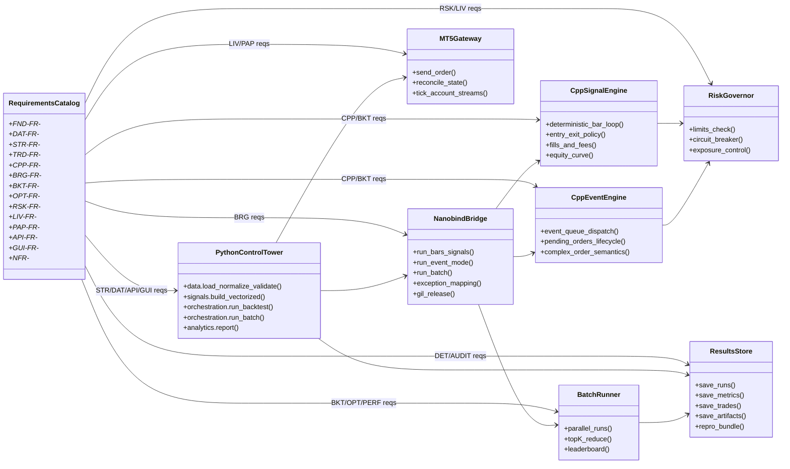
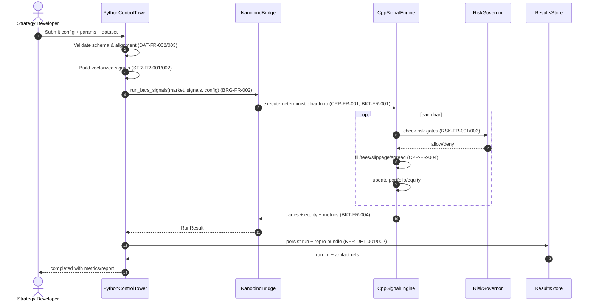
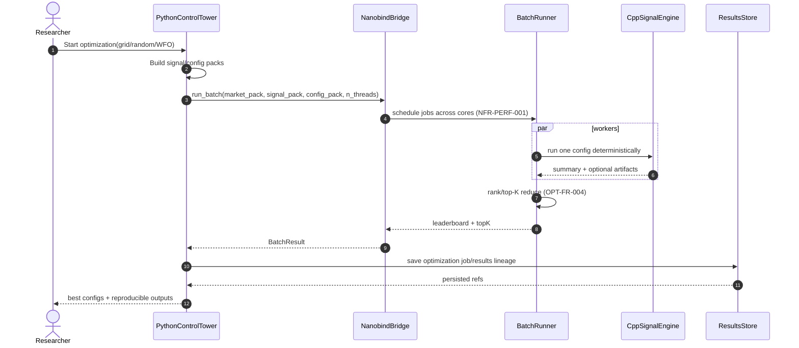
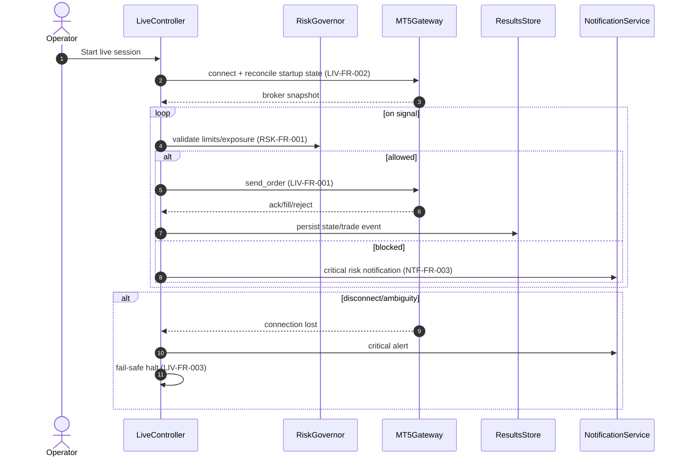

## Software Requirements Specification

**System:** Hybrid C++/Python Quantitative Trading & Backtesting Platform
**Architecture:** Sandwich Architecture (C++20 Core → Nanobind Bridge → Python Orchestration Layer)
**Document Status:** Baseline v1.0
**Authoritative Use:** This SRS is the source of truth for design, implementation, testing, and release decisions.

---

## 1. Introduction

### 1.1 Purpose

This Software Requirements Specification (SRS) defines the complete **functional** and **non-functional** requirements for a hybrid quantitative trading system that supports research, backtesting, paper trading, and live execution across multiple symbols and strategies.

The system uses:

* **Bottom layer (Performance):** C++20 core for latency-sensitive and compute-heavy workloads.
* **Middle layer (Interoperability):** Nanobind bridge for low-overhead interoperability and zero-copy data exchange where feasible.
* **Top layer (Flexibility):** Python for strategy logic, ML workflows, orchestration, APIs, and UI.

### 1.2 Scope

The platform covers:

* Market data ingestion and normalization
* Feature/indicator generation
* Strategy execution (research + live)
* Portfolio and risk management
* Order management and execution
* Backtesting and optimization
* Metrics, analytics, and reporting
* Live operations, monitoring, and recovery
* Storage, lineage, and auditability
* API/UI access for internal and external use

### 1.3 Intended Audience

* Quant developers and strategy engineers
* C++/Python platform engineers
* QA and test automation engineers
* DevOps/SRE engineers
* Product/operations owners
* Audit/compliance stakeholders (internal)

### 1.4 Definitions

* **OMS:** Order Management System
* **EMS:** Execution Management System
* **WFO/WFM:** Walk-Forward Optimization / Walk-Forward Matrix
* **RTO/RPO:** Recovery Time Objective / Recovery Point Objective
* **Run Manifest:** Immutable metadata snapshot of a run (code/data/config/seed)
* **Deterministic Replay:** Same input + config + seed yields identical outputs within defined tolerance

### 1.5 Conventions

* Requirements use **“shall”** to denote mandatory behavior.
* IDs:

  * Functional: `FR-<MODULE>-###`
  * Non-functional: `NFR-<CATEGORY>-###`

---

## 2. System Overview

### 2.1 Business and Technical Goals

1. Provide high-performance backtesting and live trading at scale.
2. Maintain strategy agility via Python while preserving C++ performance.
3. Guarantee reproducible research and auditable live operations.
4. Ensure safe execution through layered risk controls and fault recovery.
5. Support incremental extension through modular architecture.

### 2.2 Architecture Summary

The platform shall implement a three-layer sandwich architecture:

1. **C++20 Core Layer**

   * Event engine, indicators, execution simulation, portfolio/risk primitives
   * High-throughput data structures and algorithms
2. **Nanobind Bridge Layer**

   * Typed bindings, error mapping, ownership contracts
   * Zero-copy views for compatible memory layouts
3. **Python Application Layer**

   * Strategy definitions, ML integration, orchestration workflows
   * API services, UI dashboards, analytics, and experimentation

### 2.3 Operating Modes

* `DEV` (local development)
* `BACKTEST` (historical simulation)
* `PAPER` (live market data, simulated fills)
* `LIVE` (real broker execution)

### 2.4 Supported Asset/Market Scope (Initial Baseline)

* Primary: FX/CFD style instruments
* Extensible to additional asset classes via adapters and symbol metadata abstractions

---

## 3. Assumptions, Dependencies, and Constraints

### 3.1 Assumptions

* Broker APIs provide sufficient market/order state for reconciliation.
* Historical and live data feeds can be normalized into canonical schemas.
* Engineering teams maintain separate but coordinated C++ and Python codebases.

### 3.2 External Dependencies

* Broker connectors (e.g., MT5, others through adapters)
* Data vendors (e.g., broker history, third-party tick sources)
* Message bus (e.g., ZeroMQ/Redis)
* Storage engines (e.g., Parquet/SQLite/Timescale/PostgreSQL as configured)

### 3.3 Technical Constraints

* C++ standard: **C++20**
* Python version: **3.11+** (3.12 preferred)
* Bridge: **Nanobind**
* Linux-first runtime; cross-platform support is desired but secondary
* All critical actions must be logged and traceable
* **Hardware Constraints**:
  * **Priority**: High
  * **Description**: Must run on standard consumer hardware (e.g., Apple M1 equivalent or partitions of it).
  * **Spec**: Min 4 cores, 8GB RAM (16GB recommended), ~50GB storage.
* **Deployment Constraints**:
  * **Priority**: High
  * **Description**: Single-machine local deployment (no mandatory cloud dependency for MVP).
  * **Technology**: Docker optional, native OS support (Windows/Linux/macOS).
* **Portability Constraints**:
  * **Priority**: High
  * **Requirement**: The system shall use platform-independent file paths (e.g., `pathlib`).
* **Memory Constraints**:
  * **Priority**: Medium
  * **Limit**: <4GB for typical single-strategy workloads.

---

## 4. Functional Requirements

## 4.1 Module 1 — Core Utils

* **FR-UTIL-001**: The system shall provide thread-safe logging APIs in C++ and Python with unified severity levels.
* **FR-UTIL-002**: Logging shall support structured fields (timestamp, component, correlation ID, symbol, strategy, run ID).
* **FR-UTIL-003**: The system shall provide schema validation utilities for market, trade, and configuration objects.
* **FR-UTIL-004**: The system shall provide date/time, timezone, and string normalization helper functions.
* **FR-UTIL-005**: The system shall provide optimized math/stat primitives callable from Python (rolling stats, moments, z-score, rank, correlations).
* **FR-UTIL-006**: The logging subsystem shall support **Dynamic Filtering** by component and severity at runtime.
* **FR-UTIL-007**: The system shall define a **Unified Exception Hierarchy** (e.g., `HaruError`, `DataError`, `OrderError`) mapping C++ to Python exceptions.
* **FR-UTIL-008**: The logging subsystem shall automatically **Redact Sensitive Fields** (API keys, passwords) from all outputs.
* **FR-UTIL-009**: The system shall implement **Crash Handling** for segfaults/panics, attempting to flush logs, persist state, and send a notification before termination.

## 4.2 Module 2 — C++ Core Engineering

* **FR-CPP-001**: The C++ event loop shall enforce Global Clock synchronization across all symbols (no lookahead).
* **FR-CPP-002**: The data reader shall use memory-mapped (mmap) lazy loading for historical data access (supporting >1TB per symbol).
* **FR-CPP-003**: The core shall strictly enforce RAII resource management and Smart Pointers (unique/shared) for ownership.
* **FR-CPP-004**: The core shall guarantee zero-copy ownership contracts via Nanobind bridges.
* **FR-CPP-005**: The matching engine shall handle gap scenarios (executing at gap price, not stop level).
* **FR-CPP-006**: The core shall support async logging for high-throughput paths to avoid blocking the event loop.

## 4.3 Module 3 — Config & Secrets

* **FR-CONF-001**: The system shall load hierarchical configuration (TOML primary format) from file + environment + runtime override (with precedence rules).
* **FR-CONF-002**: The system shall support environment profiles (`DEV/BACKTEST/PAPER/LIVE`).
* **FR-CONF-003**: The system shall validate configuration against versioned schemas before startup.
* **FR-CONF-004**: Secrets (API keys/passwords/tokens) shall be sourced from a secure secret provider and not hardcoded.
* **FR-CONF-005**: Strategy parameters shall be versioned and linked to each run manifest.
* **FR-CONF-006**: Configuration changes in live mode shall require explicit authorization and audit logging.
* **FR-CONF-007**: The system shall support **Runtime Reloading** of non-critical configuration (e.g., logging levels, risk limits) without service interruption.
* **FR-CONF-008**: All configuration parameters shall be **Self-Documenting** with descriptions, safeguards, and units defined in the schema.
* **FR-CONF-009**: The system shall use **OS-Level Credential Storage** (Windows Credential Locker / Keyring) for secure secret management, avoiding plain-text files.
* **FR-CONF-010**: The database layer shall implement configurable **Connection Pooling** (pool size, overflow limit, timeout) to manage concurrent access.

## 4.4 Module 4 — Interop Bridge (Nanobind)

* **FR-BRIDGE-001**: The bridge shall expose C++ data structures to Python via typed nanobind bindings.
* **FR-BRIDGE-002**: The bridge shall support zero-copy transfer for contiguous numeric buffers where layout compatibility exists.
* **FR-BRIDGE-003**: The bridge shall define and enforce ownership contracts (C++-owned, Python-view, shared ownership).
* **FR-BRIDGE-004**: C++ exceptions shall be mapped to Python exception classes with preserved context.
* **FR-BRIDGE-005**: The bridge shall support explicit serialization pathways (Arrow/Protobuf/shared memory) when zero-copy is not feasible.
* **FR-BRIDGE-006**: The bridge shall expose lifecycle hooks for initialization, teardown, and health checks.

## 4.5 Module 5 — Event/Time & Calendar Engine

* **FR-TIME-001**: The system shall maintain a canonical event timestamp model supporting event-time and processing-time.
* **FR-TIME-002**: The system shall enforce deterministic event ordering policies per symbol and across merged streams.
* **FR-TIME-003**: The system shall normalize timezone handling with explicit DST policies.
* **FR-TIME-004**: The system shall support exchange/broker holiday calendars and trading session rules.
* **FR-TIME-005**: The system shall expose deterministic replay clocks for backtesting and incident replay.

## 4.6 Module 6 — Data Ingestion & Normalization

* **FR-DATA-001**: The system shall ingest live and historical market data from configured providers.
* **FR-DATA-002**: The system shall normalize provider-specific payloads to canonical tick/bar schemas.
* **FR-DATA-003**: The system shall detect and flag missing intervals, duplicates, and out-of-order records.
* **FR-DATA-004**: The system shall support multi-symbol synchronized ingestion pipelines.
* **FR-DATA-005**: The system shall provide caching tiers (memory + disk) with configurable eviction policies.
* **FR-DATA-011**: The system shall implement data quality validation checks.
  * **Checks**:
    * **Price Sanity**: High ≥ Low, Bid > 0, Ask > 0.
    * **Gap Detection**: Price gaps exceeding 10x average bar range.
    * **Spike Filtering**: Single bar range exceeding 5x ATR.
    * **Spread Analysis**: Spread widening > 3x median.
    * **Zero Volume**: Detection of zero-volume bars.
* **FR-DATA-012**: The system shall retain historical data indefinitely (no automatic deletion).
  * **Policy**: Manual deletion only.
* **FR-DATA-013**: The system shall support data compaction (merging incremental downloads).
* **FR-DATA-006**: The system shall maintain symbol metadata mappings (point value, digits, contract size, trading sessions).
* **FR-DATA-007**: The system shall ingest fundamental data.
  * **Priority**: Medium
  * **Sources**: Economic calendars, Government APIs.
  * **Data**: GDP, Inflation (CPI/PPI), Employment (NFP), Interest Rates.
* **FR-DATA-008**: The system shall ingest news releases.
  * **Priority**: Medium
  * **Sources**: News APIs, RSS feeds.
  * **Data**: Title, timestamp, category, impact level, sentiment score.
* **FR-DATA-009**: The system shall track central bank meetings.
  * **Priority**: Medium
  * **Focus**: FOMC (Fed), ECB, BoE, BoJ.
  * **Features**: Schedule tracking, rate decision announcements.
* **FR-DATA-010**: The system shall support sentiment data ingestion (Future).
  * **Priority**: Low
  * **Sources**: StockTwits, Twitter/X, News sentiment aggregators.
  * **metrics**: Bullish/Bearish ratios, volume, trend.
* **FR-DATA-014**: The data manager shall provide **Progress Callbacks** and estimated time remaining for long-running downloads/imports.

## 4.7 Module 7 — Feature Engineering

* **FR-FEAT-001**: The system shall compute technical indicators and derived features from canonical data.
* **FR-FEAT-002**: Feature pipelines shall be versioned and linked to run manifests.
* **FR-FEAT-003**: The system shall support both batch and incremental (streaming) feature computation.
* **FR-FEAT-004**: The system shall prevent look-ahead leakage in training and backtesting feature generation.
* **FR-FEAT-005**: Feature dependencies and computation graphs shall be inspectable.

## 4.8 Module 8 — Strategy Runtime

* **FR-STRAT-001**: The platform shall provide a common strategy interface usable in backtest, paper, and live modes.
* **FR-STRAT-002**: Strategy lifecycle hooks shall include: `initialize`, `on_bar`, `on_tick`, `on_trade`, `on_order_update`, `on_timer`, and `on_shutdown`.
* **FR-STRAT-003**: Strategies shall be isolated with per-strategy state containers and identifiers.
* **FR-STRAT-004**: Strategy execution shall support Python-native logic and optional C++ accelerated components.
* **FR-STRAT-005**: Strategy parameters and model artifacts shall be loaded by explicit version.
* **FR-STRAT-006**: Strategy decisions shall emit explainability metadata for audit/reporting.
* **FR-STRAT-007**: The system shall provide a standard indicator library.
  * **Trend**: SMA, EMA, WMA, HMA, SuperTrend, ADX, Parabolic SAR.
  * **Momentum**: RSI, Stochastic, MACD, CCI, ROC, MFI.
  * **Volatility**: ATR, Bollinger Bands, Keltner Channels.
  * **Volume**: OBV, VWAP, Volume Profile.
* **FR-STRAT-008**: The system shall provide strategy templates.
  * **Examples**: Mean Reversion, Trend Following, Breakout, Pairs Trading, Arbitrage.
* **FR-STRAT-009**: The strategy engine shall enforce **Point-in-Time (PIT) Correctness**, raising errors if future data is accessed during backtesting.
* **FR-STRAT-010**: The system shall support a **Debug Mode** allowing `pause`, `resume`, and `step-by-bar` execution for strategy development.

## 4.9 Module 9 — Portfolio & Allocation

* **FR-PORT-001**: The system shall support concurrent multi-strategy, multi-symbol portfolio execution.
* **FR-PORT-002**: Allocation models shall support static weights, risk parity, and configurable custom allocators.
* **FR-PORT-003**: The system shall enforce portfolio-level exposure constraints (asset, symbol, sector, strategy).
* **FR-PORT-004**: Rebalancing policies shall support schedule-based and event-triggered rebalance.
* **FR-PORT-005**: Portfolio state shall include capital, reserved margin, realized/unrealized PnL, and risk metrics.

## 4.10 Module 10 — Risk Engine

* **FR-RISK-001**: Pre-trade risk checks shall validate size, margin, max exposure, and policy constraints.
* **FR-RISK-002**: In-trade risk shall monitor drawdown, volatility spikes, and limit breaches.
* **FR-RISK-003**: The system shall implement kill-switch/circuit-breaker controls at strategy and global scopes.
* **FR-RISK-004**: Position sizing methods shall include fixed, volatility-based, and Kelly-derived models.
* **FR-RISK-005**: Risk rules shall be configurable by mode (backtest/paper/live) with stricter defaults for live.
* **FR-RISK-006**: All risk decisions and overrides shall be audit logged with actor and reason.
* **FR-RISK-007**: The system shall enforce maximum drawdown controls.
  * **Actions**: Halt trading, Reduce positions, Alert.
* **FR-RISK-008**: The system shall implement time-based risk limits.
  * **Constraints**: Intraday vs Overnight limits, Weekend exposure.
* **FR-RISK-009**: The system shall implement Circuit Breakers.
  * **Daily Loss Halt**: Halt new trades if daily loss exceeds X%.
  * **Equity Floor Kill Switch**: Close all positions if equity drops below absolute floor.
  * **FR-RISK-010**: The system shall support **Hidden Markov Model (HMM)** based regime detection as a baseline risk input.
  * **Regime Detection**: Adjust position sizing based on market regime (Trending/Ranging/Volatile).

## 4.11 Module 11 — OMS / Trading State

* **FR-OMS-001**: The system shall implement a formal order lifecycle state machine.
* **FR-OMS-002**: The OMS shall support order types with specific behaviors:
  * **Market**: Execute at current Ask/Bid with max slippage.
  * **Limit**: Execute at price or better (Buy < Market, Sell > Market).
  * **Stop**: Trigger at price, then execute as Market (Buy > Market, Sell < Market).
  * **Stop-Limit**: Trigger at price, submit Limit order.
  * **Trailing-Stop**: Dynamic stop level tracking price by fixed distance/ATR.
* **FR-OMS-003**: The OMS shall support idempotent order submission via client order identifiers.
* **FR-OMS-004**: The OMS shall maintain authoritative internal state for orders, fills, positions, and account snapshots.
* **FR-OMS-005**: The OMS shall reconcile internal state with broker state periodically and on reconnect.
* **FR-OMS-006**: Reconciliation mismatches shall raise alerts and invoke configured recovery workflows.
* **FR-OMS-007**: The OMS shall support both **Netting** (single position per symbol) and **Hedging** (multiple opposing positions) modes, configurable per symbol/account.
* **FR-OMS-008**: The OMS shall track **Margin Call** levels and emit warnings when equity drops within X% of the limit.
* **FR-OMS-009**: The OMS shall simulate **Stop-Out** liquidation events when margin requirements are breached, matching broker behavior.

## 4.12 Module 12 — Execution / EMS

* **FR-EXEC-001**: The EMS shall route approved orders to broker adapters.
* **FR-EXEC-002**: The EMS shall support execution algorithms (basic TWAP/VWAP at minimum).
* **FR-EXEC-003**: The EMS shall model and track slippage, spread, and partial fills.
* **FR-EXEC-004**: The EMS shall support retry policies with bounded attempts and escalation.
* **FR-EXEC-005**: The EMS shall expose latency metrics from order intent to broker acknowledgment/fill.
* **FR-EXEC-006**: Execution paths shall enforce final pre-send risk checks.
* **FR-EXEC-007**: The system shall provide a Command-Line Interface (CLI).
  * **Priority**: Medium
  * **Use Cases**: Automation, scripting, headless deployment, server management.
* **FR-EXEC-008**: The system shall provide a dedicated **Paper Trading Engine** that simulates execution using live market data without placing real orders.
* **FR-EXEC-009**: Paper Trading shall provide **Execution Parity**, using the exact same slippage, commission, and spread models as the Backtesting engine.
* **FR-EXEC-010**: Paper Trading shall support **Account Snapshots**, recording periodic states (balance, equity, positions) for performance tracking.
* **FR-EXEC-011**: The system shall support **Mode Switching** (Paper to Live) via configuration flag without code changes.
* **FR-EXEC-012**: All paper trades shall be stored in the database with the same schema and detail level as live trades.

## 4.13 Module 13 — Backtesting Engines

* **FR-BT-001**: The system shall provide event-driven and vectorized backtesting engines.
* **FR-BT-009**: The system shall support Ray-based distributed workers, with worker restart/reassign and cluster mode.
* **FR-BT-002**: Backtesting shall support tick-level and bar-level simulations.
* **FR-BT-003**: Backtesting shall model transaction costs (spread, commission [fixed/%, tiered], slippage, swap/financing).
* **FR-BT-004**: Fill simulation shall support realistic partial fills and order book assumptions (configurable).
* **FR-BT-008**: The system shall support Monte Carlo simulations.
  * **Variations**: Randomized trade sequence, Return distribution sampling, Parameter perturbation (sensitivity analysis).
* **FR-BT-005**: Backtests shall support walk-forward optimization and matrix-based evaluation workflows.
* **FR-BT-006**: Backtest output shall include trade logs, equity curves, drawdowns, and run manifest linkage.
* **FR-BT-007**: The backtesting engine shall support deterministic replay and reproducibility checks.
* **FR-BT-013**: Each **Ray Worker** shall instantiate an independent C++ engine instance, bypassing the Global Interpreter Lock (GIL) for true parallelism.
* **FR-BT-014**: Workers shall share **Read-Only Market Data** via memory-mapped files (mmap) to avoid per-worker data duplication and RAM exhaustion.
* **FR-BT-015**: The system shall support **Configurable Worker Count** with intelligent defaults (System Cores - 2).
* **FR-BT-016**: The Distributed Manager shall monitor **Worker Health**, detecting dead workers and automatically restarting them with their assigned parameter set.
* **FR-BT-010**: The system shall maintain a composite version identifier (C++ core hash + Python version + Release version).
* **FR-BT-011**: Every stored backtest shall record the composite version identifier.
* **FR-BT-012**: The system shall provide a `reproduce(backtest_id)` command that retrieves config/data/seed and deterministicly re-runs the backtest.
* **FR-BT-017**: The backtesting engine shall generate **Edge Detector** reports, comparing strategy entries against random entries to quantify skill vs luck.
  * **Metrics**: Confidence Intervals, Effect Sizes, and P-Values.
* **FR-BT-018**: The system shall use **Seeded Random Number Generators (RNG)** for all stochastic processes (slippage, latency noise) to guarantee reproducibility.

## 4.14 Module 14 — Optimization & Research

* **FR-RSCH-001**: The system shall support grid, random, genetic, and Bayesian optimization workflows.
* **FR-RSCH-002**: Research runs shall support parameter sweeps with parallel execution controls.
* **FR-RSCH-003**: The system shall support Monte Carlo perturbation tests.
* **FR-RSCH-004**: Research output shall include sensitivity analysis and stability scoring.
* **FR-RSCH-005**: The platform shall enforce train/validation/test split discipline and leak prevention policies.
* **FR-RSCH-006**: Experiment metadata shall be searchable by strategy, symbol, period, and objective.
* **FR-RSCH-007**: The system shall support symbol classification.
  * **Priority**: Medium
  * **Categories**: Asset class, Volatility regime, Trending vs Ranging, Liquidity tier.
* **FR-RSCH-008**: The system shall support indicator research and analysis.
  * **Priority**: Low
  * **Metrics**: Predictive power, Signal quality, Lag characteristics, Correlation with returns.
* **FR-RSCH-009**: The system shall analyze market seasonality patterns.
  * **Priority**: Medium
  * **Features**: Day of week, Month of year, Time of day effects, Holiday impacts.
* **FR-RSCH-010**: The system shall identify market edge opportunities (Edge Lab).
  * **Null Model**: Baseline random entry performance.
  * **Mean Reversion**: Z-Score fade signals and compression detection.
  * **Trend Persistence**: ATR breakout follow-through analysis.
  * **Session Edge**: Time-of-day alpha detection.

## 4.15 Module 15 — Metrics & Analytics

* **FR-MET-001**: The system shall compute core return/risk metrics.
  * **Metrics**: CAGR, Sharpe, Sortino, Calmar, Omega, Serenity Index, Max DD, VaR (Historical/Parametric).
* **FR-MET-002**: The system shall compute efficiency metrics (profit factor, expectancy, recovery factor, win/loss structure).
* **FR-MET-003**: Metrics shall be available per trade, strategy, portfolio, and time bucket.
* **FR-MET-004**: Benchmark comparison shall support configurable reference indices/strategies.
* **FR-MET-005**: Metric computations shall be versioned to ensure historical comparability.

## 4.16 Module 16 — Live Session Control & Recovery

* **FR-LIVE-001**: The system shall enforce trading sessions and holiday/hour restrictions.
* **FR-LIVE-002**: Live heartbeat checks shall monitor broker connectivity, data freshness, and critical service status.
* **FR-LIVE-003**: On critical failures, the system shall execute graceful shutdown policies.
* **FR-LIVE-007**: The system shall support automatic broker reconnection within 30 seconds.
* **FR-LIVE-004**: The system shall checkpoint runtime state for warm recovery.
* **FR-LIVE-005**: On restart, the system shall reconcile positions/orders before resuming new order flow.
* **FR-LIVE-006**: Manual recovery actions shall require authorization and audit logging.
* **FR-LIVE-008**: The system shall enforce **Order Spam Prevention**, limiting the rate of new orders to prevent broker bans.
* **FR-LIVE-009**: Emergency Shutdown shall be triggerable via UI, API, or automated Risk Governor rules, instantly canceling open orders and flattening positions.
* **FR-LIVE-010**: The system shall provide **Live Event Handlers** for: tick received, bar closed, order filled, order rejected, order modified, position closed, connection lost, and connection restored.
* **FR-LIVE-011**: The system shall support **Split Reconciliation Policies**: Automatic resolution for minor discrepancies (e.g., swap diffs) vs Manual intervention for major discrepancies (e.g., unknown positions).

## 4.17 Module 17 — Storage, Catalog & Lineage

* **FR-STOR-001**: The system shall store market data, trades, orders, metrics, and manifests in durable storage.
* **FR-STOR-002**: Trade and order journals shall be append-only and immutable.
* **FR-STOR-003**: The system shall maintain data lineage linking outputs to input datasets/features/config/code version.
* **FR-STOR-004**: Schema evolution shall be versioned with backward compatibility policies.
* **FR-STOR-005**: Retention and archival policies shall be configurable by data class.
* **FR-STOR-006**: The storage layer shall support fast retrieval for analysis and replay.
* **FR-STOR-007**: The system shall implement data backup and recovery procedures.
  * **Backup**: Support manual/scheduled backups with integrity checks (checksums).
  * **Recovery**: Documented procedures for Point-in-Time Recovery (PITR) and transaction log replay.
* **FR-STOR-008**: The system shall enforce data retention policies.
  * **Redis**: Active session only (ephemeral).
  * **Historical**: Indefinite (manual deletion only).
  * **Logs**: 30-day rotation (application), 90-day retention (security/access).
  * **Trade Audit Trail**: Permanent/Indefinite (regulatory requirement).
* **FR-STOR-012**: The database schema shall explicitly include tables for: `sessions`, `backtests`, `users`, `user_settings`, `edge_results`, `finance_metrics`, `live_trades`, `optimizations`, `simulations`, `strategies`, `paper_trades`, and `account_snapshots`.
* **FR-STOR-009**: The system shall use SQLAlchemy + Alembic for database schema migration and management.
* **FR-STOR-010**: The system shall implement Write-Ahead Logging (WAL) for all critical state changes before commit.
* **FR-STOR-011**: The system shall support state reconstruction from WAL + Database snapshot upon recovery (No Data Loss).

#### 4.17.1 Data Volume Estimates

| Data Type | Estimate |
|-----------|----------|
| 1 year of M1 bars, 1 symbol | ~525,600 records (~25 MB in Parquet) |
| 1 year of tick data, 1 symbol (major FX) | ~50-100M records (~2-5 GB in Parquet) |
| 50 symbols, 10 years, M1 bars | ~263M records (~12 GB) |
| 50 symbols, 10 years, tick data | ~25-50 billion records (~1-2.5 TB) |
| 10,000 optimization runs (metadata) | ~50 MB in database |
| Single backtest trade log (1000 trades) | ~500 KB in database |

## 4.18 Module 18 — API Gateway (REST/WebSocket)

* **FR-API-001**: The system shall provide REST APIs (FastAPI) for configuration, runs, metrics, positions, orders, and health.
* **FR-API-002**: The system shall provide WebSocket streams for real-time updates (PnL, risk, orders, fills, system status).
* **FR-API-003**: APIs shall support versioning and backward-compatible deprecation windows.
* **FR-API-004**: APIs shall enforce authentication (JWT) and role-based authorization.
* **FR-API-007**: The system shall generate automatic OpenAPI (Swagger) documentation.
* **FR-API-005**: API actions affecting live trading shall require elevated permissions and explicit confirmations.
* **FR-API-006**: API requests/responses shall include correlation IDs for traceability.
* **FR-API-008**: The API shall provide specific endpoints for:
  * **Backtest**: `run`, `status`, `results`, `stop`.
  * **Optimization**: `run`, `status`, `results`, `stop`.
  * **Live**: `start`, `stop`, `pause`, `emergency_stop`, `status`.
  * **Paper**: `start`, `stop`, `status`.
  * **Data**: `download`, `validate`, `status`.
  * **Risk**: `view_limits`, `update_limits`.
  * **Notifications**: `test`, `configure`.

## 4.19 Module 19 — UI Dashboard

* **FR-UI-001**: The UI shall display real-time portfolio, strategy, order, and risk views (PySide6 Desktop App).
* **FR-UI-002**: The UI shall provide interactive charts (PyQtGraph) with candlestick, equity curve, drawdown, distribution plots, drawing tools, and indicator overlays.
* **FR-UI-003**: The UI shall support drill-down from portfolio to strategy to trade-level records.
* **FR-UI-004**: The UI shall provide report exports for defined periods and entities.
* **FR-UI-007**: The UI shall implement specific performance Service Level Objectives (SLOs).
  * **Refresh Rate**: ≥ 30 fps (real-time charts), ≥ 1 Hz (tabular data).
  * **Latency**: <200ms from event to display update.
* **FR-UI-006**: UI actions shall follow RBAC permissions and audit trails.
* **FR-UI-008**: **Threading Contract**: UI rendering shall NEVER block the C++ engine. The engine shall run in a separate thread/process and communicate via **Signal/Slot** (non-blocking) mechanisms to the UI thread.
* **FR-UI-009**: The UI shall support **Multi-Chart Layouts** (Grid/Tabbed) for monitoring multiple symbols or timeframes simultaneously.
* **FR-UI-010**: The UI shall include a **Strategy Configuration Editor** with schema-based form generation for parameters.
* **FR-UI-011**: The UI shall include a **Backtest Results Viewer** with interactive charts, metrics display, and trade log browser.
* **FR-UI-012**: The UI shall include a **Risk Management Dashboard** showing real-time risk metrics (exposure, margin, Greeks).

## 4.20 Module 20 — Observability (Logs/Metrics/Traces/Alerts)

* **FR-OBS-001**: The system shall collect structured logs from C++ and Python components.
* **FR-OBS-002**: The system shall collect time-series operational metrics (latency, throughput, queue depth, failures).
* **FR-OBS-003**: The system shall support distributed tracing across ingestion → strategy → risk → OMS → EMS.
* **FR-OBS-004**: Alerting rules shall support severity levels and escalation policies.
* **FR-OBS-005**: The system shall provide health endpoints and service readiness checks.
* **FR-OBS-006**: Observability data shall be queryable by run ID and correlation ID.

## 4.21 Module 21 — Testing & Validation

* **FR-TEST-001**: The system shall include unit tests for C++ (Google Test/Benchmark) and Python components.
* **FR-TEST-002**: The system shall include integration tests for bridge contracts and cross-language workflows.
* **FR-TEST-003**: The system shall include deterministic replay tests for backtest reproducibility.
* **FR-TEST-004**: The system shall include backtest/live parity tests for equivalent strategy interfaces.
* **FR-TEST-005**: The system shall include fault-injection tests (disconnects, stale data, rejects, partial fills).
* **FR-TEST-006**: Test results shall be published and tied to commit/build artifacts.

## 4.22 Module 22 — CI/CD, Release & Deployment

* **FR-CICD-001**: CI shall build C++ and Python artifacts for every protected-branch change.
* **FR-CICD-002**: CI shall run linting (clang-tidy, ruff), static analysis (mypy), and unit tests (ASan/UBSan for C++).
* **FR-CICD-003**: Release pipelines shall support staged deployments (dev → staging → production/live).
* **FR-CICD-004**: Deployment shall support rollback to last known good release.
* **FR-CICD-005**: Production release shall require quality gate approval and test threshold compliance.
* **FR-CICD-006**: Each release shall produce signed artifacts, changelog, and compatibility notes.

## 4.23 Module 23 — Notifications & Alerting

* **FR-NOTIF-001**: The system shall support Telegram notifications.
  * **Priority**: High
  * **Events**: Trade executions, Risk limit breaches, System errors, Daily/Weekly summaries.
  * **Technology**: Telegram Bot API.
* **FR-NOTIF-002**: The system shall support Email notifications.
  * **Priority**: Medium
  * **Events**: Critical system alerts, Performance reports, Account statements.
  * **Technology**: SMTP.
* **FR-NOTIF-003**: The system shall support Browser/Desktop notifications.
  * **Priority**: Medium
  * **Use Case**: Real-time alerts for the running application (monitoring mode).
* **FR-NOTIF-004**: The system shall provide granular notification configuration.
  * **Priority**: Medium
  * **Features**: Channel selection per event type, Severity thresholds, Rate limiting (anti-spam).
* **FR-NOTIF-005**: All notifications shall follow a common **Notification Model** with fields: type (info/warning/error/trade/risk), title, message, timestamp, channel, delivery_status.
* **FR-NOTIF-006**: Notification channels shall implement a common interface with methods: `send()`, `is_available()`, and `test_connection()`.
* **FR-NOTIF-007**: All sent notifications shall be stored in the database for audit trail.

---

## 5. External Interface Requirements

## 5.1 Broker/Data Interfaces

* **FR-INT-001**: Broker adapters shall expose consistent operations: connect, account snapshot, submit/cancel/modify, open orders, positions, fills.
* **FR-INT-002**: Data adapters shall expose subscribe/unsubscribe and historical fetch operations.
* **FR-INT-003**: Adapter failures shall produce normalized error codes and retryability hints.
* **FR-INT-008**: The system shall support specific broker integrations.
  * **MT5 (MetaTrader 5)**:
    * **Priority**: Critical
    * **Features**: Full API integration via ZeroMQ (MQL5 EA) with sub-millisecond streaming.
    * **Protocol**: MQL5 EA shall receive structured text commands (e.g., `ORDER_SEND;EURUSD;BUY;1.0;SL=1.0900`) and stream tick data via ZMQ PUB.
    * **Translation**: The broker gateway shall translate between the system's canonical order/data formats and the MT5-specific formats, handling all broker-specific quirks (e.g., volume steps, error codes).
    * **Connection**: The gateway shall handle heartbeat monitoring, automatic reconnection (exponential backoff), and graceful state reconciliation.
  * **Dukascopy**:
    * **Priority**: High
    * **Features**: High-quality historical tick and bar data access.
  * **Future Integrations**:
    * **Priority**: Medium/Low
    * **Targets**: cTrader (Spotware), Interactive Brokers (TWS/Gateway), Oanda (v20), VisualChart, Alpaca, CCXT (Crypto).

## 5.2 Inter-Process Messaging

* **FR-INT-004**: Internal services shall communicate over message bus with schema-validated payloads.
* **FR-INT-005**: Message contracts shall be versioned and backward-compatible for one major version window.

## 5.3 File/Artifact Interfaces

* **FR-INT-006**: Run manifests and reports shall be exportable in machine-readable formats (JSON/Parquet/CSV where applicable).
* **FR-INT-007**: Imported datasets shall undergo schema and quality validation before acceptance.

---

## 6. Data Requirements

## 6.1 Canonical Schemas (Minimum)

* **Tick**: symbol, bid, ask, last(optional), volume(optional), event_ts, recv_ts, source
* **Bar**: symbol, timeframe, open/high/low/close, volume, spread(optional), bar_start_ts, bar_end_ts, source
* **Order**: internal_id, client_id, broker_id, symbol, side, type, qty, price params, state, timestamps
* **Fill**: fill_id, order_id, qty, price, fee/commission, liquidity flag(optional), ts
* **Position**: symbol, net_qty, avg_price, unrealized_pnl, realized_pnl, margin_used, ts
* **Run Manifest**: run_id, mode, strategy version, config hash, data snapshot ID, code commit, seed, start/end time

## 6.2 Data Quality and Integrity

* **FR-DQ-001**: The system shall validate completeness, uniqueness, and ordering constraints per dataset class.
* **FR-DQ-002**: Data quality violations shall be recorded with severity and remediation status.
* **FR-DQ-003**: Data corrections shall preserve original records and change history.

---

## 7. Non-Functional Requirements

## 7.1 Performance

* **NFR-PERF-001**: The platform shall define benchmark profiles and reference hardware (`RH-01`) for repeatable performance testing.
* **NFR-PERF-002**: Under `RH-01`, event-driven backtests shall process at least **100,000 tick events/sec** for single-symbol baseline scenarios.
* **NFR-PERF-003**: Under `RH-01`, portfolio backtests (multi-symbol/multi-strategy) shall scale to at least **20 concurrent strategy instances** with no correctness degradation.
* **NFR-PERF-004**: Live mode p99 latency from strategy decision to order dispatch shall be ≤ **25 ms** (Internal) and order signal-to-submission ≤ **500 ms** (Total System).
* **NFR-PERF-005**: Bridge overhead for supported zero-copy paths shall remain below **5%** of total stage time in profiling benchmarks.
* **NFR-PERF-006**: Backtesting throughput target.
  * **Target**: Fill **1,000,000 orders in 70-100ms** (Vectorized mode) on reference hardware.
  * **Hardware**: Apple M1 equivalent or better.
* **NFR-PERF-007**: Live Strategy Concurrency.
  * **Target**: Support at least **50 simultaneous strategy instances** (Scaled Target).
  * **Condition**: No significant latency degradation.
* **NFR-PERF-008**: Symbol Concurrency.
  * **Target**: Support real-time streaming/processing for **100+ symbols** (Scaled Target).
  * **Latency**: <100ms processing time per tick batch.
* **NFR-PERF-009**: Strategy Iteration Speed.
  * **Target**: < 5 minutes per backtest iteration (typical workload).
* **NFR-PERF-010**: Bridge Call Latency.
  * **Target**: < 1 microsecond per call (Python → C++ command).

## 7.2 Reliability & Availability

* **NFR-REL-001**: Non-live services shall target monthly availability ≥ **99.0%**.
* **NFR-REL-002**: Live trading control plane shall target monthly availability ≥ **99.9%** (24/7 availability design for crypto markets).
* **NFR-REL-003**: Critical components shall implement watchdog health checks and automatic restart policies.
* **NFR-REL-006**: The system shall support automatic failover.
  * **Scope**: Broker connections (primary -> backup), Data feeds.
* **NFR-REL-004**: No single component failure shall silently bypass risk checks.
* **NFR-REL-005**: All critical failures shall generate operator-visible alerts within **30 seconds**.
* **NFR-REL-007**: The C++ core shall assert **Zero Memory Leaks** on shutdown, verified by AddressSanitizer in CI.

## 7.3 Recoverability & Resilience

* **NFR-REC-001**: The system shall support warm restart with state reconciliation.
* **NFR-REC-002**: **RTO** for trading service recovery shall be ≤ **10 minutes**.
* **NFR-REC-003**: **RPO** for trading state shall be ≤ **60 seconds** via checkpointing/journaling.
* **NFR-REC-004**: Recovery routines shall prevent duplicate order submission through idempotency controls.

## 7.4 Determinism & Reproducibility

* **NFR-REP-001**: Backtest runs with identical data snapshot, config, seed, and code revision shall reproduce identical trade sequences.
* **NFR-REP-002**: Floating-point tolerant comparisons shall be explicitly defined for metric validation.
* **NFR-REP-003**: Every run shall persist an immutable run manifest.
* **NFR-REP-004**: Experiment and optimization results shall be reproducible by run ID.

## 7.5 Security

* **NFR-SEC-001**: Secrets shall never be logged in plaintext.
* **NFR-SEC-002**: API endpoints shall require authenticated access with role-based authorization.
* **NFR-SEC-003**: Sensitive data in transit shall use TLS.
* **NFR-SEC-004**: Sensitive data at rest shall be encrypted where supported by storage provider.
* **NFR-SEC-005**: Privileged trading actions shall require elevated roles and full audit entries.
* **NFR-SEC-006**: Security events (failed auth, privilege escalation attempts) shall be logged and alerted.
  * **Content**: User, Action, IP Address, Timestamp, Status.
  * **Retention**: Minimum 90 days for system access logs.
* **NFR-SEC-007**: Passwords shall enforce complexity requirements (min 12 chars, mixed case, symbols).
* **NFR-SEC-008**: Accounts shall lock after N failed attempts (default 5).
* **NFR-SEC-009**: The system shall validate all inputs against injection and path traversal attacks.
* **NFR-SEC-010**: The system shall implement API rate limiting as a security control.
* **NFR-SEC-011**: Dependencies shall be regularly scanned and updated for security vulnerabilities.
* **NFR-SEC-012**: Passwords shall NEVER be stored in plaintext (must use separate hashing like Argon2/Bcrypt).

## 7.6 Observability

* **NFR-OBS-001**: All logs shall be structured, machine-parseable, and correlated by run/request IDs.
* **NFR-OBS-002**: Metrics shall be retained at high resolution for at least **30 days** (configurable).
* **NFR-OBS-003**: Trace sampling shall be configurable by mode and severity.
* **NFR-OBS-004**: Dashboarded SLOs shall include latency, error rate, throughput, and data freshness.

## 7.7 Scalability

* **NFR-SCL-001**: The system shall support horizontal scale-out for non-stateful components.
* **NFR-SCL-002**: Strategy runtime shall support concurrent execution with configurable resource quotas.
* **NFR-SCL-003**: Storage layout shall support partitioning by symbol/time/run for large historical datasets.
* **NFR-SCL-004**: Distributed agent architecture shall scale linearly with added CPU cores (≥ 85% efficiency at 16 cores).

## 7.8 Maintainability & Extensibility

* **NFR-MNT-001**: Module boundaries shall be explicit with versioned interfaces/contracts.
* **NFR-MNT-002**: Plugin mechanisms shall allow adding indicators/strategies/adapters without core rewrites.
* **NFR-MNT-003**: Public APIs and message schemas shall follow semantic versioning.
* **NFR-MNT-004**: Code quality gates shall enforce formatting, linting, and static checks in CI.

## 7.9 Usability

* **NFR-USE-001**: UI shall present clear operational status for data, broker, and risk subsystems.
* **NFR-USE-002**: Critical actions in live mode shall require explicit confirmation flows.
* **NFR-USE-003**: Reports shall be exportable and understandable without internal implementation knowledge.

## 7.10 Testability

* **NFR-TST-001**: Minimum automated unit test coverage thresholds shall be enforced per module.
* **NFR-TST-002**: Integration and replay tests shall run in CI on protected branches.
* **NFR-TST-003**: Regression performance tests shall detect statistically significant degradation.
* **NFR-TST-004**: Fault-injection test suites shall run at least once per release candidate.
* **NFR-TST-005**: QA acceptance shall require usage examples (tutorials/walkthroughs) verification.
* **NFR-TST-006**: Codebase must enforce type hints (Python) for all public interfaces.
* **NFR-TST-007**: Automated Unit Test Coverage.
  * **Target**: > 70% (MVP), > 90% (V2/Future).

## 7.11 Compliance & Auditability

* **NFR-AUD-001**: All order/risk/config actions shall produce immutable audit records.
* **NFR-AUD-002**: Audit records shall include actor identity, timestamp, action, before/after values, and reason code when applicable.
* **NFR-AUD-003**: Trade and execution journals shall be reconstructable for any run/date range.

## 7.12 Documentation

* **NFR-DOC-001**: The system shall provide comprehensive API documentation (Sphinx/Doxygen).
* **NFR-DOC-002**: The system shall provide user guides (Installation, Getting Started, Strategy Development).
* **NFR-DOC-003**: The system shall maintain up-to-date architecture diagrams (Component, Sequence, Deployment).
* **NFR-DOC-004**: The system shall provide a database schema reference and data dictionary.
* **NFR-DOC-005**: The system shall provide a developer guide (Environment setup, Contribution guidelines).

---

## 8. Safety and Risk Control Requirements

* **FR-SAFE-001**: The system shall block order transmission if pre-trade risk checks fail.
* **FR-SAFE-002**: The system shall provide global and per-strategy kill-switches.
* **FR-SAFE-003**: The system shall halt new entries when hard drawdown/margin thresholds are breached.
* **FR-SAFE-004**: Manual overrides shall be role-restricted, justified, and audit logged.
* **FR-SAFE-005**: On uncertain broker/account state, the system shall default to safe mode (no new orders) until reconciliation completes.

---

## 9. Verification and Acceptance Requirements

### 9.1 Verification Methods

* **Inspection (I)**: Requirement and artifact review
* **Test (T)**: Automated/manual test execution
* **Analysis (A)**: Benchmark/profiling/statistical analysis
* **Demonstration (D)**: Scenario-based operational walkthrough

### 9.2 Minimum Acceptance Criteria

| Module | Acceptance Criteria |
|--------|-------------------|
| C++ Core Engine | Processes 1M+ ticks/sec; all order types execute correctly; matching engine handles gap scenarios |
| Nanobind Bridge | Zero-copy verified; < 1μs call latency; no memory leaks under 1M+ call stress test |
| Event-Driven Backtester | Produces identical results to a reference implementation for 5 known strategies on known data |
| Vectorized Backtester | Results match event-driven engine within acceptable tolerance for equivalent configurations |
| Risk Management | All risk limits enforced; position sizing matches manual calculations; governor blocks correctly |
| Live Trading | Successfully executes round-trip trade (open + close) on demo account; reconnection works after simulated disconnect |
| Paper Trading | Results are statistically consistent with backtesting results on the same data period |
| Performance Metrics | All metrics match manual/spreadsheet calculations for a reference trade log |
| Data Validation | Correctly identifies all planted data quality issues in a test dataset |
| Notifications | Telegram and Email delivery confirmed within 5 seconds of trigger |

### 9.3 System-Level Acceptance

| Criterion | Test |
|-----------|------|
| End-to-end backtest | Run a moving average crossover strategy on EURUSD 2020-2024 M1 data and produce a complete report |
| End-to-end optimization | Grid search over 1000 parameter combinations on 8 cores, all complete successfully |
| End-to-end live trading | Strategy runs on demo account for 24 hours without crash, executing at least one trade |
| Deterministic replay | Re-run a stored backtest and verify bit-identical results |
| Crash recovery | Kill the process during a backtest, restart, and verify state recovery |

---

## 10. Requirements Traceability Model

Each requirement shall map to:

* Design component(s)
* Implementation module(s)
* Test case ID(s)
* CI job(s)
* Release version introduced/changed

A traceability matrix shall be maintained as:

* `requirements_traceability_matrix.md` or equivalent structured store.

---

## 11. Out-of-Scope for This Baseline

* High-frequency co-located market making microsecond infrastructure
* Options Greeks engines and complex derivatives pricing
* Regulatory reporting integrations specific to a jurisdiction (unless explicitly added)
* Multi-tenant SaaS hard isolation model (single-organization baseline assumed)

---

## 12. Change Control

* Any change impacting FR/NFR semantics shall require SRS version bump and approval.
* Breaking changes require migration notes and backward-compatibility strategy.
* SRS revisions shall include change summary, rationale, and impacted modules/tests.

---

## 13. Appendix A — Reference Module Index (V2)

1. Core Utils
2. C++ Core Engineering
3. Config & Secrets
4. Interop Bridge
5. Event/Time & Calendar Engine
6. Data Ingestion/Normalization
7. Feature Engineering
8. Strategy Runtime
9. Portfolio & Allocation
10. Risk Engine
11. OMS/Trading State
12. Execution/EMS
13. Backtesting Engines
14. Optimization & Research
15. Metrics & Analytics
16. Live Session Control & Recovery
17. Storage, Catalog & Lineage
18. API Gateway
19. UI Dashboard
20. Observability
21. Testing & Validation
22. CI/CD, Release & Deployment
23. Notifications & Alerting

---

## 14. Appendix B — Recommended Companion Documents

* `02_system_design.md`
* `03_interface_control_document.md`
* `04_data_dictionary.md`
* `05_test_strategy_and_master_plan.md`
* `06_operational_runbooks.md`
* `07_security_and_access_control_spec.md`
* `requirements_traceability_matrix.md`

---

## 15. Appendix C — Glossary of Financial Terms

| Term | Definition |
|------|-----------|
| **Pip** | Smallest price increment for a currency pair (typically 0.0001 for majors) |
| **Lot** | Standard unit of trade (100,000 units of base currency in FX) |
| **Spread** | Difference between ask and bid price |
| **Swap** | Overnight financing charge/credit for holding a position past rollover |
| **Margin** | Collateral required to open a leveraged position |
| **Drawdown** | Peak-to-trough decline in account equity |
| **Sharpe Ratio** | Risk-adjusted return: (return − risk-free rate) / standard deviation |
| **Walk-Forward** | Optimization technique that validates on unseen data to test robustness |
| **Stop-Out** | Broker-forced liquidation when margin level drops below threshold |
| **Slippage** | Difference between expected and actual execution price |

## 16. Appendix D — Visual Traceability Diagrams

### 16.1 Requirements-to-Components Class Diagram

### 16.2 Sequence Diagram — Requirement Coverage for Signal-Driven Run

### 16.3 Sequence Diagram — Requirement Coverage for Batch Optimization

### 16.4 Sequence Diagram — Requirement Coverage for Live Safeguarded Flow

---
