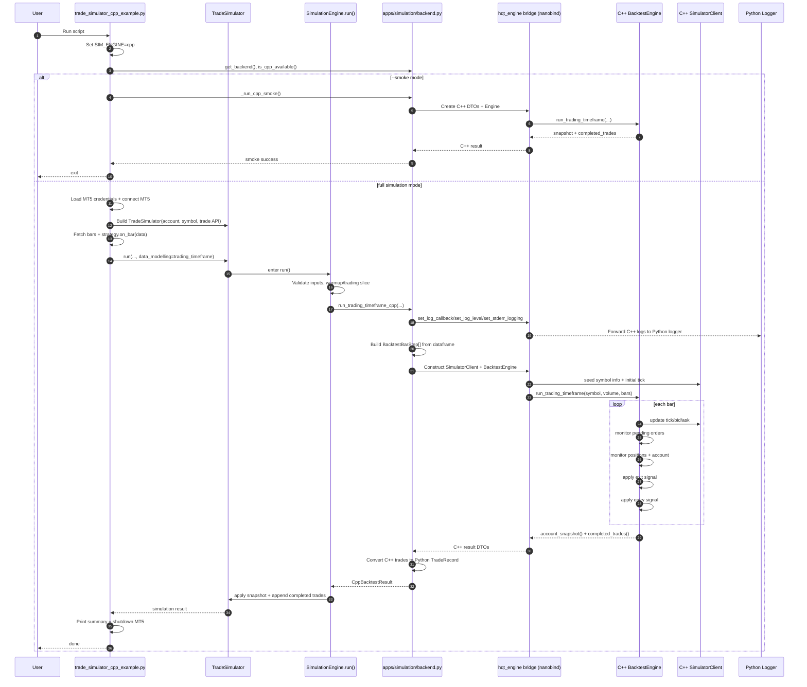

# HaruQuant Architecture

## Runtime Split
- `Python` is the orchestration layer: strategy code, simulation setup, API/UI integration, and persistence workflows.
- `C++` is the deterministic execution layer: core simulation state transitions, order execution semantics, and heavy backtest loops.
- `Bridge` (`hqt_engine` via nanobind) is the boundary that exposes C++ types/functions to Python.

## Main Components
- `apps/simulation/backend.py`: backend selector and adapter that routes simulation calls to Python or C++ engine.
- `cpp/src/engine/*`: C++ simulation engine modules (`SimulatorClient`, `BacktestEngine`, calculators, monitors, trackers).
- `cpp/include/engine/engine.hpp`: unified non-infrastructure C++ API header for sim/trading/analytics types and engine facade.
- `bridge/src/module.cpp` and `bridge/src/sim_bindings.cpp`: Python extension entrypoint and C++ API bindings.
- `apps/logger/*`: Python logging subsystem that writes to terminal and rotating files under `logs/`.

## C++ Logging Bridge
- C++ logger implementation:
  - Header: `cpp/include/util/logger.hpp`
  - Source: `cpp/src/engine/logger.cpp`
- C++ logging behavior:
  - Supports levels: `DEBUG`, `INFO`, `WARNING`, `ERROR`.
  - Supports optional stderr output.
  - Supports optional callback sink for forwarding logs to Python.
  - Emits structured records aligned to Python logger schema keys:
    - `time`, `level`, `message`, `module`, `name`, `function`, `line`, `file`, `process`, `thread`, `extra`.
- Bridge API exposed on `hqt_engine`:
  - `set_log_callback(callable_or_none)` (supports both `callback(record_dict)` and legacy `callback(level, message)`)
  - `set_log_level(level_str)`
  - `set_stderr_logging(enabled)`
  - `emit_log(level_str, message)` (utility/testing emitter)
  - `run_cpp_logger_usage_example()` (C++ usage smoke example)
- Python hookup:
  - `apps/simulation/backend.py` initializes a one-time log bridge.
  - C++ log callback forwards records into `apps.logger.logger`.
  - Result: C++ log events flow through the same Python logger handlers, so they appear in terminal and `logs/` files.

## Logging Flow
1. C++ code emits log via `hqt::util::info/warning/error/debug`.
2. Logger checks level and dispatches to:
   - Python callback sink (if configured), and/or
   - stderr (if enabled).
3. Python callback maps level to `apps.logger.logger.<level>()`.
4. Python logger handlers write to terminal and log files.

## Usage Examples
- C++ usage source:
  - `cpp/src/engine/usage.cpp`
- C++ usage header:
  - `cpp/include/usage/logger_usage.hpp`
- Python runner that triggers the C++ usage path via bridge:
  - `tests/usage/utils/usage_cpp_logger.py`

## Sequence: `trade_simulator_cpp_example.py`

## Engine Merge Status
- Merge complete for folder layout:
  - Legacy `cpp/include/core`, `cpp/include/sim`, and `cpp/src/sim` were removed.
  - Unified C++ execution surface is now under `cpp/include/engine/*` and `cpp/src/engine/*`.
- Header compression (Option A) complete:
  - Non-infrastructure declarations consolidated into `cpp/include/engine/engine.hpp`.
  - Infrastructure headers remain separate: `event.hpp`, `event_loop.hpp`, `global_clock.hpp`, `write_ahead_log.hpp`, `zmq_broadcaster.hpp`.
- Runtime behavior is preserved:
  - `hqt::engine::Engine` remains the facade entrypoint.
  - Simulation model/execution types continue to use `hqt::sim` namespace for bridge compatibility.
