# Design Specification / System Architecture: HaruQuant Agentic AI System

Status: canonical architecture spec
Scope: implementation-ready system architecture
Use this when: you need runtime architecture, boundaries, topology, and system structure
Companion docs: `Requirements.md`, `Security.md`, `Observability_Audit.md`
Owner: platform architecture
Review cadence: quarterly or when system topology changes

**Document Version:** 1.1.1  
**Companion To:** SRS v3.1.1 (Board Approval Version)  
**Supersedes:** v1.0.0  
**System:** HaruQuant Autonomous Trading Platform  
**Framework Target:** Google Agent Development Kit (ADK) v2.0+  
**Protocol Target:** Model Context Protocol (MCP) v2025-06-18 or later  
**Classification:** Internal Use - Proprietary  
**Status:** Consolidated Architecture Baseline

---

## 1. Purpose

This Design Specification translates the approved Software Requirements Specification into an implementation-ready system architecture for HaruQuant’s agentic trading platform. It defines the runtime services, ADK-native agent patterns, canonical schemas, MCP server boundaries, database models, state machines, APIs, deployment topology, frontend integration, recovery behavior, evaluation framework, and migration strategy required for engineering delivery.

This revision consolidates the earlier system architecture baseline with the ADK-native implementation detail from the companion design draft so that the document provides full architectural coverage for the implementation team.

---

## 2. Relationship to the SRS

This document is the primary architecture bridge from requirements to implementation. It realizes the SRS mandates, including:

- bounded autonomy
- the mandatory workflow law: **Reason → Plan → Act → Observe → Evaluate → Refine/Finish**
- strict risk gating before all live side effects
- schema-validated inter-agent communication
- replayability, reproducibility, and auditability
- separation of deterministic compute, orchestration, and broker side effects
- policy-governed human supervision, override, and kill-switch behavior
- progressive rollout from research-only through bounded autonomous live execution

This document is normative for architecture and implementation unless superseded by a later approved revision or a formally approved exception. It is aligned to the approved SRS fileciteturn7file4L1-L20

---

## 3. Architecture Goals and Design Drivers

### 3.1 Primary Goals

1. Convert the SRS governance model into enforceable runtime boundaries.
2. Translate agent collaboration into deterministic, observable workflow execution.
3. Ensure zero ungated live broker actions.
4. Preserve deterministic quant engines while using LLM agents only where reasoning adds value.
5. Guarantee reproducibility and audit reconstruction for all live execution decisions.
6. Support phased rollout from research-only through bounded autonomous live execution.
7. Keep the system modular, operable, testable, and evolvable.

### 3.2 Design Drivers

- safety over convenience
- fail closed on uncertainty
- deterministic compute for execution-critical calculations
- explicit state machines for all material workflows
- idempotent side effects
- event-first observability
- versioned schemas, prompts, and policies
- isolation of model context from secrets and privileged state
- human governance as a first-class subsystem
- ADK-native orchestration patterns rather than ad hoc agent calling

### 3.3 Design Principles

**DP-001 Separation of reasoning and execution**  
LLM agents may reason, summarize, evaluate, and plan; only controlled services may execute broker side effects.

**DP-002 Risk before execution**  
No order placement, modification, scaling, or close action reaches broker adapters without a valid `RiskAssessmentDecision`.

**DP-003 State machines over implicit flow**  
All material workflows are persisted as explicit finite state machines.

**DP-004 Simulation backend purity**  
Backtest simulation backends consume prepared tick data plus primitive execution values only. Data loading, strategy instantiation, tick generation, reporting, and persistence live outside the vectorized/event-driven simulator loops under `services/simulation`.

**DP-004 Contracts over ad hoc JSON**  
All agent-to-agent and service-to-service messages use versioned canonical schemas.

**DP-005 Replayable decisions**  
All execution-bound decisions must be reconstructable from stored references, hashes, and snapshots.

**DP-006 Idempotent integration**  
Broker submissions and critical side effects use idempotency keys, receipt reconciliation, and restart-safe deduplication.

**DP-007 Degrade safely**  
When dependencies fail, the system falls back to advisory or read-only modes rather than unsafe live behavior.

**DP-008 Policy as configuration, enforcement as code**  
Policies are declarative, versioned, and human-controlled; runtime enforcement is implemented in services, not prompts.

**DP-009 Typed everywhere**  
Inter-agent messages, tool requests, tool responses, API payloads, and stored artifacts are all schema-validated.

**DP-010 ADK-native workflow composition**  
Sequential, routing, parallel, evaluator-optimizer, and orchestrator-worker patterns are first-class workflow constructs.

---

## 4. Layered Architecture

### 4.1 Six-Layer Architecture

1. **Interface Layer**  
   Dashboard, API gateway, authentication, WebSocket/SSE event bridge, operator controls.

2. **Orchestration Layer**  
   ADK Runner, workflow engine, state machine enforcement, session coordination, refinement loop management.

3. **Agent Layer**  
   Specialist LLM agents and bounded sub-agents.

4. **Tool / MCP Layer**  
   Broker tools, SQL tools, risk analytics tools, research retrieval tools, market data tools, audit tools.

5. **Deterministic Compute Layer**  
   Risk formulas, portfolio analytics, optimization, backtesting, reconciliation, readiness checks.

6. **Evaluation and Observability Layer**  
   LLM-as-judge evaluators, telemetry, audit logging, replay bundle assembly, metrics and alerting.

### 4.2 Context Diagram

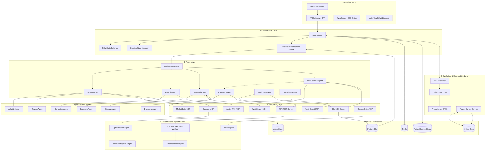

### 4.3 Component Responsibilities Matrix

| Layer | Component | Responsibility | Primary Pattern |
|---|---|---|---|
| Interface | API Gateway / BFF | request routing, auth, operator API, event streaming | REST + WS/SSE |
| Orchestration | ADK Runner | session lifecycle, agent execution, output chaining | ADK runtime |
| Orchestration | FSM Enforcer | validates state transitions and loop order | deterministic FSM |
| Orchestration | Workflow Orchestrator | declares plans, routes tasks, persists state | coordinator |
| Agent | OrchestratorAgent | goal decomposition, routing, aggregation | orchestrator-worker |
| Agent | RiskGovernorAgent | mandatory veto/approve gate for execution | sequential hard gate |
| Agent | StrategyAgent | evidence-backed trade hypotheses | sequential + parallel |
| Agent | ExecutionAgent | approved intent → broker-safe instruction | sequential |
| Agent | PortfolioAgent | risk-aware portfolio actions | parallel + evaluator |
| Agent | ResearchAgent | grounded retrieval and synthesis | routing + evaluator |
| Agent | MonitoringAgent | incident enrichment and health summarization | observer |
| Tool | MT5 MCP | broker interaction boundary | state-mutating/read-only tools |
| Tool | Risk Analytics MCP | VaR/CVaR/ES/correlation/exposure calculations | read-only tool facade |
| Tool | SQL MCP | normalized read/write access to operational data | governed DB access |
| Evaluation | ADK Evaluator | rubric scoring, trajectory review | evaluator-optimizer |
| State | Redis | short-lived session/workflow cache | ephemeral store |
| State | PostgreSQL | relational operational state | OLTP |
| State | Object Store | immutable artifacts, replay bundles | append-mostly |
| State | Vector Store | long-term research memory | semantic retrieval |
| State | Git-backed config repo | prompts, policies, workflow templates | procedural memory |

---

## 5. ADK-Native Orchestration Model

### 5.1 Runtime Pattern Mapping

HaruQuant uses the following ADK-native patterns:

- **Sequential** for gated execution workflows
- **Routing** when user intent, asset class, incident type, or mode determines path
- **Parallel** for independent analytics such as volatility, correlation, exposure, and regime
- **Evaluator-Optimizer** for research, strategy validation, and quality-sensitive outputs
- **Orchestrator-Workers** for multi-step dynamic plans

### 5.2 Pattern Selection Matrix

| Workflow | Sequential | Routing | Parallel | Evaluator-Optimizer | Orchestrator-Workers |
|---|---:|---:|---:|---:|---:|
| Trade decision | Y | Y | Y | Y | Y |
| Portfolio optimization | Y | N | Y | Y | Y |
| Supervised live execution | Y | Y | N | Y | Y |
| Research report | Y | Y | Y | Y | Y |
| Backtest validation | Y | N | Y | Y | Y |
| Incident triage | Y | Y | N | N | Y |
| Daily briefing | Y | Y | Y | Y | N |

### 5.3 Workflow Law Enforcement

The workflow engine prevents material workflows from completing unless the phases occur in order:

```text
Reason → Plan → Act → Observe → Evaluate → Refine/Finish
```

Emergency-exit workflows may invert the order of Act and Evaluate only under explicit emergency policy, after which post-action evaluation is mandatory.

---

## 6. Deployment View

### 6.1 Baseline Deployment Topology

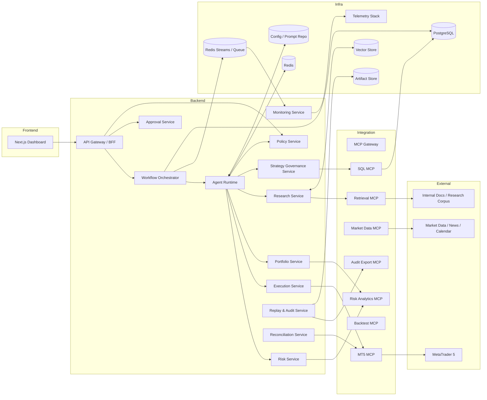

### 6.2 Environment Separation

Minimum environments:

- `dev`
- `test`
- `paper`
- `staging`
- `prod`

Rules:

- paper and prod use separate broker credentials and DB namespaces
- compliance profile resolution is environment-scoped
- prompt, policy, and schema activation is versioned per environment
- production cannot load unapproved prompt or policy revisions directly from development branches
- shadow mode routes production-like data through the agentic stack without permitting execution

---

## 7. Service Catalog

### 7.1 API Gateway / BFF
Responsibilities:
- authenticate users
- authorize operator actions
- expose REST and live event APIs
- redact sensitive fields before UI response
- bridge domain events to frontend subscriptions

### 7.2 Workflow Orchestrator Service
Responsibilities:
- create workflows
- enforce phase ordering
- persist state and transitions
- dispatch tasks to agents and deterministic services
- coordinate refinement loops
- assemble replay bundle references

### 7.3 Agent Runtime Service
Responsibilities:
- host specialist agents
- load prompts, tool manifests, and memory bindings by version
- enforce tool allowlists
- strip secrets from model context
- transform outputs into canonical schemas
- emit trajectory logs

### 7.4 Policy & Governance Service
Responsibilities:
- resolve active operating mode
- load policy bundles and compliance profiles
- validate role authority
- resolve kill-switch state
- govern override eligibility
- serve policy versions to execution and risk paths

### 7.5 Approval Service
Responsibilities:
- create approval requests
- route approvals by action type, role, and profile
- enforce dual authorization
- expire unused approvals
- persist reasons and rationales

### 7.6 Risk Engine Service
Responsibilities:
- compute exposures, concentration, VaR, expected shortfall, drawdown, correlation
- validate snapshot freshness
- apply policy formulas and thresholds
- return `RiskAssessmentDecision`

### 7.7 Portfolio Analytics Service
Responsibilities:
- compute marginal risk contribution
- propose rebalancing, hedging, resizing, de-risking
- score portfolio alternatives
- remain advisory unless standard gating path is used

### 7.8 Execution Service
Responsibilities:
- validate approved execution intents
- normalize broker payloads
- submit through MT5 MCP
- store receipts and send attempts
- deduplicate by idempotency key
- trigger reconciliation on uncertainty

### 7.9 Monitoring & Incident Service
Responsibilities:
- consume state and observation events
- detect incidents and stale states
- emit alerts
- update authoritative/provisional/reconciling status
- manage incident FSM

### 7.10 Strategy Governance Service
Responsibilities:
- manage lifecycle transitions
- validate promotion evidence
- persist approvals and lifecycle state
- suspend or retire strategies under policy

### 7.11 Research / Retrieval Service
Responsibilities:
- retrieve grounded evidence
- synthesize findings
- attach freshness and provenance
- sanitize untrusted content
- maintain long-term research memory references

### 7.12 Reconciliation Service
Responsibilities:
- recover in-flight execution state
- compare local and broker truth
- identify duplicates and conflicts
- raise incidents for unresolved divergence

### 7.13 Replay & Audit Service
Responsibilities:
- reconstruct workflows end to end
- verify hashes and manifests
- assemble compliance-profile-specific export bundles
- support legal-hold-aware retrieval

---

## 8. Agent Design and Persona Specifications

### 8.1 Mandatory Agents

| Agent | Primary Purpose | Allowed Outputs | Forbidden Outputs |
|---|---|---|---|
| OrchestratorAgent | break down workflow goals and route sub-tasks | plans, aggregation, escalation | direct broker instructions |
| RiskGovernorAgent | evaluate and gate execution-bound actions | risk decisions, limits, force-exit decisions | broker calls, policy bypass |
| StrategyAgent | generate trade hypotheses | hypotheses, candidate comparisons | live orders |
| ExecutionAgent | translate approved intents into broker-safe instructions | execution intents and reports | ungated broker actions |
| PortfolioAgent | produce portfolio proposals | rebalance/hedge/resize proposals | live side effects without gating |
| ResearchAgent | grounded retrieval and synthesis | evidence bundles, research reports | execution instructions |
| MonitoringAgent | summarize anomalies and health state | incidents, alert context | hidden state mutation |
| ComplianceAgent | apply compliance-aware review | review findings, escalation advice | silent override of controls |

### 8.2 Optional Sub-Agents

- VolatilityAgent
- RegimeAgent
- SlippageAgent
- CorrelationAgent
- ExposureAgent
- DrawdownAgent
- PromotionEvaluatorAgent
- ExplainabilityAgent

### 8.3 Agent Invocation Rules

- Agents do not call each other arbitrarily.
- All invocations are routed by the workflow orchestrator.
- All outputs use canonical schemas.
- Any execution-bound path must pass through RiskGovernor and policy validation.
- Only Execution Service may invoke state-mutating broker MCP tools.

### 8.4 OrchestratorAgent Specification

**Purpose**  
Interprets workflow objectives, classifies intent, builds task graphs, chooses patterns, aggregates outputs, and enforces the canonical loop.

**Responsibilities**
- classify workflow intent
- decompose into bounded sub-tasks
- choose sequential, routing, parallel, evaluator-optimizer, or orchestrator-worker pattern
- request mandatory risk gating before execution-bound actions
- escalate to human operator on repeated low-confidence results

**Illustrative ADK Skeleton**
```python
from google.adk.agents import Agent

orchestrator_agent = Agent(
    name="OrchestratorAgent",
    model="gemini-2.5-pro",
    instruction=\"\"\"
You are the HaruQuant workflow coordinator.
Decompose goals, enforce Reason→Plan→Act→Observe→Evaluate→Refine/Finish,
route tasks to specialist agents, and never perform broker actions directly.
\"\"\",
    tools=[],
)
```

### 8.5 RiskGovernorAgent Specification

**Purpose**  
Acts as the non-bypassable portfolio-level risk gate for all execution-bound actions.

**Responsibilities**
- load freshest account and portfolio state
- evaluate concentration, correlation, volatility, drawdown, session, blackout, and kill-switch status
- approve, approve with limits, reject, or force exit
- attach rationale, metrics snapshot, token or decision reference, and expiry

**Hard Constraint**
Execution cannot proceed without a current valid risk decision tied to the exact proposal.

**Illustrative ADK Skeleton**
```python
from google.adk.agents import Agent

risk_governor_agent = Agent(
    name="RiskGovernorAgent",
    model="gemini-2.5-flash",
    instruction=\"\"\"
You are the HaruQuant risk governor with absolute veto authority.
No execution-bound action is allowed without your approval.
If inputs are stale, malformed, missing, or policy-incompatible, reject.
\"\"\",
    tools=["risk_analytics_mcp", "sql_mcp"],
)
```

### 8.6 StrategyAgent Specification

**Purpose**  
Generate evidence-backed trade hypotheses, not executable orders.

**Responsibilities**
- analyze market and research context
- produce explicit thesis, entry rationale, invalidation rationale, stop and exit logic
- request volatility and regime assessments as sub-analyses
- return candidate hypotheses with evidence and confidence notes

### 8.7 ExecutionAgent Specification

**Purpose**  
Turn approved execution intents into broker-safe MT5 instructions after immediate revalidation.

**Responsibilities**
- verify current risk decision and approval status
- normalize order parameters to symbol constraints
- attach idempotency key and broker client order ID
- capture receipt and slippage metrics
- trigger reconciliation on any uncertainty

### 8.8 PortfolioAgent Specification

**Purpose**  
Analyze current portfolio state and produce advisory rebalancing, hedging, resizing, and de-risking alternatives.

### 8.9 ResearchAgent Specification

**Purpose**  
Perform grounded retrieval from internal and approved external sources, then synthesize findings with explicit evidence and freshness.

### 8.10 MonitoringAgent Specification

**Purpose**  
Observe execution, health, staleness, schema failures, latency breaches, and incident conditions, then classify alerts and incidents.

### 8.11 ComplianceAgent Specification

**Purpose**  
Apply profile-specific review rules and identify cases needing compliance sign-off or export readiness.

---

## 9. Workflow Engine and State Machines

### 9.1 Workflow Types

- research workflow
- advisory trading workflow
- paper execution workflow
- supervised live execution workflow
- bounded autonomous live execution workflow
- portfolio rebalance workflow
- emergency exit workflow
- incident response workflow
- strategy promotion workflow

### 9.2 Canonical Workflow FSM

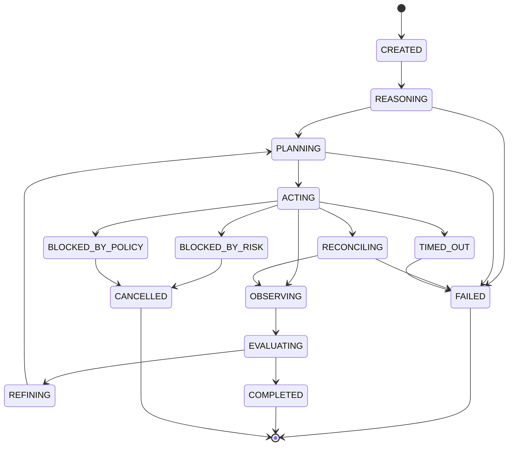

### 9.3 Trade Proposal FSM

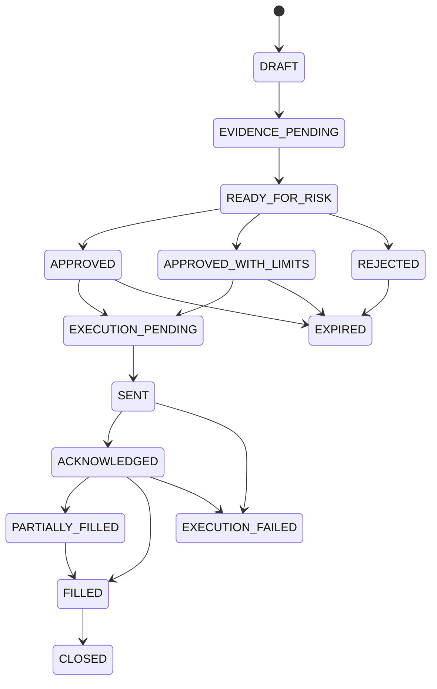

### 9.4 Incident FSM

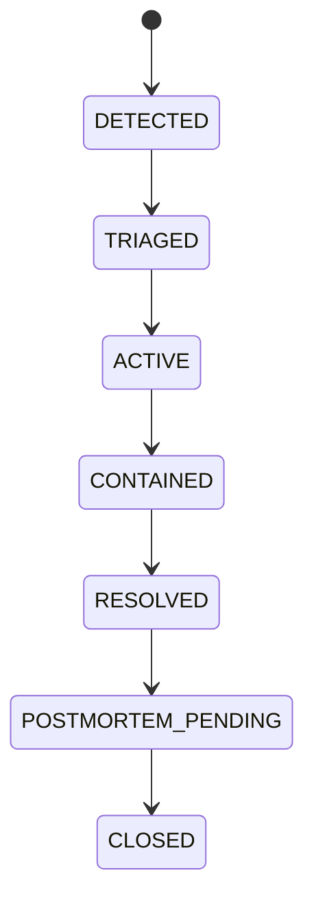

### 9.5 Kill Switch FSM

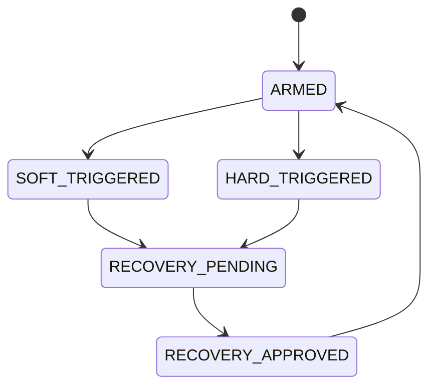

### 9.6 Strategy Lifecycle FSM

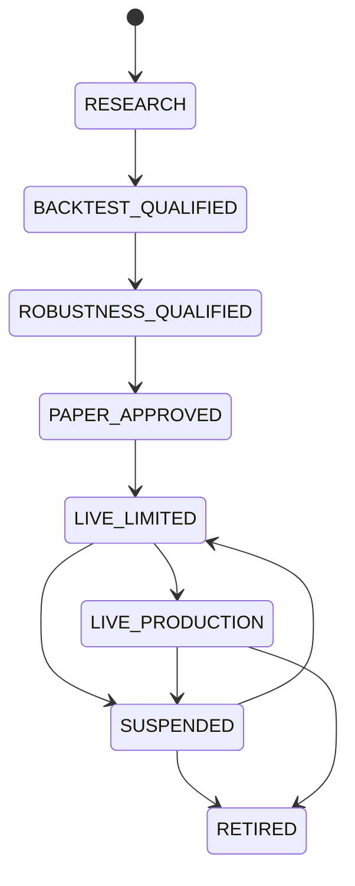

### 9.7 Approval FSM

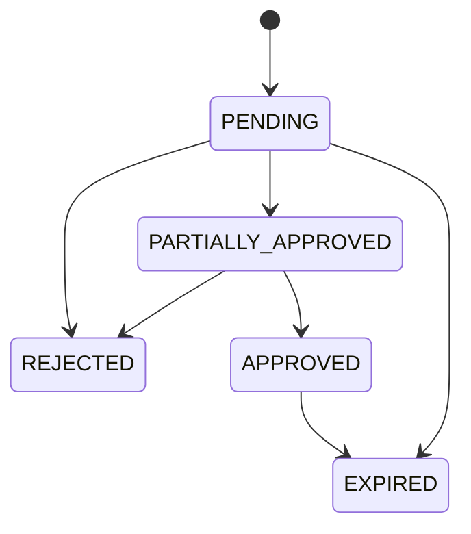

### 9.8 State Coordination Rules

- workflow transitions are concurrency-safe and versioned
- execution intents acquire short lease locks during send
- risk decisions expire after policy TTL
- any workflow paused longer than the shortest relevant TTL requires revalidation
- parallel analytic agents are read-only unless explicitly designated as aggregators
- kill switch may transition any live-capable workflow into a terminal blocked state

---

## 10. Canonical Contract Design

### 10.1 Shared Envelope

All canonical contracts use a common envelope:

```json
{
  "schema_version": "1.0.0",
  "contract_type": "WorkflowIntent",
  "workflow_id": "wf_...",
  "correlation_id": "corr_...",
  "causation_id": "evt_...",
  "timestamp_utc": "2026-04-08T10:15:30Z",
  "originator": {
    "type": "agent|user|service",
    "id": "strategy_agent_v4"
  },
  "environment": "prod",
  "operating_mode": "MODE-003",
  "payload": {}
}
```

### 10.2 Canonical Contract Families

- `WorkflowIntent`
- `WorkflowPlan`
- `TradeHypothesis`
- `TradeProposal`
- `RiskAssessmentRequest`
- `RiskAssessmentDecision`
- `ExecutionIntent`
- `ExecutionReceipt`
- `ObservationEvent`
- `EvaluationReport`
- `IncidentAlert`
- `OverrideRequest`
- `OverrideDecision`
- `ReplayBundle`

### 10.3 Pydantic / Schema Examples

#### 10.3.1 Common Envelope and Workflow State

```python
from enum import Enum
from typing import Any, Dict, List, Literal, Optional
from datetime import datetime
from pydantic import BaseModel, Field

class WorkflowPhase(str, Enum):
    REASON = "reason"
    PLAN = "plan"
    ACT = "act"
    OBSERVE = "observe"
    EVALUATE = "evaluate"
    REFINE = "refine"
    FINISH = "finish"

class AgentEnvelope(BaseModel):
    correlation_id: str
    workflow_id: str
    step_id: str
    parent_step_id: Optional[str] = None
    ts: datetime = Field(default_factory=datetime.utcnow)
    sender: str
    recipient: str
    phase: WorkflowPhase
    payload_type: str
    payload: Dict[str, Any]
    schema_version: str = "1.0.0"

class WorkflowState(BaseModel):
    workflow_id: str
    workflow_type: Literal["trade_review", "portfolio_opt", "research_report", "risk_review"]
    state: Literal[
        "IDLE", "REASONING", "PLANNING", "ACTING", "OBSERVING",
        "EVALUATING", "REFINING", "COMPLETE", "ERROR", "ESCALATED", "KILLED"
    ]
    version: int = 1
    actor: str
    updated_at: datetime = Field(default_factory=datetime.utcnow)
    iteration_count: int = 0
```

#### 10.3.2 Evidence and Trade Hypothesis

```python
from pydantic import BaseModel, Field, confloat
from typing import List, Literal, Optional
from datetime import datetime

class EvidenceItem(BaseModel):
    source: str
    source_type: Literal["sql", "vector", "web", "market", "broker", "memory"]
    summary: str
    confidence: confloat(ge=0.0, le=1.0)
    timestamp: datetime
    freshness_seconds: int

class TradeHypothesis(BaseModel):
    symbol: str
    side: Literal["buy", "sell"]
    thesis: str
    entry_rationale: str
    invalidation_rationale: str
    stop_loss_price: float
    take_profit_price: Optional[float] = None
    holding_horizon: Literal["intraday", "swing", "position"]
    confidence: confloat(ge=0.0, le=1.0)
    evidence: List[EvidenceItem]
    expected_rr: Optional[float] = None
    strategy_family: Literal["trend", "mean_reversion", "breakout", "carry", "volatility_conditioned"]
```

#### 10.3.3 Volatility, Regime, Limits, and Risk Assessment

```python
from pydantic import BaseModel, confloat, conint, condecimal
from typing import Dict, Any, List, Literal, Optional
from datetime import datetime

class VolatilityAssessment(BaseModel):
    symbol: str
    realized_vol_20: float
    atr_14: float
    vol_percentile_252: confloat(ge=0.0, le=1.0)
    size_multiplier: confloat(gt=0.0, le=1.0) = 1.0

class RegimeAssessment(BaseModel):
    symbol: str
    regime: Literal["trend", "range", "breakout", "risk_off", "crisis"]
    confidence: confloat(ge=0.0, le=1.0)
    constraints: Dict[str, Any] = {}

class RiskLimits(BaseModel):
    max_symbol_exposure_pct: confloat(gt=0, le=1.0) = 0.10
    max_portfolio_var_pct: confloat(gt=0, le=1.0) = 0.05
    max_daily_drawdown_pct: confloat(gt=0, le=1.0) = 0.03
    max_correlation_to_book: confloat(ge=-1.0, le=1.0) = 0.7
    max_spread_points: conint(gt=0) = 5
    max_slippage_bps: conint(gt=0) = 10

class RiskAssessmentDecision(BaseModel):
    decision: Literal["APPROVE", "APPROVE_WITH_LIMITS", "REJECT", "FORCE_EXIT"]
    reasons: List[str]
    risk_metrics_snapshot: Dict[str, float]
    adjusted_volume_lots: Optional[condecimal(gt=0)] = None
    adjusted_max_deviation_points: Optional[conint(gt=0)] = None
    required_tags: List[str] = []
    approval_token: Optional[str] = None
    expires_at: Optional[datetime] = None
    force_exit_symbols: List[str] = []
```

#### 10.3.4 Proposed Execution and Receipt

```python
from pydantic import BaseModel, condecimal, conint
from typing import Literal, Optional
from datetime import datetime

class ProposedExecution(BaseModel):
    symbol: str
    side: Literal["buy", "sell"]
    order_type: Literal["market", "limit", "stop"]
    volume_lots: condecimal(gt=0, multiple_of=0.01)
    entry_price: Optional[float] = None
    stop_loss: Optional[float] = None
    take_profit: Optional[float] = None
    max_deviation_points: conint(ge=0) = 10
    slippage_budget_bps: conint(ge=0) = 10
    time_in_force: Literal["GTC", "DAY", "IOC", "FOK"] = "IOC"
    rationale: str
    linked_hypothesis_id: Optional[str] = None
    risk_approval_token: str
    idempotency_key: str

class ExecutionReceipt(BaseModel):
    broker: str = "mt5"
    request_id: str
    status: Literal["sent", "acknowledged", "rejected", "partial_fill", "filled", "cancelled"]
    broker_order_id: Optional[str] = None
    broker_deal_id: Optional[str] = None
    symbol: str
    filled_volume_lots: float = 0.0
    requested_price: Optional[float] = None
    fill_price: Optional[float] = None
    spread_points: Optional[float] = None
    slippage_points: Optional[float] = None
    slippage_bps: Optional[float] = None
    broker_message: Optional[str] = None
    mt5_retcode: Optional[int] = None
    ts: datetime = Field(default_factory=datetime.utcnow)
```

#### 10.3.5 Trajectory Log Entry

```python
from pydantic import BaseModel
from typing import Any, Dict, List, Optional
from datetime import datetime

class TrajectoryLogEntry(BaseModel):
    log_id: str
    correlation_id: str
    workflow_id: str
    agent_name: str
    phase: str
    iteration: int
    input_schema: str
    input_hash: str
    output_schema: str
    output_hash: str
    tool_calls: List[Dict[str, Any]]
    observation_payload: Optional[Dict[str, Any]] = None
    evaluation_output: Optional[Dict[str, Any]] = None
    latency_ms: int
    token_usage: Optional[Dict[str, int]] = None
    final_state: str
    ts: datetime = Field(default_factory=datetime.utcnow)
    signature: str
```

### 10.4 Validation Stack

Validation order:

1. structural schema validation
2. semantic validation
3. state-machine validation
4. policy validation
5. reference integrity validation
6. freshness validation for execution-critical paths

Invalid contracts do not advance workflows and emit actionable validation failures.

---

## 11. MCP Server Design

### 11.1 Architecture Rule

All external reads and side effects route through MCP servers or approved internal equivalents. No agent directly talks to MT5, live databases, or third-party feeds without a registered tool interface.

### 11.2 Required MCP Servers

| Server | Tools | Used By | Safety Constraints |
|---|---|---|---|
| `mt5_mcp` | place_order, modify_position, close_position, get_account_info, get_symbol_info, list_positions | Execution, Monitoring, Reconciliation | approval token for mutating tools; idempotency required |
| `sql_mcp` | run_read_query, get_trade_history, get_equity_curve, store_workflow_event, fetch_strategy_metrics | all services as governed | parameterized queries; row/scope security |
| `vector_rag_mcp` | semantic_search, retrieve_experiment_notes, retrieve_playbook, index_document | Research, Strategy | freshness metadata and confidence required |
| `risk_analytics_mcp` | compute_var, compute_cvar, compute_corr_matrix, compute_risk_contribution, compute_position_size | Risk, Portfolio | read-only; snapshot versioning |
| `market_data_mcp` | get_tick, get_ohlcv, get_spread_history, get_session_state, get_economic_calendar | Strategy, Execution, Risk | execution-critical staleness checks |
| `backtest_mcp` | run_backtest, compare_parameter_sets, retrieve_backtest_result | Strategy, Research, Governance | advisory/validation only |
| `web_search_mcp` | search_news, fetch_page, extract_macro_events | Research | source credibility and freshness required |
| `audit_export_mcp` | build_export_bundle, sign_manifest, compliance_profile_packaging | Replay & Audit, Compliance | profile-specific authorization |

### 11.3 Tool Security Rules

- all tools validate inputs against schemas at the entry point
- mutating tools require valid approval and idempotency metadata
- read-only tools must still enforce scope and freshness
- every tool call is logged with input hash, output hash, latency, correlation ID, and result status
- retries are bounded and type-specific

### 11.4 Example MT5 Tool Wrapper

```python
@mt5_server.tool()
async def place_order(request: ProposedExecution) -> ExecutionReceipt:
    if not await validate_approval_token(request.risk_approval_token):
        raise PermissionError("Invalid or expired risk approval token")

    symbol_info = await get_symbol_info(request.symbol)
    normalized_volume = round_to_lot_step(request.volume_lots, symbol_info.lot_step)
    normalized_request = normalize_prices(request, symbol_info.digits)

    result = await mt5_api.send_order(
        symbol=request.symbol,
        side=request.side,
        order_type=request.order_type,
        volume=normalized_volume,
        price=normalized_request.entry_price,
        sl=normalized_request.stop_loss,
        tp=normalized_request.take_profit,
        client_order_id=request.idempotency_key,
    )

    return ExecutionReceipt(
        request_id=request.idempotency_key,
        status=map_mt5_status(result.retcode),
        broker_order_id=result.order_id if result.retcode == 0 else None,
        fill_price=result.price if result.retcode == 0 else None,
        mt5_retcode=result.retcode,
        broker_message=result.comment,
    )
```

---

## 12. Deterministic Risk, Portfolio, and Execution Design

### 12.1 Risk Evaluation Pipeline

1. load proposal and context
2. validate strategy lifecycle eligibility
3. resolve active operating mode and compliance profile
4. check kill-switch state
5. load freshest account, position, and market snapshots
6. compute gross/net exposure and concentration
7. compute volatility-adjusted sizing
8. compute correlation concentration
9. evaluate drawdown state
10. evaluate regime restrictions
11. evaluate session and blackout restrictions
12. evaluate spread/slippage readiness
13. apply policy formulas
14. return machine-enforceable decision

### 12.2 Deterministic Formula Ownership

Risk math lives in deterministic modules, not prompts:

```text
risk/
  exposure.py
  concentration.py
  volatility.py
  correlation.py
  var.py
  expected_shortfall.py
  drawdown.py
  session_rules.py
  regime_rules.py
  policy_evaluator.py
```

### 12.3 Execution Pipeline

1. receive approved execution intent
2. verify proposal state and expiry
3. verify risk decision freshness and match
4. verify market open, symbol tradability, spread, price freshness, stops, fill mode, connectivity
5. normalize broker payload
6. persist send attempt
7. submit through MT5 MCP
8. store receipt
9. emit observation event
10. trigger reconciliation
11. mark authoritative only after confirmation

### 12.4 Portfolio Proposal Structure

Fields:
- current portfolio snapshot reference
- proposed action list
- projected VaR and ES deltas
- concentration and diversification deltas
- liquidity and turnover impact
- rationale and evidence bundle

### 12.5 Example Trade Sequence

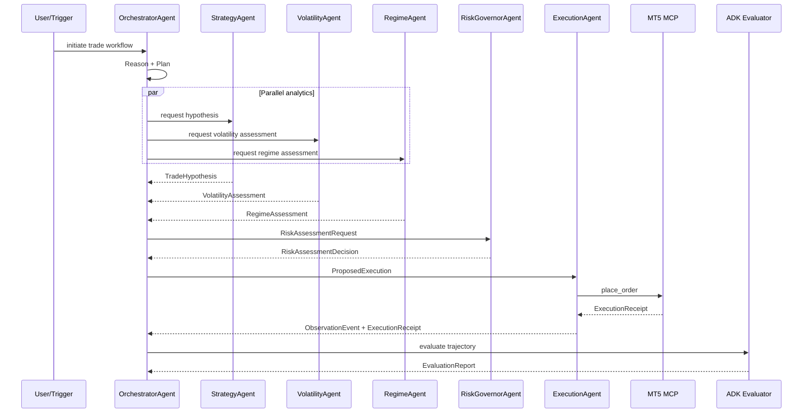

---

## 13. Memory and State Architecture

### 13.1 Three-Layer Memory Model

#### Procedural Memory
Stores:
- prompts and instructions
- policy files
- workflow templates
- FSM definitions
- MCP tool wrapper contracts

Storage:
- Git-backed configuration repository

Properties:
- read-only at runtime except via governed change process
- versioned and rollback-capable

#### Vector Memory
Stores:
- research reports
- postmortems
- experiment notes
- prior strategy patterns
- curated operator notes

Storage:
- Pinecone, Weaviate, or equivalent vector store

Access:
- only through retrieval tools
- must attach freshness metadata and source references

#### Session Memory
Stores:
- current workflow state
- recent agent outputs
- cached tool outputs
- operator/session preferences

Storage:
- Redis with TTL

Access:
- via ADK session state and workflow-scoped memory bindings

### 13.2 Memory Governance Rules

- live execution decisions must not depend on ungrounded conversational memory
- session memory is ephemeral and non-authoritative
- vector memory is advisory until validated against current structured data
- procedural memory changes require change control
- replay artifacts are immutable and separate from mutable working memory

### 13.3 Workflow State Coordination Rules

- portfolio-dependent actions read a named snapshot version
- state mutations use optimistic concurrency
- execution paths use short lease locks
- stale versions cause re-plan rather than silent overwrite
- broker bridge re-checks freshness immediately before send

---

## 14. Data Model and Persistence Design

### 14.1 Storage Categories

| Category | Storage | Mutability |
|---|---|---|
| workflow state | PostgreSQL | mutable with versioning |
| market/account snapshots | PostgreSQL + object store | append-mostly |
| replay bundles | object store + hash index | immutable |
| trajectories and logs | object store / telemetry backend | append-only |
| cache and queues | Redis | ephemeral |
| policy and schema registry | PostgreSQL | versioned |
| audit chain | append-only table or ledger | immutable/tamper-evident |

### 14.2 Core Relational Entities

- workflows
- workflow_transitions
- workflow_steps
- trade_hypotheses
- trade_proposals
- risk_decisions
- risk_constraints
- execution_intents
- execution_receipts
- broker_positions
- observations
- evaluation_reports
- incidents
- kill_switch_events
- strategy_registry
- strategy_promotions
- approvals
- approval_votes
- policies
- compliance_profiles
- replay_bundles

### 14.3 Example Class Diagram

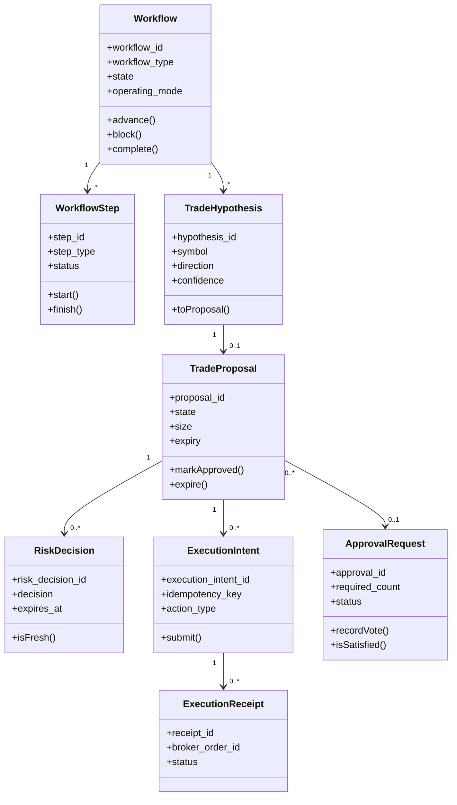

---

## 15. Event Model and Live State Propagation

### 15.1 Event Backbone

Use Redis Streams or equivalent for:
- workflow transition events
- observation events
- risk decision events
- receipt events
- alert and incident events
- approval events
- policy change events
- replay completion events

### 15.2 Event Envelope

- event_id
- event_type
- schema_version
- timestamp_utc
- producer
- workflow_id optional
- correlation_id
- causation_id
- payload or payload_ref
- integrity hash

### 15.3 Event Naming Convention

`<domain>.<entity>.<action>.v<major>`

Examples:
- `workflow.state.changed.v1`
- `risk.decision.issued.v1`
- `execution.intent.sent.v1`
- `execution.receipt.received.v1`
- `incident.detected.v1`
- `approval.vote.recorded.v1`

### 15.4 Frontend Event Schemas

#### Agent State Event
```typescript
export interface AgentStateEvent {
  correlation_id: string;
  workflow_id: string;
  agent_name: string;
  phase: "reason" | "plan" | "act" | "observe" | "evaluate" | "refine" | "finish";
  iteration: number;
  timestamp: string;
  payload: {
    decision?: string;
    confidence?: number;
    risk_status?: "approved" | "rejected" | "pending";
    execution_status?: "sent" | "filled" | "rejected";
    evaluation_score?: number;
  };
  next_phase?: string;
}
```

#### Risk Gate Event
```typescript
export interface RiskGateEvent {
  workflow_id: string;
  decision: "approve" | "approve_with_limits" | "reject" | "force_exit";
  reasons: string[];
  risk_metrics: {
    var_95: number;
    exposure_pct: number;
    correlation_score: number;
    drawdown_buffer: number;
  };
  approval_token?: string;
  expires_at?: string;
  timestamp: string;
}
```

#### Trajectory Log Event
```typescript
export interface TrajectoryLogEvent {
  log_id: string;
  workflow_id: string;
  step_id: string;
  agent_name: string;
  phase: string;
  input_summary: string;
  output_summary: string;
  tool_calls: Array<{
    tool_name: string;
    latency_ms: number;
    status: "success" | "error";
  }>;
  evaluation: {
    rubric_scores: Record<string, number>;
    overall_score: number;
    verdict: "pass" | "warn" | "fail";
  };
  timestamp: string;
}
```

### 15.5 Authoritative vs Provisional State

The monitoring layer tags UI state as:
- `AUTHORITATIVE`
- `PROVISIONAL`
- `UNDER_RECONCILIATION`

Dashboard state must visually expose freshness and authority status.

---

## 16. API Design

### 16.1 API Style

- REST for commands and queries
- OpenAPI 3.1 for external/operator APIs
- WebSocket or SSE for live dashboard events
- strict request and response schemas

### 16.2 Domain Endpoints

#### Workflow
- `POST /api/workflows`
- `GET /api/workflows/{workflow_id}`
- `POST /api/workflows/{workflow_id}/cancel`
- `POST /api/workflows/{workflow_id}/pause`
- `POST /api/workflows/{workflow_id}/resume`

#### Proposal
- `GET /api/proposals`
- `GET /api/proposals/{proposal_id}`
- `POST /api/proposals/{proposal_id}/request-approval`
- `POST /api/proposals/{proposal_id}/expire`

#### Risk
- `POST /api/risk/assess`
- `GET /api/risk/decisions/{risk_decision_id}`
- `GET /api/risk/policies/active`

#### Approval
- `GET /api/approvals`
- `POST /api/approvals/{approval_id}/approve`
- `POST /api/approvals/{approval_id}/reject`

#### Execution
- `POST /api/execution/intents`
- `GET /api/execution/intents/{execution_intent_id}`
- `POST /api/execution/intents/{execution_intent_id}/retry-reconcile`

#### Strategy Governance
- `GET /api/strategies`
- `GET /api/strategies/{strategy_id}`
- `POST /api/strategies/{strategy_id}/promote`
- `POST /api/strategies/{strategy_id}/suspend`
- `POST /api/strategies/{strategy_id}/retire`

#### Policy
- `GET /api/policies`
- `POST /api/policies`
- `POST /api/policies/{policy_version_id}/activate`
- `POST /api/kill-switch/soft-trigger`
- `POST /api/kill-switch/hard-trigger`
- `POST /api/kill-switch/recover`

#### Replay / Audit
- `GET /api/replay/{workflow_id}`
- `POST /api/audit/export`
- `POST /api/legal-hold`

### 16.3 Command Rules

- all state-changing commands require authenticated identity
- all commands emit domain events
- write endpoints support idempotency where needed
- approval and override routes validate role, compliance profile, and dual-auth rules
- production write routes are restricted by environment, role, and policy

---

## 17. Frontend Integration Blueprint

### 17.1 Major Dashboard Screens

- system overview
- workflow explorer
- proposal review
- risk decision inspector
- execution monitor
- incident console
- strategy registry and promotions
- policy and governance console
- replay viewer
- audit export center

### 17.2 Suggested Frontend Structure

```text
frontend/
  src/components/
    AgentLoopVisualizer.tsx
    RiskGatePanel.tsx
    TrajectoryLogViewer.tsx
    PortfolioRiskHeatmap.tsx
    ExecutionMonitor.tsx
    EvaluationScorecard.tsx
    KillSwitchControl.tsx
  src/hooks/
    useAgentSession.ts
  src/services/
    agentApi.ts
    trajectoryService.ts
    riskMetricsService.ts
  src/types/
    agent-events.ts
```

### 17.3 Live Update Flow

1. service emits event
2. event is published to Redis stream/pubsub
3. API gateway pushes event to session channel
4. frontend hook updates local state
5. affected dashboard panels re-render

Target:
- backend event ingestion to UI authoritative update <= 500 ms p95

### 17.4 UI Rules

- safety-critical values show freshness state
- workflow phases are visible step by step
- approvals display required roles and expiry
- risk decisions display policy version and TTL
- stale UI state can never directly trigger execution; backend always revalidates

---

## 18. Human Governance, Security, and Compliance Design

### 18.1 Roles

- Viewer
- Operator
- Trader
- Risk Manager
- Compliance Officer
- Ops Admin
- System Admin

### 18.2 Approval and Override Controls

Mandatory fields for override:
- original blocked action
- original risk decision
- override target action
- reason code
- written rationale
- expiry
- approver identities
- compliance profile
- downstream outcome link

### 18.3 Kill Switch Behavior

Soft trigger:
- blocks new entries
- allows supervised exit or reduction per policy
- opens or updates incident

Hard trigger:
- blocks all new entries and most modifications
- may allow only approved emergency exits
- requires dual authorization for recovery

### 18.4 Authentication and Authorization

- OIDC/OAuth2 for users
- mTLS or signed tokens for service-to-service auth
- RBAC with scoped permissions
- role and compliance validation at command layer
- MFA for production-sensitive operator actions

### 18.5 Secrets and Model Context

- secrets are stored in a secret manager or environment-bound vault
- secrets are never injected into model context
- MCP servers hold service credentials
- logs and replay bundles redact secret material

### 18.6 Audit Requirements

Audit records must include:
- timestamp
- actor identity
- workflow linkage
- correlation ID
- input/output hashes
- policy version
- reason codes where applicable
- signature or integrity chain metadata

Recommended:
- Ed25519 signatures or hash chaining
- append-only audit storage
- legal-hold support
- export shaping by compliance profile

---

## 19. Evaluation Framework and Replay Design

### 19.1 Evaluation Architecture

Use ADK-native evaluator pattern:
- separate evaluation model from action model
- rubric-based scoring
- deterministic temperature for judge runs
- store verdict, sub-scores, issues, and improvement actions

### 19.2 Core Rubrics

#### Trade Decision Rubric
Suggested weighted criteria:
- rationale quality: 0.30
- risk awareness: 0.25
- schema compliance: 0.20
- loop adherence: 0.15
- evidence grounding: 0.10

#### Research Rubric
Suggested weighted criteria:
- source grounding
- contradiction handling
- freshness handling
- actionability
- caveat quality

#### Risk Assessment Rubric
Suggested weighted criteria:
- policy consistency
- numerical consistency
- freshness handling
- rationale sufficiency
- limit clarity

### 19.3 Evaluation Example Skeleton

```python
class HaruQuantEvaluator:
    def evaluate_trajectory(self, trajectory, rubric):
        # build judge prompt from trajectory + rubric
        # run separate evaluation model
        # parse structured rubric output
        # compute weighted score
        # return EvaluationResult
        pass
```

### 19.4 Replay Bundle Contents

- workflow definition
- state transition history
- canonical contracts
- market and account snapshot references
- prompt hash and model metadata
- policy version refs
- schema version refs
- receipts and observations
- evaluation reports
- integrity manifest

### 19.5 Trajectory Logging Requirements

Each log entry records:
- workflow and correlation IDs
- agent name
- phase and iteration
- input/output schemas
- input/output hashes
- tool calls with hashes and latency
- evaluation payload if present
- latency and token usage
- final state
- timestamp
- signature

---

## 20. Failure Semantics, Hallucination Controls, and Recovery

### 20.1 Failure Classes

- stale market data
- stale account data
- stale risk decision
- schema validation failure
- MCP timeout
- broker ack delay
- duplicate receipt
- partial persistence failure
- restart during execution
- broker/local state conflict
- infinite refine loop
- policy service unavailability

### 20.2 Standard Responses

| Failure | Response |
|---|---|
| stale HOT data | fail closed for new entry |
| stale risk decision | recompute risk |
| tool timeout | mark provisional, reconcile, bounded retry |
| broker ack delay | no blind retry; reconcile first |
| duplicate receipt | dedupe; incident on mismatch |
| schema failure | reject contract, alert monitoring |
| restart during live flow | reconcile in-flight intents |
| conflicting state | block related actions, raise incident |
| infinite refine loop | escalate to human operator |
| policy service unavailable | block live side effects |

### 20.3 Retry and Fallback Policies

- network timeout: retry up to 2 times with exponential backoff
- schema failure: fail fast, do not retry malformed payloads
- stale state version: refresh and re-plan
- broker reject for marketability: one bounded re-plan by execution service only
- missing required context: request context repair; else escalate
- low-confidence research: narrow scope or add explicit caveats
- guardrail violation: block and log

### 20.4 Hallucination Controls

- no free-form inter-agent control messages
- factual execution-critical fields must come from MCP/tool-grounded data
- evidence confidence and freshness required for research claims
- evaluator checks unsupported assertions
- stale data is rejected at tool level
- execution agents cannot bypass RiskGovernor or compliance controls

### 20.5 Restart Recovery Sequence

1. startup loads in-flight execution intents
2. reconciliation queries broker by client order ID and account state
3. local status is updated to confirmed, absent, filled, or conflicting
4. conflicts raise incidents and block related actions
5. only reconciled flows may resume live actions

---

## 21. Strategy Lifecycle and Promotion Design

### 21.1 Promotion Workflow

1. collect evidence bundle
2. validate completeness
3. evaluate gate policy
4. route required approvals
5. persist transition
6. update operating envelope
7. emit governance event

### 21.2 Promotion Evidence Bundle

Must include:
- strategy version and code hash
- parameter set and constraints
- evaluation data range
- markets, symbols, timeframes, sessions
- backtest and robustness metrics
- risk profile
- known limitations
- proposed operating envelope
- approval records

### 21.3 Suspension Triggers

- drawdown breach
- execution quality deterioration
- unresolved critical incident
- unverifiable provenance
- compliance profile violation
- manual supervisory suspension

---

## 22. Migration Compatibility and First Implementation Slice

### 22.1 Legacy Integration Strategy

Existing HaruQuant modules are wrapped as MCP tools rather than immediately replaced:

- `simulation/` → `backtest_mcp`
- `optimization/` → `optimization_mcp`
- `mt5/` → `mt5_mcp`
- `risk/` → `risk_analytics_mcp`
- `database/` → `sql_mcp`

### 22.2 Migration Principles

- additive rather than destructive migration
- blue/green deployment capability
- feature flags by workflow or user/session
- shadow mode for production-like validation without execution
- backward compatibility for major UI and API surfaces during transition

### 22.3 First Implementation Slice

**Scope**  
Trade idea review workflow, read-only and no live execution.

**Agents**
- Router/Orchestrator
- Memory/Context
- Market Research
- Signal Interpretation
- Risk Governor
- Compliance
- Evaluator
- Reporting

**Tools**
- market_data_mcp
- sql_mcp read-only
- vector_rag_mcp

**Output**
- approve/reject/adjust decision
- confidence
- reasons
- evidence references

### 22.4 Validation Criteria for First Slice

- schema compliance >= 95%
- risk governor veto cannot be bypassed
- trajectory logs are queryable and replayable
- cached-data trade decision p95 latency <= 2.5s
- hallucination rate for tool-grounded fields < 5%

---

## 23. Suggested Codebase Structure

```text
haruquant/
  apps/
    api_gateway/
    workflow_orchestrator/
    agent_runtime/
    policy_service/
    approval_service/
    risk_service/
    execution_service/
    portfolio_service/
    monitoring_service/
    strategy_governance_service/
    replay_audit_service/
    research_service/
    reconciliation_service/
  domain/
    workflows/
    proposals/
    risk/
    execution/
    portfolio/
    incidents/
    strategies/
    approvals/
    policies/
    replay/
  contracts/
    workflow_intent/
    workflow_plan/
    trade_hypothesis/
    trade_proposal/
    risk_assessment_request/
    risk_assessment_decision/
    execution_intent/
    execution_receipt/
    observation_event/
    evaluation_report/
    incident_alert/
    override_request/
    override_decision/
    replay_bundle/
  risk/
    exposure.py
    concentration.py
    volatility.py
    correlation.py
    var.py
    expected_shortfall.py
    policy_evaluator.py
  execution/
    validators.py
    broker_payloads.py
    idempotency.py
    reconciler.py
  policy/
    role_matrix.py
    mode_resolver.py
    compliance_profiles.py
    kill_switch.py
  integrations/
    mcp/
      gateway/
      mt5_server/
      data_server/
      retrieval_server/
      audit_export_server/
  storage/
    models/
    repositories/
    migrations/
  frontend/
    web/
  tests/
    unit/
    integration/
    scenario/
    chaos/
    replay/
    security/
```

---

## 24. Use Cases and Sequence Views

### 24.1 Core Use Cases

| Use Case | Actors | Outcome |
|---|---|---|
| Start research workflow | Operator, ResearchAgent | evidence-backed research result |
| Generate advisory trade proposal | Trader, StrategyAgent | proposal without live side effect |
| Run paper execution | Operator, ExecutionService | simulated execution record |
| Approve supervised live trade | Trader, Risk Manager | live execution with audit trail |
| Autonomous bounded live trade | System, Risk Service | live order within policy envelope |
| Request override on reject | Risk Manager, Compliance Officer | approved or denied override |
| Trigger kill switch | Operator/Risk Manager/Ops | new live execution halted |
| Promote strategy | Trader/Risk Manager/Compliance | lifecycle transition recorded |
| Replay workflow | Compliance/Audit | reconstructed decision history |
| Recover from restart | Ops/Reconciliation | in-flight state reconciled |

### 24.2 Use Case Diagram

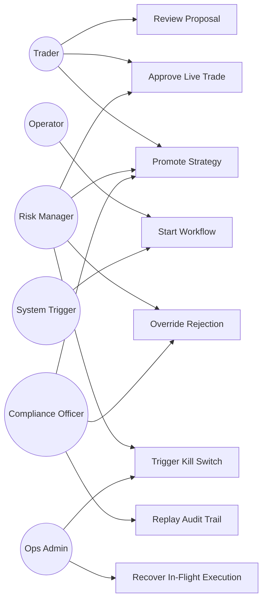

### 24.3 Supervised Live Trade Sequence

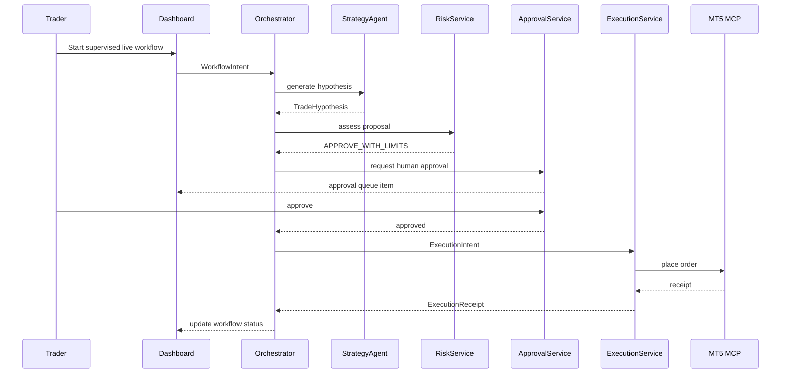

### 24.4 Autonomous Live Within Envelope

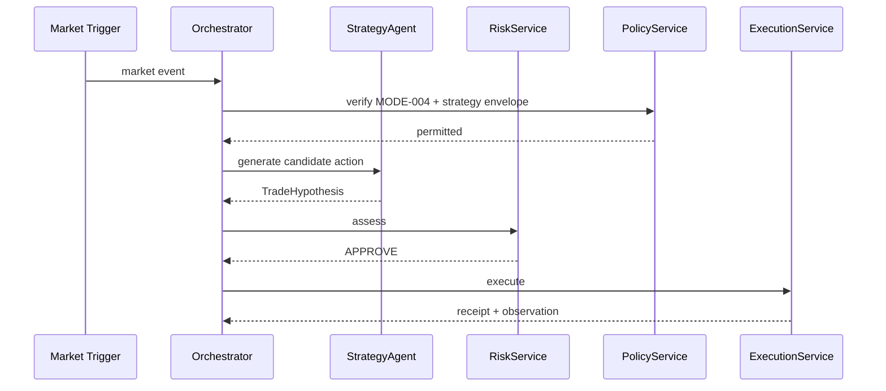

### 24.5 Override of Rejected Live Action

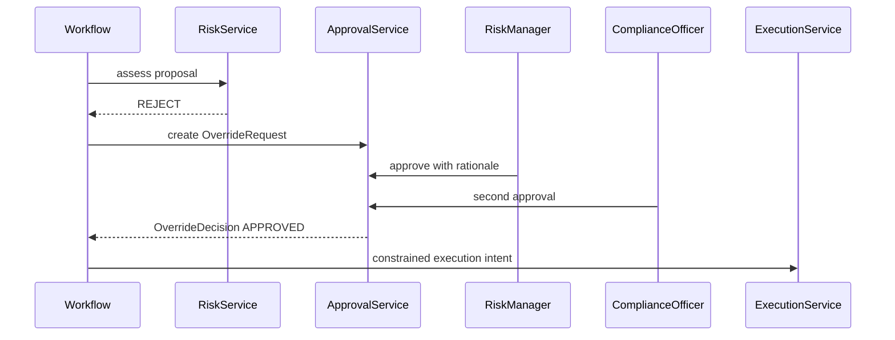

---

## 25. Performance Design

### 25.1 Latency Budgets

| Operation | Budget |
|---|---:|
| risk evaluation p95 | <= 300 ms |
| execution readiness validation p95 | <= 400 ms excluding external latency |
| end-to-end trade decision p95 | <= 2.5 s |
| dashboard propagation p95 | <= 500 ms |
| research first-answer p95 | <= 6 s |
| portfolio advisory run p95 | <= 4 s |

### 25.2 Performance Tactics

- cache HOT/WARM snapshots in Redis with freshness metadata
- keep deterministic risk math local to the risk service
- avoid LLM in the critical execution validation path
- pre-fetch symbol metadata
- use async IO for MCP calls
- store heavy blobs outside OLTP tables
- stream events rather than poll
- isolate evaluation workloads from execution-critical workloads

---

## 26. Testing Architecture

### 26.1 Test Layers

- unit tests for schemas, formulas, validators, tool wrappers
- integration tests for service interactions
- scenario tests for workflow/state-machine behavior
- chaos tests for timeouts, disconnects, stale state, restarts
- replay tests for reconstruction accuracy
- security tests for RBAC, secrets isolation, tool authorization
- red-team tests for prompt injection and retrieval contamination
- promotion gate tests
- kill-switch and override tests

### 26.2 Test Data Strategy

- deterministic market snapshot fixtures
- broker simulator for paper/test
- recorded MT5 receipt fixtures
- anonymized replay bundles
- policy matrix fixtures by compliance profile

### 26.3 Acceptance Mapping

Each acceptance criterion must map to:
- at least one scenario test
- at least one runtime monitoring assertion
- replay verification where applicable

---

## 27. Requirement-to-Design Traceability Matrix

### 27.1 Invariants and Core Governance

| SRS Ref | Design Realization |
|---|---|
| INV-001 | Risk Service + Execution Service hard gate; Sections 12 and 18 |
| INV-002 | MCP-only external access; Section 11 |
| INV-003 | canonical contract validation; Section 10 |
| INV-004 | provenance bundle + replay bundle; Sections 10, 19 |
| INV-005 | fail-closed semantics; Section 20 |
| INV-006 | hypothesis → proposal transformation only; Sections 10 and 12 |
| INV-010 to INV-014 | service separation and state segregation; Sections 4, 7, 13, 14 |
| INV-020 to INV-021 | agent authority boundaries and deterministic formula ownership; Sections 8 and 12 |

### 27.2 Functional Requirements

| SRS Ref Range | Design Sections |
|---|---|
| FR-001 to FR-004 | Sections 7, 16, 18 |
| FR-005 to FR-017 | Section 9 |
| FR-018 to FR-027 | Sections 5, 8, 10, 11 |
| FR-028 to FR-034 | Section 12 |
| FR-035 to FR-038 | Section 18 |
| FR-039 to FR-047 | Sections 8 and 21 |
| FR-048 to FR-051 | Section 12 |
| FR-052 to FR-055 | Section 8 and 13 |
| FR-056 to FR-060 | Section 12 |
| FR-061 to FR-067 | Sections 15 and 17 |
| FR-068 to FR-071 | Section 13 |
| FR-072 to FR-074 | Sections 14 and 19 |
| FR-075 to FR-078 | Section 20 |
| FR-079 to FR-081 | Sections 18 and 19 |
| FR-082 to FR-090 | Section 26 |

### 27.3 Non-Functional Requirements

| SRS Ref | Design Realization |
|---|---|
| NFR-001 to NFR-003 | Sections 12, 18, 20 |
| NFR-004 to NFR-005 | Section 19 |
| NFR-006 to NFR-011 | Section 25 |
| NFR-012 to NFR-014 | Sections 9, 12, 20 |
| NFR-015 to NFR-018 | Sections 11, 18, 19 |
| NFR-019 to NFR-020 | Sections 10, 14, 19 |

---

## 28. Open Design Decisions

These should be finalized before build freeze:

1. Redis Streams vs RabbitMQ/Kafka for event backbone.
2. Exact object store choice for replay artifacts.
3. PostgreSQL partitioning strategy for high-volume snapshots and logs.
4. JSONB vs external artifact format for heavy risk metrics snapshots.
5. Exact MT5 deployment pattern relative to terminal runtime.
6. REST-only vs REST + GraphQL for dashboard queries.
7. DB-native ledger features vs application-managed hash chaining.
8. Final vector store choice and embedding lifecycle policy.
9. Formal prompt registry representation and release workflow.

---

## 29. Implementation Order Recommendation

### Phase 1 — Governance and Skeleton
- schema registry
- workflow orchestrator
- policy service
- approval service
- PostgreSQL baseline schema
- event bus
- dashboard skeleton

### Phase 2 — Deterministic Safety Core
- risk engine
- execution readiness validator
- kill switch manager
- MT5 MCP server
- reconciliation engine

### Phase 3 — Agent Runtime
- OrchestratorAgent
- StrategyAgent
- ResearchAgent
- MonitoringAgent
- evaluator infrastructure
- prompt/version registry

### Phase 4 — Live Control Plane
- execution service
- approval flows
- incident console
- replay service
- audit export

### Phase 5 — Portfolio and Promotion
- portfolio analytics service
- strategy governance service
- promotion workflows
- evidence bundle automation

### Phase 6 — Migration and Hardening
- first implementation slice
- shadow mode
- chaos testing
- replay validation
- security and red-team testing
- performance tuning
- compliance profile rollout

---

## 30. Board-Ready Architecture Summary

This revision provides the consolidated architecture baseline for HaruQuant. It turns the approved SRS into a concrete implementation architecture with:

- enforceable service boundaries
- ADK-native orchestration patterns
- explicit workflow, proposal, incident, approval, kill-switch, and strategy state machines
- canonical schemas and typed contracts
- MCP-governed integration boundaries
- deterministic risk and execution logic
- memory and persistence separation
- frontend event contracts and operator workflows
- evaluation, replay, and audit design
- migration and first-slice implementation guidance

The resulting system is one in which:
- agents reason, but services enforce
- policies configure, but code gates
- workflows are explicit, not implicit
- broker actions are idempotent and reconcilable
- every critical decision can be replayed and explained
- autonomy is bounded by mode, policy, strategy state, and risk envelope

---

## 31. Suggested Next Companion Documents

1. **Canonical Schemas Specification**  
   Full JSON Schema / Pydantic definitions for every canonical contract.

2. **Database Schema Specification**  
   DDL-level schema, indexes, partitioning, retention, and migration plan.

3. **API Specification**  
   OpenAPI definitions for operator and internal endpoints.

4. **MCP Server Specification**  
   Tool manifests, auth model, request/response schemas, and failure contracts.

5. **Implementation Plan / Work Breakdown**  
   Epics, milestones, dependencies, sprint slicing, and acceptance mapping.

6. **Test Strategy and Certification Plan**  
   Full plan for unit, integration, scenario, chaos, replay, security, and readiness.
